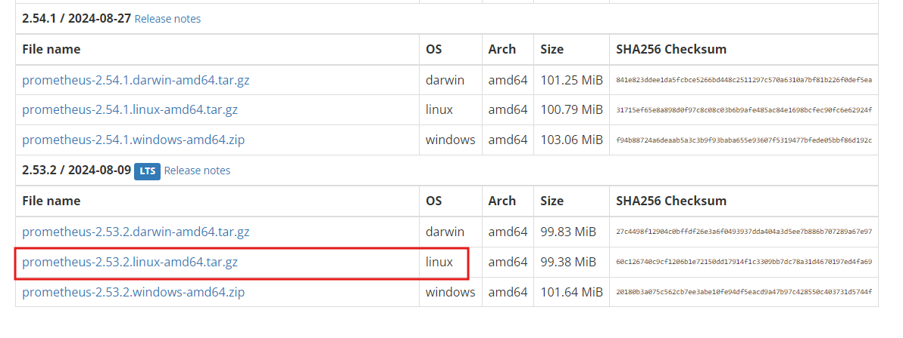
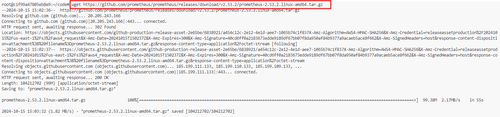
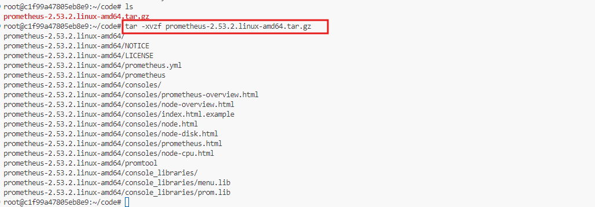
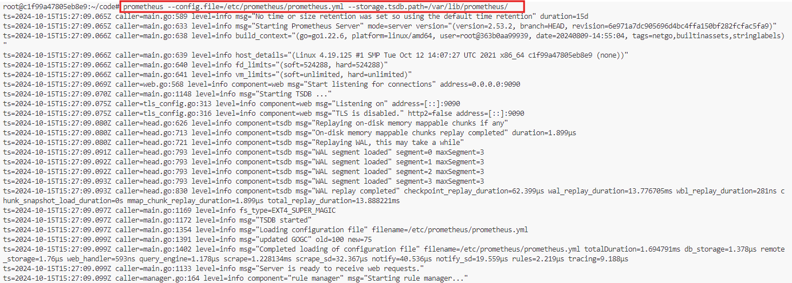
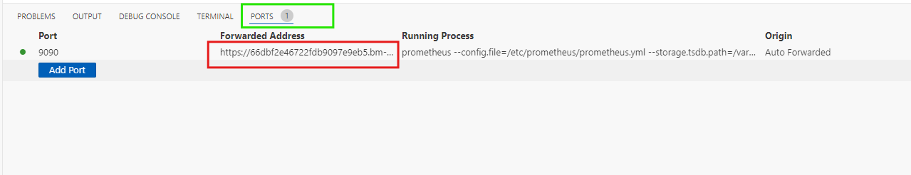
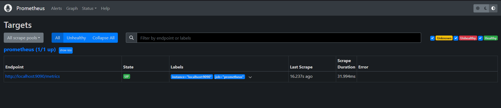
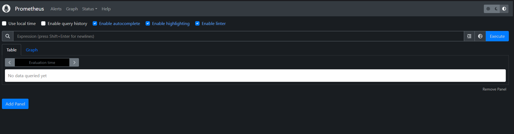

# Installing Prometheus with Binary and Managing it with Systemd

In this lab, we will set up Prometheus, an open-source monitoring and alerting toolkit, by following three key parts:

1. **Install Prometheus from Binary**: We will download the Prometheus binary, set it up, and run it to access the Prometheus web interface (GUI).

2. **Create a Non-root User**: We will create a dedicated non-root user for running Prometheus, enhancing security. Then, we will start Prometheus using this user and access the GUI.

3. **Create a systemd Service**: We will write a systemd service file to manage the Prometheus process. This will allow Prometheus to start automatically on boot and provide easier management of the service. Finally, we will test the GUI again.

This lab will provide you with a practical understanding of how to set up and manage Prometheus in a production environment.

---

## Install Prometheus and Access the Prometheus Web Interface

### Step 1: Download and Install Prometheus Binary

1. **Download Prometheus Binary:**
   - Go to the official Prometheus [download page](https://prometheus.io/download/). Copy the link to the latest release of Prometheus for Linux

      

   - Download the latest release of Prometheus for Linux by pasting the link we just copied after `wget` command:
     ```bash
     wget https://github.com/prometheus/prometheus/releases/download/<version>/prometheus-<version>.linux-amd64.tar.gz
     ```

     

   - This command uses `wget` to download the Prometheus binary tarball from the official GitHub repository. 

     *Note: Replace `<version>` with the your downloaded `prometheus` version number.*

2. **Extract the Tarball**:
   - Use `tar` command to extract the `tarball`:
     ```bash
     tar -xvzf prometheus-<version>.linux-amd64.tar.gz
     ```
     

   - **Explanation**:
     - `tar -xvzf` extracts the contents of the compressed file. Options:
       - `-x`: Extract files.
       - `-v`: Verbose output (shows extraction progress).
       - `-z`: Decompresses with gzip.
       - `-f`: Specifies the filename.

3. **Move Prometheus Binaries to `/usr/local/bin`**:
   ```bash
   cd prometheus-<version>.linux-amd64
   sudo mv prometheus /usr/local/bin/
   sudo mv promtool /usr/local/bin/
   ```
   - The `mv` command moves the `prometheus` and `promtool` binaries to `/usr/local/bin`, making them executable from anywhere in the terminal. `sudo` is used to execute the command with administrative privileges.

     *Note: Replace `<version>` with the your downloaded `prometheus` version number.*

4. **Set Up Prometheus Directories**:
   ```bash
   sudo mkdir /etc/prometheus
   sudo mkdir /var/lib/prometheus
   ```
   - This step creates the necessary directories for Prometheus configuration and data storage. The `mkdir` command is used to create these directories, with `sudo` ensuring proper permissions.

5. **Move Configuration and Console Files**:
   ```bash
   sudo mv prometheus.yml /etc/prometheus/
   sudo mv consoles /etc/prometheus/
   sudo mv console_libraries /etc/prometheus/
   ```
   -  This command moves the configuration file and related console files to the `/etc/prometheus` directory. This is where Prometheus will look for its configuration.

### Step 2: Start Prometheus

1. **Run Prometheus Executable**:
   ```bash
   prometheus --config.file=/etc/prometheus/prometheus.yml --storage.tsdb.path=/var/lib/prometheus/
   ```
   

   **Explanation**:
     - This command starts the Prometheus server. The parameters specify:
       - `--config.file`: Path to the configuration file.
       - `--storage.tsdb.path`: Path where time series data will be stored.

2. **Access the Prometheus Web Interface**:
   - In VSCode `Panel`, beside `TERMINAL` you will see `PORTS`.Go there and you will find a forwarded 
     link by `vscode` on port `9090` for `Prometheus`

     

     *Note: If you work on a local machine, you can access the Prometheus web interface by visiting 
     `http://localhost:9090` in your browser. If you work on a remote machine, replace `localhost` 
      with the IP address of the machine where Prometheus is running.*

3. **Verify Prometheus Target Status**:

   -  Click on the **"Status"** tab in the top menu and select **"Targets"**.

      
   -  You should see a target named `prometheus` with the URL `http://localhost:9090/metrics`. The 
      `UP` status indicates that Prometheus 
      is successfully running and scraping metrics from itself.

---

## Create a Non-root User and Start Prometheus

Creating a non-root user for running Prometheus enhances security by minimizing potential risks associated with running services as the root user. This practice helps limit the impact of any vulnerabilities that may arise in the application, as the user will have restricted permissions.

### Step 1: Create a Non-root User

1. **Create a Prometheus User**:
   ```bash
   sudo useradd --no-create-home --shell /bin/false prometheus
   ```
   - This command creates a new user named `prometheus` without a home directory and with no login shell, which enhances security.

2. **Assign Ownership of Directories**:
   ```bash
   sudo chown -R prometheus:prometheus /etc/prometheus
   sudo chown -R prometheus:prometheus /var/lib/prometheus
   ```
   - The `chown` command changes the ownership of the specified directories to the `prometheus` user, allowing it to read and write necessary files.

### Step 2: Start Prometheus with the Non-root User

1. **Run Prometheus as the Non-root User**:
   ```bash
   sudo -u prometheus /usr/local/bin/prometheus --config.file=/etc/prometheus/prometheus.yml --storage.tsdb.path=/var/lib/prometheus/
   ```

   - The `sudo -u` command allows you to run the Prometheus executable as the `prometheus` user, ensuring that Prometheus runs with limited privileges.

     

2. **Access the Prometheus Web Interface Again**:
   - Open a browser and go to forwarded link for `Prometheus` in `PORTS` of VSCode `Panel`

     

     

   - This confirms that Prometheus is running correctly under the non-root user.

---

## Create a systemd Service File for Prometheus

systemd is a system and service manager for Linux operating systems that initializes system components and manages services. Using systemd for Prometheus provides benefits like automatic service start on boot, easier service management, and better logging and monitoring of service performance.

### Step 1: Write a systemd Service File

1. **Create a Prometheus Service File**:
   ```bash
   sudo vim /etc/systemd/system/prometheus.service
   ```
   - This command opens a new file in the `nano` text editor where we will define the systemd service configuration for Prometheus.

2. **Add the Following Configuration**:
   ```ini
   [Unit]
   Description=Prometheus Monitoring System
   Wants=network-online.target
   After=network-online.target

   [Service]
   User=prometheus
   Group=prometheus
   Type=simple
   ExecStart=/usr/local/bin/prometheus \
     --config.file=/etc/prometheus/prometheus.yml \
     --storage.tsdb.path=/var/lib/prometheus/

   [Install]
   WantedBy=multi-user.target
   ```
   - **Explanation**: 
     - `[Unit]`: General service description and dependencies.
     - `[Service]`: Defines how to run the Prometheus service.
       - `User`: Specifies the user to run the service.
       - `Group`: Specifies the group to run the service.
       - `Type`: Indicates the service type; `simple` means the service is considered started immediately after the exec command is invoked.
       - `ExecStart`: The command to start Prometheus with its configuration and data path.
     - `[Install]`: Defines how the service is installed and started.

### Step 2: Start Prometheus with systemd

1. **Reload systemd Daemon**:
   ```bash
   sudo systemctl daemon-reload
   ```
   - This command reloads the systemd manager configuration to recognize the new service file.

2. **Enable Prometheus to Start at Boot**:
   ```bash
   sudo systemctl enable prometheus
   ```
   - This command enables the Prometheus service to start automatically on system boot.

3. **Start Prometheus Service**:
   ```bash
   sudo systemctl start prometheus
   ```
   - This command starts the Prometheus service managed by systemd.

4. **Check Prometheus Service Status**:
   ```bash
   sudo systemctl status prometheus
   ```
   - This command checks the status of the Prometheus service, confirming that it is running correctly.

     

### Step 3: Access the Prometheus Web Interface Again

1. **Open a Browser**:
   - Open forwarded link for `Prometheus` in `PORTS` of VSCode `Panel`

     

     

   - This confirms that Prometheus is running as a systemd service and accessible via the web interface.
---

By following these steps, you have successfully installed Prometheus, run it securely as a non-root user, and configured it to run as a systemd service. This setup provides a solid foundation for monitoring metrics in a production environment, with the flexibility to manage the service easily.


