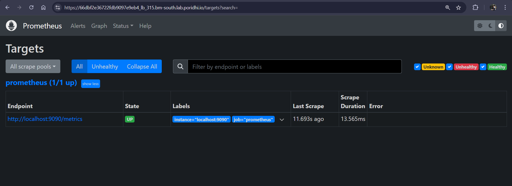
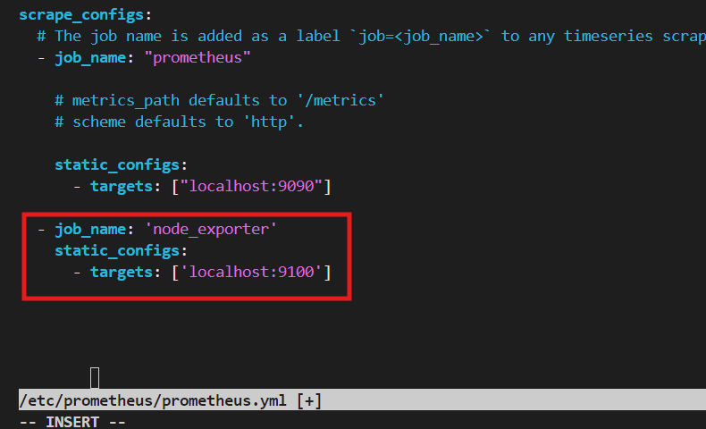
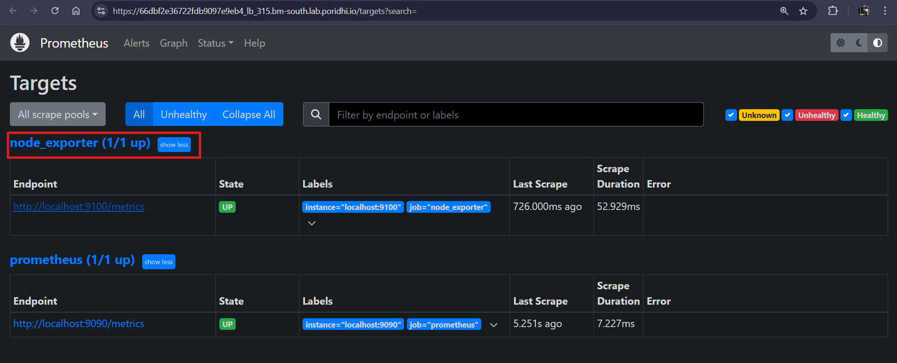
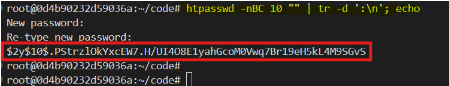
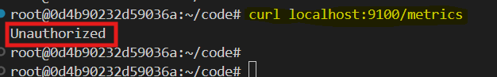
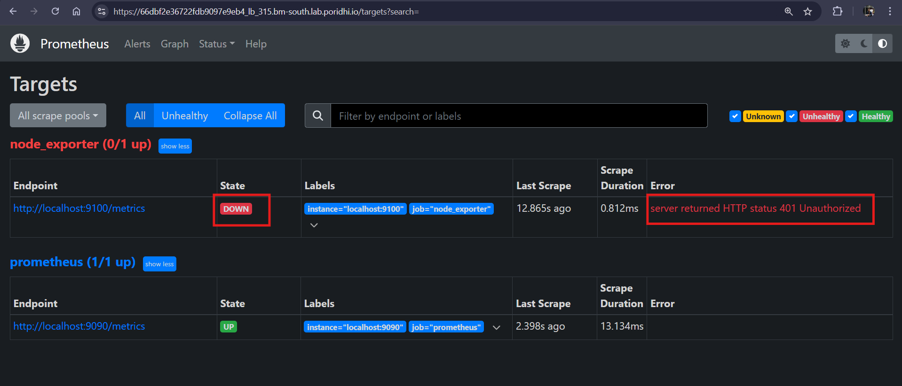
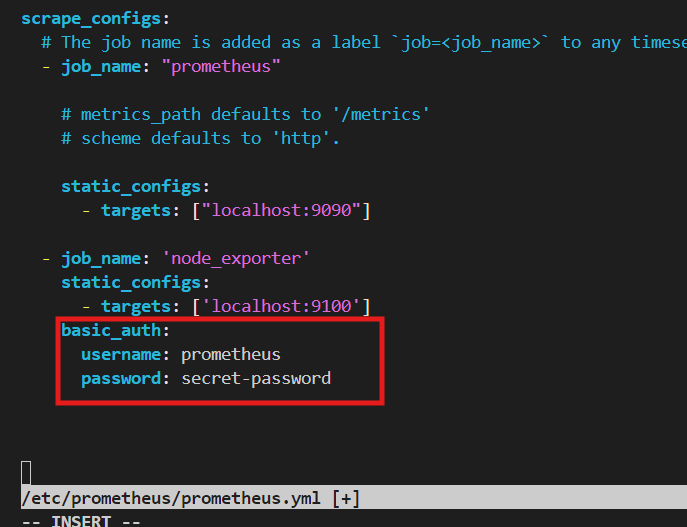
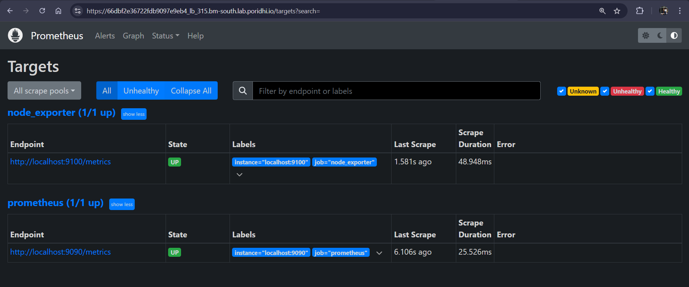

# **Prometheus Authentication Setup and Configuration**

Prometheus is a powerful monitoring system that scrapes and stores time-series data from various targets, including Node Exporter, which is used to monitor system metrics. However, by default, Prometheus and Node Exporter expose their metrics endpoints without any authentication, which can be a security risk. To ensure that only authorized users can access metrics, we will configure basic authentication for Node Exporter and secure it with Prometheus.


This guide will take you step-by-step through the process of setting up Prometheus and Node Exporter, enabling authentication, and configuring Prometheus to scrape the Node Exporter metrics securely.


## **Task Description**

1. Install and configure Prometheus and Node Exporter.
2. Set up Prometheus to scrape Node Exporter metrics.
3. Configure basic authentication for Node Exporter.
4. Update Prometheus to use authentication for scraping Node Exporter.


## **Setup Prometheus and Node Exporter**

### **1. Setup Script for Prometheus**

Create a setup script to automate the installation of Prometheus.

#### **Create a Script as `prometheus.sh`**

```bash
#!/bin/bash

# Variables
PROM_VERSION="2.53.2"
PROM_USER="prometheus"
PROM_DIR="/etc/prometheus"
PROM_LIB_DIR="/var/lib/prometheus"
PROM_BINARY_URL="https://github.com/prometheus/prometheus/releases/download/v${PROM_VERSION}/prometheus-${PROM_VERSION}.linux-amd64.tar.gz"
PROM_BIN_PATH="/usr/local/bin"

# Install wget and tar
sudo apt-get update && sudo apt-get install -y wget tar

# Download and extract Prometheus
wget $PROM_BINARY_URL && tar -xvzf prometheus-${PROM_VERSION}.linux-amd64.tar.gz

# Move binaries and config files
sudo mv prometheus-${PROM_VERSION}.linux-amd64/{prometheus,promtool} $PROM_BIN_PATH/
sudo mkdir -p $PROM_DIR $PROM_LIB_DIR && sudo mv prometheus-${PROM_VERSION}.linux-amd64/{prometheus.yml,consoles,console_libraries} $PROM_DIR/

# Create Prometheus user and assign permissions
sudo useradd --no-create-home --shell /bin/false $PROM_USER
sudo chown -R $PROM_USER:$PROM_USER $PROM_DIR $PROM_LIB_DIR

# Create systemd service file
sudo tee /etc/systemd/system/prometheus.service > /dev/null <<EOT
[Unit]
Description=Prometheus Monitoring System
Wants=network-online.target
After=network-online.target

[Service]
User=$PROM_USER
ExecStart=$PROM_BIN_PATH/prometheus --config.file=$PROM_DIR/prometheus.yml --storage.tsdb.path=$PROM_LIB_DIR

[Install]
WantedBy=multi-user.target
EOT

# Reload systemd, enable and start Prometheus
sudo systemctl daemon-reload
sudo systemctl enable --now prometheus

# Check status
sudo systemctl status prometheus
```

#### **Run the Script:**

```bash
chmod +x prometheus.sh
sudo ./prometheus.sh
```


### **2. Setup Script for Node Exporter**

Similarly, create a setup script for Node Exporter.

#### **Create a Script as `exporter.sh`**

```bash
#!/bin/bash

# Variables
NODE_EXPORTER_VERSION="1.8.2"
NODE_EXPORTER_USER="node_exporter"
NODE_EXPORTER_BINARY_URL="https://github.com/prometheus/node_exporter/releases/download/v${NODE_EXPORTER_VERSION}/node_exporter-${NODE_EXPORTER_VERSION}.linux-amd64.tar.gz"
NODE_EXPORTER_BIN_PATH="/usr/local/bin"

# Install wget and tar
sudo apt-get update && sudo apt-get install -y wget tar

# Download and extract Node Exporter
wget $NODE_EXPORTER_BINARY_URL && tar -xvzf node_exporter-${NODE_EXPORTER_VERSION}.linux-amd64.tar.gz

# Move Node Exporter binary
sudo mv node_exporter-${NODE_EXPORTER_VERSION}.linux-amd64/node_exporter $NODE_EXPORTER_BIN_PATH/

# Create a Node Exporter user (non-root)
sudo useradd --no-create-home --shell /bin/false $NODE_EXPORTER_USER

# Set ownership of the binary
sudo chown $NODE_EXPORTER_USER:$NODE_EXPORTER_USER $NODE_EXPORTER_BIN_PATH/node_exporter

# Create a systemd service file
sudo tee /etc/systemd/system/node_exporter.service > /dev/null <<EOT
[Unit]
Description=Node Exporter
Wants=network-online.target
After=network-online.target

[Service]
User=$NODE_EXPORTER_USER
Group=$NODE_EXPORTER_USER
ExecStart=$NODE_EXPORTER_BIN_PATH/node_exporter

[Install]
WantedBy=multi-user.target
EOT

# Reload systemd, enable and start Node Exporter
sudo systemctl daemon-reload
sudo systemctl enable --now node_exporter

# Check status
sudo systemctl status node_exporter
```

#### **Run the Script:**

```bash
chmod +x exporter.sh
sudo ./exporter.sh
```


### **3. Expose Prometheus UI**

- Get the `IP` to create a load balancer:

  ```bash
  ifconfig
  ```

  Here copy the `IP` from `eth0` interface:

  

- Create a load balancer from `Poridhi Lab` by providing the `IP` and `port: 9090`.


- Access the UI by opening the load balancer URL from browser. Go to *status > target*. We can see that prometheus has only one target and it is prometheus itself. Currently, it doesn't have `node_exporter` as its target to scrape. We have to configure the prometheus to scrape the `node_exporter`. 

  


### **4. Configure Prometheus to Scrape Node Exporter**

Prometheus needs to be configured to scrape the metrics from Node Exporter.

- **Edit Prometheus Configuration:**

  ```bash
  sudo vi /etc/prometheus/prometheus.yml
  ```

- Add the following job under the `scrape_configs` section:

  ```yaml
  - job_name: 'node_exporter'
    static_configs:
      - targets: ['localhost:9100']
  ```

  

- **Restart Prometheus:**

  ```bash
  sudo systemctl restart prometheus
  ```

- **Access/Reload the prometheus UI**

  Now you can see that the Prometheus is scraping the node_exporter:

  


## **Node Exporter Authentication Configuration**

To secure Node Exporter, we'll configure basic authentication.

### **Create Configuration File for Node Exporter**

- Lets create a folder and configuration file and set necessary permissions for them:

  ```bash
  sudo mkdir /etc/node_exporter/
  sudo touch /etc/node_exporter/config.yml
  sudo chmod 700 /etc/node_exporter
  sudo chmod 600 /etc/node_exporter/config.yml
  sudo chown -R node_exporter:node_exporter /etc/node_exporter
  ```

### **Install Apache2 Utils and Generate Password Hash**

- Install the required utility:

  ```bash
  sudo apt update
  sudo apt install apache2-utils -y
  ```

- Generate a password hash:

  In our case, we'll use `secret-password` as our password. Copy the generated hash.

  ```bash
  htpasswd -nBC 10 "" | tr -d ':\n'; echo
  ```


  

- Edit the `config.yml` file:

  ```bash
  sudo vi /etc/node_exporter/config.yml
  ```

  Add the following, replacing `<hashed-password>` with your generated hash:

  ```yaml
  basic_auth_users:
    prometheus: <hashed-password>
  ```

### **3. Configure Node Exporter Systemd Service**

- Open and Update the systemd service:
  ```bash
  sudo vi /etc/systemd/system/node_exporter.service
  ```

  Update the `ExecStart` directive:

  ```ini
  [Unit]
  Description=Node Exporter
  After=network.target

  [Service]
  User=node_exporter
  ExecStart=/usr/local/bin/node_exporter --web.config.file=/etc/node_exporter/config.yml

  [Install]
  WantedBy=multi-user.target
  ```

### **4. Set Proper Permissions**

- Ensure that the Node Exporter directory and file are properly owned and permissioned:

  ```bash
  sudo chown -R node_exporter:node_exporter /etc/node_exporter
  sudo chmod 755 /etc/node_exporter
  sudo chmod 644 /etc/node_exporter/config.yml
  ```

### **5. Reload Systemd and Restart Node Exporter**

- Let's reload the systemd to get the latest configuration:

  ```bash
  sudo systemctl daemon-reload
  sudo systemctl restart node_exporter
  sudo systemctl enable node_exporter
  ```


## **Testing Authentication**

### Test unauthorized access:

```bash
curl localhost:9100/metrics
```

Result: **Unauthorized**



### Test with credentials:

```bash
curl -u prometheus:secret-password localhost:9100/metrics
```

Result: **Metrics received**

### Prometheus UI

In the prometheus UI, we can see that the `node_exporter` in in `down` status with `401 Unauthorized` error:

  

This is because Prometheus also needs to be configured to authenticate with Node Exporter.

## **Prometheus Authentication Configuration**


### **Edit Prometheus Configuration**

Edit the `prometheus.yml` file:

```bash
sudo vi /etc/prometheus/prometheus.yml
```

Add the following under `scrape_configs`:

```yaml
- job_name: 'node_exporter'
  static_configs:
    - targets: ['localhost:9100']
  basic_auth:
    username: prometheus
    password: secret-password
```



### **Restart Prometheus**

```bash
sudo systemctl daemon-reload
sudo systemctl restart prometheus
```

### **Verify Prometheus Scraping**

In the Prometheus UI, the Node Exporter target should now be listed as **UP**, indicating authorized access.




## **Conclusion**

You've successfully configured Prometheus and Node Exporter with authentication, ensuring that metrics are protected and only accessible by authorized users. By integrating basic authentication, you have enhanced the security of your monitoring setup.