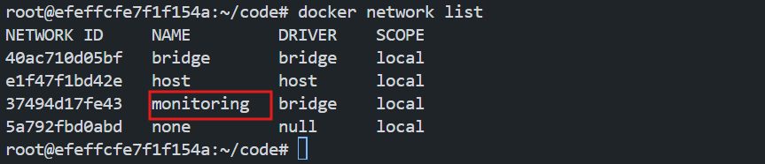
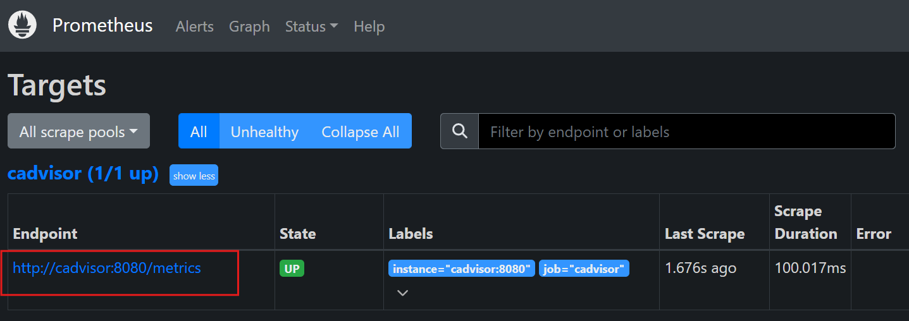
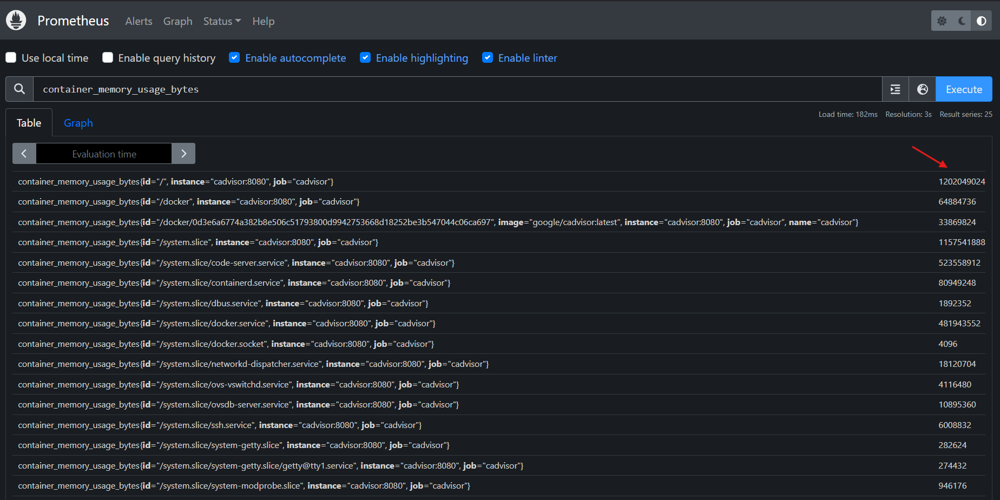

# Prometheus in Docker and Monitoring Containers

In this lab, you will learn how to set up Prometheus in Docker to monitor container metrics using `cAdvisor`, a tool designed to provide real-time performance data for running containers. `cAdvisor` collects and exposes metrics such as CPU, memory, and network usage from your Docker containers, which Prometheus then scrapes and stores for analysis. This setup enables efficient monitoring of containerized applications.


In this lab, you will:
- Create a Docker network for container communication.
- Configure Prometheus to scrape data from `cAdvisor`.
- Use Docker Compose to deploy Prometheus and `cAdvisor` together.
- Query and monitor Docker container metrics using Prometheus.

### Create a Docker Network
First, create a Docker network to allow Prometheus and other containers to communicate.

```bash
docker network create monitoring
```
We will use this network to connect Prometheus and cAdvisor.

We can verify the network by running:

```bash
docker network ls
```



### Create a Prometheus Configuration File

Create a `prometheus.yml` file to define how Prometheus scrapes data from `cAdvisor`.

```bash
mkdir prometheus
cd prometheus
vim prometheus.yml
```

Inside the `prometheus.yml` file, add the following:

```yaml
global:
  scrape_interval: 15s  # Scrape targets every 15 seconds

scrape_configs:
  - job_name: 'cadvisor'
    static_configs:
      - targets: ['cadvisor:9080']  # Reference to the cAdvisor container running on port 9080
```

This configuration tells Prometheus to scrape metrics from `cAdvisor` running on port `9080`.

### Set Up Prometheus and cAdvisor Using Docker Compose

Now, create a Docker Compose file to run Prometheus and `cAdvisor` together.

1. Create a `docker-compose.yml` file in the `prometheus` directory:

```bash
vim docker-compose.yml
```

2. Add the following configuration to the file:

```yaml
version: '3'

services:
  prometheus:
    image: prom/prometheus:latest
    container_name: prometheus
    volumes:
      - ./prometheus/prometheus.yml:/etc/prometheus/prometheus.yml
    ports:
      - 9090:9090
    networks:
      - monitoring

  cadvisor:
    image: google/cadvisor:latest
    container_name: cadvisor
    volumes:
      - /:/rootfs:ro
      - /var/run/docker.sock:/var/run/docker.sock:ro
      - /sys:/sys:ro
      - /var/lib/docker/:/var/lib/docker:ro
    ports:
      - 9080:8080  # Exposing cAdvisor on port 9080
    networks:
      - monitoring

networks:
  monitoring:
    external: true
```

This `docker-compose.yml` file sets up two services:
- **Prometheus**: It scrapes metrics and makes them available on port `9090`.
- **cAdvisor**: It monitors Docker containers and exposes metrics on port `9080`.


`cAdvisor` (Container Advisor) is an open-source tool for monitoring resource usage and performance of running containers. It collects metrics like CPU, memory, network, and disk usage, and exposes them for tools like Prometheus to scrape for analysis and monitoring.

### Start the Lab

Run `docker-compose` to start the Prometheus and `cAdvisor` containers:

```bash
docker-compose up -d
```

### Verify Prometheus and cAdvisor

- Find the `eth0` IP address for the `Poridhi's VM` currently you are running by using the command:

  ```bash
  ifconfig
  ```
  
    
- Go to Poridhi's `LoadBalancer`and Create a `LoadBalancer` with the `eht0` IP and port `9090`.

  

- By using the Provided `URL` by `LoadBalancer`, you can access the Prometheus web interface from any browser.

-  Click on the **"Status"** tab in the top menu and select **"Targets"** in Prometheus GUI.

   
       
   You should see a target named `cadvisor` with the URL `http://cadvisor:8080/metrics`. The `UP` status indicates that `cAdvisor` is successfully running and scraping metrics from the Docker containers.

### Monitor Docker Containers with Prometheus

To see Docker container metrics in Prometheus:

1. Open the Prometheus UI URL provided by the `LoadBalancer`.
2. In the **Expression** field, try querying for container metrics. For example:
   ```bash
   container_memory_usage_bytes
   ```

   

   This will show memory usage for each container in bytes.

3. Explore other metrics like CPU, network usage, etc.:
   ```bash
   container_cpu_usage_seconds_total
   container_network_receive_bytes_total
   ```

### Clean Up
Once you finish the lab, you can stop and remove all the containers:

```bash
docker-compose down
```

This lab walks you through setting up Prometheus in Docker and monitoring your containers using `cAdvisor`. By the end of the lab, you’ll be able to monitor your Docker containers' CPU, memory, and network usage via Prometheus.
