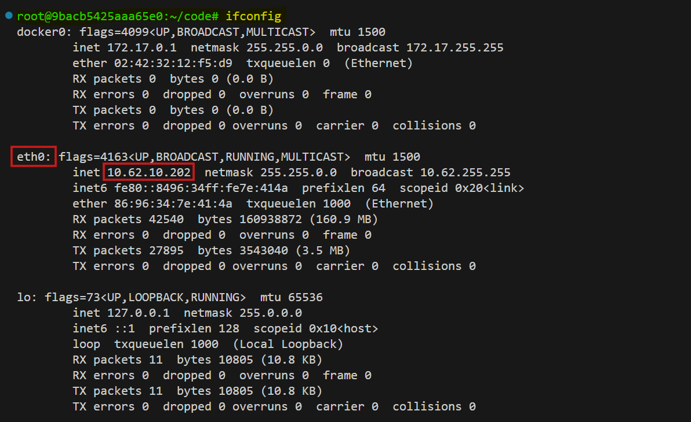
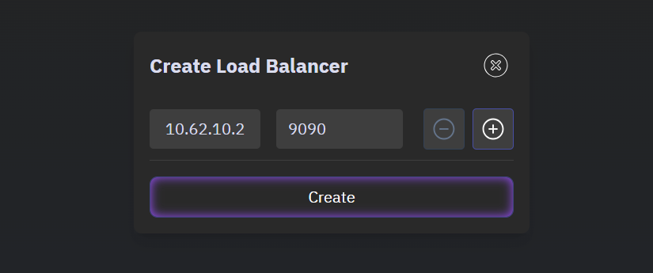
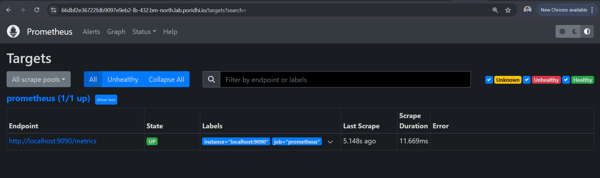
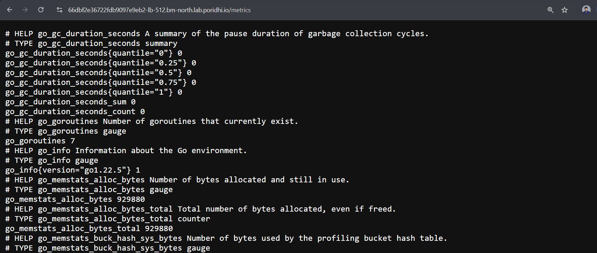
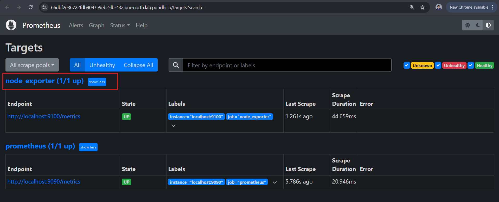

# Getting Started with PromQL: Selectors, Matchers, and Modifiers

PromQL, short for **Prometheus Query Language**, is the powerful and flexible language used to query metrics within Prometheus. This guide covers the key concepts, syntax, and use cases for PromQL, enabling you to analyze metrics, create visualizations, and configure alerting rules effectively.


## Task Overview  

In this lab, we explore the foundational concepts of **PromQL (Prometheus Query Language)** with a focus on understanding and applying **selectors**, **matchers**, and **modifiers** to query and analyze time-series data.  

By the end of this lab, you will:  
1. Learn how **selectors** identify specific data series or metrics.  
2. Use **matchers** to filter metrics based on label conditions.  
3. Apply **modifiers** to refine and enhance the results of your queries.  

This hands-on exercise is designed to equip you with the skills needed to craft precise and effective PromQL queries, which are essential for monitoring and debugging in Prometheus.

## Task Workflow

1. Install and configure Prometheus using scripts.
2. Set up Node Exporter for metric collection.
3. Access Prometheus via a LoadBalancer.
4. Understand PromQL and apply `selectors`, `matchers` and `modifiers` for query.

## **Setup Prometheus and Node Exporter**

### **1. Setup Script for Prometheus**

Create a setup script to automate the installation of Prometheus.

- #### **Create a Script as `prometheus.sh`**

  ```bash
  #!/bin/bash

  # Variables
  PROM_VERSION="2.53.2"
  PROM_USER="prometheus"
  PROM_DIR="/etc/prometheus"
  PROM_LIB_DIR="/var/lib/prometheus"
  PROM_BINARY_URL="https://github.com/prometheus/prometheus/releases/download/v${PROM_VERSION}/prometheus-${PROM_VERSION}.linux-amd64.tar.gz"
  PROM_BIN_PATH="/usr/local/bin"

  # Install wget and tar
  sudo apt-get update && sudo apt-get install -y wget tar

  # Download and extract Prometheus
  wget $PROM_BINARY_URL && tar -xvzf prometheus-${PROM_VERSION}.linux-amd64.tar.gz

  # Move binaries and config files
  sudo mv prometheus-${PROM_VERSION}.linux-amd64/{prometheus,promtool} $PROM_BIN_PATH/
  sudo mkdir -p $PROM_DIR $PROM_LIB_DIR && sudo mv prometheus-${PROM_VERSION}.linux-amd64/{prometheus.yml,consoles,console_libraries} $PROM_DIR/

  # Create Prometheus user and assign permissions
  sudo useradd --no-create-home --shell /bin/false $PROM_USER
  sudo chown -R $PROM_USER:$PROM_USER $PROM_DIR $PROM_LIB_DIR

  # Create systemd service file
  sudo tee /etc/systemd/system/prometheus.service > /dev/null <<EOT
  [Unit]
  Description=Prometheus Monitoring System
  Wants=network-online.target
  After=network-online.target

  [Service]
  User=$PROM_USER
  ExecStart=$PROM_BIN_PATH/prometheus --config.file=$PROM_DIR/prometheus.yml --storage.tsdb.path=$PROM_LIB_DIR

  [Install]
  WantedBy=multi-user.target
  EOT

  # Reload systemd, enable and start Prometheus
  sudo systemctl daemon-reload
  sudo systemctl enable --now prometheus

  # Check status
  sudo systemctl status prometheus
  ```

- #### **Run the Script:**

  ```bash
  chmod +x prometheus.sh
  sudo ./prometheus.sh
  ```

### **2. Setup Script for Node Exporter**

Similarly, create a setup script for Node Exporter.  

- #### **Create a Script as `exporter.sh`**

  ```bash
  #!/bin/bash

  # Variables
  NODE_EXPORTER_VERSION="1.8.2"
  NODE_EXPORTER_USER="node_exporter"
  NODE_EXPORTER_BINARY_URL="https://github.com/prometheus/node_exporter/releases/download/v${NODE_EXPORTER_VERSION}/node_exporter-${NODE_EXPORTER_VERSION}.linux-amd64.tar.gz"
  NODE_EXPORTER_BIN_PATH="/usr/local/bin"

  # Install wget and tar
  sudo apt-get update && sudo apt-get install -y wget tar

  # Download and extract Node Exporter
  wget $NODE_EXPORTER_BINARY_URL && tar -xvzf node_exporter-${NODE_EXPORTER_VERSION}.linux-amd64.tar.gz

  # Move Node Exporter binary
  sudo mv node_exporter-${NODE_EXPORTER_VERSION}.linux-amd64/node_exporter $NODE_EXPORTER_BIN_PATH/

  # Create a Node Exporter user (non-root)
  sudo useradd --no-create-home --shell /bin/false $NODE_EXPORTER_USER

  # Set ownership of the binary
  sudo chown $NODE_EXPORTER_USER:$NODE_EXPORTER_USER $NODE_EXPORTER_BIN_PATH/node_exporter

  # Create a systemd service file
  sudo tee /etc/systemd/system/node_exporter.service > /dev/null <<EOT
  [Unit]
  Description=Node Exporter
  Wants=network-online.target
  After=network-online.target

  [Service]
  User=$NODE_EXPORTER_USER
  Group=$NODE_EXPORTER_USER
  ExecStart=$NODE_EXPORTER_BIN_PATH/node_exporter

  [Install]
  WantedBy=multi-user.target
  EOT

  # Reload systemd, enable and start Node Exporter
  sudo systemctl daemon-reload
  sudo systemctl enable --now node_exporter

  # Check status
  sudo systemctl status node_exporter
  ```

- #### **Run the Script:**

  ```bash
  chmod +x exporter.sh
  sudo ./exporter.sh
  ```

### **3. Expose Prometheus UI and Node Exporter Metrics**

- Get the `IP` to create a load balancer:

  ```bash
  ifconfig
  ```

  Here copy the `IP` from `eth0` interface:

  

- Create a load balancer from `Poridhi Lab` by providing the `IP` and `port: 9090`.

  

- Access the UI by opening the load balancer URL from browser. Go to *status > target*. We can see that prometheus has only one target and it is prometheus itself. Currently, it doesn't have `node_exporter` as its target to scrape. We have to configure the prometheus to scrape the `node_exporter`. 

  

- Access the Node exporter metrics by creating another load balancer from `Poridhi Lab` using the `port: 9100`.

  

### **4. Configure Prometheus to Scrape Node Exporter**

Prometheus needs to be configured to scrape the metrics from Node Exporter.

- **Edit Prometheus Configuration:**

  ```bash
  sudo vi /etc/prometheus/prometheus.yml
  ```

- Add the following job under the `scrape_configs` section:

  ```yaml
  - job_name: 'node_exporter'
    static_configs:
      - targets: ['localhost:9100']
  ```

- **Restart Prometheus:**

  ```bash
  sudo systemctl daemon-reload
  sudo systemctl restart prometheus
  ```

- **Access/Reload the prometheus UI**

  Now you can see that the Prometheus is scraping the `node_exporter`. It may take a while to get the `up` state:

  

## Introduction to PromQL

PromQL is the primary method for querying metrics in Prometheus. A PromQL expression is sent to the Prometheus server, which evaluates the query and returns the corresponding data. The returned data can be:

- Visualized in tools like Grafana or Prometheus' built-in dashboard.
- Used to build alerting rules to notify administrators when thresholds are exceeded.

## PromQL Data Types

When a PromQL query is executed, the result can be one of the following data types:

### 1. **String**
- A simple string value.
- Currently unused in Prometheus.

### 2. **Scalar**
- A numeric floating-point value.
- Example: `54.743` or `127.43`.

### 3. **Instant Vector**
- A set of time series containing a single sample for each time series, all sharing the same timestamp.
- Example Query: `metric_name`
  - Returns values for the specified metric across all unique label combinations.
  - All results share the same timestamp.

### 4. **Range Vector**
- A set of time series containing multiple data points over a time range.
- Example Query: `metric_name[3m]`
  - Returns values for the last 3 minutes, including timestamps for each scrape.

## Selectors and Matchers

Selectors and matchers allow filtering specific time series from metrics.

### Matchers

1. **Equality Matcher** (`=`)
   - Matches time series with an exact label value.
   - Example: `metric_name{instance="node1"}`

2. **Negative Equality Matcher** (`!=`)
   - Excludes time series with a specific label value.
   - Example: `metric_name{device!="tmpfs"}`

3. **Regex Matcher** (`=~`)
   - Matches time series where the label value matches a regex.
   - Example: `metric_name{device=~"/dev/sda.*"}`

4. **Negative Regex Matcher** (`!~`)
   - Excludes time series where the label value matches a regex.
   - Example: `metric_name{mountpoint!~"/boot.*"}`

### Combining Selectors
- Use a comma to combine multiple selectors.
- Example: `metric_name{instance="node1", device!="tmpfs"}`

## Range Vector Selectors

- Used to query data over a time range.
- Syntax: `metric_name[duration]`
  - Example: `metric_name[2m]` retrieves data from the last 2 minutes.

## Using the Offset Modifier

- Retrieves metric data from a specific offset in the past.
- Syntax: `metric_name offset duration`
  - Example: `metric_name offset 5m` retrieves data from 5 minutes ago.

### Supported Time Units
- Milliseconds: `ms`
- Seconds: `s`
- Minutes: `m`
- Hours: `h`
- Days: `d`
- Weeks: `w`
- Years: `y`

Example:
- `metric_name offset 2w` retrieves data from 2 weeks ago.
- `metric_name offset 1h30m` retrieves data from 1 hour and 30 minutes ago.

## The `@` Modifier for Specific Timestamps

- Fetches data for a specific UNIX timestamp.
- Syntax: `metric_name @ <timestamp>`
  - Example: `metric_name @ 1694781960` retrieves data for the exact time corresponding to the UNIX timestamp.

## Combining Offset and `@` Modifiers

- These can be used together for advanced queries.
- Example: `metric_name @ 1694781960 offset 5m`
  - Retrieves data for 5 minutes before the specified timestamp.

The order of these modifiers does not matter.

## Conclusion

PromQL is a powerful tool for querying and analyzing metrics in Prometheus. By mastering its data types, selectors, matchers, and modifiers, you can extract the precise data needed for monitoring and alerting. As you explore further, PromQL’s advanced features will unlock even greater potential for observability and insights.