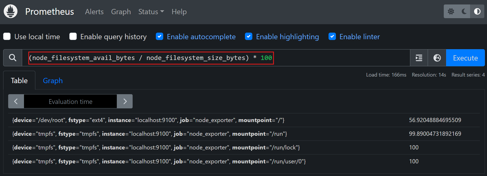
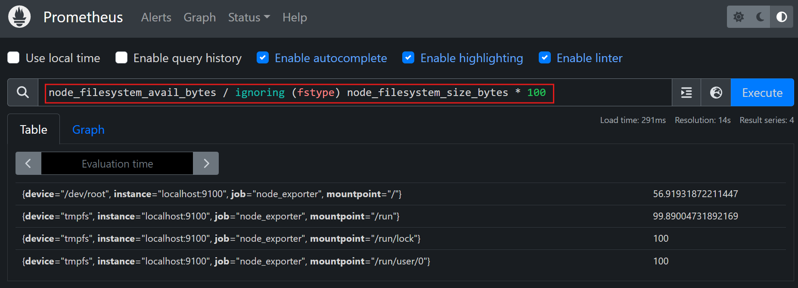
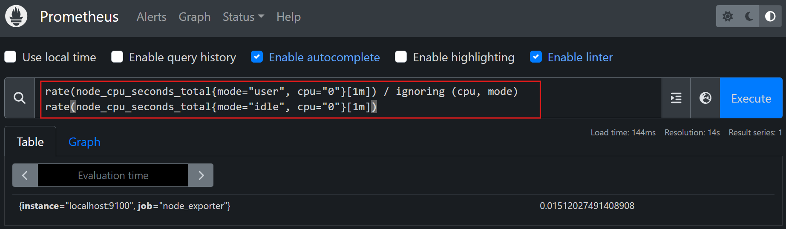

# Vector Matching and Aggregation in PromQL

PromQL (Prometheus Query Language) is a robust query language designed to analyze metrics. It supports two powerful features:

- **Vector Matching**:
  Vector matching enables operations between metrics by aligning their labels. It ensures that labels on both vectors match perfectly (one-to-one) or resolves mismatches using features like `on`, `ignoring`, `group_left`, and `group_right`.

- **Aggregation**:
  Aggregation simplifies metrics across dimensions using operators like `sum`, `avg`, `min`, `max`, and `count`. It allows you to summarize system behavior, such as total CPU usage or average memory available.

These features together enable detailed analysis of system metrics.


## Objectives

By the end of this lab, you will:
1. Install and configure Prometheus using a script.
2. Understand vector matching (`on`, `ignoring`, `group_left`, `group_right`).
3. Perform aggregation with PromQL (`sum`, `avg`, `max`, `min`).
4. Test queries in Prometheus using a LoadBalancer for external access.


## Install and Configure Prometheus

Create the following script as `prometheus.sh`:

```bash
#!/bin/bash

# Variables
PROM_VERSION="2.53.2"
PROM_USER="prometheus"
PROM_DIR="/etc/prometheus"
PROM_LIB_DIR="/var/lib/prometheus"
PROM_BINARY_URL="https://github.com/prometheus/prometheus/releases/download/v${PROM_VERSION}/prometheus-${PROM_VERSION}.linux-amd64.tar.gz"
PROM_BIN_PATH="/usr/local/bin"

# Install wget and tar
sudo apt-get update && sudo apt-get install -y wget tar

# Download and extract Prometheus
wget $PROM_BINARY_URL && tar -xvzf prometheus-${PROM_VERSION}.linux-amd64.tar.gz

# Move binaries and config files
sudo mv prometheus-${PROM_VERSION}.linux-amd64/{prometheus,promtool} $PROM_BIN_PATH/
sudo mkdir -p $PROM_DIR $PROM_LIB_DIR && sudo mv prometheus-${PROM_VERSION}.linux-amd64/{prometheus.yml,consoles,console_libraries} $PROM_DIR/

# Create Prometheus user and assign permissions
sudo useradd --no-create-home --shell /bin/false $PROM_USER
sudo chown -R $PROM_USER:$PROM_USER $PROM_DIR $PROM_LIB_DIR

# Create systemd service file
sudo tee /etc/systemd/system/prometheus.service > /dev/null <<EOT
[Unit]
Description=Prometheus Monitoring System
Wants=network-online.target
After=network-online.target

[Service]
User=$PROM_USER
ExecStart=$PROM_BIN_PATH/prometheus --config.file=$PROM_DIR/prometheus.yml --storage.tsdb.path=$PROM_LIB_DIR

[Install]
WantedBy=multi-user.target
EOT

# Reload systemd, enable and start Prometheus
sudo systemctl daemon-reload
sudo systemctl enable --now prometheus

# Check status
sudo systemctl status prometheus
```
### Make it executable

   ```bash
   chmod +x prometheus.sh
   ```
### Run the script
   ```bash
   ./prometheus.sh
   ```
This will install Prometheus and configure it to monitor the local machine using the Node Exporter.

#### Configure Prometheus for Metric Collection

1. Edit the Prometheus configuration file:
   ```bash
   sudo vim /etc/prometheus/prometheus.yml
   ```
   Add the following scrape job:
   ```yaml
   scrape_configs:
     - job_name: 'node_exporter'
       static_configs:
         - targets: ['localhost:9100']  # Replace with your Node Exporter address
   ```

2. Restart Prometheus:
   ```bash
   sudo systemctl restart prometheus
   ```

### Step 2: Testing PromQL Queries

#### Check Prometheus Targets:
1. Find the `eth0` IP address of the VM:
   ```bash
   ifconfig
   ```
   

2. Create a `LoadBalancer`:
   - Go to Poridhi's `LoadBalancer`.
   - Create a `LoadBalancer` using the `eth0` IP and port `9090`.

   

3. Access Prometheus:
   Use the provided `LoadBalancer URL` to access the Prometheus web interface from any browser.

4. Verify Targets:
   - Click on the **"Status"** tab in Prometheus UI.
   - Select **"Targets"** and confirm that the `node_exporter` target is `UP`.

   

### Step 3: Vector Matching Queries in PromQL

#### 1. **One-to-One Matching**
**Query**: Calculate the percentage of free disk space:
  ```promql
  (node_filesystem_avail_bytes / node_filesystem_size_bytes) * 100
  ```
  

#### 2. **Ignoring Labels**
**Query**: Ignore the `fstype` label while calculating free disk space:
  ```promql
  node_filesystem_avail_bytes / ignoring (fstype) node_filesystem_size_bytes * 100
  ```
  

#### 3. **Using `on`**
**Query**: Match CPU usage by `instance` while ignoring `cpu` and `mode`:
  ```promql
  rate(node_cpu_seconds_total{mode="user", cpu="0"}[1m]) / ignoring (cpu, mode) rate(node_cpu_seconds_total{mode="idle", cpu="0"}[1m])
  ```

  
- `cpu="0"`:
  Filters the query to only include metrics for cpu="0". You can change this to cpu="1" or another label as needed.
- `ignoring (cpu, mode)`:
  Ensures the division ignores cpu and mode labels, matching only by instance.
- Division:
  Matches the user and idle CPU metrics for cpu="0" and calculates the ratio.

#### 4. **Many-to-One Matching**
- **Query**: Match multiple error codes (`400`, `500`) to total requests for each endpoint:
  ```promql
  sum(http_errors_total) by (endpoint) / on(endpoint) group_left http_requests_total
  ```

### Step 4: Aggregation Queries in PromQL

#### 1. **Summing Metrics**
- **Query**: Calculate total memory available across all nodes:
  ```promql
  sum(node_memory_MemAvailable_bytes)
  ```

#### 2. **Averaging Metrics**
- **Query**: Average free disk space per mountpoint:
  ```promql
  avg(node_filesystem_avail_bytes) by (mountpoint)
  ```

#### 3. **Counting Metrics**
- **Query**: Count the number of instances exporting memory metrics:
  ```promql
  count(node_memory_MemAvailable_bytes)
  ```

#### 4. **Finding Maximum and Minimum Values**
- **Query**: Maximum memory available among all nodes:
  ```promql
  max(node_memory_MemAvailable_bytes)
  ```

#### 5. **Combining Aggregation and Vector Matching**
- **Query**: Calculate the average error rate per endpoint:
  ```promql
  avg(sum(http_errors_total) by (endpoint)) / avg(http_requests_total)
  ```

### Step 5: Analyze Results in Prometheus

1. Navigate to Prometheus's **Graph** tab using the `LoadBalancer URL`.
2. Paste each query into the query editor.
3. Execute the queries and analyze the results.

### Summary

In this lab, you:
1. Installed Prometheus using a script and configured it for monitoring.
2. Tested vector matching queries using `on`, `ignoring`, `group_left`, and `group_right`.
3. Performed aggregation using PromQL functions like `sum`, `avg`, `max`, `min`, and `count`.
4. Used a LoadBalancer to access and analyze Prometheus metrics externally.