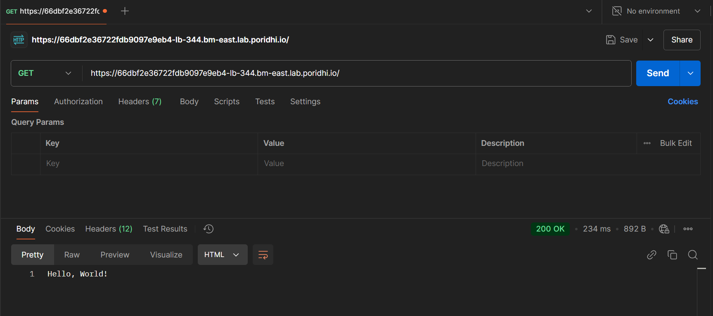
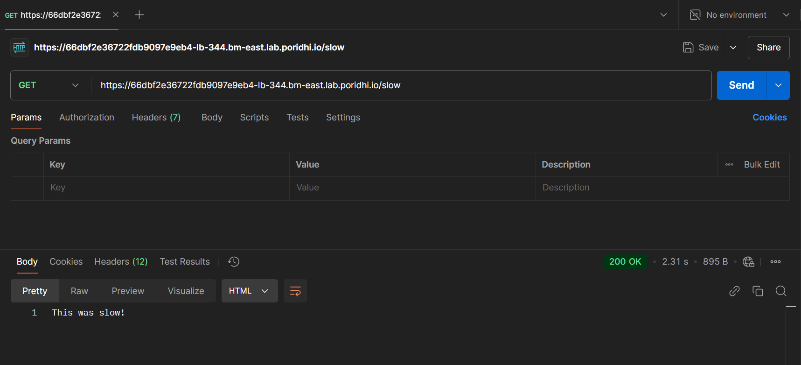
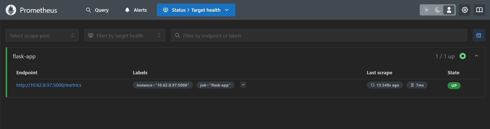
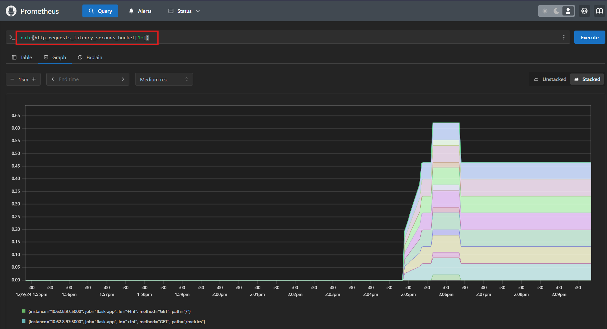
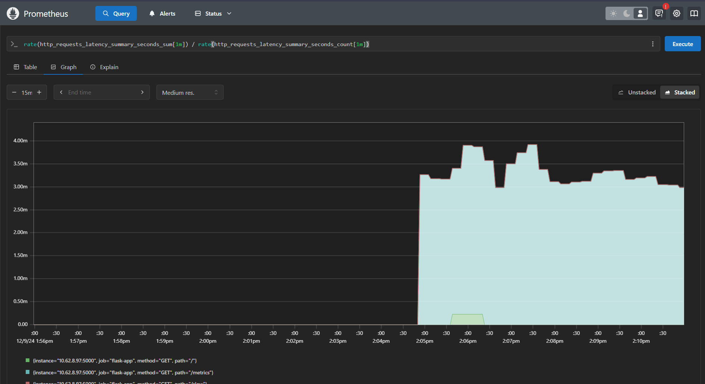
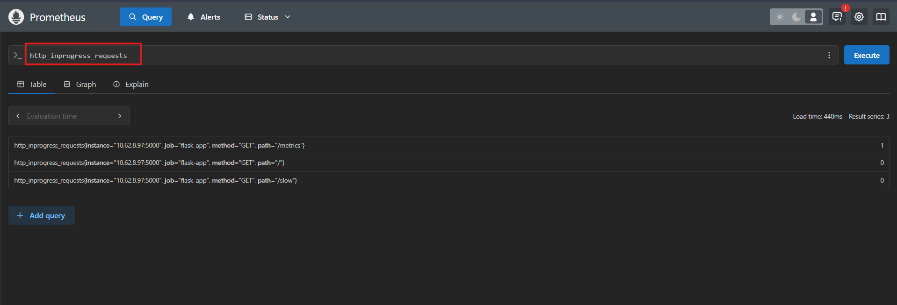

# Application Instrumentation Using Histogram, Summary, and Gauge Metrics

Application instrumentation is the process of adding monitoring capabilities to your application's code to measure its performance and behavior. It's like adding sensors to your application that help you understand what's happening inside while it's running. Think of it as similar to how a car's dashboard provides critical information about speed, fuel level, and engine temperature.


This lab demonstrates how to instrument a Flask application with Histogram, Summary, and Gauge metrics:

- **Histogram Metric:** Tracks request latency and response time.

- **Summary Metric:** Similar to a histogram but provides quantiles instead of buckets (limited customization in Python).

- **Gauge Metric:** Tracks the number of active requests.


## Task Description

This lab demonstrates how to instrument a Flask application with metrics using the Prometheus Python client. 

- Implement the Histogram metric to track latency and response time per request.

- Implement the Summary metric to record request latencies.

- Implement the Gauge metric to monitor active requests in real-time.

- Expose metrics at the `/metrics` endpoint for Prometheus to scrape.


## Setup the Environment

1. Create a project directory:
   ```bash
   mkdir prometheus-lab
   cd prometheus-lab
   ```

2. Set up a virtual environment:
   ```bash
   python3 -m venv venv
   source venv/bin/activate
   ```

3. Install the required libraries:
   ```bash
   pip install flask prometheus-client
   ```

These packages provide:
- `Flask`: Web framework for building our application
- `prometheus-client`: Official Python client library for Prometheus

## Flask Application Code

Let's break down our application code piece by piece in `app.py`:


Here’s the Flask application with Prometheus metrics, breaking it down part by part to help you understand the instrumentation:


### 1. **Importing Necessary Modules**
```python
from flask import Flask, request
from prometheus_client import Histogram, Summary, Gauge, generate_latest
import time
```
- **`Flask`**: The web framework used to create the application.
- **`prometheus_client`**: The library for creating Prometheus metrics.
  - **`Histogram`**: Tracks distributions, focusing on latency buckets.
  - **`Summary`**: Tracks latency with quantiles.
  - **`Gauge`**: Tracks values that can go up and down (e.g., in-progress requests).
  - **`generate_latest`**: Generates the current metrics in a format Prometheus understands.
- **`time`**: Used to measure request duration.


### 2. **Creating a Flask App**
```python
app = Flask(__name__)
```
This initializes the Flask app that will handle incoming HTTP requests.


### 3. **Defining Metrics**
#### **Histogram**
```python
REQUEST_LATENCY = Histogram(
    'http_requests_latency_seconds',
    'Histogram of HTTP request latency in seconds',
    ['method', 'path'],
    buckets=[0.1, 0.5, 1, 2.5, 5, 10]
)
```
- Tracks request latencies with predefined **buckets** (e.g., `0.1s`, `0.5s`, etc.).
- **Labels** (`method` and `path`) help distinguish metrics based on request type and endpoint.

#### **Summary**
```python
REQUEST_SUMMARY = Summary(
    'http_requests_latency_summary_seconds',
    'Summary of HTTP request latency in seconds',
    ['method', 'path']
)
```
- Similar to a histogram but focuses on quantiles (e.g., 50th percentile latency).

#### **Gauge**
```python
INPROGRESS_REQUESTS = Gauge(
    'http_inprogress_requests',
    'Number of in-progress HTTP requests',
    ['method', 'path']
)
```
- Tracks the current number of ongoing requests, incremented when a request starts and decremented when it ends.


### 4. **Middleware: `before_request`**
```python
@app.before_request
def before_request():
    request.start_time = time.time()
    INPROGRESS_REQUESTS.labels(method=request.method, path=request.path).inc()
```
- **`request.start_time`**: Captures the start time of the request.
- **Gauge Increment**: Tracks that a new request is in progress.


### 5. **Middleware: `after_request`**
```python
@app.after_request
def after_request(response):
    latency = time.time() - request.start_time
    REQUEST_LATENCY.labels(method=request.method, path=request.path).observe(latency)
    REQUEST_SUMMARY.labels(method=request.method, path=request.path).observe(latency)
    INPROGRESS_REQUESTS.labels(method=request.method, path=request.path).dec()
    return response
```
- Calculates the **latency** as the difference between the current time and the start time.
- Updates:
  - **Histogram**: Observes the request's latency for bucket tracking.
  - **Summary**: Observes latency for quantile calculations.
  - **Gauge**: Decrements to signal the request is completed.


### 6. **Basic Routes**
#### **Home Route**
```python
@app.route('/')
def home():
    return "Hello, World!"
```
- A simple endpoint for testing basic behavior.

#### **Slow Route**
```python
@app.route('/slow')
def slow():
    time.sleep(2)  # Simulate a slow request
    return "This was slow!"
```
- Simulates a slow response by pausing for 2 seconds.


### 7. **Metrics Endpoint**
```python
@app.route('/metrics')
def metrics():
    return generate_latest(), 200, {'Content-Type': 'text/plain; charset=utf-8'}
```
- Exposes all collected metrics in Prometheus format.
- Prometheus scrapes this endpoint to gather metrics.


### 8. **Running the Application**
```python
if __name__ == '__main__':
    app.run(host='0.0.0.0', port=5000)
```
- Starts the Flask application, listening on all network interfaces at port 5000.


### 9. **Start the Application**

Run the application using the following command:
```bash
python3 app.py
```

### **Use Cases of Each Metric**
- **Histogram**: Analyze distribution patterns of latencies to understand how many requests fall within specific ranges.
- **Summary**: Focus on quantiles for latency reporting, like "95% of requests take less than X seconds."
- **Gauge**: Monitor current load on the application (useful for scaling decisions).


## Run prometheus server using docker

### 1. Setup prometheus configuration in `prometheus.yml` :

```yaml
global:
  scrape_interval: 15s

scrape_configs:
  - job_name: 'flask-app'
    static_configs:
      - targets: ['<ip-adress>:5000']
```

Get the `ip-address` from `eth0` ip address using `ifconfig` command. 

### 2. `docker-compose.yml` for prometheus server:

```yaml
version: '3'
services:
  prometheus:
    image: prom/prometheus:latest
    ports:
      - "9090:9090"
    volumes:
      - ./prometheus.yml:/etc/prometheus/prometheus.yml
    networks:
      - monitoring

networks:
  monitoring:
```

### 3. Running the docker container:
```bash
docker-compose up -d 
```

## Create Load Balancer and send HTTP requests

### 1. Create load balancer for flask-app and prometheus UI:
- Get the `eth0` IP using `ifconfig` command.
- Create a load balancers with the `IP` address and port `9090` for prometheus dashboard.
- Create another load balancer with the `IP` address and port `5000` for flask app.


### 2. Generate some test data using `Postman`:

- Send some `GET` request to the address:
`<flask-app-lb-url>`.

    

- Send some `GET` request to the address:
`<flask-app-lb-url>/slow`.

    


    


## Access Prometheus UI 

1. Open the load balancer url for prometheus service. 

2. Check if the target is in `up` state from: *status > target health*

    


## Sample PromQL Queries

1. Request Latency (Histogram):

    ```
    rate(http_requests_latency_seconds_bucket[1m])
    ```

    

2. Request Latency (Summary):

    ```
    rate(http_requests_latency_summary_seconds_sum[1m]) / rate(http_requests_latency_summary_seconds_count[1m])
    ```

    

3. Active Requests:
    ```
    http_inprogress_requests
    ```

    


## Conclusion

In this lab, we demonstrated how to instrument a Flask application with Prometheus metrics, including histograms, summaries, and gauges. These metrics provide valuable insights into application performance, such as request latency, response times, and active requests. By exposing metrics at the `/metrics` endpoint and setting up Prometheus for scraping, you can effectively monitor and analyze your application's behavior. This approach ensures a more reliable and scalable application through proactive performance tracking and real-time monitoring.