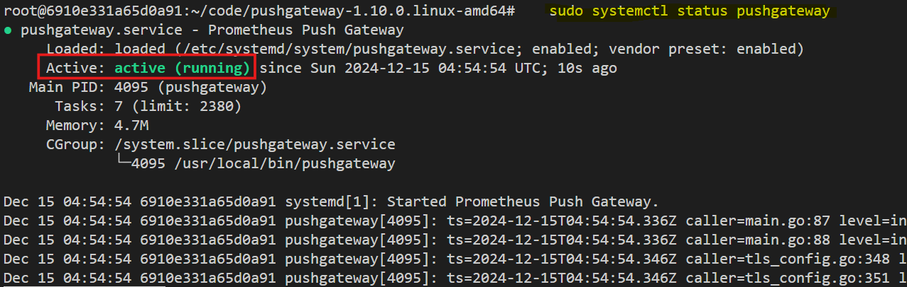
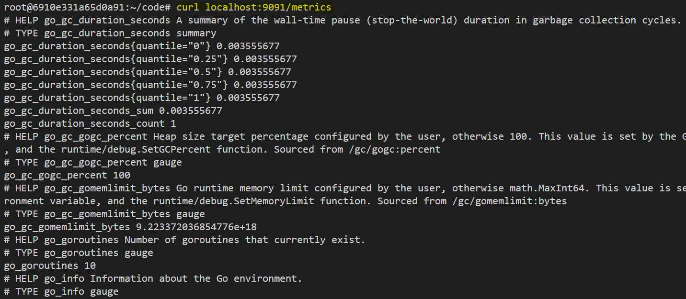

# **Introduction to Push Gateway**

In a typical Prometheus setup, the server scrapes metrics from running instances. However, when it comes to **batch jobs**—which run for a short period and exit—it becomes challenging for Prometheus to collect metrics because the job often finishes before Prometheus has a chance to scrape them.


The **Push Gateway** addresses this problem by acting as a middleman. Here's how it works:

1. **Batch Job Completion**: When a batch job finishes, it pushes its metrics to the Push Gateway instead of waiting for Prometheus to scrape them.
2. **Prometheus Scraping**: Prometheus then scrapes the metrics from the Push Gateway, just as it would for any other target.


#### **Example Usecase**

Imagine you have a backup script that runs nightly. This script generates metrics like backup size, time taken, and success/failure status. Instead of keeping the script running for Prometheus to scrape, it can push these metrics to the Push Gateway, which holds onto them until Prometheus collects them.

## **Task Description**  
In this task, you will set up and configure the Prometheus Push Gateway to collect metrics from short-lived batch jobs. You will learn:

1. Installing Push Gateway using either the binary method or systemd for process management.  
2. Configuring Prometheus to scrape metrics from Push Gateway, ensuring metrics are correctly attributed to the original source jobs.  


# **Installation Steps**

You can set up the Push Gateway on any server, even the same server hosting your Prometheus instance. Below are the two steps for installation: 
1. Using the binary method.
2. Setting it up with **systemd** for process management.

### **Step 1: Download and Install Push Gateway Binary**
1. Visit the [Prometheus website](https://prometheus.io/download/) and navigate to the downloads page.
2. Locate the Push Gateway binary for your operating system.
3. Use `wget` to download the binary:
   ```bash
   wget https://github.com/prometheus/pushgateway/releases/download/v1.10.0/pushgateway-1.10.0.linux-amd64.tar.gz
   ```
4. Extract the downloaded file:
   ```bash
   tar -xvzf pushgateway-1.10.0.linux-amd64.tar.gz
   ```
5. Move into the extracted directory:
   ```bash
   cd pushgateway-1.10.0.linux-amd64
   ```

6. Start the Push Gateway:
   ```bash
   ./pushgateway
   ```
   The Push Gateway will now run on the default port **9091**.

### **Step 2: Set Up Systemd for Push Gateway**

1. **Create a System User for Push Gateway**:
   ```bash
   sudo useradd --no-create-home --shell /bin/false pushgateway
   ```

2. **Move the Executable to a System Directory**:
   ```bash
   sudo cp pushgateway /usr/local/bin/
   sudo chown pushgateway:pushgateway /usr/local/bin/pushgateway
   ```

3. **Create a Systemd Service File**:
   Create a new service file at `/etc/systemd/system/pushgateway.service` with the following command:

   ```bash
   vi /etc/systemd/system/pushgateway.service
   ``` 
   
   Add the following content:
   ```ini
   [Unit]
   Description=Prometheus Push Gateway
   After=network.target

   [Service]
   User=pushgateway
   Group=pushgateway
   ExecStart=/usr/local/bin/pushgateway
   Restart=on-failure

   [Install]
   WantedBy=multi-user.target
   ```

4. **Reload and Enable the Service**:
   ```bash
   sudo systemctl daemon-reload
   sudo systemctl start pushgateway
   sudo systemctl enable pushgateway
   ```

5. **Verify the Service**:
   Check the status to ensure the Push Gateway is running:
   ```bash
   sudo systemctl status pushgateway
   ```

   

6. **Test the Metrics Endpoint**:
   Use `curl` to verify the metrics endpoint:
   ```bash
   curl localhost:9091/metrics
   ```

   


## **Configuration for Push Gateway**

When configuring **Prometheus** to scrape metrics from the Push Gateway, the setup in `prometheus.yml` is similar to adding any other scrape target, with one key difference: the **`honor_labels: true`** flag. A basic configuration to scrape metrics from the Push Gateway might look like this in `prometheus.yml`:
```yaml
scrape_configs:
  - job_name: 'pushgateway'
    static_configs:
      - targets: ['<pushgateway-server>:9091']
    honor_labels: true
```

You can open this `prometheus.yml` file using the following command:
```bash
vi /etc/prometheus/prometheus.yml
```

### **What Does `honor_labels: true` Do?**
- Normally, when Prometheus scrapes a target, it automatically assigns the `job` and `instance` labels to the scraped metrics, reflecting the scrape job and target instance (e.g., Push Gateway).
- However, for metrics in the Push Gateway, the actual `job` and `instance` labels should reflect the **original batch job** that pushed the metrics, not the Push Gateway itself.

    

- By setting **`honor_labels: true`**, Prometheus respects the labels (e.g., `job` and `instance`) specified by the metrics in the Push Gateway. This ensures that the metrics are attributed to their source jobs, rather than the Push Gateway. 

This setup is crucial when multiple batch jobs push metrics to the same Push Gateway, allowing Prometheus to differentiate metrics based on their original jobs and instances.


## **Conclusion**  
The Push Gateway is an essential tool for capturing metrics from short-lived batch jobs in a Prometheus ecosystem. By acting as an intermediary, it ensures that metrics from completed jobs are not missed, providing accurate monitoring and insights. Proper setup with **`honor_labels: true`** in Prometheus configuration enables seamless attribution of metrics to their source, ensuring meaningful and reliable monitoring across diverse workloads.