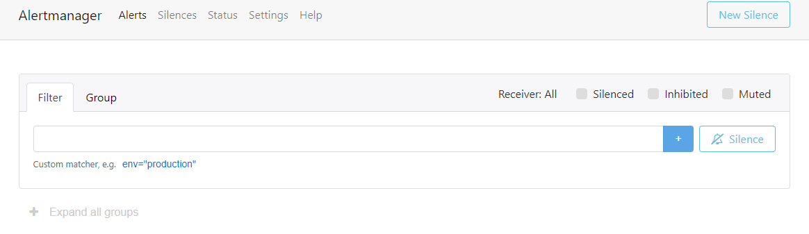
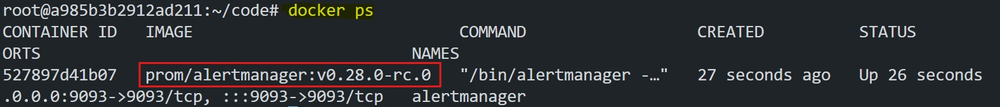

# **Installations of Alertmanager**

## **Introduction**  
Alertmanager is a component of the Prometheus ecosystem responsible for handling alerts generated by Prometheus. It manages alerts by grouping, deduplicating, and routing them to various receivers such as email, Slack, or PagerDuty. 


**Why do we need Alertmanager?**  
- Prometheus triggers alerts but cannot send notifications directly.  
- Alertmanager ensures alerts are efficiently managed and delivered to the right channels such as `Email`, `Slack`, or `PagerDuty` 
- It allows features like **silencing**, **inhibition**, and **routing** to reduce alert fatigue.


## **Objective**  
In this lab, you will:  
1. Understand the architecture of Alertmanager.  
2. Install Alertmanager using two methods:  
   - **Method 1**: Install with systemd for standalone setups.  
   - **Method 2**: Install using Docker for containerized environments.  

## **Alertmanager Architecture**


The architecture of Alertmanager can be broken down into the following components:

1. **Alerts**: Prometheus sends alerts to Alertmanager through its API.  
2. **Dispatching**: Alerts are grouped (e.g., Group 1, Group 2) based on predefined conditions.  
3. **Inhibition**: Suppresses certain alerts when higher-priority alerts are active.  
4. **Silencing**: Temporarily silences alerts during maintenance or known outages.  
5. **Routing**: Routes alerts to specific receivers like Slack, email, or chat services.  
6. **Receivers**: Final destinations for alerts where users are notified.

## **Install Alertmanager**

### **Method 1: Install Alertmanager with systemd**

1. **Download Alertmanager**:
   ```bash
   wget https://github.com/prometheus/alertmanager/releases/download/v0.28.0-rc.0/alertmanager-0.28.0-rc.0.linux-amd64.tar.gz
   ```

2. **Extract the archive**:
   ```bash
   tar -xvzf alertmanager-0.28.0-rc.0.linux-amd64.tar.gz
   cd alertmanager-0.28.0-rc.0.linux-amd64
   ```

3. **Move binaries to `/usr/local/bin`**:
   ```bash
   sudo mv alertmanager amtool /usr/local/bin/
   ```

4. **Create directories for Alertmanager**:
   ```bash
   sudo mkdir -p /etc/alertmanager /var/lib/alertmanager
   ```

5. **Create `alertmanager.yml` configuration file**:  
   ```bash
   sudo nano /etc/alertmanager/alertmanager.yml
   ```

   **Demo Configuration**:  
   ```yaml
   route:
     group_by: ['alertname']
     group_wait: 30s
     group_interval: 5m
     repeat_interval: 1h
     receiver: 'web.hook'

   receivers:
     - name: 'web.hook'
       webhook_configs:
         - url: 'http://127.0.0.1:5001/'

   inhibit_rules:
     - source_match:
         severity: 'critical'
       target_match:
         severity: 'warning'
       equal: ['alertname', 'dev', 'instance']
   ```

    Here we are using demo `url` for testing purpose in `webhook_configs`. Later on we will use `slack` configuration

6. **Create a systemd service file**:
   ```bash
   sudo nano /etc/systemd/system/alertmanager.service
   ```

   Add the following content:
   ```ini
   [Unit]
   Description=Alertmanager Service
   After=network.target

   [Service]
   ExecStart=/usr/local/bin/alertmanager \
     --config.file=/etc/alertmanager/alertmanager.yml \
     --storage.path=/var/lib/alertmanager
   Restart=always
   User=root
   Group=root

   [Install]
   WantedBy=multi-user.target
   ```

7. **Reload systemd and start Alertmanager**:
   ```bash
   sudo systemctl daemon-reload
   sudo systemctl enable --now alertmanager
   ```

8. **Check Alertmanager status**:
   ```bash
   sudo systemctl status alertmanager
   ```

9. **Verify Alertmanager UI:**
   - Find the `eth0` IP address for the `Poridhi's VM` currently you are running by using the command:

    ```bash
    ifconfig
    ```

    
    
   - Go to Poridhi's `LoadBalancer`and Create a `LoadBalancer` with the `eht0` IP and port `9093`.

   - By using the Provided `URL` by `LoadBalancer`, you can access the Alertmanager web interface from any browser.

   

### **Method 2: Install Alertmanager with Docker**

1. **Pull the Alertmanager Docker image**:
   ```bash
   docker pull prom/alertmanager:v0.28.0-rc.0
   ```

2. **Create a directory for Alertmanager configuration**:  
   Run the following commands to create the directory:

   ```bash
   mkdir -p ~/alertmanager
   ```

3. **Create the configuration file**:  
   Open the `alertmanager.yml` file for editing:

   ```bash
   nano ~/alertmanager/alertmanager.yml
   ```

4. **Add the following configuration**:  
   This configuration uses a webhook for testing purposes.

   ```yaml
   route:
     group_by: ['alertname']
     group_wait: 30s
     group_interval: 5m
     repeat_interval: 1h
     receiver: 'web.hook'

   receivers:
     - name: 'web.hook'
       webhook_configs:
         - url: 'http://127.0.0.1:5001/'

   inhibit_rules:
     - source_match:
         severity: 'critical'
       target_match:
         severity: 'warning'
       equal: ['alertname', 'dev', 'instance']
   ```

5. **Run Alertmanager Container**:
   ```bash
   docker run -d \
     --name=alertmanager \
     -p 9093:9093 \
     -v ~/alertmanager/alertmanager.yml:/etc/alertmanager/alertmanager.yml \
     prom/alertmanager:v0.28.0-rc.0
   ```

   Check the container state in docker

   ```bash
   docker ps
   ```

   

6. **Verify Alertmanager UI:**
   - Find the `eth0` IP address for the `Poridhi's VM` currently you are running by using the command:

     ```bash
     ifconfig
     ```
    
    - Go to Poridhi's `LoadBalancer`and Create a `LoadBalancer` with the `eht0` IP and port `9093`.

   - By using the Provided `URL` by `LoadBalancer`, you can access the Alertmanager web interface from any browser.

7. **Check Docker logs** (optional for debugging):
   ```bash
   docker logs alertmanager
   ```

## **Conclusion**

In this lab, you:  
1. Learned about **Alertmanager** and its architecture.  
2. Installed Alertmanager using **systemd** and **Docker**.  
