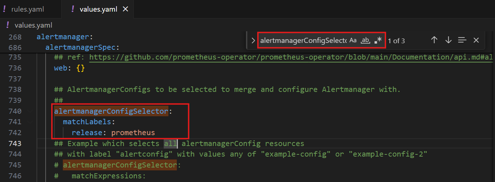
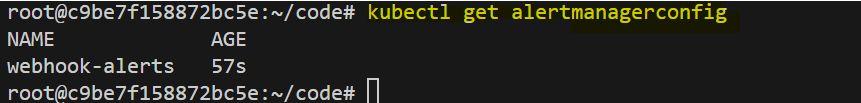
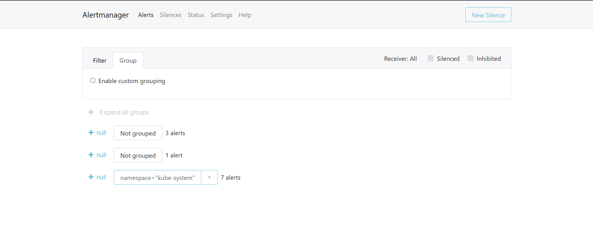
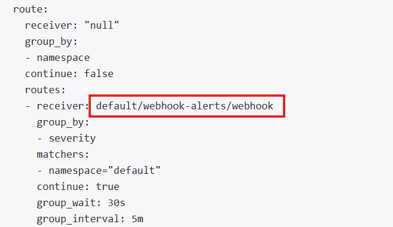

# **Adding Rules and Alertmanager Rules in Kubernetes**

Prometheus and Alertmanager are indispensable components for establishing robust monitoring and alerting systems in Kubernetes environments. 

### **Rules**
Rules in Prometheus are configurations that define conditions under which an alert should be triggered. They are used to monitor specific metrics and create alerts based on thresholds or specific events, such as when a server goes down or a service becomes unresponsive. These rules are typically managed through a `PrometheusRule` custom resource in Kubernetes.

### **Alertmanager Rules**
Alertmanager Rules work with Prometheus to handle and route alerts once they are triggered. They define how alerts should be grouped, delayed, and sent to various notification endpoints (e.g., email, Slack, or webhooks). These are configured using the `AlertmanagerConfig` resource in Kubernetes, allowing fine-grained control over alert routing and handling.

In this comprehensive lab, you will dive deep into the processes required to:

1. Add Prometheus rules dynamically using the `PrometheusRule` custom resource definition (CRD).
2. Set up Alertmanager rules leveraging the `AlertmanagerConfig` CRD for efficient alert handling.

This lab will provide a detailed understanding of the necessary configurations, the step-by-step procedures for deployment, and how these resources interact seamlessly with Prometheus and Alertmanager. 


## **Task Description**
In this hands-on lab, you will undertake the following tasks:

1. Deploying Prometheus with Helm on the kubernetes cluster.
2. Create and deploy Prometheus rules to monitor critical metrics, such as node status.
3. Configure and apply Alertmanager rules for structured alert handling.
4. Verify and validate configurations through the Prometheus and Alertmanager user interfaces, ensuring functionality and integration.


## **Deploying Prometheus with Helm**

This section demonstrates how to install Helm, add the Prometheus community repository, deploy Prometheus using the Helm chart.


### **Install Helm**

1. **Navigate to Helm Documentation**  
   Visit the [Helm documentation](./images/https://helm.sh/docs/intro/install/) to view installation instructions for various operating systems.

2. **Install Helm on Linux**  
   Run the following commands to install Helm using the default script:
   ```bash
   curl -fsSL https://raw.githubusercontent.com/helm/helm/main/scripts/get-helm-3 > get_helm.sh
   chmod 700 get_helm.sh
   ./get_helm.sh
   ```

3. **Verify Installation**  
   Confirm that Helm is installed by checking its version:
   ```bash
   helm version
   ```


### **Add the Prometheus Community Repository**

1. Add the Prometheus community Helm repository:
   ```bash
   helm repo add prometheus-community https://prometheus-community.github.io/helm-charts
   ```

2. Update the Helm repository:
   ```bash
   helm repo update
   ```


### **Install the Prometheus Helm Chart**

1. Verify your KUBECONFIG environment variable:

   ```bash
   $KUBECONFIG
   ```

   If it's not set, you might need to:
   ```bash
   export KUBECONFIG=/etc/rancher/k3s/k3s.yaml
   ```


2. Deploy the Helm chart with a release name of your choice (e.g., `prometheus`):
   ```bash
   helm install prometheus prometheus-community/kube-prometheus-stack
   ```

   - **Release Name**: `prometheus` (you can change this to any name you prefer).
   - **Chart Name**: `prometheus-community/kube-prometheus-stack`.

3. Confirm the installation by checking the Helm releases:
   ```bash
   helm list
   ```

4. Verify the CRDs: 
   ```bash
   kubectl get crd
   ```
   
   `prometheus.monitoring.coreos.com`: Used to create prometheus instance. 

### Verify Deployment

1. **Check the Pods**  
   Ensure all Prometheus pods are running:
   ```bash
   kubectl get pods -n default
   ```

2. **List Kubernetes Resources Created**  
   View the resources created by the Helm chart:
   ```bash
   kubectl get all -n default
   ```

   Let’s explore these resources based on the provided `kubectl get all` output.


### Access the Prometheus Dashboard

#### Change the Service Type to NodePort
If you'd like to access Prometheus without relying on port forwarding, you can update the service type from `ClusterIP` to `NodePort`. This makes the service accessible via any node in the cluster at a specific port. 

1. Edit the service configuration:
   ```bash
   kubectl edit svc prometheus-kube-prometheus-prometheus
   ```

   Press `i` to enter into `insert` mode.

2. Change the `type` field under `spec` from `ClusterIP` to `NodePort`:
   ```yaml
   spec:
     type: NodePort
   ```

   Press `Esc` and type `:wq` to save and exit the editor.

3. Save the changes. Kubernetes will automatically allocate a port in the range 30000–32767 for the service. To find the allocated port:
   ```bash
   kubectl get svc prometheus-kube-prometheus-prometheus
   ```

   Example output:
   ```
   NAME                                  TYPE       CLUSTER-IP       EXTERNAL-IP   PORT(S)          AGE
   prometheus-kube-prometheus-prometheus NodePort   10.96.232.231    <none>        9090:31234/TCP   5m
   ```

4. Create a load balancer in Pordhi using the `eth0` IP and `NodePort` for the prometheus service. Access the Prometheus dashboard by visiting the load balancer url.


## **Adding Prometheus Rules**

### **Create a `PrometheusRule` Resource**

The `PrometheusRule` Custom Resource Definition (CRD) serves as a powerful mechanism for dynamically registering monitoring rules with a Prometheus instance within a Kubernetes environment. 


This resource enables the definition of sophisticated alerting and monitoring rules directly under the `spec` field, which follows a structure akin to that of a traditional `prometheus.yml` configuration file. By leveraging this CRD, users can efficiently manage the creation, modification, and deletion of monitoring rules without requiring manual updates to the Prometheus configuration. This not only simplifies rule management but also ensures a high degree of flexibility and scalability for dynamic Kubernetes workloads.

Begin by creating a file named `rules.yml` with the following content:

   ```yaml
   apiVersion: monitoring.coreos.com/v1
   kind: PrometheusRule
   metadata:
     name: api-rules
     labels:
       release: prometheus
   spec:
     groups:
       - name: api-group
         rules:
           - alert: InstanceDown
             expr: up == 0
             for: 0m
             labels:
               severity: critical
             annotations:
               summary: "Instance {{ $labels.instance }} is down"
               description: "{{ $labels.instance }} of job {{ $labels.job }} has been down for more than 5 minutes."
   ```

3. Key considerations:
   - The resource type is identified as `kind: PrometheusRule`.
   - The `release: prometheus` label ensures proper detection by the Prometheus operator.

### **1.2 Apply the Rule**

1. Save the `rules.yml` file and apply it to your Kubernetes cluster using the following command:

   ```bash
   kubectl apply -f rules.yml
   ```

2. Verify successful creation with:

   ```bash
   kubectl get prometheusrule
   ```

   

3. Open the Prometheus UI, navigate to `Status > Rules`, and locate the `API` group and `InstanceDown` rule to confirm proper deployment.

    


## **Adding Alertmanager Rules**

### **Configure the Helm Chart**

1. Extract the current chart values into a file for customization:

   ```bash
   helm show values prometheus-community/kube-prometheus-stack > values.yaml
   ```

2. Update the `AlertmanagerConfigSelector` section in the `values.yaml` file to include the necessary labels:

    

   ```yaml
   alertmanager:
     alertmanagerConfigSelector:
       matchLabels:
         release: prometheus
   ```


3. Use the modified values file to upgrade the chart:

   ```bash
   helm upgrade prometheus prometheus-community/kube-prometheus-stack -f values.yaml
   ```

   

4. Verify the updated configuration:

   ```bash
   kubectl get alertmanagers.monitoring.coreos.com -o yaml | grep -A3  alertmanagerConfigSelector
   ```

   

### **Create an `AlertmanagerConfig` Resource**


1. Create a file named `alert.yaml` with the following content:

   ```yaml
   apiVersion: monitoring.coreos.com/v1alpha1
   kind: AlertmanagerConfig
   metadata:
     name: webhook-alerts
     labels:
       release: prometheus
   spec:
     route:
       groupBy: [severity]
       groupWait: 30s
       groupInterval: 5m
       receiver: webhook
     receivers:
       - name: webhook
         webhookConfigs:
           - url: http://example.com/webhook
   ```


    ### Explanation of the YAML's Main Configurations

    The provided YAML file defines an `AlertmanagerConfig` resource, which is used to configure Alertmanager in a Kubernetes environment. Here's how its main configurations work:

    - **`kind: AlertmanagerConfig`**
    Declares the type of Kubernetes resource being created, which is an Alertmanager configuration.

    - **`metadata` Section**
        - `name: webhook-alerts`: Defines the name of the resource, uniquely identifying it within the namespace.
        - `labels: release: prometheus`: Adds a label that ties this configuration to the Prometheus release, ensuring it is picked up by the Prometheus Operator based on the `AlertmanagerConfigSelector`.

    - **`spec` Section**
        - Contains the core configuration for Alertmanager, specifying how alerts should be grouped and handled.
        - **`route`:**
            - `groupBy: [severity]`: Groups alerts by the `severity` label, ensuring that alerts with the same severity are bundled together.
            - `groupWait: 30s`: Defines a 30-second delay before sending the first notification for a new alert group.
            - `groupInterval: 5m`: Ensures subsequent notifications for an alert group are sent at 5-minute intervals.
            - `receiver: webhook`: Specifies the default receiver for this route, named `webhook`.

    - **`receivers` Section**
        - Defines where alerts should be sent.
        - `- name: webhook`: Creates a receiver named `webhook`.
        - `webhookConfigs`: Configures the `webhook` receiver to send alerts to a specified URL.
            - `url: http://example.com/webhook`: Specifies the webhook endpoint where alerts will be posted.


2. Key points to note:
   - The `spec` section employs camel case for properties, such as `groupWait` and `groupBy`.
   - Ensure labels align with the `AlertmanagerConfigSelector` defined in the Helm chart.

3. Apply the configuration file to the cluster:

   ```bash
   kubectl apply -f alert.yaml
   ```

4. Confirm successful creation with:

   ```bash
   kubectl get alertmanagerconfig
   ```

   

### **Verify Alertmanager Configuration**

#### Change the Service Type to NodePort
If you'd like to access Alertmanager, you can update the service type from `ClusterIP` to `NodePort`. This makes the service accessible via any node in the cluster at a specific port. 

1. Edit the service configuration:
   ```bash
   kubectl edit svc prometheus-kube-prometheus-alertmanager
   ```

   Press `i` to enter into `insert` mode.

2. Change the `type` field under `spec` from `ClusterIP` to `NodePort`:
   ```yaml
   spec:
     type: NodePort
   ```

   Press `Esc` and type `:wq` to save and exit the editor.

3. Save the changes. Kubernetes will automatically allocate a port in the range 30000–32767 for the service. To find the allocated port:
   ```bash
   kubectl get svc prometheus-kube-prometheus-alertmanager
   ```

4. Create a load balancer in Pordhi using the `eth0` IP and `NodePort` for the prometheus service. Access the Prometheus dashboard by visiting the load balancer url.

    

    Goto *Status* tab to see the detailed configuration where you will see the `webhook` config as well. 


      


## **Conclusion**
In this extensive lab, we:

- Dynamically added Prometheus rules using the `PrometheusRule` CRD.
- Configured sophisticated Alertmanager rules with the `AlertmanagerConfig` CRD.
- Validated the configurations through Prometheus and Alertmanager user interfaces.

These steps empower you to efficiently manage monitoring and alerting systems in a Kubernetes cluster, leveraging the capabilities of the Prometheus operator for seamless integration and dynamic management of rules. Mastery of these techniques is essential for maintaining a robust and proactive Kubernetes environment.

