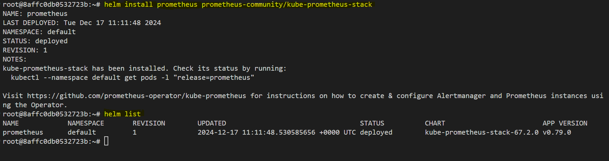

# **Introduction to Monitoring Kubernetes**

Monitoring is a critical component in maintaining and optimizing modern applications and infrastructure. Effective monitoring ensures visibility into system performance, application behavior, and infrastructure health, making it easier to detect and resolve issues quickly. In this guide, we’ll delve into the process of using Prometheus for monitoring both Kubernetes applications and the Kubernetes cluster itself. Prometheus, a robust open-source monitoring solution, is particularly well-suited for Kubernetes environments due to its scalability and extensive metrics collection capabilities. It empowers teams to achieve deep observability, enabling proactive problem-solving and informed decision-making.


## **Why Monitor Kubernetes?**


Kubernetes environments are complex, involving multiple interconnected layers, including applications, containers, nodes, and the cluster’s control plane. Monitoring Kubernetes is essential for several reasons:

1. **Application Performance Tracking:** Ensures that applications running in the cluster deliver the expected performance and user experience.
2. **Infrastructure Optimization:** Helps maintain efficient resource usage across nodes, containers, and other cluster components.
3. **Real-Time Issue Diagnosis:** Enables immediate detection and troubleshooting of problems within the cluster.
4. **Failure Prediction:** Provides insights into trends and patterns that may indicate potential issues, allowing proactive mitigation.
5. **Compliance and Reporting:** Offers visibility into system operations, aiding in audits and compliance with operational standards.

## **Setting Up Prometheus for Kubernetes**

### Deploying Prometheus on Kubernetes


Deploying Prometheus directly within the Kubernetes cluster has distinct advantages compared to hosting it on a separate server:

1. **Proximity to Monitoring Targets:** Locating Prometheus within the cluster minimizes latency, improving the speed and accuracy of metrics collection.
2. **Efficient Resource Utilization:** Leveraging the existing Kubernetes infrastructure reduces overhead and eliminates the need for additional servers or virtual machines.

This approach not only simplifies setup but also enhances the effectiveness of monitoring by tightly integrating Prometheus with the cluster.

### Monitoring Targets

Prometheus in a Kubernetes environment is designed to monitor two primary categories of targets:

1. **Applications:** These include any services or applications deployed within the cluster, such as APIs, web servers, and microservices.
2. **Kubernetes Cluster Components:** Prometheus collects metrics from various Kubernetes components to provide a holistic view of cluster health and performance:
   - **Control Plane Components:** Key elements like the `api-server`, `kube-scheduler`, and `coredns`.
   - **Container-Level Metrics:** Gathered from the `kubelet` process, which is analogous to `cAdvisor`.
   - **Cluster-Level Metrics:** Provided by the `kube-state-metrics` container, covering deployments, pods, and other Kubernetes objects.
   - **Node Metrics:** Captured using `node-exporter`, which monitors CPU, memory, disk, and network usage on each node.

### Collecting Metrics with Prometheus

#### **Kube-State-Metrics**


Kubernetes does not expose cluster-level metrics by default. Deploying the `kube-state-metrics` container is essential to fill this gap. This component makes comprehensive metrics related to deployments, pods, services, and other cluster objects accessible to Prometheus. These insights are crucial for understanding the state of the Kubernetes cluster at a granular level.

#### **Node-Exporter**


Every Kubernetes node is essentially a Linux-based server. Monitoring these nodes requires the installation of `node-exporter`, a Prometheus exporter designed to collect node-level metrics such as CPU utilization, memory consumption, and disk I/O. Instead of manually installing `node-exporter` on each node, Kubernetes’ DaemonSet abstraction can be used:

- **DaemonSet Automation:** Ensures that a `node-exporter` pod is automatically deployed to every node in the cluster.
- **Scalability:** Automatically adds `node-exporter` to new nodes as they join the cluster, eliminating manual configuration tasks.

#### **Service Discovery**


Prometheus leverages Kubernetes’ built-in service discovery to dynamically detect monitoring targets, including:

1. Kubernetes components such as `api-server` and `kube-scheduler`.
2. `node-exporter` pods running on cluster nodes.
3. Metrics exposed by the `kube-state-metrics` container.

This dynamic discovery feature significantly reduces the configuration effort by eliminating the need to manually define target endpoints for Prometheus.

## **Simplifying Prometheus Deployment with Helm**

### What is Helm?

Helm is a powerful package manager for Kubernetes that simplifies the deployment and management of applications. It consolidates Kubernetes configurations into reusable packages called Helm charts. 


With Helm, users can:

1. Deploy applications with pre-configured templates.
2. Customize deployments through values files.
3. Share and distribute Helm charts via repositories for easier collaboration and reuse.

### Deploying Prometheus with Helm

To simplify Prometheus deployment, use the **kube-Prometheus-stack Helm chart**, available from the Prometheus Community repository. This comprehensive chart:

1. Installs Prometheus and associated components, such as:
   - **Alertmanager:** For defining and handling alerts.
   - **Push Gateway:** Facilitates metrics collection from short-lived jobs.
   - **Prometheus Operator:** Manages Prometheus deployments and configurations within Kubernetes.
2. Automates setup tasks, significantly reducing the time and effort required for manual configurations.
3. Provides extensive customization options to tailor the monitoring setup to specific needs.

### What is the Prometheus Operator?

The Prometheus Operator is a Kubernetes-native controller designed to simplify the lifecycle management of Prometheus instances. It extends Kubernetes’ functionality by introducing custom resources, enabling declarative management of Prometheus components. Key features include:

1. **Custom Resource Definitions (CRDs):**
   - **Prometheus Resource:** Defines Prometheus deployments.
   - **Alertmanager Resource:** Configures Alertmanager instances.
   - **ServiceMonitor and PodMonitor Resources:** Specify metrics scraping configurations.
   - **Prometheus Rules:** Establish alerting rules.
2. **Automation:** Handles updates, scaling, and restart operations based on configuration changes.
3. **Abstraction:** Simplifies complex configurations, making it easier to manage Prometheus within Kubernetes environments.

## **Benefits of Using the kube-Prometheus-Stack Chart**

1. **Comprehensive Deployment:** Bundles Prometheus, Alertmanager, and the Prometheus Operator into a single package.
2. **Ease of Use:** Requires minimal configuration and supports single-command deployments.
3. **Scalability:** Automatically adapts to cluster changes, such as adding or removing nodes.
4. **Customization:** Allows users to modify configurations using Helm templates and values files to meet specific requirements.
5. **Reliability:** Ensures all components are properly configured and integrated, reducing the likelihood of misconfigurations.


## **Deploying Prometheus with Helm**

This section demonstrates how to install Helm, add the Prometheus community repository, deploy Prometheus using the Helm chart, and customize the deployment with `values.yaml`.


### **Step 1: Install Helm**

1. **Navigate to Helm Documentation**  
   Visit the [Helm documentation](https://helm.sh/docs/intro/install/) to view installation instructions for various operating systems.

2. **Install Helm on Linux**  
   Run the following commands to install Helm using the default script:
   ```bash
   curl -fsSL https://raw.githubusercontent.com/helm/helm/main/scripts/get-helm-3 > get_helm.sh
   chmod 700 get_helm.sh
   ./get_helm.sh
   ```

3. **Verify Installation**  
   Confirm that Helm is installed by checking its version:
   ```bash
   helm version
   ```


### **Step 2: Add the Prometheus Community Repository**

1. Add the Prometheus community Helm repository:
   ```bash
   helm repo add prometheus-community https://prometheus-community.github.io/helm-charts
   ```

2. Update the Helm repository:
   ```bash
   helm repo update
   ```


### **Step 3: Install the Prometheus Helm Chart**

1. At first run the following commands to export the Kubernetes configuration file for the k3s cluster to `/root/.kube/config`, enabling kubectl to interact with the cluster and then setting  secure permissions on the config file, allowing only the root user to read and write it.

   ```bash
   kubectl config view --raw > /root/.kube/config
   chmod 600 /root/.kube/config
   ```


2. Deploy the Helm chart with a release name of your choice (e.g., `prometheus`):
   ```bash
   helm install prometheus prometheus-community/kube-prometheus-stack
   ```

   - **Release Name**: `prometheus` (you can change this to any name you prefer).
   - **Chart Name**: `prometheus-community/kube-prometheus-stack`.

3. Confirm the installation by checking the Helm releases:
   ```bash
   helm list
   ```

   


### **Step 4: Explore Chart Configuration**

Helm charts come with a set of default values that can be overridden. The values.yaml file is where these custom configurations are defined. By customizing the values.yaml, you can:
- Set up persistent storage for Prometheus and Alertmanager.
- Configure alerting rules and scrape configurations.
- Enable or disable specific components (e.g., Node Exporter).

1. **View Default Configurations**  
   Display the default values for the Helm chart:
   ```bash
   helm show values prometheus-community/kube-prometheus-stack
   ```

2. **Save the Default Configurations to a File**  
   Save the output to a file for customization:
   ```bash
   helm show values prometheus-community/kube-prometheus-stack > values.yaml
   ```

3. Open the `values.yaml` file in a text editor and review the options:
   ```bash
   nano values.yaml
   ```


### **Step 5: Customize and Deploy with Custom Values**

When deploying Prometheus, the default configurations provided by Helm charts might not suit all environments. Customizing values allows you to:

- Configure resource limits and requests tailored to your environment.
- Define retention policies for metrics data.
- Enable specific integrations (e.g., Grafana, Alertmanager).
- Adjust replica counts and node affinities for high availability.

This flexibility ensures the deployment meets the specific needs of your application and cluster.


1. Modify the `values.yaml` file to customize the deployment as needed. For example, you can change the namespace, resource limits, or retention policies.

2. Deploy Prometheus with the customized `values.yaml` file:
   ```bash
   helm install prometheus-reconfigured prometheus-community/kube-prometheus-stack -f values.yaml
   ```


### **Step 6: Verify Deployment**

1. **Check the Pods**  
   Ensure all Prometheus pods are running:
   ```bash
   kubectl get pods -n default
   ```

   

2. **List Kubernetes Resources Created**  
   View the resources created by the Helm chart:
   ```bash
   kubectl get all -n default
   ```

   Let’s explore these resources based on the provided `kubectl get all` output.


   #### **1. Pods**
   Pods are the smallest deployable units in Kubernetes, running containers for various components:
   - **Prometheus Pods** (`prometheus-prometheus-kube-prometheus-prometheus-0`):
   - Run the Prometheus server responsible for data scraping and storage.
   - Contain two containers for high availability.

   - **Alertmanager Pods** (`alertmanager-prometheus-kube-prometheus-alertmanager-0`):
   - Handle alert notifications based on defined alerting rules.
   - Run with two containers for better reliability.

   - **Grafana Pod** (`prometheus-grafana-578946f5d5-vn5fh`):
   - Provides a web-based dashboard for visualizing metrics.
   - Configured to use Prometheus as a data source.

   - **Node Exporter Pods** (`prometheus-prometheus-node-exporter-*`):
   - Run as DaemonSets to collect system-level metrics from each node.

   - **Kube-State-Metrics Pod** (`prometheus-kube-state-metrics-6489887dc-*`):
   - Provides detailed Kubernetes resource metrics.

   #### **2. Services**
   Services expose components for internal and external communication:
   - **Prometheus Service** (`prometheus-kube-prometheus-prometheus`):
   - ClusterIP service exposing Prometheus on port 9090.

   - **Alertmanager Service** (`prometheus-kube-prometheus-alertmanager`):
   - Exposes Alertmanager on ports 9093 and 8080.

   - **Grafana Service** (`prometheus-grafana`):
   - Provides access to the Grafana dashboard on port 80.

   - **Node Exporter Service** (`prometheus-prometheus-node-exporter`):
   - Exposes metrics collected from nodes on port 9100.

   #### **3. Deployments**
   Deployments ensure the desired state of Pods:
   - **Prometheus Operator Deployment** (`prometheus-kube-prometheus-operator`):
   - Manages the Prometheus and Alertmanager custom resources.

   - **Grafana Deployment** (`prometheus-grafana`):
   - Ensures a single instance of the Grafana pod is always running.

   - **Kube-State-Metrics Deployment** (`prometheus-kube-state-metrics`):
   - Ensures a single instance for Kubernetes resource metrics.

   #### **4. StatefulSets**
   StatefulSets are used for stateful applications:
   - **Prometheus StatefulSet** (`prometheus-prometheus-kube-prometheus-prometheus`):
   - Manages Prometheus server pods with persistent storage.

   - **Alertmanager StatefulSet** (`alertmanager-prometheus-kube-prometheus-alertmanager`):
   - Manages Alertmanager pods with persistent storage.

   #### **5. DaemonSets**
   DaemonSets ensure that a copy of a pod runs on each node:
   - **Node Exporter DaemonSet** (`prometheus-prometheus-node-exporter`):
   - Collects node-level metrics from all cluster nodes.


## Conclusion  
Monitoring Kubernetes clusters and applications is essential for ensuring performance, reliability, and operational efficiency. Prometheus, with its robust capabilities and native integration with Kubernetes, provides an efficient and scalable solution for metrics collection and observability. By deploying Prometheus using Helm and customizing configurations through `values.yaml`, you can tailor the monitoring setup to meet your specific needs, enabling proactive issue resolution and informed decision-making. This guide equips you with the necessary steps to set up and leverage Prometheus, empowering you to maintain a healthy, high-performing Kubernetes environment.