# Redis Cluster Deployment on AWS

This guide provides step-by-step instructions for deploying a Redis cluster with 6 nodes (3 primary and 3 replica) on Amazon Web Services (AWS) Elastic Compute Cloud (EC2) instances. We'll cover the process from setting up EC2 instances using Pulumi to configuring, launching, and thoroughly testing the Redis cluster.

## What is Redis Cluster?


A Redis Cluster is a distributed implementation of Redis that provides data partitioning, replication, and high availability. It allows you to scale a Redis installation across multiple nodes, balancing data and load to improve performance and fault tolerance. Here are the key features and concepts:

### Key Features of Redis Cluster:
1. **Sharding (Data Partitioning):** Redis Cluster automatically splits your dataset across multiple nodes. Each node holds a subset of the data, and operations on keys are routed to the appropriate node. Redis uses a mechanism called **hash slots** to map keys to nodes.
   
2. **Replication:** Redis Cluster supports replication by automatically assigning slave nodes to master nodes. Each master node has one or more replicas (slaves) to ensure high availability. If a master fails, one of the replicas can take over.

3. **High Availability:** If a master node goes down, Redis Cluster can promote one of its replicas to be the new master, ensuring that the cluster continues to operate. This ensures minimal downtime in case of node failure.

4. **Automatic Failover:** Redis Cluster detects when a node fails and triggers an automatic failover. A replica node is promoted to master, and the cluster reconfigures itself without manual intervention.

5. **Scaling:** You can add or remove nodes from the cluster to scale out or scale down. Redis Cluster automatically rebalances data among the nodes during scaling operations.

## Scenario Overview

This lab focuses on deploying a highly available **Redis Cluster** on AWS using **EC2 instances**. The setup includes 6 Redis nodes (3 primary and 3 replicas) distributed across two Availability Zones to ensure fault tolerance and high performance. Using **Pulumi**, we provision the necessary infrastructure, including a **VPC**, subnets, security group, and EC2 instances. Each instance is configured with Redis in cluster mode. The cluster is created using the Redis CLI, and tests are conducted to verify key-value operations, data distribution, and failover scenarios. Monitoring and maintenance strategies are implemented to ensure long-term cluster health and security.

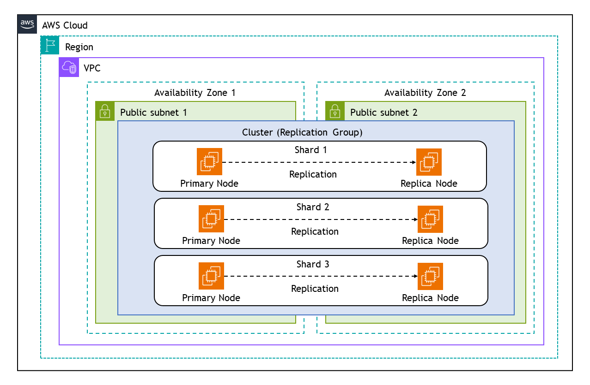

## Step 1: Setting up EC2 Instances with Pulumi

### Configure AWS CLI

- Configure AWS CLI with the necessary credentials. Run the following command and follow the prompts to configure it:

    ```sh
    aws configure
    ```
    
    This command sets up your AWS CLI with the necessary credentials, region, and output format.

    

    You will find the `AWS Access key` and `AWS Seceret Access key` on Lab description page,where you generated the credentials.

    

### Set Up a Pulumi Project

Now, let's create a new Pulumi project and write the code to provision our EC2 instances.

1. Create a new directory and initialize a Pulumi project:

   ```bash
   mkdir redis-cluster-pulumi && cd redis-cluster-pulumi
   pulumi new aws-javascript
   ```

    This command creates a new directory with the basic structure for a Pulumi project. Follow the prompts to set up your project.

2. Create Key Pair

    Create a new key pair for our instances using the following command:

    ```sh
    aws ec2 create-key-pair --key-name MyKeyPair --query 'KeyMaterial' --output text > MyKeyPair.pem
    ```

3. Set File Permissions of the key files

    ```sh
    chmod 400 MyKeyPair.pem
    ```


4. Replace the contents of `index.js` with the following code:

    ```javascript
    const pulumi = require("@pulumi/pulumi");
    const aws = require("@pulumi/aws");

    // Create a VPC
    const vpc = new aws.ec2.Vpc("redis-vpc", {
        cidrBlock: "10.0.0.0/16",
        enableDnsHostnames: true,
        enableDnsSupport: true,
        tags: {
            Name: "redis-vpc",
        },
    });
    exports.vpcId = vpc.id;

    // Create public subnets
    const publicSubnet1 = new aws.ec2.Subnet("redis-subnet-1", {
        vpcId: vpc.id,
        cidrBlock: "10.0.1.0/24",
        availabilityZone: "ap-southeast-1a",
        mapPublicIpOnLaunch: true,
        tags: {
            Name: "redis-subnet-1",
        },
    });
    exports.publicSubnet1Id = publicSubnet1.id;

    const publicSubnet2 = new aws.ec2.Subnet("redis-subnet-2", {
        vpcId: vpc.id,
        cidrBlock: "10.0.2.0/24",
        availabilityZone: "ap-southeast-1b",
        mapPublicIpOnLaunch: true,
        tags: {
            Name: "redis-subnet-2",
        },
    });
    exports.publicSubnet2Id = publicSubnet2.id;

    // Create an Internet Gateway
    const internetGateway = new aws.ec2.InternetGateway("redis-igw", {
        vpcId: vpc.id,
        tags: {
            Name: "redis-igw",
        },
    });
    exports.igwId = internetGateway.id;

    // Create a Route Table
    const publicRouteTable = new aws.ec2.RouteTable("redis-rt", {
        vpcId: vpc.id,
        tags: {
            Name: "redis-rt",
        },
    });
    exports.publicRouteTableId = publicRouteTable.id;

    // Create a route in the Route Table for the Internet Gateway
    const route = new aws.ec2.Route("igw-route", {
        routeTableId: publicRouteTable.id,
        destinationCidrBlock: "0.0.0.0/0",
        gatewayId: internetGateway.id,
    });

    // Associate Route Table with Public Subnets
    const rtAssociation1 = new aws.ec2.RouteTableAssociation("rt-association-1", {
        subnetId: publicSubnet1.id,
        routeTableId: publicRouteTable.id,
    });
    const rtAssociation2 = new aws.ec2.RouteTableAssociation("rt-association-2", {
        subnetId: publicSubnet2.id,
        routeTableId: publicRouteTable.id,
    });

    // Create a Security Group for the Redis Instances
    const redisSecurityGroup = new aws.ec2.SecurityGroup("redis-secgrp", {
        vpcId: vpc.id,
        description: "Allow SSH and Redis access",
        ingress: [
            { protocol: "tcp", fromPort: 22, toPort: 22, cidrBlocks: ["0.0.0.0/0"] },  // SSH
            { protocol: "tcp", fromPort: 6379, toPort: 6379, cidrBlocks: ["10.0.0.0/16"] },  // Redis
            { protocol: "tcp", fromPort: 16379, toPort: 16379, cidrBlocks: ["10.0.0.0/16"] },  // Redis Cluster
        ],
        egress: [
            { protocol: "-1", fromPort: 0, toPort: 0, cidrBlocks: ["0.0.0.0/0"] }  // Allow all outbound traffic
        ],
        tags: {
            Name: "redis-secgrp",
        },
    });
    exports.redisSecurityGroupId = redisSecurityGroup.id;

    // Define an AMI for the EC2 instances
    const amiId = "ami-01811d4912b4ccb26";  // Ubuntu 24.04 LTS

    // Create Redis Instances
    const createInstance = (name, subnetId) => {
        return new aws.ec2.Instance(name, {
            instanceType: "t2.micro",
            vpcSecurityGroupIds: [redisSecurityGroup.id],
            ami: amiId,
            subnetId: subnetId,
            keyName: "MyKeyPair",  // Update with your key pair
            associatePublicIpAddress: true,
            tags: {
                Name: name,
                Environment: "Development",
                Project: "RedisSetup"
            },
        });
    };

    const redisInstance1 = createInstance("redis-instance-1", publicSubnet1.id);
    const redisInstance2 = createInstance("redis-instance-2", publicSubnet1.id);
    const redisInstance3 = createInstance("redis-instance-3", publicSubnet1.id);
    const redisInstance4 = createInstance("redis-instance-4", publicSubnet2.id);
    const redisInstance5 = createInstance("redis-instance-5", publicSubnet2.id);
    const redisInstance6 = createInstance("redis-instance-6", publicSubnet2.id);

    exports.redisInstance1Id = redisInstance1.id;
    exports.redisInstance1PublicIp = redisInstance1.publicIp;
    exports.redisInstance2Id = redisInstance2.id;
    exports.redisInstance2PublicIp = redisInstance2.publicIp;
    exports.redisInstance3Id = redisInstance3.id;
    exports.redisInstance3PublicIp = redisInstance3.publicIp;
    exports.redisInstance4Id = redisInstance4.id;
    exports.redisInstance4PublicIp = redisInstance4.publicIp;
    exports.redisInstance5Id = redisInstance5.id;
    exports.redisInstance5PublicIp = redisInstance5.publicIp;
    exports.redisInstance6Id = redisInstance6.id;
    exports.redisInstance6PublicIp = redisInstance6.publicIp;
    ```

5. Deploy the infrastructure:

   ```bash
   pulumi up
   ```

   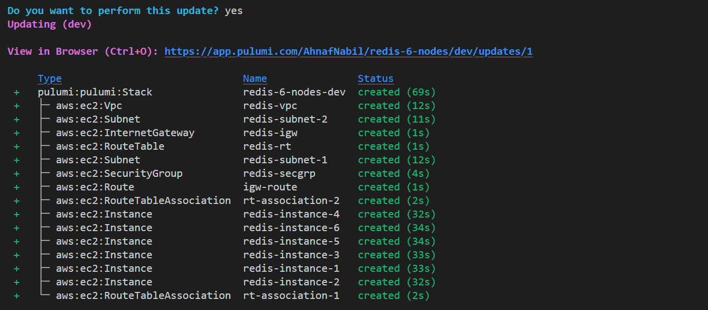

This will create 6 EC2 instances across 2 availability zones, along with the necessary networking components. For creating a Redis cluster with replicas, we will need at least 3 master nodes and 3 replica nodes (for a total of 6 nodes) as Redis Cluster requires at least 3 master nodes to function properly.

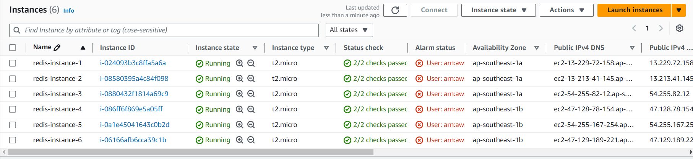

## Step 2: Installing Redis

For each EC2 instance:

1. Connect via SSH:

   ```
   ssh -i your-key.pem ec2-user@<instance-public-ip>
   ```

2. Update the system and install Redis:

   ```bash
   sudo apt update
   sudo apt install redis-server -y
   ```

3. Start Redis service:

   ```bash
   sudo systemctl start redis-server
   sudo systemctl enable redis-server
   ```

4. Verify Redis is running:

   ```bash
   sudo systemctl status redis-server 
   ```

   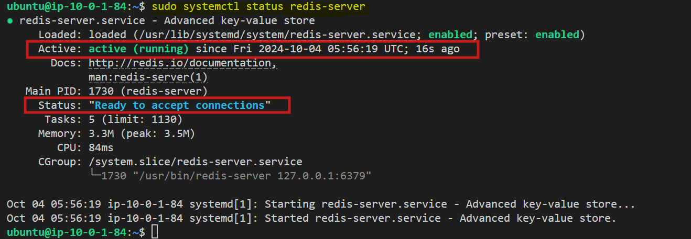

## Step 3: Configuring Redis Nodes

On each instance, modify the Redis configuration:

1. Open the Redis configuration file:

   ```bash
   sudo nano /etc/redis/redis.conf
   ```

2. Make the following changes:

   ```bash
   bind 0.0.0.0
   ```

   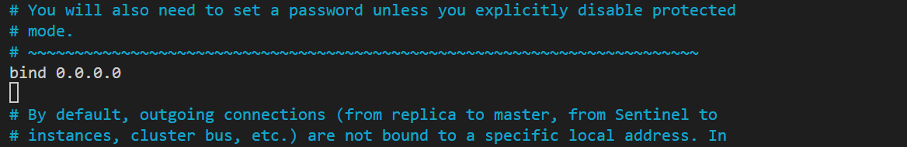

   ```bash
   protected-mode no
   port 6379
   cluster-enabled yes
   cluster-config-file nodes.conf
   cluster-node-timeout 5000
   appendonly yes
   ```

   

3. Save the file and exit.

4. Restart Redis:

   ```bash
   sudo systemctl restart redis-server
   ```

## Step 4: Creating the Redis Cluster

1. On one of the instances, install Redis CLI tools:

   ```bash
   sudo apt install redis-tools -y
   ```

2. Create the cluster (replace with your actual private IPs):

    ```bash
    redis-cli --cluster create \
    <redis1-privateIP>:6379 <redis2-privateIP>:6379 <redis3-privateIP>:6379 \
    <redis4-privateIP>:6379 <redis5-privateIP>:6379 <redis6-privateIP>:6379 \
    --cluster-replicas 1
    ```

   The command initializes a Redis cluster with six nodes (3 primary and 3 replicas) across the specified IP addresses and ports. The `--cluster-replicas 1` flag indicates that each primary node will have one replica for redundancy and high availability.

3. Confirm the cluster creation when prompted.

    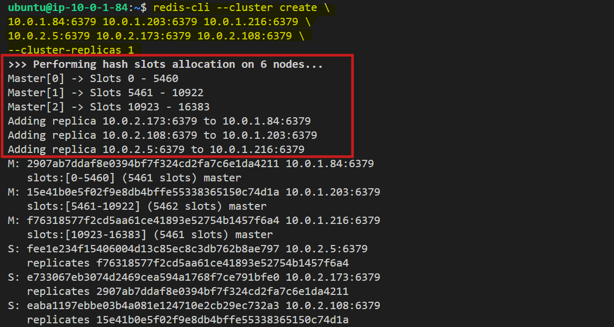

## Step 5: Testing the Cluster

Now, let's thoroughly test our Redis cluster to ensure it's working correctly. We'll perform various operations and check the cluster's behavior.

### Connecting to the Cluster

First, connect to one of the cluster nodes:

```bash
redis-cli -h <private-ip-of-any-node> -c
```

The `-c` flag enables cluster mode, allowing the client to follow redirections when necessary.

### Checking Cluster Info

Let's start by checking the cluster information:

```bash
CLUSTER INFO
```

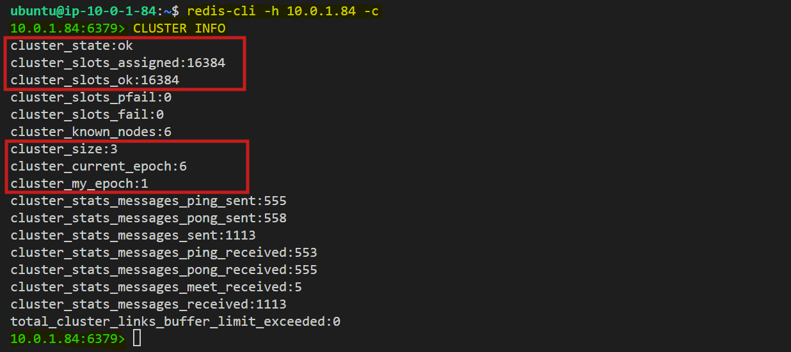

The `cluster_state:ok` means the cluster is functioning properly.

### Checking Cluster Nodes

Now, let's check the details of each node in the cluster:

```
CLUSTER NODES
```

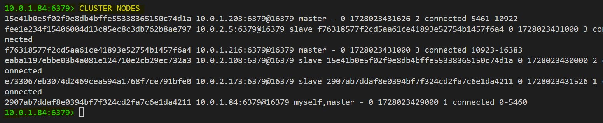

This output shows the node IDs, IP addresses, roles (master/slave), and the slot ranges they're responsible for.


### Testing Data Replication

Now, test replication by writing to the primary and reading from the replica.

1. Write a key-value pair to the primary node:

   ```bash
   SET mykey "Hello, Redis Cluster!"
   ```

2. Read the key from any node (the cluster will direct you to the appropriate node if needed):

   ```bash
   GET mykey
   ```

   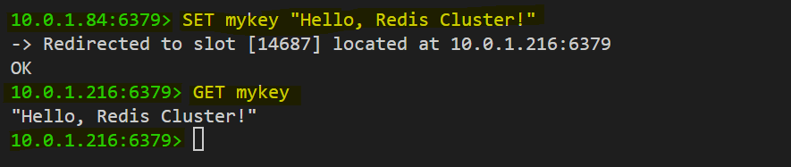

If replication is working, you'll be able to retrieve the value from any node in the cluster.

For Example:

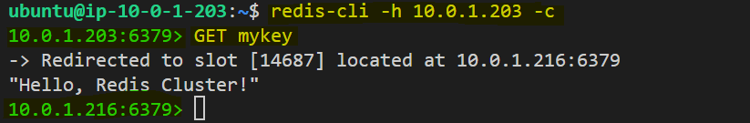

### Checking Failover Mechanism

We can test the cluster's failover mechanism by shutting down one of the primary nodes and observing how the replica takes over.

1. On the primary node, stop Redis:

   ```bash
   sudo systemctl stop redis-server
   ```

2. Wait for a few seconds and then check the cluster status:

   ```bash
   redis-cli -h <any-other-node-ip> -c CLUSTER NODES
   ```

    You'll notice that the replica has been promoted to primary.

    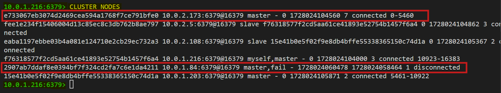

3. When you restart the Redis server on the node that was originally a primary, the restarted node joins as a replica.

    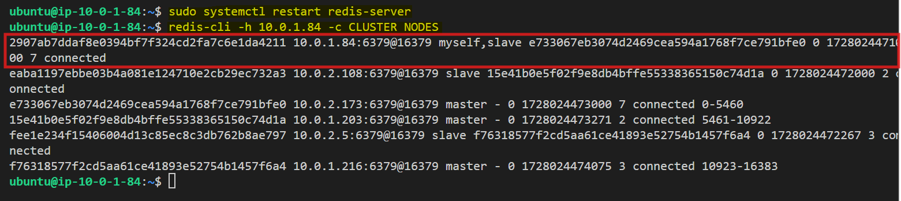

## Step 6: Monitoring and Maintenance

For ongoing monitoring and maintenance:

1. Regular health checks:

   ```bash
   redis-cli --cluster check <private-ip-of-any-node>:6379
   ```

   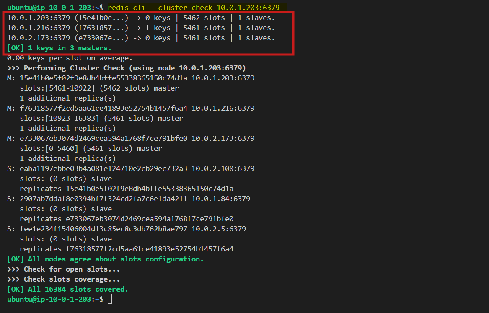

2. Monitor memory usage:

   ```bash
   INFO memory
   ```

   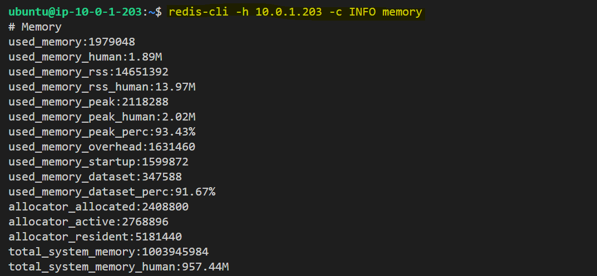

3. Check persistence status (if AOF is enabled):

   ```bash
   INFO persistence
   ```

   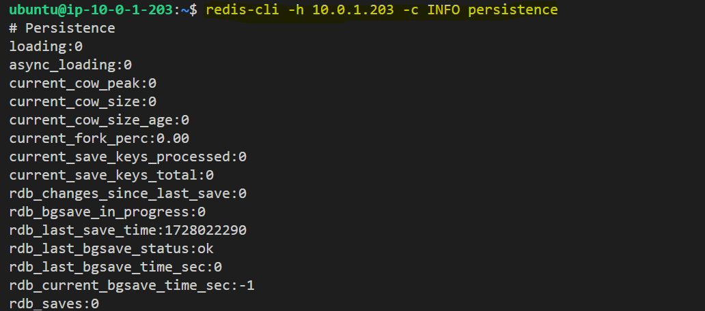

4. Monitor connected clients:

   ```bash
   INFO clients
   ```

   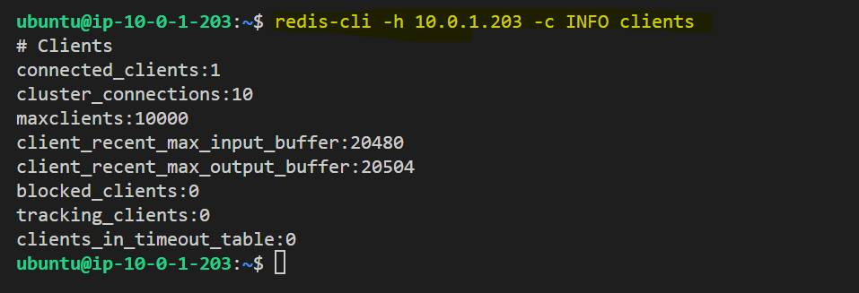

   The `INFO clients` output shows that the Redis node has 1 connected client, 10 internal cluster connections, no blocked clients, and is operating within its set limits for input/output buffers and maximum clients.

## Conclusion

In conclusion, this lab successfully demonstrates the deployment of a highly available **Redis Cluster** on AWS using **EC2 instances** and **Pulumi** for infrastructure automation. By distributing nodes across two Availability Zones, we ensure fault tolerance and data replication for high availability. The cluster creation, testing, and monitoring processes provide a solid foundation for scaling Redis in production environments. This setup not only enhances performance but also ensures that the system can handle failures gracefully, maintaining data integrity and availability, making it a reliable solution for real-world use cases.