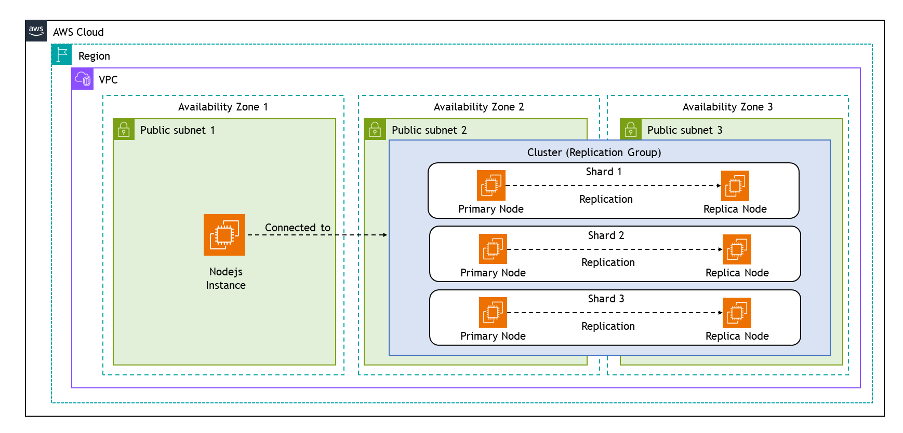
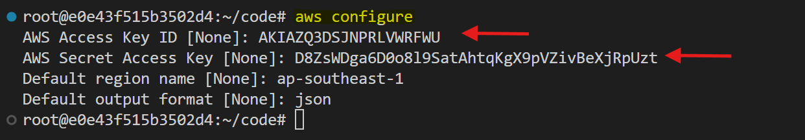
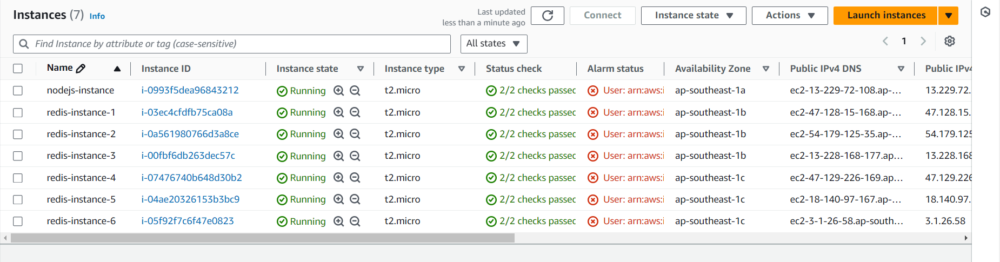
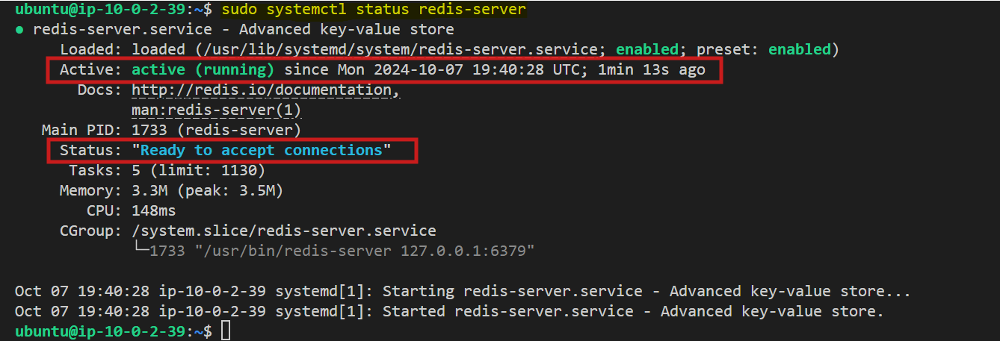
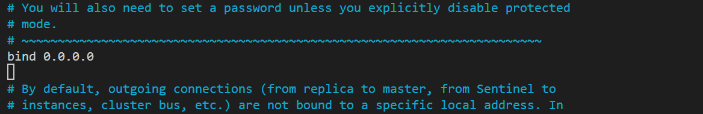
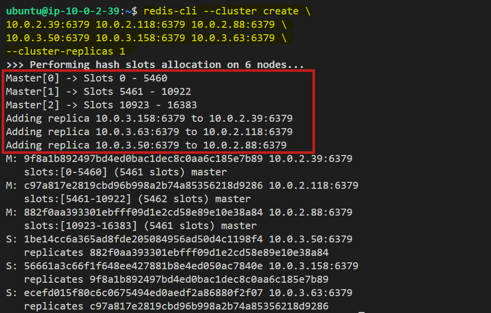
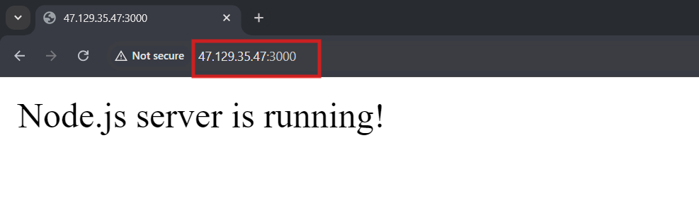
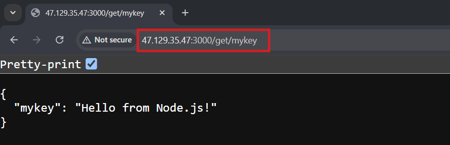
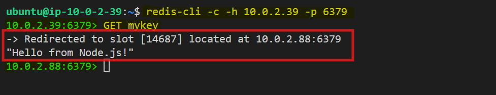

# Integrate NodeJS application with Redis Cluster

This guide provides a detailed process for setting up a Redis Cluster on Amazon Web Services (AWS) and integrating it with a Node.js application. It includes everything from provisioning infrastructure using Pulumi to testing the final application for functionality.


## Scenario Overview

In this scenario, we will use Pulumi to provision AWS infrastructure, creating a VPC with three public subnets, six EC2 instances for a Redis Cluster (three per subnet), and an additional EC2 instance for a Node.js application. After configuring Redis on the instances and creating the cluster, the Node.js app is developed with ioredis for Redis integration, featuring routes for setting and retrieving key-value pairs. The app is deployed on the EC2 instance, connecting to Redis via private IPs.



## Step 1: Infrastructure Setup with Pulumi

### Configure AWS CLI

- Configure AWS CLI with the necessary credentials. Run the following command and follow the prompts to configure it:

    ```sh
    aws configure
    ```
    
    This command sets up your AWS CLI with the necessary credentials, region, and output format.

    

    You will find the `AWS Access key` and `AWS Seceret Access key` on Lab description page,where you generated the credentials.

    

### Pulumi Project Setup

Now, let's create a new Pulumi project and write the code to provision our EC2 instances.

1. Create a new directory and initialize a Pulumi project:

   ```bash
   mkdir redis-cluster-pulumi && cd redis-cluster-pulumi
   pulumi new aws-javascript
   ```

    This command creates a new directory with the basic structure for a Pulumi project. Follow the prompts to set up your project.

2. Create Key Pair

    Create a new key pair for our instances using the following command:

    ```sh
    aws ec2 create-key-pair --key-name MyKeyPair --query 'KeyMaterial' --output text > MyKeyPair.pem
    ```

3. Set File Permissions of the key files

    ```sh
    chmod 400 MyKeyPair.pem
    ```

4. Replace the contents of `index.js` with the following code:

    ```javascript
    const pulumi = require("@pulumi/pulumi");
    const aws = require("@pulumi/aws");

    // Create a VPC
    const vpc = new aws.ec2.Vpc("redis-vpc", {
        cidrBlock: "10.0.0.0/16",
        enableDnsHostnames: true,
        enableDnsSupport: true,
        tags: {
            Name: "redis-vpc",
        },
    });
    exports.vpcId = vpc.id;

    // Create public subnets in three availability zones
    const publicSubnet1 = new aws.ec2.Subnet("subnet-1", {
        vpcId: vpc.id,
        cidrBlock: "10.0.1.0/24",
        availabilityZone: "ap-southeast-1a",
        mapPublicIpOnLaunch: true,
        tags: {
            Name: "subnet-1",
        },
    });
    exports.publicSubnet1Id = publicSubnet1.id;

    const publicSubnet2 = new aws.ec2.Subnet("subnet-2", {
        vpcId: vpc.id,
        cidrBlock: "10.0.2.0/24",
        availabilityZone: "ap-southeast-1b",
        mapPublicIpOnLaunch: true,
        tags: {
            Name: "subnet-2",
        },
    });
    exports.publicSubnet2Id = publicSubnet2.id;

    const publicSubnet3 = new aws.ec2.Subnet("subnet-3", {
        vpcId: vpc.id,
        cidrBlock: "10.0.3.0/24",
        availabilityZone: "ap-southeast-1c",
        mapPublicIpOnLaunch: true,
        tags: {
            Name: "subnet-3",
        },
    });
    exports.publicSubnet3Id = publicSubnet3.id;

    // Create an Internet Gateway
    const internetGateway = new aws.ec2.InternetGateway("redis-igw", {
        vpcId: vpc.id,
        tags: {
            Name: "redis-igw",
        },
    });
    exports.igwId = internetGateway.id;

    // Create a Route Table
    const publicRouteTable = new aws.ec2.RouteTable("redis-rt", {
        vpcId: vpc.id,
        tags: {
            Name: "redis-rt",
        },
    });
    exports.publicRouteTableId = publicRouteTable.id;

    // Create a route in the Route Table for the Internet Gateway
    const route = new aws.ec2.Route("igw-route", {
        routeTableId: publicRouteTable.id,
        destinationCidrBlock: "0.0.0.0/0",
        gatewayId: internetGateway.id,
    });

    // Associate Route Table with Public Subnets
    const rtAssociation1 = new aws.ec2.RouteTableAssociation("rt-association-1", {
        subnetId: publicSubnet1.id,
        routeTableId: publicRouteTable.id,
    });
    const rtAssociation2 = new aws.ec2.RouteTableAssociation("rt-association-2", {
        subnetId: publicSubnet2.id,
        routeTableId: publicRouteTable.id,
    });
    const rtAssociation3 = new aws.ec2.RouteTableAssociation("rt-association-3", {
        subnetId: publicSubnet3.id,
        routeTableId: publicRouteTable.id,
    });

    // Create a Security Group for the Node.js and Redis Instances
    const redisSecurityGroup = new aws.ec2.SecurityGroup("redis-secgrp", {
        vpcId: vpc.id,
        description: "Allow SSH, Redis, and Node.js traffic",
        ingress: [
            { protocol: "tcp", fromPort: 22, toPort: 22, cidrBlocks: ["0.0.0.0/0"] },  // SSH
            { protocol: "tcp", fromPort: 6379, toPort: 6379, cidrBlocks: ["10.0.0.0/16"] },  // Redis
            { protocol: "tcp", fromPort: 16379, toPort: 16379, cidrBlocks: ["10.0.0.0/16"] },  // Redis Cluster
            { protocol: "tcp", fromPort: 3000, toPort: 3000, cidrBlocks: ["0.0.0.0/0"] },  // Node.js (Port 3000)
        ],
        egress: [
            { protocol: "-1", fromPort: 0, toPort: 0, cidrBlocks: ["0.0.0.0/0"] }  // Allow all outbound traffic
        ],
        tags: {
            Name: "redis-secgrp",
        },
    });
    exports.redisSecurityGroupId = redisSecurityGroup.id;

    // Define an AMI for the EC2 instances
    const amiId = "ami-01811d4912b4ccb26";  // Ubuntu 24.04 LTS

    // Create a Node.js Instance in the first subnet (ap-southeast-1a)
    const nodejsInstance = new aws.ec2.Instance("nodejs-instance", {
        instanceType: "t2.micro",
        vpcSecurityGroupIds: [redisSecurityGroup.id],
        ami: amiId,
        subnetId: publicSubnet1.id,
        keyName: "MyKeyPair",  // Update with your key pair
        associatePublicIpAddress: true,
        tags: {
            Name: "nodejs-instance",
            Environment: "Development",
            Project: "RedisSetup"
        },
    });
    exports.nodejsInstanceId = nodejsInstance.id;
    exports.nodejsInstancePublicIp = nodejsInstance.publicIp;  // Output Node.js public IP

    // Helper function to create Redis instances
    const createRedisInstance = (name, subnetId) => {
        return new aws.ec2.Instance(name, {
            instanceType: "t2.micro",
            vpcSecurityGroupIds: [redisSecurityGroup.id],
            ami: amiId,
            subnetId: subnetId,
            keyName: "MyKeyPair",  // Update with your key pair
            associatePublicIpAddress: true,
            tags: {
                Name: name,
                Environment: "Development",
                Project: "RedisSetup"
            },
        });
    };

    // Create Redis Cluster Instances across the remaining two subnets
    const redisInstance1 = createRedisInstance("redis-instance-1", publicSubnet2.id);
    const redisInstance2 = createRedisInstance("redis-instance-2", publicSubnet2.id);
    const redisInstance3 = createRedisInstance("redis-instance-3", publicSubnet2.id);
    const redisInstance4 = createRedisInstance("redis-instance-4", publicSubnet3.id);
    const redisInstance5 = createRedisInstance("redis-instance-5", publicSubnet3.id);
    const redisInstance6 = createRedisInstance("redis-instance-6", publicSubnet3.id);

    // Export Redis instance IDs and public IPs
    exports.redisInstance1Id = redisInstance1.id;
    exports.redisInstance1PublicIp = redisInstance1.publicIp;
    exports.redisInstance2Id = redisInstance2.id;
    exports.redisInstance2PublicIp = redisInstance2.publicIp;
    exports.redisInstance3Id = redisInstance3.id;
    exports.redisInstance3PublicIp = redisInstance3.publicIp;
    exports.redisInstance4Id = redisInstance4.id;
    exports.redisInstance4PublicIp = redisInstance4.publicIp;
    exports.redisInstance5Id = redisInstance5.id;
    exports.redisInstance5PublicIp = redisInstance5.publicIp;
    exports.redisInstance6Id = redisInstance6.id;
    exports.redisInstance6PublicIp = redisInstance6.publicIp;
    ```

5. Deploy the infrastructure:

   ```bash
   pulumi up
   ```

   

This Pulumi code provisions a VPC with three public subnets across three availability zones and creates a total of seven EC2 instances: 1 Node.js instance in the first subnet (ap-southeast-1a) and 6 Redis instances spread across the remaining two subnets (ap-southeast-1b and ap-southeast-1c) to form a Redis Cluster. For creating a Redis cluster with replicas, we will need at least 3 master nodes and 3 replica nodes (for a total of 6 nodes) as Redis Cluster requires at least 3 master nodes to function properly.



## Step 2: Installing Redis

For each Redis EC2 instance:

1. Connect via SSH:

   ```
   ssh -i your-key.pem ec2-user@<instance-public-ip>
   ```

2. Update the system and install Redis:

   ```bash
   sudo apt update
   sudo apt install redis-server -y
   ```

3. Start Redis service:

   ```bash
   sudo systemctl start redis-server
   sudo systemctl enable redis-server
   ```

4. Verify Redis is running:

   ```bash
   sudo systemctl status redis-server 
   ```

   

## Step 3: Configuring Redis Nodes

On each Redis instance, modify the Redis configuration:

1. Open the Redis configuration file:

   ```bash
   sudo nano /etc/redis/redis.conf
   ```

2. Make the following changes:

   ```bash
   bind 0.0.0.0
   ```

   

   ```bash
   protected-mode no
   port 6379
   cluster-enabled yes
   cluster-config-file nodes.conf
   cluster-node-timeout 5000
   appendonly yes
   ```

   

3. Save the file and exit.

4. Restart Redis:

   ```bash
   sudo systemctl restart redis-server
   ```

## Step 4: Creating the Redis Cluster

1. On one of the instances, install Redis CLI tools:

   ```bash
   sudo apt install redis-tools -y
   ```

2. Create the cluster (replace with your actual private IPs):

    ```bash
    redis-cli --cluster create \
    <redis1-privateIP>:6379 <redis2-privateIP>:6379 <redis3-privateIP>:6379 \
    <redis4-privateIP>:6379 <redis5-privateIP>:6379 <redis6-privateIP>:6379 \
    --cluster-replicas 1
    ```

   The command initializes a Redis cluster with six nodes (3 primary and 3 replicas) across the specified IP addresses and ports. The `--cluster-replicas 1` flag indicates that each primary node will have one replica for redundancy and high availability.

3. Confirm the cluster creation when prompted.

    

## Step 5: Node.js Application Integration

### Setting up Node.js Environment on EC2

1. **Connect to your EC2 instance** where Node.js will be hosted. Use SSH to log in:

   ```bash
   ssh -i "your-key.pem" ubuntu@<nodejs-instance-public-ip>
   ```

2. **Install Node.js and npm** (if not already installed):

   ```bash
   sudo apt update
   sudo apt install nodejs npm -y
   ```

3. **Create a new directory for your Node.js application** and install dependencies:

   ```bash
   mkdir redis-cluster-nodejs && cd redis-cluster-nodejs
   npm init -y
   npm install express ioredis
   ```

### Creating the Application

1. Create a file named `app.js` and add the following code:

    ```javascript
    const express = require('express');
    const Redis = require('ioredis');

    const app = express();
    const port = 3000;

    // Redis Cluster configuration
    const cluster = new Redis.Cluster([
    { host: 'redis1-private-ip', port: 6379 },
    { host: 'redis2-private-ip', port: 6379 },
    { host: 'redis3-private-ip', port: 6379 },
    { host: 'redis4-private-ip', port: 6379 },
    { host: 'redis5-private-ip', port: 6379 },
    { host: 'redis6-private-ip', port: 6379 }
    ]);

    app.use(express.json());

    // Root route to confirm server is running
    app.get('/', (req, res) => {
    res.send('Node.js server is running!');
    });

    app.post('/set', async (req, res) => {
    const { key, value } = req.body;
    try {
        await cluster.set(key, value);
        res.json({ message: 'Value set successfully' });
    } catch (error) {
        res.status(500).json({ error: error.message });
    }
    });

    app.get('/get/:key', async (req, res) => {
    const { key } = req.params;
    try {
        const value = await cluster.get(key);
        if (value === null) {
        res.status(404).json({ message: 'Key not found' });
        } else {
        res.json({ [key]: value });
        }
    } catch (error) {
        res.status(500).json({ error: error.message });
    }
    });

    app.listen(port, () => {
    console.log(`Server running on http://localhost:${port}`);
    });
    ```

    Replace the `host` values with the private IPs of your Redis Cluster nodes.

### Testing the Application

1. Run the Node.js application:

   ```bash
   node app.js
   ```

   You can check that Nodejs server is running properly using `http://<Nodejs-ec2-public-ip>:3000` on the browser:

   

2. Set a key-value pair using `curl` while the application is running:

   ```bash
   curl -X POST -H "Content-Type: application/json" -d '{"key":"mykey","value":"Hello from Node.js!"}' http://localhost:3000/set
   ```

   **Expected Output:**

    ```bash
    {
    "message": "Value set successfully"
    }
    ```

3. Retrieve the value using the key from the browser (Use the GET endpoint `/get/<key>` to retrieve the value for a key):

    ```bash
    http://<ec2-public-ip>:3000/get/mykey
    ```

    

## Step 6: Checking Keys via the Redis CLI

If you have access to one of your Redis cluster nodes, you can use the Redis CLI (`redis-cli`) to directly check the keys stored in your Redis cluster.

### Connect to a Redis Node

SSH into one of your EC2 instances where Redis is running:

```bash
ssh -i /path/to/your-key.pem ubuntu@<redis-node-public-ip>
```

### Run Redis CLI

Once you're logged in, you can access Redis using the `redis-cli` command.

```bash
redis-cli -c -h <redis-node-private-ip> -p 6379
```

Make sure you connect to the node using the private IP, as Redis Cluster nodes usually communicate over private IPs.

### Retrieve a Specific Key

To get the value of a specific key, use the `GET` command:

```bash
GET mykey
```

This will return the value of `mykey` if it exists.



## Conclusion

This guide provides the steps necessary to set up a Redis Cluster on AWS and integrate it with a Node.js application. By following these instructions, you can ensure a robust and scalable infrastructure for your Redis-based applications. 