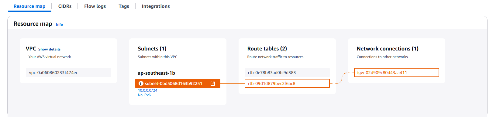
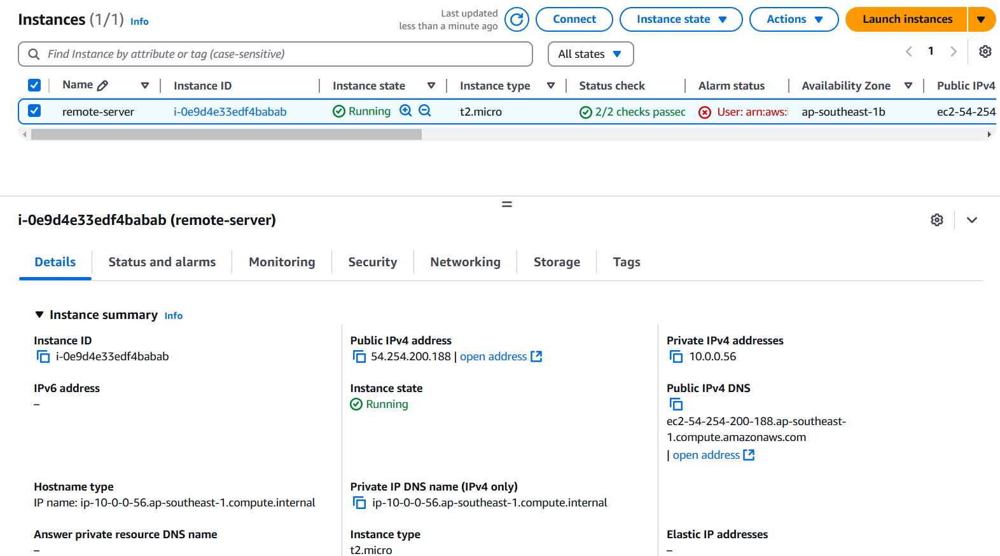
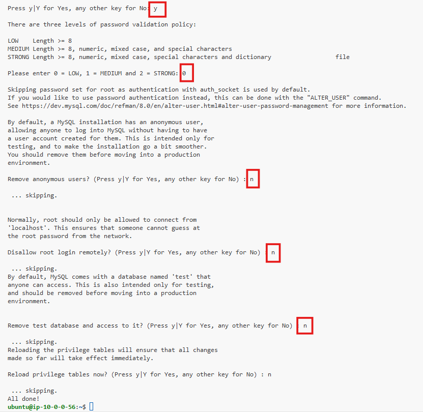
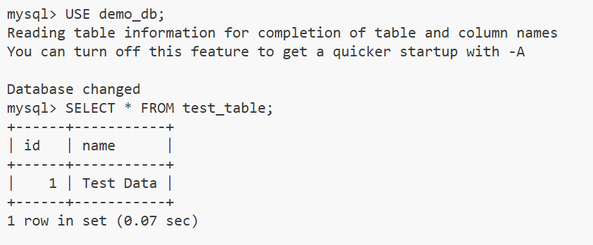

# **Setting Up an SSH Tunnel to Access a Database on AWS**


### **What is SSH Tunneling?**
SSH tunneling is a method of transporting arbitrary networking data over an encrypted SSH connection. It can be used to securely forward traffic from a local machine to a remote server or vice versa. SSH tunnels are commonly used to:
- Securely access remote services (e.g., databases, web servers).
- Bypass firewalls or network restrictions.
- Encrypt traffic over untrusted networks.


### **Types of SSH Tunnels**
1. **Local Port Forwarding**:
   - Forwards traffic from a local port to a remote server.
   - Example: Access a remote database through a local port.
2. **Remote Port Forwarding**:
   - Forwards traffic from a remote port to a local machine.
   - Example: Expose a local web server to the internet via a remote server.
3. **Dynamic Port Forwarding**:
   - Creates a SOCKS proxy for dynamic port forwarding.
   - Example: Securely browse the internet through an SSH server.

### **Use Cases of SSH Tunneling**
- Securely accessing databases or internal services.
- Bypassing firewalls or network restrictions.
- Encrypting traffic for remote desktop connections.
- Accessing resources in a private network.


## **Task Description**
In this task, you will understand Local Port Forwarding:
1. Set up an AWS EC2 instance.
2. Install and configure a MySQL database on the EC2 instance.
3. Configure MySQL to allow remote access.
4. Create an SSH tunnel from your local machine to securely access the MySQL database.
5. Test the SSH tunnel and interact with the database.


## **Prerequisites**
- An AWS account.
- A local machine with SSH and MySQL client installed.
- Basic knowledge of AWS EC2, SSH, and MySQL.


## **Step-by-Step Implementation**


### **Step 1. AWS CLI Configuration**

Run the following command to configure AWS CLI:

```bash
aws configure
```


This command prompts you for your AWS Access Key ID, Secret Access Key, region, and output format.


###  Step 2: Set Up a Pulumi Project


#### Set Up a new directory
Create a new directory for your project and navigate into it:

```sh
mkdir aws-pulumi-infra
cd aws-pulumi-infra
```

#### Install python `venv`

```sh 
sudo apt update
sudo apt install python3.8-venv
```

#### Initialize a New Pulumi Project
Run the following command to create a new Pulumi project:

```sh
pulumi new aws-python
```
Follow the prompts to set up your project.


#### Create Key Pair

Create a new key pair for our instances using the following command:

```sh
aws ec2 create-key-pair --key-name key-pair-poridhi-poc --query 'KeyMaterial' --output text > key-pair-poridhi-poc.pem
```

These commands will create key pair for our instances.

#### Set File Permissions of the key files
```sh
chmod 400 key-pair-poridhi-poc.pem
```

#### Write Code for infrastructure creation

- Create a VPC
- Create an Internet Gateway
- Create a Public Subnet
- Create a Route Table
- Associate the Subnet with the Route Table
- Create a Security Group
- Create the EC2 Instance
- Export Output

Now, **Open `__main__.py` file in your project directory**:

```python
import pulumi
import pulumi_aws as aws

# Create a VPC
vpc = aws.ec2.Vpc("my-vpc",
    cidr_block="10.0.0.0/16",
    enable_dns_support=True,
    enable_dns_hostnames=True
)

# Create an Internet Gateway
internet_gateway = aws.ec2.InternetGateway("my-igw",
    vpc_id=vpc.id
)

# Create a Public Subnet
subnet = aws.ec2.Subnet("my-subnet",
    vpc_id=vpc.id,
    cidr_block="10.0.0.0/24",
    map_public_ip_on_launch=True
)

# Create a route table
route_table = aws.ec2.RouteTable("my-route-table",
    vpc_id=vpc.id,
    routes=[aws.ec2.RouteTableRouteArgs(
        cidr_block="0.0.0.0/0",
        gateway_id=internet_gateway.id,
    )]
)

# Associate the subnet with the route table
route_table_association = aws.ec2.RouteTableAssociation("my-route-table-association",
    subnet_id=subnet.id,
    route_table_id=route_table.id
)

# Security Group allowing SSH and MySQL 
security_group = aws.ec2.SecurityGroup("my-sec-group",
    vpc_id=vpc.id,
    description="Allow SSH from all IP and MySQL only from the EC2 instance itself",
    ingress=[
        # Allow SSH (port 22) 
        aws.ec2.SecurityGroupIngressArgs(
            protocol="tcp",
            from_port=22,
            to_port=22,
            cidr_blocks=["0.0.0.0/0"],
        ),
        # Allow MySQL (port 3306) only from the EC2 instance itself
        aws.ec2.SecurityGroupIngressArgs(
            protocol="tcp",
            from_port=3306,
            to_port=3306,
            cidr_blocks=["127.0.0.1/32"],
        ),
    ],
    egress=[
        # Allow all outbound traffic
        aws.ec2.SecurityGroupEgressArgs(
            protocol="-1",
            from_port=0,
            to_port=0,
            cidr_blocks=["0.0.0.0/0"],
        ),
    ],
)


# Create the ec2
remote_server = aws.ec2.Instance('remote-server',
    instance_type='t2.micro',
    ami='ami-0672fd5b9210aa093',
    vpc_security_group_ids=[security_group.id],
    subnet_id=subnet.id,
    key_name='key-pair-poridhi-poc', 
    tags={
        'Name': 'remote-server',
    }
)

# Output the public IP address
pulumi.export('remote_server_public_ip', remote_server.public_ip)
```

#### **Explanation of the pulumi setup**

- **VPC Setup**
   1. **VPC Creation**:
      - Creates a custom VPC with the CIDR block `10.0.0.0/16`.
      - Enables DNS support and hostnames.

   2. **Internet Gateway**:
      - Creates an Internet Gateway to enable internet access for resources in the VPC.

   3. **Public Subnet**:
      - Creates a public subnet with CIDR `10.0.0.0/24` that auto-assigns public IPs to instances launched in it.

   4. **Route Table**:
      - Configures a route table with a route for `0.0.0.0/0` (all traffic) through the Internet Gateway.
      - Associates the route table with the public subnet.

- **Security Group**
   - **SSH Access**:
   - Allows SSH (port 22) from all IPs (`0.0.0.0/0`) for simplicity.
   - **MySQL Access**:
   - Restricts MySQL (port 3306) access to the EC2 instance itself (`127.0.0.1/32`).
   - **Outbound Traffic**:
   - Allows all outbound traffic.

- **EC2 Instance**
   - Launches an EC2 instance (`t2.micro`) using:
   - A publicly accessible AMI (`ami-0672fd5b9210aa093`).
   - The created security group and public subnet.
   - A specified key pair for SSH access.


- **Outputs**
   - Exports the **public IP address** of the EC2 instance for easy connection and testing.

This setup creates a basic AWS environment with secure configurations for a database server and remote access.


#### Preview the deployment plan

To preview the deployment plan, run the following command:

```bash
pulumi preview
```

This will show all the components ready to be deployed and provisioned.

#### Deploy the Pulumi Stack

Deploy the stack using the following command:

```sh
pulumi up
```
Review the changes and confirm by typing "yes".


#### Verify the Deployment

You can varify the creteated resources such as VPC, Subnet, EC2 instance using AWS console.


- VPC resource map:

   

- EC2 instance:

   


### **Step 2: Install and Configure MySQL Database**
1. Connect to the EC2 instance via SSH:
   ```bash
   ssh -i /path/to/my-key.pem ec2-user@<public-ip-of-ec2>
   ```

   in our case:

   ```bash
   ssh -i key-pair-poridhi-poc.pem ubuntu@54.254.200.188
   ```

2. Update the package list and install MySQL:
   ```bash
   sudo apt update
   sudo apt install mysql-server -y
   ```
3. Start and enable the MySQL service:
   ```bash
   sudo systemctl start mysql
   sudo systemctl enable mysql
   ```
4. Secure the MySQL installation:
   ```bash
   sudo mysql_secure_installation
   ```
   Follow the prompts to set a root password and secure the installation.

   Here's our responses:

      


5. Log in to MySQL:
   ```bash
   sudo mysql -u root -p
   ```
   Press `Enter` when prompted for password.

6. Create a database and user:
   ```sql
   CREATE DATABASE demo_db;
   CREATE USER 'demo_user'@'localhost' IDENTIFIED BY 'password';
   GRANT ALL PRIVILEGES ON demo_db.* TO 'demo_user'@'localhost';
   FLUSH PRIVILEGES;
   EXIT;
   ```

7. Reload the database:
   ```bash
   sudo systemctl restart mysql
   ```   

8. Log in as the new user:

   ```bash
   mysql -u demo_user -p
   ```
   Type `password` to login as the demo_user.

9. Verify access to the database:

   ```sql
   USE demo_db;
   CREATE TABLE test_table (id INT, name VARCHAR(50));
   INSERT INTO test_table VALUES (1, 'Test Data');
   SELECT * FROM test_table;
   ```

<!-- ### **Step 3: Configure MySQL to Allow Remote Access**
1. Edit the MySQL configuration file:
   ```bash
   sudo vi /etc/my.cnf
   ```
   Change the `bind-address` line to:
   ```
   bind-address = 0.0.0.0
   ```
2. Restart the MySQL service:
   ```bash
   sudo systemctl restart mysqld
   ```
3. Update the EC2 security group to allow MySQL (port 3306) from your local machine's IP. -->

### **Step 3: Create an SSH Tunnel from Your Local Machine**


1. Use the following command to create an SSH tunnel from your local machine:
   ```bash
   ssh -i /path/to/my-key.pem -L 3306:localhost:3306 ec2-user@<public-ip-of-ec2>
   ```
   - `-i /path/to/my-key.pem`: Path to your private key file.
   - `-L 3306:localhost:3306`: Forward local port 3306 to the remote MySQL server on port 3306.
   - `ec2-user@<public-ip-of-ec2>`: SSH user and public IP of your EC2 instance.


### **Step 4: Attempt to Connect via Telnet**

From your local machine, open a new terminal and use Telnet to try connecting to the EC2 instance's MySQL port (3306):

```bash
telnet <public-ip-of-ec2> 3306
```

If MySQL is not accessible directly, you'll see an error like:

```
Trying <public-ip-of-ec2>...
telnet: Unable to connect to remote host: Connection timed out
```

#### Why It Fails:

By default, MySQL is configured to only allow connections from localhost (unless you explicitly configure it to allow remote access).

Even if MySQL allows remote connections, the EC2 security group might block access to port 3306 from external IPs.


### **Step 5: Test the SSH Tunnel and Access the Database**


1. Open a new terminal window.
2. Install the MySQL Client:

   ```bash
   sudo apt update
   sudo apt install mysql-client -y
   ```

2. Connect to the MySQL database using the tunnel:
   ```bash
   mysql -u demo_user -p -h 127.0.0.1 -P 3306
   ```

   Here password is `password`.

3. Verify access to the database:
   ```sql
   USE demo_db;
   SELECT * FROM test_table;
   ```

   


## **Clean Up**
1. Terminate the EC2 instance:
   - Go to the EC2 Dashboard in the AWS Console.
   - Select the instance and click **Terminate**.
2. Delete the `.pem` file from your local machine.


## **Conclusion**
This documentation provides a step-by-step guide to setting up an SSH tunnel to securely access a MySQL database on an AWS EC2 instance. By following these steps, you can demonstrate how SSH tunneling can be used to securely access resources in a cloud environment. This setup is ideal for scenarios where security and encryption are critical.
