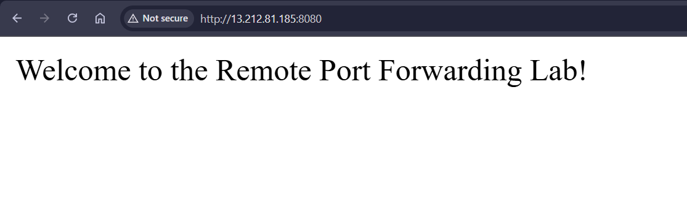

# **Remote Port Forwarding Using SSH Tunnel in AWS**

Remote port forwarding is a technique that allows external users to access services running on a private network by forwarding connections through an SSH tunnel. This is useful when the local machine hosting the service is not directly accessible from the internet, but an intermediary (gateway) machine with SSH access can relay traffic.


## **Task Description**
You are required to:
1. Deploy an AWS EC2 instance (gateway) using Pulumi.
2. Set up a local Express.js service on your Ubuntu machine.
3. Configure remote port forwarding to allow access to the local service through the AWS instance.
4. Test and verify the connection.


## **Step-by-Step Implementation**

### **Step 1. AWS CLI Configuration**

Run the following command to configure AWS CLI:

```bash
aws configure
```

This command prompts you for your AWS Access Key ID, Secret Access Key, region, and output format.


###  **Step 2: Set Up a Pulumi Project**


#### **Set Up a new directory**
Create a new directory for your project and navigate into it:

```sh
mkdir aws-pulumi-infra
cd aws-pulumi-infra
```

#### **Install python `venv`**

```sh 
sudo apt update
sudo apt install python3.8-venv -y
```

#### **Initialize a New Pulumi Project**
Run the following command to create a new Pulumi project:

```sh
pulumi new aws-python
```
Follow the prompts to set up your project.


#### **Create Key Pair**

Create a new key pair for our instances using the following command:

```sh
aws ec2 create-key-pair --key-name key-pair-poridhi-poc --query 'KeyMaterial' --output text > key-pair-poridhi-poc.pem
```

These commands will create key pair for our instances.

#### **Set File Permissions of the key files**
```sh
chmod 400 key-pair-poridhi-poc.pem
```

#### **Infrastructure Components**
1. VPC (10.0.0.0/16)
2. Public Subnet (10.0.1.0/24)
4. Internet Gateway
6. Route Tables
7. Security Groups
8. EC2 Instance 

Now, **Open `__main__.py` file in your project directory**:

```python
import pulumi
import pulumi_aws as aws

# Create a VPC
vpc = aws.ec2.Vpc("my-vpc",
    cidr_block="10.0.0.0/16",
    enable_dns_support=True,
    enable_dns_hostnames=True
)

# Create an Internet Gateway
internet_gateway = aws.ec2.InternetGateway("my-igw",
    vpc_id=vpc.id
)

# Create a Public Subnet
public_subnet = aws.ec2.Subnet("public-subnet",
    vpc_id=vpc.id,
    cidr_block="10.0.1.0/24",
    map_public_ip_on_launch=True
)

# Create a Route Table for the Public Subnet
public_route_table = aws.ec2.RouteTable("public-route-table",
    vpc_id=vpc.id,
    routes=[aws.ec2.RouteTableRouteArgs(
        cidr_block="0.0.0.0/0",
        gateway_id=internet_gateway.id,
    )]
)

# Associate the Public Subnet with the Public Route Table
public_route_table_association = aws.ec2.RouteTableAssociation("public-route-table-association",
    subnet_id=public_subnet.id,
    route_table_id=public_route_table.id
)

# Define a security group for SSH access
gateway_sg = aws.ec2.SecurityGroup("ssh-security-group",
    description="Allow SSH inbound traffic",
    vpc_id=vpc.id,
    ingress=[
        aws.ec2.SecurityGroupIngressArgs(
            protocol="tcp", from_port=22, to_port=22, cidr_blocks=["0.0.0.0/0"], 
        ),
        aws.ec2.SecurityGroupIngressArgs(
            protocol="tcp", from_port=8080, to_port=8080, cidr_blocks=["0.0.0.0/0"],  
        ),
    ],
    egress=[
        aws.ec2.SecurityGroupEgressArgs(
            protocol="-1", from_port=0, to_port=0, cidr_blocks=["0.0.0.0/0"],
        ),
    ],
)

# Create the Gateway instance in the Public Subnet
gateway_instance = aws.ec2.Instance("gateway-instance",
    instance_type="t2.micro",
    ami="ami-0672fd5b9210aa093",  # Replace with your desired AMI ID
    vpc_security_group_ids=[gateway_sg.id],
    subnet_id=public_subnet.id,
    key_name="key-pair-poridhi-poc",  # Replace with your key pair name
    tags={
        "Name": "mysql-server",
    }
)

# Output the  Public IP of the Gateway Instance
pulumi.export("gateway_instance_public_ip", gateway_instance.public_ip)
```


#### **Deploy the Pulumi Stack**

Deploy the stack using the following command:

```sh
pulumi up
```
Review the changes and confirm by typing "yes".


### **Step 2: Set Up the Local Express.js Service**

#### **Install Node.js & Create an Express Server**
```sh
mkdir express-service
cd express-service
npm init -y
npm install express
```

Create `server.js`:
```js
const express = require('express');
const app = express();
const port = 3000;

app.get('/', (req, res) => {
    res.send('Welcome to the Remote Port Forwarding Lab!');
});

app.listen(port, () => {
    console.log(`Express service running at http://localhost:${port}`);
});
```
Start the server:
```sh
node server.js
```


### **Step 3: Configure Remote Port Forwarding**

#### **SSH into the EC2 Instance**
Use the public IP from Pulumi output:
```sh
ssh -i your-key.pem ec2-user@<EC2_PUBLIC_IP>
```

#### **Enable Remote Ports on SSH Server**
Modify the SSH config:
```sh
echo "GatewayPorts yes" | sudo tee -a /etc/ssh/sshd_config
sudo systemctl restart ssh
```

#### **Start Remote Port Forwarding from Your Ubuntu Machine**
Open a new terminal and run the following command.
Replace `<EC2_PUBLIC_IP>` with your EC2 instance IP:
```sh
ssh -R 0.0.0.0:8080:localhost:3000 -i your-key.pem ec2-user@<EC2_PUBLIC_IP>
```

- **`0.0.0.0:8080`** → Exposes port 8080 on EC2 to the world.
- **`localhost:3000`** → Forwards traffic to your local machine’s Express server.


### **Step 4: Verify and Test the Setup**


#### **Check if Port 8080 is Listening on EC2**
SSH into the EC2 instance and run:
```sh
netstat -tulnp | grep 8080
```
You should see an entry indicating that port 8080 is open.

#### **Access Express.js Service from Anywhere**
From any machine, try:
```sh
curl http://<EC2_PUBLIC_IP>:8080
```
Expected output:
```
Welcome to the Remote Port Forwarding Lab!
```

Or open the url from any browser:




### **Step 5: Cleanup**

#### **Stop Remote Port Forwarding**
Exit the SSH session or use `Ctrl + C` to terminate the tunnel.

#### **Destroy AWS Resources**
If you want to remove the EC2 instance, run:
```sh
pulumi destroy
pulumi stack rm
```


## **Conclusion**
You have successfully set up **Remote Port Forwarding** using SSH tunnels to expose a private **Express.js service** via an **AWS EC2 instance**. This technique is useful when you need secure access to private services from a remote machine. 