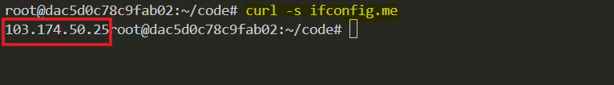

# **SSH Dynamic Port Forwarding (SOCKS Proxy Tunneling)**  

## **SSH Dynamic Port Forwarding**  
SSH Dynamic Port Forwarding is a technique that allows your local machine to act as a **SOCKS proxy**, routing traffic through a remote server via an **encrypted SSH tunnel**.  

This means any application (e.g., web browser, terminal) configured to use the proxy will send its network requests through the remote SSH server instead of directly to the internet.  

### **Analogy**  
Imagine you’re in a restricted office network where social media sites like YouTube and Twitter are blocked. However, you have access to a remote server outside the office. If you create an SSH Dynamic Port Forwarding tunnel to that remote server, you can make your internet traffic appear as if it’s coming from that server, bypassing the restrictions.  


## **What Problems Does It Solve?**  
### **Bypass Network Restrictions**  
If you are in a restricted environment (e.g., workplace, university, or a country with internet censorship), Dynamic Port Forwarding allows you to access blocked websites by tunneling traffic through a remote server.  

### **Secure Browsing on Public Wi-Fi**  
Public Wi-Fi hotspots are often insecure, allowing hackers to intercept unencrypted traffic. By using an SSH tunnel, all your internet traffic is **encrypted**, preventing eavesdropping.  

### **Anonymity & Privacy**  
Instead of revealing your local IP address, websites will see the IP of your remote SSH server, improving anonymity.  

###  **Accessing Internal Networks**  
If you have an SSH server inside a private network, you can use dynamic port forwarding to access internal web applications, APIs, or databases securely.  


## **How Does SSH Dynamic Port Forwarding Work?**  

### **How Normal Internet Traffic Works**  
1. You open your browser and type `https://google.com`.  
2. Your computer sends a request to Google’s server.  
3. Google responds, and you see the webpage.  

**Problem:** If you are on a restricted network, the request might be blocked.  


### **How Dynamic Port Forwarding Works**  
1. You establish an **SSH connection to a remote server** with dynamic port forwarding.  
2. Your local computer **sets up a SOCKS proxy** (e.g., `127.0.0.1:1080`).  
3. Any application (browser, terminal, etc.) configured to use the SOCKS proxy sends traffic through the **SSH tunnel**.  
4. The remote server forwards requests to the internet on your behalf.  

**Benefit:** The restricted network **only sees an encrypted SSH connection**, not the actual websites you're visiting.  


## **Task description**

### Deploy AWS Infrastructure with Pulumi and Configure an SSH SOCKS Proxy  

In this task, you will set up an AWS infrastructure using Pulumi with Python, deploy an EC2 instance, and configure an SSH SOCKS proxy for secure web traffic tunneling. The steps include:  

1. **AWS CLI Configuration** – Set up AWS credentials for Pulumi.  
2. **Pulumi Project Setup** – Initialize a new Pulumi project with Python, configure a virtual environment, and create necessary AWS resources.  
3. **Infrastructure Deployment** – Use Pulumi to create a VPC, subnet, internet gateway, security group, and EC2 instance with SSH access.  
4. **SOCKS Proxy Setup** – Establish an SSH dynamic port forwarding tunnel.  
5. **Testing & Monitoring** – Verify proxy setup using `curl`, check SSH tunnel status, and monitor network traffic with `iftop` and `nethogs`.  
6. **Performance Analysis** – Measure latency and bandwidth usage through the tunnel.  

This hands-on exercise ensures secure remote access via an SSH SOCKS proxy.


## **Step 1. AWS CLI Configuration**

Run the following command to configure AWS CLI:

```bash
aws configure
```


This command prompts you for your AWS Access Key ID, Secret Access Key, region, and output format.


## **Step 2: Set Up a Pulumi Project**


### **Set Up a new directory**
Create a new directory for your project and navigate into it:

```sh
mkdir aws-pulumi-infra
cd aws-pulumi-infra
```

### **Install python `venv`**

```sh 
sudo apt update
sudo apt install python3.8-venv -y
```

### **Initialize a New Pulumi Project**
Run the following command to create a new Pulumi project:

```sh
pulumi new aws-python
```
Follow the prompts to set up your project.


### **Create Key Pair**

Create a new key pair for our instances using the following command:

```sh
aws ec2 create-key-pair --key-name key-pair-poridhi-poc --query 'KeyMaterial' --output text > key-pair-poridhi-poc.pem
```

These commands will create key pair for our instances.

### **Set File Permissions of the key files**
```sh
chmod 400 key-pair-poridhi-poc.pem
```

### **Write Code for infrastructure creation**

- Create a VPC
- Create an Internet Gateway
- Create a Public Subnet
- Create a Route Table
- Associate the Subnet with the Route Table
- Create a Security Group
- Create the EC2 Instance
- Export Output

Now, **Open `__main__.py` file in your project directory**:

```python
import pulumi
import pulumi_aws as aws

# Create a VPC
vpc = aws.ec2.Vpc("my-vpc",
    cidr_block="10.0.0.0/16",
    enable_dns_support=True,
    enable_dns_hostnames=True
)

# Create an Internet Gateway
internet_gateway = aws.ec2.InternetGateway("my-igw",
    vpc_id=vpc.id
)

# Create a Public Subnet
subnet = aws.ec2.Subnet("my-subnet",
    vpc_id=vpc.id,
    cidr_block="10.0.0.0/24",
    map_public_ip_on_launch=True
)

# Create a route table
route_table = aws.ec2.RouteTable("my-route-table",
    vpc_id=vpc.id,
    routes=[aws.ec2.RouteTableRouteArgs(
        cidr_block="0.0.0.0/0",
        gateway_id=internet_gateway.id,
    )]
)

# Associate the subnet with the route table
route_table_association = aws.ec2.RouteTableAssociation("my-route-table-association",
    subnet_id=subnet.id,
    route_table_id=route_table.id
)

# Security Group allowing SSH and MySQL 
security_group = aws.ec2.SecurityGroup("my-sec-group",
    vpc_id=vpc.id,
    description="Allow SSH from all IP and MySQL only from the EC2 instance itself",
    ingress=[
        # Allow SSH (port 22) 
        aws.ec2.SecurityGroupIngressArgs(
            protocol="tcp", from_port=22, to_port=22, cidr_blocks=["0.0.0.0/0"],
        ),
    ],
    egress=[
        # Allow all outbound traffic
        aws.ec2.SecurityGroupEgressArgs(
            protocol="-1", from_port=0, to_port=0, cidr_blocks=["0.0.0.0/0"],
        ),
    ],
)


# Create the ec2
remote_server = aws.ec2.Instance('remote-server',
    instance_type='t2.micro',
    ami='ami-0672fd5b9210aa093',
    vpc_security_group_ids=[security_group.id],
    subnet_id=subnet.id,
    key_name='key-pair-poridhi-poc', 
    tags={
        'Name': 'remote-server',
    }
)

# Output the public IP address
pulumi.export('remote_server_public_ip', remote_server.public_ip)
```


### **Preview the deployment plan**

To preview the deployment plan, run the following command:

```bash
pulumi preview
```

This will show all the components ready to be deployed and provisioned.

### **Deploy the Pulumi Stack**

Deploy the stack using the following command:

```sh
pulumi up
```
Review the changes and confirm by typing "yes".


### **Check Public IP Before and After Using SOCKS Proxy**
```bash
curl -s ifconfig.me
```




## **Step 3: Create an SSH SOCKS Proxy**  
From your **local machine**, run:  
```sh
ssh -D 1080 -N -C -i your-key.pem ubuntu@<EC2_PUBLIC_IP>
```
- `-D 1080` → Creates a **SOCKS proxy** on port `1080`.  
- `-N` → No remote commands (just forwarding).  
- `-C` → Compresses data.  

This command **does not give a shell**, but it creates the tunnel. Keep the terminal open. 


### **Test with proxy to see EC2's IP**  
```sh
curl --socks5 localhost:1080 ifconfig.me
```
It should return the **remote server’s IP** instead of your local one.  


## **Step 4: Verifying and Monitoring the SOCKS Proxy Connection**

### **Verify the SOCKS proxy is listening**

```bash
sudo lsof -i :1080
```
Expected output should show ssh process listening


### **Check if the tunnel process is running**

```bash
ps aux | grep "ssh -D"
```

Should see your ssh tunnel process


### **Verify port is open and listening**

```bash
netstat -tlnp | grep 1080
```

Expected:


### **Monitor SSH tunnel traffic**

```bash
# Install iftop if not already installed
sudo apt-get install iftop
# Monitor traffic on the SSH connection
sudo iftop -i any -f "port ssh"
```

Expected:


Now open a new terminal and curl using the proxy and immediately switch to the monitoring terminal:

```bash
curl --socks5 localhost:1080 http://www.google.com
```


In the monitoring terminal you will see:


- When you run `curl --socks5 localhost:1080 http://www.google.com`, you should see:

  - A connection line between your local machine and your EC2 instance
  - Traffic spikes in both TX (transmit) and RX (receive)
  - Non-zero values in the bottom summary (TX/RX/TOTAL)
  - The EC2's IP address should appear in the connections

- Understanding  `iftop` Display

  - The top bar shows bandwidth scale 
  - Left column shows source addresses 
  - Right column shows destination addresses
  - Three columns of numbers on the right show:
    - Last 2 seconds average
    - Last 10 seconds average
    - Last 40 seconds average


### **Monitor bandwidth usage through tunnel**
```bash
# Install nethogs if not already installed
sudo apt install nethogs
sudo nethogs
```

This will open something like following:


Now open a new terminal and curl using the proxy and immediately switch to the nethogs terminal:

```bash
curl --socks5 localhost:1080 http://www.google.com
```

You will see the bandwidth usage through ssh as follows:


This highlighted line represents your SSH tunnel traffic. The non-zero values for SENT and RECEIVED confirm that data is actively flowing through your SSH tunnel.

- What This Tells Us About Your SSH Tunnel:

- The tunnel is active and functioning (PID 12469)
- Data is flowing in both directions:

  - Upload (SENT): 0.118 KB/sec
  - Download (RECEIVED): 0.409 KB/sec


- The asymmetric traffic pattern (more received than sent) is normal for web browsing through the tunnel

This output confirms your SSH dynamic port forwarding is working correctly since we can see actual bandwidth usage through the SSH process when making requests through the SOCKS proxy.


### **Test latency through tunnel**


```bash
# Without proxy
time curl https://www.google.com > /dev/null
```

```bash
# With proxy
time curl --socks5 localhost:1080 https://www.google.com > /dev/null
```
Expected output:


Let me break down the latency testing results comparing direct connection vs. SSH tunnel:

**Direct Connection (without SOCKS proxy)**:
```bash
time curl https://www.google.com > /dev/null
- Download Speed: 25,598 bytes/sec
- Total Time (real): 0.852 seconds
- User CPU Time: 0.038 seconds
- System CPU Time: 0.023 seconds
```

**Through SSH Tunnel (with SOCKS proxy)**:
```bash
time curl --socks5 localhost:1080 https://www.google.com > /dev/null
- Download Speed: 18,922 bytes/sec
- Total Time (real): 1.069 seconds
- User CPU Time: 0.056 seconds
- System CPU Time: 0.007 seconds
```

**Key Observations**:
1. **Speed Difference**:
   - Direct: 25.6 KB/s
   - Tunneled: 18.9 KB/s
   - ~26% slower through the tunnel

2. **Latency Increase**:
   - Direct: 0.852s
   - Tunneled: 1.069s
   - Additional overhead: ~0.217s (about 25% slower)

3. **CPU Usage**:
   - Direct: 0.061s total (0.038s user + 0.023s system)
   - Tunneled: 0.063s total (0.056s user + 0.007s system)
   - Slightly more user CPU time for encryption/decryption in tunnel

This latency increase is expected because:
- Traffic must be encrypted/decrypted
- Data travels a longer path (your machine → EC2 → Google instead of direct)
- The SOCKS proxy adds processing overhead

The tradeoff is security and privacy for a modest performance impact, which is typically acceptable for most use cases.


## **When to Use SSH Dynamic Port Forwarding?**  
| Scenario | Benefit |
|----------|---------|
| Bypassing website restrictions at work/school | Access blocked sites |
| Using public Wi-Fi safely | Encrypts traffic to prevent eavesdropping |
| Keeping browsing private | Websites see the remote SSH server’s IP, not yours |
| Securely accessing internal company networks | Tunnel into a private network remotely |


## **Key Differences: Local, Remote, and Dynamic Port Forwarding**  

| Type | Description | Use Case |
|------|-------------|----------|
| **Local Port Forwarding (-L)** | Forwards traffic from local machine to remote service | Accessing a database on a remote server |
| **Remote Port Forwarding (-R)** | Forwards traffic from a remote machine to a local service | Hosting a local web app and exposing it to the internet |
| **Dynamic Port Forwarding (-D)** | Creates a SOCKS proxy to route any traffic through the SSH tunnel | Secure internet browsing and bypassing restrictions |


## **Conclusion**  
In this implementation, we set up AWS infrastructure using Pulumi, deployed an EC2 instance, and configured an SSH SOCKS proxy for secure tunneling. We verified the proxy's functionality using various network monitoring tools, ensuring secure and anonymous browsing through the remote server. Performance tests showed a slight increase in latency due to tunneling overhead, but the setup successfully masked local IP and enabled secure traffic routing through the EC2 instance.

