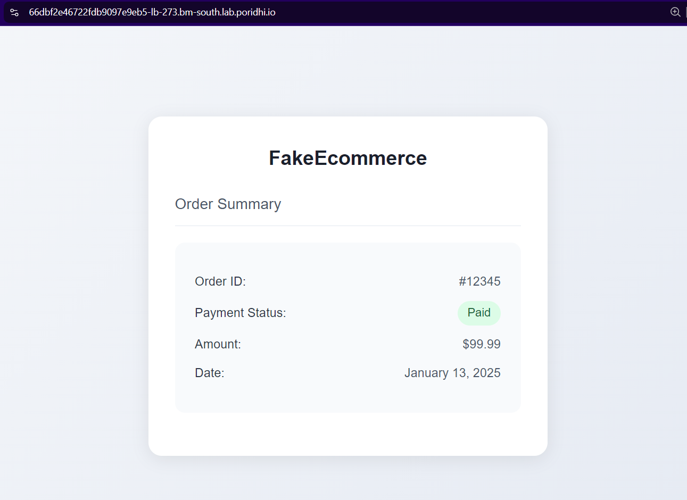

# Exploring Offensive Security

Offensive security is a critical field in cybersecurity that focuses on identifying vulnerabilities in systems and applications. One of the most common tools used by ethical hackers and penetration testers is Gobuster, a robust directory and file brute-forcing tool. This lab will introduce you to Gobuster and demonstrate its capabilities by simulating a simple attack on a payment status application.

## Overview


In this lab, we will:
- Learn about Gobuster and its features.
- Clone and run a sample payment application.
- Create a wordlist and use Gobuster to identify open pages in the application.
- Exploit the discovered pages to modify payment statuses.

## Offensive Security

Offensive security involves actively testing systems, networks, and applications to identify and mitigate security vulnerabilities. Ethical hackers and penetration testers use offensive security tools and techniques to assess the security posture of an organization and recommend improvements.


## What is Gobuster?


Gobuster is a command-line tool written in Go, used for brute-forcing:
- Directories and files on a web server.
- DNS subdomains.
- Virtual hostnames on servers.


### Features of Gobuster
1. **Directory and File Brute-Forcing:** Discover hidden paths and files on web servers.
2. **DNS Subdomain Enumeration:** Identify subdomains of a target domain.
3. **Virtual Host Discovery:** Find virtual hosts configured on a server.

### How Gobuster Works
Gobuster iterates through a wordlist containing potential directory and file names. It sends HTTP requests to the server for each entry in the wordlist and reports paths that return valid status codes (e.g., 200, 301).

### Common Gobuster Options
1. **`-u`**: Specify the target URL.
2. **`-w`**: Provide the path to the wordlist.
3. **`-o`**: Output results to a file.
4. **`-x`**: Specify file extensions to append to entries in the wordlist.
5. **`-t`**: Set the number of concurrent threads.
6. **`-s`**: Filter results by HTTP status codes.

#### Example Command
```bash
gobuster  -u http://example.com -w wordlist.txt -x php,html -t 50 -o results.txt dir
```
This command brute-forces directories on `http://example.com`, appends `.php` and `.html` to entries, uses 50 threads, and saves the output to `results.txt`.

## Lab Instructions

### Step 1: Install Gobuster
Use the following commands to install Gobuster on your system:
1. Update the package list:
   ```bash
   sudo apt update
   ```
2. Install Gobuster:
   ```bash
   sudo apt install gobuster -y
   ```
3. Verify the installation:
   ```bash
   gobuster -h
   ```

### Step 2: Run the Application

#### Pull the docker image from the docker hub

```
docker pull fazlulkarim105925/fakepaymentapplication:latest
```

#### Run the docker image

```
docker run -d -p 8000:8000 fazlulkarim105925/fakepaymentapplication:latest
```

#### Create a Loadbalancer in Poridhi's Cloud

Find the `eth0` ip with

```
ifconfig
```


Create a Loadbalancer with the `eth0` ip and the port `8000`.


With the loadbalancer `url` you can access the application form any browser.


In this page, you can see the payment status of the user. Which is currently in `Pending` state. Suppoose this application has a `Admin Portal` where the admin can change the payment status of the user which is only accessible to the admin. But if we find the hidden path to the `Admin Portal`, we can access it and change the payment status of the user. Hackers use various tools to find this kind of hidden paths. One of the most common tools is `Gobuster`. In this lab, we will use `Gobuster` to find the hidden path to the `Admin Portal` and change the payment status of the user with the predefine wordlist.

### Step 3: Create a Wordlist

In some third party websites, you will find various wordlists that were already created by different communities. Hackers use those wordlists or create their own wordlists to find the hidden paths. Create a file named `wordlist.txt` with the following contents:

```plaintext
admin-portal
styles.css
script.js
favicon.ico
```

### Step 4: Run Gobuster
Run Gobuster with the wordlist to discover open pages:
```bash
gobuster -u http://localhost:8000 -w wordlist.txt dir
```
In this command, `gobuster dir` is used to brute-force directories, `-u http://localhost:8000` specifies the target URL, `-w wordlist.txt` provides the wordlist, and `-v` enables verbose output.


In output, you can see the hidden path to the `Admin Portal` which is `/admin-portal`.

### Step 5: Exploit the Admin Portal
1. Open `<poridhi-loadbalancer-url>/admin-portal` in a browser.

   

2. Modify the payment status using the admin controls.

   

### Step 6: Verify the Exploit
1. Navigate to the dashboard `<poridhi-loadbalancer-url>` and confirm that the payment status reflects the changes made in the admin portal.

   
2. Verify the status persistence by refreshing the page.

## Conclusion
This lab demonstrated:
- The use of Gobuster to identify open pages and directories on a web server.
- How discovered pages can be exploited to access sensitive functionality.

By practicing ethical hacking techniques with tools like Gobuster, you can identify vulnerabilities in web applications and implement measures to mitigate them.
