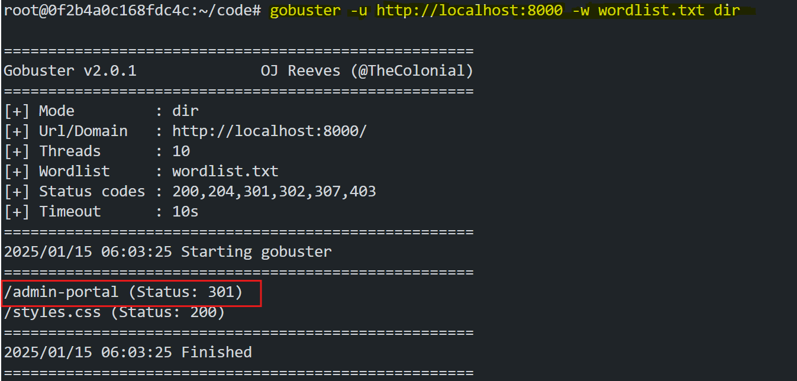

# Exploring Offensive Security with Gobuster

Offensive security is a critical field in cybersecurity that focuses on identifying vulnerabilities in systems and applications. One of the most common tools used by ethical hackers and penetration testers is Gobuster, a robust directory and file brute-forcing tool. This lab will introduce you to Gobuster and demonstrate its capabilities by simulating a simple attack on a payment status application.

## Overview


In this lab, we will:
- Learn about Gobuster and its features.
- Clone and run a sample payment application.
- Create a wordlist and use Gobuster to identify open pages in the application.
- Exploit the discovered pages to modify payment statuses.

## Offensive Security

Offensive security involves actively testing systems, networks, and applications to identify and mitigate security vulnerabilities. Ethical hackers and penetration testers use offensive security tools and techniques to assess the security posture of an organization and recommend improvements.


## What is Gobuster?


Gobuster is a command-line tool written in Go, used for brute-forcing:
- Directories and files on a web server.
- DNS subdomains.
- Virtual hostnames on servers.


### Features of Gobuster
1. **Directory and File Brute-Forcing:** Discover hidden paths and files on web servers.
2. **DNS Subdomain Enumeration:** Identify subdomains of a target domain.
3. **Virtual Host Discovery:** Find virtual hosts configured on a server.

### How Gobuster Works
Gobuster iterates through a wordlist containing potential directory and file names. It sends HTTP requests to the server for each entry in the wordlist and reports paths that return valid status codes (e.g., 200, 301).

### Common Gobuster Options
1. **`-u`**: Specify the target URL.
2. **`-w`**: Provide the path to the wordlist.
3. **`-o`**: Output results to a file.
4. **`-x`**: Specify file extensions to append to entries in the wordlist.
5. **`-t`**: Set the number of concurrent threads.
6. **`-s`**: Filter results by HTTP status codes.

#### Example Command
```bash
gobuster dir -u http://example.com -w wordlist.txt -x php,html -t 50 -o results.txt
```
This command brute-forces directories on `http://example.com`, appends `.php` and `.html` to entries, uses 50 threads, and saves the output to `results.txt`.

## Step-by-Step Lab Instructions

### Step 1: Install Gobuster
Use the following commands to install Gobuster on your system:
1. Update the package list:
   ```bash
   sudo apt update
   ```
2. Install Gobuster:
   ```bash
   sudo apt install gobuster -y
   ```
3. Verify the installation:
   ```bash
   gobuster -h
   ```

### Step 2: Clone the Application
Clone the payment application from GitHub:
```bash
git clone <repository_url>
cd project
```
Replace `<repository_url>` with the URL of the GitHub repository.

### Step 3: Run the Application

Start a Python HTTP server to host the application:

```bash
python3 -m http.server 8000
```

- Create a loadbalancer in Poridi's cloud with the `eth0` ip and port `8000`.

- To find the `eth0` ip, run the following command:

```bash
ifconfig
```

   

- With the Loadbalancer `URL` access the application from any browser.

   

### Step 4: Create a Wordlist
Create a file named `wordlist.txt` with the following contents:
```
admin-portal
styles.css
script.js
favicon.ico
```

### Step 5: Run Gobuster
Run Gobuster with the wordlist to discover open pages:
```bash
gobuster dir -u http://localhost:8000 -w wordlist.txt -v
```


### Step 6: Exploit the Admin Portal
1. Open `http://localhost:8000/admin-portal` in a browser.


2. Modify the payment status using the admin controls.

   

3. Update the status and verify it on the dashboard (`http://localhost:8000`).

   

### Step 7: Verify the Exploit
1. Navigate to the dashboard and confirm that the payment status reflects the changes made in the admin portal.
2. Verify the status persistence by refreshing the page.

## Conclusion
This lab demonstrated:
- The use of Gobuster to identify open pages and directories on a web server.
- How discovered pages can be exploited to access sensitive functionality.

By practicing ethical hacking techniques with tools like Gobuster, you can identify vulnerabilities in web applications and implement measures to mitigate them.
