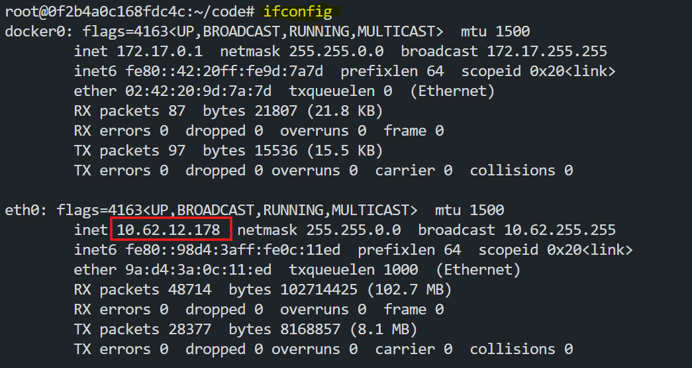

# Exploring the OSI Model

The Open Systems Interconnection (OSI) model is a framework that helps us understand how devices communicate over a network. It breaks the process into seven layers, each with a specific role. This lab will explain the OSI model step-by-step and show how it works in a real-world example using Docker.

## Objective
In this lab, you will learn:
- Learn the purpose of the OSI model.
- Understand the functions of each layer.
- Explore how data moves through the OSI layers.
- Perform a practical example to see the OSI model in action.

## What is OSI?
The OSI model is a guide that describes how devices communicate in a network. It has seven layers, each with a unique job. These layers work together to send data from one device to another in an organized way. By following these layers, devices from different manufacturers can communicate smoothly. It has 7 unique layers.


## Details of Each Layer
- ### Physical Layer (Layer 1)
   The Physical Layer deals with the hardware parts of the network. It manages the cables, switches, and signals used to send data. This layer ensures that raw binary data (1s and 0s) is transmitted as electrical signals or light pulses. Examples include Ethernet cables, fiber optics, and network adapters.

   The Functionalist provided by this Layer is shown in the diagram below.

   

- ### Data Link Layer (Layer 2)
   The Data Link Layer ensures that data is sent to the correct device on the local network. It adds MAC addresses to identify devices and divides data into smaller frames for transmission. Devices like switches and NICs (Network Interface Cards) operate at this layer. It also handles error detection and correction during transmission.

   The Functionalist provided by this Layer is shown in the diagram below.

   

- ### Network Layer (Layer 3)
   The Network Layer is responsible for routing data to its destination. It uses logical addressing (IP addresses) to identify devices and chooses the best path for data delivery. Routers work at this layer, and protocols like IPv4 and IPv6 are used here. Data is broken into packets for efficient routing. For routing several algorithms are used like `Routing Table`, `Distance Vector`, `Link State`, `Path Vector`, etc.

   The Functionalist provided by this Layer is shown in the diagram below.

   

- ### Transport Layer (Layer 4)
   The Transport Layer ensures data is delivered error-free and in the correct order. It uses protocols like TCP (Transmission Control Protocol) for reliable communication and UDP (User Datagram Protocol) for faster, less reliable communication. This layer manages data flow by dividing it into smaller segments.

   The Functionalist provided by this Layers are shown in the diagram below.

   

- ### Session Layer (Layer 5)
   The Session Layer manages the communication between devices. It creates, maintains, and terminates connections, called sessions. This layer also includes checkpoints, which help resume communication if the connection is interrupted. When two need to communicate they need to establish a session first.

   The Functionalist provided by this Layer is shown in the diagram below.

   

- ### Presentation Layer (Layer 6)
   The Presentation Layer prepares data for the application layer. It translates data formats, compresses information, and encrypts it for security. For example, HTTPS ensures secure data transmission at this layer. It acts as a translator, allowing devices with different data formats to communicate.

   The Functionalist provided by this Layer is shown in the diagram below.

   

- ### Application Layer (Layer 7)
   The Application Layer is where users interact with the network.It can also be called as the `User Layer`.This is layer is visible to the user. It defines how applications like web browsers, email clients, and file transfer programs send and receive data. Protocols like HTTP, FTP, and DNS operate at this layer, enabling user-friendly communication.

   The Functionalist provided by this Layer is shown in the diagram below.

   

## Encapsulation
Encapsulation is the process by which data is wrapped with the necessary information at each layer of the OSI model as it moves from the application layer down to the physical layer. This process ensures the data can be transmitted and interpreted correctly by the receiving device.


- At the **Application Layer (Layer 7)**, the data is created and passed down to the lower layers.
- At the **Presentation Layer (Layer 6)**, the data is formatted or encrypted, if necessary.
- At the **Session Layer (Layer 5)**, session information is added to manage the connection.
- At the **Transport Layer (Layer 4)**, the data is divided into segments, and headers are added to ensure reliable delivery.
- At the **Network Layer (Layer 3)**, the segments are encapsulated into packets, and IP addresses are added for routing.
- At the **Data Link Layer (Layer 2)**, the packets are encapsulated into frames, and physical addresses (MAC addresses) are added.
- Finally, at the **Physical Layer (Layer 1)**, the frames are converted into electrical signals, light pulses, or radio waves for transmission over the network.

On the receiving device, the process is reversed (decapsulation), where each layer removes its specific information to reconstruct the original data.


## Practical Example of How OSI Works
To demonstrate the OSI model, we will use a containerized environment to simulate data communication across layers.

1. **Pull and Run a Docker Image:**
   ```bash
   docker pull fazlulkarim105925/osimodelpractice:latest
   ```
2. **Run the Docker Image:**
   ```bash
   docker run -d -p 8000:8000 fazlulkarim105925/osimodelpractice:latest
   ```

3. **Access the UI:**
   - Find the `eth0` ip by using `ifconfig` command in the terminal.

     

   - Create a LoadBalancer in Poridhi's Cloud with `eth0` ip and port as `8000`.

   - Access the application from any browser with the LoadBalancer's URL.

     
    
     Click on `Send Data` button to visulize the data flow.

## Conclusion
The OSI model breaks down complex network communication into manageable layers, making it easier to understand and troubleshoot. Each layer plays a unique role, from transmitting raw signals to enabling user-friendly applications. By using Docker and tools like Wireshark, we can see the OSI model in action and better appreciate its importance in modern networking.

