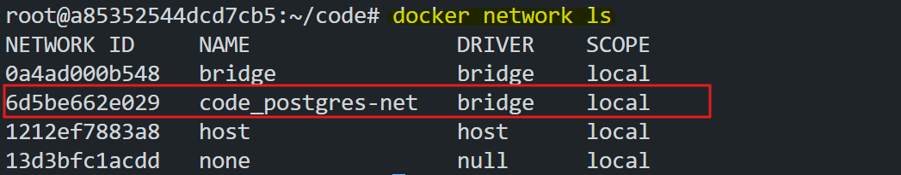
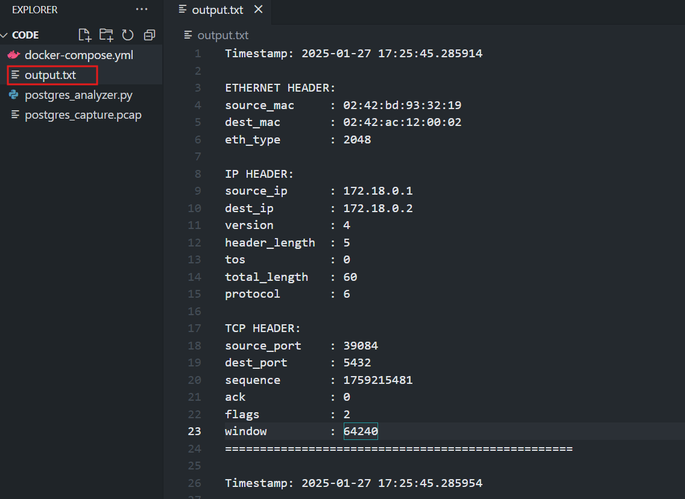
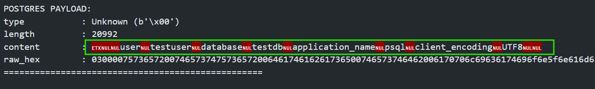

# TCP/IP Protocol Analysis

This lab will help you understand how TCP/IP works and how it can be used to analyze network traffic. We will use `tcpdump` to capture the traffic and `termshark` to analyze the traffic. Then use a python script to convert the traffic to a readable format.

## Objective

The goal of this lab is to provide a clear understanding of the essential components of data communication in a network. By the end of this lab, you will:

1. Basic understanding for Packets and Frames
2. Understand how TCP/IP works and how it can be used to analyze network traffic.
3. Understanding tcp headers and how they are used to transport data.
3. Learn how to use `tcpdump` to capture the traffic.
4. Learn how to use `termshark` to analyze the traffic.

## Packets and Frames

To understand how data travels across a network, imagine sending a letter in the mail. When you mail a letter, it is placed inside an envelope with the recipient’s address written on it. In networking, this letter represents the data you want to send, and the envelope is the packet. A packet contains not only the data but also important information like the sender’s and receiver’s addresses, ensuring it reaches the right destination. Packet are encapsulated with the necessary addressing information like source and destination IP addresses and ports.


Frames are small units of data used for communication within a local network, like your home Wi-Fi or office Ethernet. They contain the data being sent, along with important information like the sender and receiver's MAC addresses. Frames ensure that data travels efficiently between devices within the same network. They work within the Data Link Layer of the OSI model and are essential for local communication. Frames encapsulate packets by adding MAC addressing information.


This process of wrapping data with the necessary addressing information is called encapsulation. It ensures that data, no matter how large, is split into manageable pieces and routed correctly to its destination. This also helps reduce congestion and bottlenecks, making communication faster and more reliable.

## TCP/IP

TCP/IP, or Transmission Control Protocol/Internet Protocol, is the backbone of the internet. It is a set of rules or protocols that define how data is sent, transmitted, and received across networks. Think of TCP/IP as a translator that ensures devices with different hardware and software can communicate seamlessly.

TCP/IP is a more shorter version of OSI model. In OSI model, there are 7 layers and in TCP/IP model, there are 4 layers. Some of the layers are combined in TCP/IP model. TCP/IP is more popular than OSI model because it is more practical and easier to understand.


TCP/IP works through a process called encapsulation, where data is wrapped with headers containing critical information as it moves through four layers: Application, Transport, Internet, and Network Interface. These layers work together to ensure the data reaches its destination correctly.

### Application Layer

The Application Layer of TCP/IP model is the same as the Application Layer of OSI model. It is the layer that interacts with the user. It is responsible for providing services to the user. It act as the sum of the OSI model's Application, Presentation, and Session layers. 

### Transport Layer

The Transport Layer of TCP/IP model is the same as the Transport Layer of OSI model. It is the layer that ensures the data is delivered to the correct destination. It is responsible for providing services to the user. It act as the sum of the OSI model's Transport Layer. It uses protocols like TCP and UDP.

### Internet Layer

The Internet Layer of TCP/IP model is the same as the Network Layer of OSI model. It is the layer that ensures the data is delivered to the correct destination. It is responsible for providing services to the user. It act as the sum of the OSI model's Network Layer. It uses protocols like IP, ICMP, ARP, RARP, etc.

### Network Access Layer

The Network Access Layer of TCP/IP model is the same as the Data Link Layer of OSI model. It is the layer that ensures the data is delivered to the correct destination. It is responsible for providing services to the user. It act as the sum of the OSI model's Data Link Layer.

### Why is TCP Secure?

One of the key features of TCP is its reliability. Before any data is sent, TCP establishes a connection between the sender and receiver through a process called the **Three-way Handshake**. This ensures both devices are synchronized and ready to communicate. 


To establish a connection, the client sends a `SYN` message to the server. The server responds with a `SYN-ACK` message. Then the client sends an `ACK` message to the server. This is because TCP is a connection-oriented protocol and requires a response. Now the connection is established and data can be sent.

Once the data is sent, TCP checks that all packets have arrived and reassembles them in the correct order. If any packet is missing or corrupted, it is resent. This makes TCP a secure and reliable protocol for tasks like downloading files or sending emails.

### TCP Segment

After establishing a connection, the data is sent in smaller chunks, and each chunk is wrapped in a TCP segment that includes the TCP header and the data payload. Each segment is wrapped in a TCP header and data payload. 20-60 bytes for the TCP header + up to 1460 bytes of data (in most cases). 


The TCP header contains the source and destination ports, sequence number, acknowledgment number, header length, reserved, flags, window size, checksum, and urgent pointer. 


- **Source Port**: The 16-bit address of the port sending the data.
- **Destination Port**: The 16-bit address of the port receiving the data.
- **Sequence Number**: Tracks the position of data in the session.
- **Acknowledgment Number**: Acknowledges receipt of data. If segment 'x' is received, the acknowledgment will be 'x+1'.
- **HLEN (Header Length)**: Specifies the size of the header in 4-byte chunks. The header size ranges from 20 bytes (5 chunks) to 60 bytes (15 chunks).
- **Reserved**: 4 bits set to 0 for future use.
- **Flags (Control Bits)**:
  - **URG**: Urgent data is present.
  - **ACK**: Indicates acknowledgment is included in the packet.
  - **PSH**: Requests immediate delivery of data to the application without buffering.
  - **RST**: Requests to reset the connection.
  - **SYN**: Initiates a connection.
  - **FIN**: Closes a connection.
- **Window Size**: A 16-bit field that specifies how much data the receiver can handle. Helps with flow control.
- **Checksum**: A 16-bit mandatory field to check for errors in the segment.
- **Urgent Pointer**: Points to urgent data when the URG flag is set. It adds to the sequence number to locate the last urgent byte.
- **Options**: Extra features, stored in 32-bit units. If less than 32 bits, padding is added to make up the difference.

### TCP Connection Close

For closing a TCP connection, the client will send a `FIN` message to the server. The server will respond with a `ACK` message. Then the server will send a `FIN` message to the client. The client will respond with a `ACK` message. This is because TCP is a connection-oriented protocol and requires a response.


## Analyzing TCP Traffic with Postgres

Now we will analyze the TCP traffic with Postgres. We will use `tcpdump` to capture the traffic and `termshark` to analyze the traffic. Then use a python script to convert the traffic to a readable format.

### tcpdump 
`tcpdump` is a command-line utility for capturing and analyzing network traffic. It is a powerful tool for network monitoring and troubleshooting. It can be used to capture traffic from a specific port or protocol. 

### termshark

`termshark` is a terminal-based UI for `wireshark`. It is a powerful tool for network monitoring and troubleshooting. It can be used to analyze network traffic in real-time. Using filters, you can analyze the traffic based on the source and destination IP addresses, ports, protocols, etc.

## 1. Setup PostgreSQL with Docker Compose

Create `docker-compose.yml`:
```yaml
version: '3.8'
services:
  db:
    image: postgres:15
    environment:
      POSTGRES_USER: testuser
      POSTGRES_PASSWORD: testpass123
      POSTGRES_DB: testdb
    ports:
      - "5432:5432"
    networks:
      - postgres-net

networks:
  postgres-net:
    driver: bridge
```

Start PostgreSQL:
```bash
docker-compose up -d
```

## 2. Install Necessary Tools 

```bash
sudo apt update
sudo apt install tcpdump termshark postgresql-client-common postgresql-client -y
```

### 3.Find the network id for the postgres-net
```bash
docker network ls
```

Copy the network id for the `code_postgres-net`.

### 4. Capture Packets with tcpdump
```bash
sudo tcpdump -i br-<network_id_for_postgres-net> -nn -vv -w postgres_capture.pcap port 5432
```

This will capture the traffic from the `code_postgres-net` and save it to `postgres_capture.pcap`.

>Note: Replace `<network_id_for_postgres-net>` with the network id copied from the previous step.

### 5. Access PostgreSQL
In a new terminal:
```bash
PGPASSWORD=testpass123 psql -h localhost -p 5432 -U testuser -d testdb
```
After entering to postgres, stop the tcpdump capture, by pressing `Ctrl+C` in the terminal where tcpdump is running.

### 6. Analyze the captured packets with termshark

```bash
termshark -r postgres_capture.pcap
```


Use filter:
```
tcp.port == 5432 && tcp.len > 0
```
This will filter the traffic to only show the traffic to and from the port 5432 and only the packets with data not the `SYN` and `ACK` packets.

One little problem still exists. If you see the bottom section of the termshark, you will see that the data is not in a readable format. It is in `HEX/ASCII` format. We need to convert it to a readable format. We will use a python script to do this.


### 7. Python Packet Analyzer Script

Create `postgres_analyzer.py`:
```python
import dpkt
import datetime
import socket
import binascii

def decode_postgres_message(payload):
    """Decode PostgreSQL message"""
    if len(payload) < 1:
        return "Empty payload"
        
    # First byte is message type
    msg_type = payload[0:1]
    msg_types = {
        b'R': 'Authentication',
        b'S': 'Parameter Status',
        b'K': 'Backend Key Data',
        b'Q': 'Query',
        b'T': 'Row Description',
        b'D': 'Data Row',
        b'C': 'Command Complete',
        b'Z': 'Ready for Query',
        b'E': 'Error',
        b'N': 'Notice'
    }
    
    message_type = msg_types.get(msg_type, f'Unknown ({msg_type})')
    
    # Next 4 bytes are length
    if len(payload) >= 5:
        length = int.from_bytes(payload[1:5], byteorder='big')
        content = payload[5:length+1]
        
        # Try to decode content as ASCII where possible
        try:
            decoded_content = content.decode('ascii', errors='replace')
        except:
            decoded_content = binascii.hexlify(content).decode()
            
        return {
            'type': message_type,
            'length': length,
            'content': decoded_content,
            'raw_hex': binascii.hexlify(content).decode()
        }
    return {
        'type': message_type,
        'error': 'Incomplete message'
    }

def decode_packet(packet_bytes):
    """Decode full packet including headers"""
    eth = dpkt.ethernet.Ethernet(packet_bytes)
    
    # Decode Ethernet header
    eth_header = {
        'source_mac': ':'.join('%02x' % b for b in eth.src),
        'dest_mac': ':'.join('%02x' % b for b in eth.dst),
        'eth_type': eth.type
    }
    
    # Decode IP header
    ip = eth.data
    ip_header = {
        'version': ip.v,
        'header_length': ip.hl,
        'tos': ip.tos,
        'total_length': ip.len,
        'source_ip': socket.inet_ntoa(ip.src),
        'dest_ip': socket.inet_ntoa(ip.dst),
        'protocol': ip.p
    }
    
    # Decode TCP header
    tcp = ip.data
    tcp_header = {
        'source_port': tcp.sport,
        'dest_port': tcp.dport,
        'sequence': tcp.seq,
        'ack': tcp.ack,
        'flags': tcp.flags,
        'window': tcp.win
    }
    
    # Decode PostgreSQL payload if present
    postgres_data = None
    if len(tcp.data) > 0:
        postgres_data = decode_postgres_message(tcp.data)
    
    return {
        'ethernet': eth_header,
        'ip': ip_header,
        'tcp': tcp_header,
        'postgres': postgres_data
    }

def analyze_pcap(pcap_file):
    """Read and analyze pcap file"""
    with open(pcap_file, 'rb') as f:
        pcap = dpkt.pcap.Reader(f)
        
        for ts, buf in pcap:
            try:
                decoded = decode_packet(buf)
                print(f"\nTimestamp: {datetime.datetime.fromtimestamp(ts)}")
                print("\nETHERNET HEADER:")
                for k, v in decoded['ethernet'].items():
                    print(f"{k:15}: {v}")
                    
                print("\nIP HEADER:")
                for k, v in decoded['ip'].items():
                    print(f"{k:15}: {v}")
                    
                print("\nTCP HEADER:")
                for k, v in decoded['tcp'].items():
                    print(f"{k:15}: {v}")
                    
                if decoded['postgres']:
                    print("\nPOSTGRES PAYLOAD:")
                    for k, v in decoded['postgres'].items():
                        print(f"{k:15}: {v}")
                print("="*50)
                
            except Exception as e:
                print(f"Error processing packet: {e}")
                continue

if __name__ == "__main__":
    analyze_pcap("postgres_capture.pcap")
```
### 8. Run Analysis

Install dependencies:
```bash
sudo apt install python3-pip -y
```

Install `dpkt`:
```bash
pip3 install dpkt
```

Run the python script:
```bash
python3 postgres_analyzer.py > output.txt
```

This will create a file called `output.txt` with the readable format of the traffic.



### 9. Analyzing Output

The analysis output includes:

#### TCP/IP Headers:
- Source/Destination MAC addresses
- IP addresses and ports
- TCP flags and sequence numbers

#### PostgreSQL Protocol Messages:
- Startup Message
- Authentication Request
- Parameter Status
- Query Messages
- Data Rows

From the output.txt if you search `POSTGRES PAYLOAD` you will find the credentials of the postgres user that was used to connect to the postgres server.


#### Important Security Points:
- Authentication messages are visible but passwords are hashed
- Queries and data are in plaintext
- Connection parameters are visible

#### Network Performance:
- Window sizes indicate flow control
- Sequence numbers show packet ordering
- Timestamps show connection timing

## Conclusion

This lab helped you understand how TCP/IP works and how it can be used to analyze network traffic. We used `tcpdump` to capture the traffic and `termshark` to analyze the traffic. Then use a python script to convert the traffic to a readable format. It provided a basic understanding of how data are transported across a network and how TCP/IP works.

