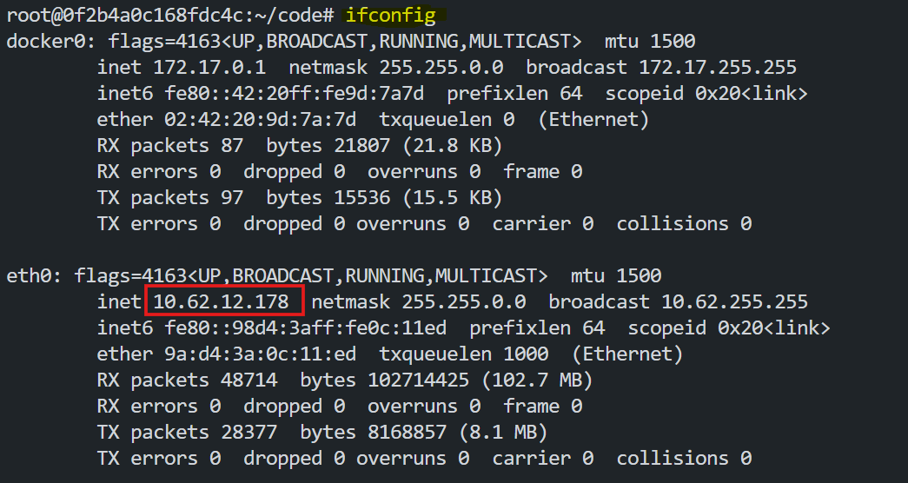
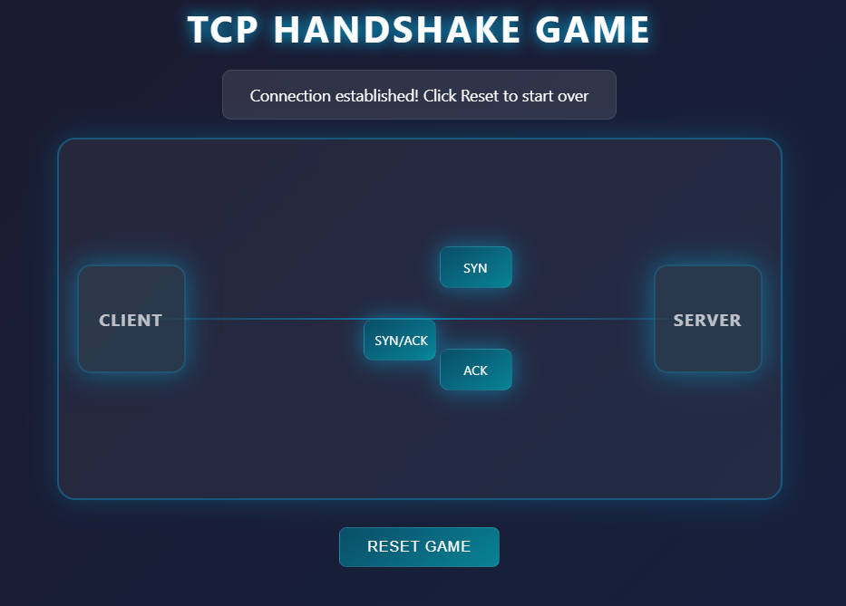
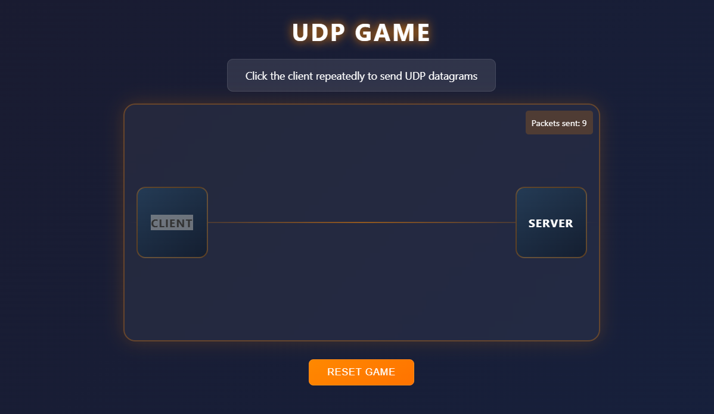

# Networking Basics: Packets, TCP/IP, and Ports

Networking is the foundation of modern communication. It allows devices to exchange data efficiently and securely, enabling everything from browsing the web to video calls. This lab focuses on breaking down complex networking concepts such as packets, frames, TCP/IP, UDP, and ports with some real-world examples.

## Objective
The goal of this lab is to provide a clear understanding of the essential components of data communication in a network. By the end of this lab, you will:

1. Understand what packets and frames are.
2. Learn how TCP/IP works and ensures secure communication.
3. Differentiate between TCP and UDP protocols.
4. Recognize the importance of ports in organizing network communication.

## Packets and Frames

To understand how data travels across a network, imagine sending a letter in the mail. When you mail a letter, it is placed inside an envelope with the recipient’s address written on it. In networking, this letter represents the data you want to send, and the envelope is the packet. A packet contains not only the data but also important information like the sender’s and receiver’s addresses, ensuring it reaches the right destination. Packet are encapsulated with the necessary addressing information like source and destination IP addresses and ports.


Frames are small units of data used for communication within a local network, like your home Wi-Fi or office Ethernet. They contain the data being sent, along with important information like the sender and receiver's MAC addresses. Frames ensure that data travels efficiently between devices within the same network. They work within the Data Link Layer of the OSI model and are essential for local communication. Frames encapsulate packets by adding MAC addressing information.


This process of wrapping data with the necessary addressing information is called encapsulation. It ensures that data, no matter how large, is split into manageable pieces and routed correctly to its destination. This also helps reduce congestion and bottlenecks, making communication faster and more reliable.

## TCP/IP Protocol

TCP/IP, or Transmission Control Protocol/Internet Protocol, is the backbone of the internet. It is a set of rules or protocols that define how data is sent, transmitted, and received across networks. Think of TCP/IP as a translator that ensures devices with different hardware and software can communicate seamlessly.

TCP/IP works through a process called encapsulation, where data is wrapped with headers containing critical information as it moves through four layers: Application, Transport, Internet, and Network Interface. These layers work together to ensure the data reaches its destination correctly.

To understand how TCP/IP works, let's consider a simple example:

#### Pull Docker the Docker Image

```bash
docker pull fazlulkarim105925/tcpgame:latest
```

#### Run the Docker Container

```bash
docker run -d -p 8000:8000 fazlulkarim105925/tcpgame:latest
```

#### Access the Application

- Find the `eth0` ip by using `ifconfig` command in the terminal.

     

- Create a LoadBalancer in Poridhi's Cloud with `eth0` ip and port as `8000`.

- Access the application from any browser with the LoadBalancer's URL.

     

   Follow the instructions to play the TCP Handshake Game. This game demonstrates the TCP handshake process. When click on `Client` button, the client will send `SYN` a message to the server. The server will respond with a `SYN-ACK` message. Then the client will send `ACK` message to the server. This is because TCP is a connection-oriented protocol and requires a response.

### Why is TCP Secure?

One of the key features of TCP is its reliability. Before any data is sent, TCP establishes a connection between the sender and receiver through a process called the **Three-way Handshake**. This ensures both devices are synchronized and ready to communicate. Once the data is sent, TCP checks that all packets have arrived and reassembles them in the correct order. If any packet is missing or corrupted, it is resent. This makes TCP a secure and reliable protocol for tasks like downloading files or sending emails.

### TCP Header

| **Header**                | **Description**                                                                 |
|---------------------------|-------------------------------------------------------------------------------|
| Source and Destination Ports | Indicate the ports used by the sender and receiver.                          |
| Source and Destination IPs   | Specify the IP addresses of the communicating devices.                       |
| Sequence Number             | Ensures that packets are reassembled in the correct order.                    |
| Checksum                    | Helps verify the integrity of the data.                                       |


## User Datagram Protocol (UDP)

UDP, or User Datagram Protocol, is another protocol used for sending data across networks. Unlike TCP, UDP is connectionless, meaning it does not establish a handshake before transmitting data. This makes it much faster but less reliable.

Imagine streaming a live video. If a small amount of data is lost during the stream, it’s better to keep playing the video rather than pausing to recover the lost data. This is where UDP shines. It’s ideal for applications where speed is more important than accuracy, such as online gaming, video streaming, or voice calls.

To understand how UDP works, let's play a simple UDP game.

#### Pull Docker the Docker Image

```bash
docker pull fazlulkarim105925/udpgame:latest
``` 

#### Run the Docker Container

```bash
docker run -d -p 8001:8001 fazlulkarim105925/udpgame:latest
```

#### Access the Application

- Find the `eth0` ip by using `ifconfig` command in the terminal.

     

- Create a LoadBalancer in Poridhi's Cloud with `eth0` ip and port as `8001`.

- Access the application from any browser with the LoadBalancer's URL.

     

  Follow the instructions to play the UDP Game. This game demonstrates the UDP communication process. When click on `Client` button, the client will send a message to the server. But there is no response from the server. This is because UDP is a connectionless protocol and does not require a response. There is no guarantee of delivery of packets.

### Why is UDP Unreliable?

UDP is unreliable because it does not require a response. This means that if a packet is lost, there is no way to know if it was received. This can lead to data loss, especially in real-time applications like video streaming.

### UDP Header

| **Header**                | **Description**                                                                 |
|---------------------------|-------------------------------------------------------------------------------|
| Source Port               | The port from which data is sent.                                              |
| Destination Port          | The port at which data is received.                                            |
| Source and Destination IPs| Indicate the IP addresses of the sender and receiver.                          |
| Data                      | The main content being transmitted.                                            |


## Key Differences Between TCP and UDP

| **Feature**       | **TCP**                                | **UDP**                     |
|-------------------|----------------------------------------|-----------------------------|
| Connection        | Connection-oriented (requires handshake). | Connectionless (no handshake). |
| Reliability       | Ensures reliable data delivery.        | No guarantee of delivery.   |
| Speed             | Slower due to reliability checks.      | Faster, suitable for real-time data. |
| Use Case          | File transfers, emails, web browsing.  | Video streaming, gaming, VoIP. |

## Ports

Ports are essential for organizing and directing data on a network. Think of a port as a specific docking point for data on a device. Each port is assigned a number, ranging from 0 to 65535, and is used to identify specific applications or services.

For example, when you browse a website, your browser communicates with the server using port 80 for HTTP or port 443 for HTTPS. Similarly, when you log into a remote server using SSH, port 22 is used. These standard port numbers ensure that devices and applications know how to interact with each other.

| **Protocol**                 | **Port Number** | **Description**                                          |
|------------------------------|-----------------|--------------------------------------------------------|
| File Transfer Protocol (FTP) | 21              | Transfers files between a client and server.           |
| Secure Shell (SSH)           | 22              | Securely logs into systems via a text-based interface. |
| HyperText Transfer Protocol (HTTP) | 80       | Loads web pages and content.                          |
| HTTPS                        | 443             | Secure version of HTTP using encryption.              |
| Remote Desktop Protocol (RDP)| 3389            | Connects to remote desktops.                          |

Ports help manage network traffic efficiently. Without them, a device would struggle to determine which application should handle incoming data. By using a system of standard ports, networking remains organized and consistent.

## Conclusion

Understanding networking concepts like packets, frames, TCP/IP, UDP, and ports is essential for appreciating how data travels across networks. Packets and frames break down large messages into manageable pieces, while protocols like TCP and UDP define how this data is transmitted. Ports ensure that data reaches the correct application, keeping communication organized. Together, these components form the foundation of reliable and efficient networking, enabling the seamless connectivity we rely on every day.

