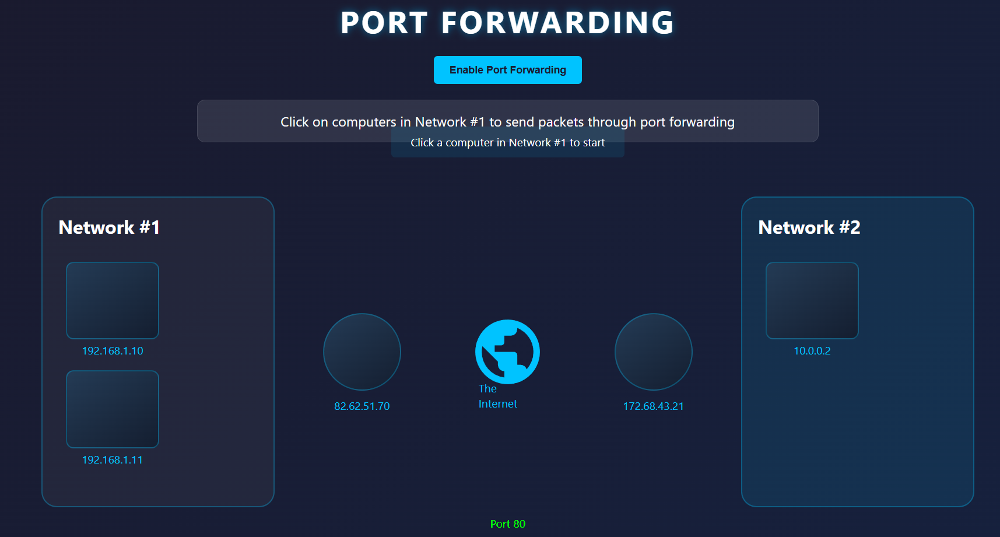
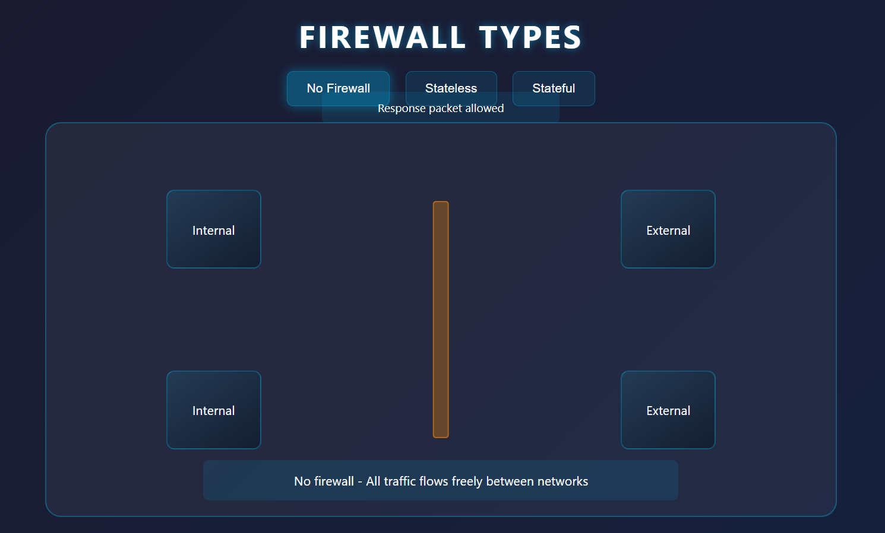
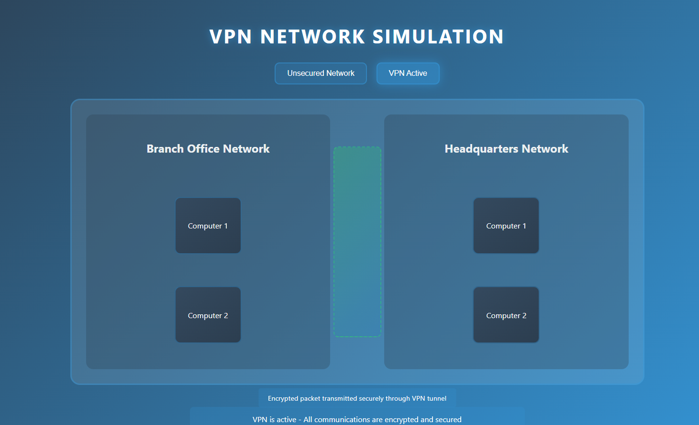

# Advanced Networking Concepts

Networking is an essential part of modern communication systems, ensuring secure and efficient data transfer across devices and networks. Beyond basic data transmission, networking involves advanced techniques and devices that manage and protect information flow. This lab provides an in-depth exploration of key concepts such as `port forwarding`, `firewalls`, `VPNs`, `routers`, and `switches`, offering a comprehensive understanding of how these components work together to build secure and reliable networks. We wll visually see how these components work together to build secure and reliable networks.

## Objective
- Understand the role of port forwarding in enabling external access to internal services.
- Learn about the functionalities and types of firewalls for network security.
- Explore VPNs and their applications in secure remote communication.
- Differentiate between routers and switches and understand their specific roles in a network.
- Gain insights into the integration of advanced networking devices in real-world scenarios.

## Port Forwarding

Port forwarding is a technique that allows external devices to access services hosted on a local network. It involves configuring the network router to direct specific types of traffic to designated devices within the network.

### How It Works
When a device on the Internet tries to access a service hosted on a private network, port forwarding ensures the router forwards the request to the correct internal device. For example, if a web server runs on port 80 at the internal IP address 192.168.1.10, port forwarding maps the router's external IP and port 80 to this internal address, enabling external users to access the web server.

To visualize the port forwarding, we will run a simple application in a docker container.

1. **Pull and Run a Docker Image:**
   ```bash
   docker pull fazlulkarim105925/portforwarding:latest
   ```
2. **Run the Docker Image:**
   ```bash
   docker run -d -p 8000:8000 fazlulkarim105925/portforwarding:latest
   ```

3. **Access the UI:**
   - Find the `eth0` ip by using `ifconfig` command in the terminal.

     

   - Create a LoadBalancer in Poridhi's Cloud with `eth0` ip and port as `8000`.

   - Access the application from any browser with the LoadBalancer's URL.

     

     This application visualizes and manages **port forwarding** configurations. It shows the flow of packets between two networks (e.g., **Network #1** and **Network #2**) through a public IP and specific port (e.g., **Port 80**). It allows users to configure forwarding rules, enabling traffic from one network to be routed securely and efficiently to another.


### Use Cases
- Hosting a website on a private server.
- Enabling remote access to surveillance cameras.
- Supporting online gaming where specific ports need to be open.

## Firewalls

Firewalls are critical for protecting networks by monitoring and controlling traffic based on predefined security rules. They act as a barrier between trusted internal networks and untrusted external sources, such as the Internet. Firewall decides whether to allow or block traffic based on the rules. 

### Types of Firewalls
- **Stateful Firewalls:** Analyze entire connections, tracking states of active connections to make dynamic decisions about allowing or blocking traffic. This firewall type consumes many resources in comparison to stateless firewalls as the decision making is dynamic. For example, a firewall could allow the first parts of a TCP handshake that would later fail. If a connection from a host is bad, it will block the entire device.

- **Stateless Firewalls:** This firewall type uses a static set of rules to determine whether or not individual packets are acceptable or not. For example, a device sending a bad packet will not necessarily mean that the entire device is then blocked. This firewall type is less resource-intensive than stateful firewalls.

### Key Functions
- Block unauthorized access to sensitive resources.
- Allow specific traffic based on source and destination IP addresses and ports.
- Analyze traffic protocols (e.g., TCP, UDP) and enforce strict policies.

### Deployment Options
- **Hardware Firewalls:** Standalone devices designed for large networks.
- **Software Firewalls:** Installed on individual devices or integrated into operating systems.
- **Cloud Firewalls:** Protect cloud-hosted services by monitoring and controlling access.

Let's understand the concept of firewalls by running a simple application.
#### Pull Docker the Docker Image

```bash
docker pull fazlulkarim105925/firewall:latest
```

#### Run the Docker Container

```bash
docker run -d -p 8001:8001 fazlulkarim105925/firewall:latest
```

#### Access the Application

- Find the `eth0` ip by using `ifconfig` command in the terminal.

     

- Create a LoadBalancer in Poridhi's Cloud with `eth0` ip and port as `8001`.

- Access the application from any browser with the LoadBalancer's URL.

   


## Virtual Private Networks (VPNs)
A VPN creates a secure and encrypted tunnel between devices, enabling private communication over public networks. This is particularly valuable for businesses, remote workers, and individuals seeking to protect their privacy online.

### How VPNs Work
VPNs encapsulate data packets and encrypt them before transmission. This process ensures that even if the data is intercepted, it remains unreadable without the encryption key.

### **Applications of VPNs:**

| **Application**             | **Explanation**                                                                                      |
|------------------------------|------------------------------------------------------------------------------------------------------|
| **Corporate Use**            | VPNs allow employees working remotely to securely access their company's private network and files. |
| **Privacy Protection**       | VPNs hide your real IP address and encrypt your online activity, making it hard for hackers to see. |
| **Bypassing Geo-Restrictions** | VPNs let you access websites, videos, or services that are blocked in your country by masking your location. |


**VPN Protocols:**
| **Protocol** | **Description**                                                                 |
|--------------|---------------------------------------------------------------------------------|
| PPTP         | Easy to set up but offers weaker encryption.                                    |
| IPSec        | Strong encryption and widely used for secure tunneling.                        |
| OpenVPN      | Open-source and highly secure, offering strong encryption and reliability.      |
| WireGuard    | Lightweight and faster than traditional VPN protocols with robust encryption.   |

To visualize the concept of VPNs, we will run a simple application.

#### Pull Docker the Docker Image

```bash
docker pull fazlulkarim105925/vpn:latest
```         

#### Run the Docker Container

```bash
docker run -d -p 8002:8002 fazlulkarim105925/vpn:latest
```

#### Access the Application

- Find the `eth0` ip by using `ifconfig` command in the terminal.

     

- Create a LoadBalancer in Poridhi's Cloud with `eth0` ip and port as `8002`.

- Access the application from any browser with the LoadBalancer's URL.

   

## Routers
Routers are essential devices that connect multiple networks and direct data packets between them. They determine the most efficient path for data transmission based on network topology and conditions. Routers are the devices that enables to communicate between networks.


This diagram represents a network communication setup between **Network-A** (192.168.1.0/24) and **Network-B** (10.0.0.0/24) through the Internet. 

- **Routers A and B** manage the traffic between the networks using their respective **routing tables**.
- **PC 192.168.1.10** in Network-A communicates with **PC 10.0.0.10** in Network-B.
- The connection passes through the **ISP Network** via the Internet, ensuring proper data flow between both networks.

This setup demonstrates how devices from different networks communicate using routing and proper IP addressing.

### Key Functions of Routers
- **Routing:** Direct packets across networks using routing tables and protocols (e.g., OSPF, RIP, BGP).
- **Network Segmentation:** Separate networks to improve performance and security.
- **NAT (Network Address Translation):** Map private IP addresses to a public IP, enabling devices to share a single external address.
- **Advanced Features:** Support port forwarding, firewall rules, and Quality of Service (QoS) to prioritize traffic.

### Use Case Example
A router connects a home network to the Internet, assigning private IP addresses to internal devices while using NAT to share a single public IP address.

## Switches
Switches are networking devices that connect multiple devices within the same network and forward data based on MAC addresses. They ensure efficient communication between devices in a local area network (LAN).

### Types of Switches
1. **Layer 2 Switches:** Operate at the Data Link Layer, forwarding frames using MAC addresses.
2. **Layer 3 Switches:** Combine Layer 2 functionality with routing capabilities at the Network Layer, enabling inter-VLAN communication.

### Key Features
- **VLAN Support:** Create isolated networks within the same physical infrastructure.
- **Spanning Tree Protocol (STP):** Prevent network loops by managing redundant paths.
- **Port Mirroring:** Monitor network traffic for troubleshooting or analysis.

### Example
In an office network, a Layer 3 switch connects multiple departments, allowing each to operate in separate VLANs while sharing Internet access and printers.


## Comparison of Routers and Switches

| **Feature**       | **Router**                          | **Switch**                                  |
|-------------------|-------------------------------------|--------------------------------------------|
| Function          | Connects multiple networks.         | Connects multiple devices in a single LAN. |
| OSI Layer         | Operates at Layer 3 (Network).       | Operates at Layer 2 (Data Link).           |
| Routing           | Routes packets using IP addresses.  | Forwards frames using MAC addresses.       |
| Use Case          | Internet connectivity, WAN routing. | Local network communication.               |

## Conclusion
This lab has provided a detailed overview of advanced networking concepts and their real-world applications. From enabling external access through port forwarding to securing data with firewalls and VPNs, each component plays a critical role in modern network management. The functionalities of routers and switches emphasize the structured and efficient operation of networks, ensuring reliable and secure communication across devices and locations. Understanding these concepts equips individuals with the knowledge to design, deploy, and manage complex networking systems effectively.

