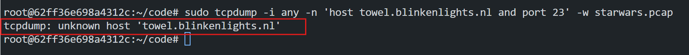
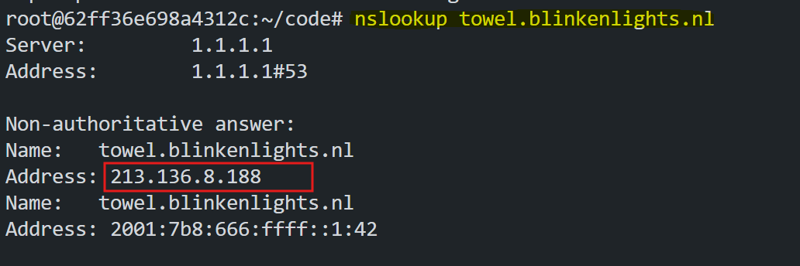
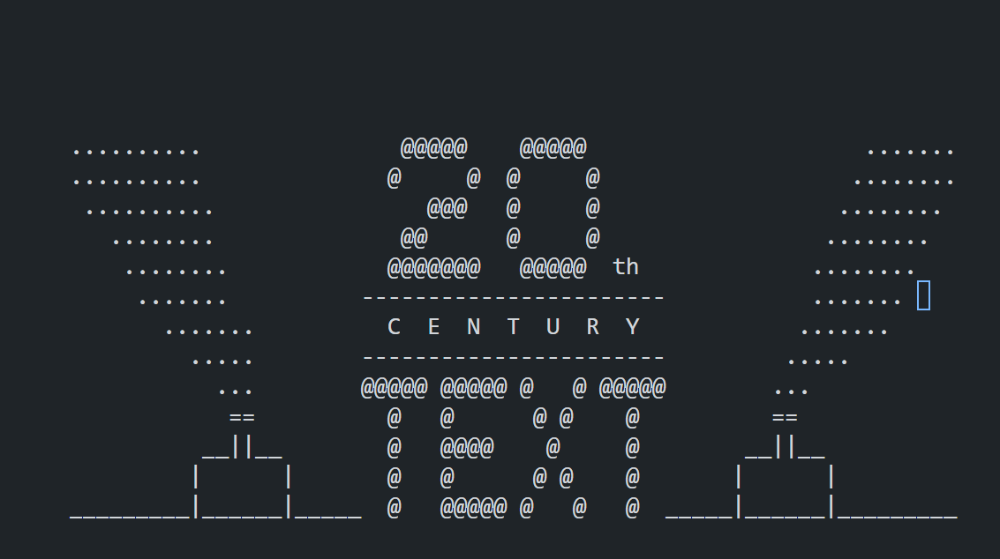

# Capturing and Analyzing Telnet Traffic

This document provides step-by-step instructions to capture, analyze, and filter Telnet traffic using tools such as `tcpdump`, `termshark`. The guide includes commands to capture traffic, resolve hostnames, establish Telnet connections, and analyze the captured data.


## **Prerequisites**
Ensure the following tools are installed on your system:
1. **tcpdump**
2. **termshark**
3. **telnet**

You can install them using your system’s package manager. For example:
```bash
sudo apt update
sudo apt install tcpdump termshark telnet -y
```

## Capturing Traffic with tcpdump
Use `tcpdump` to capture Telnet traffic from the host `towel.blinkenlights.nl` on port 23 and save the output to a `.pcap` file.

>>Note: `towel.blinkenlights.nl` is a public Telnet server that hosts a text-based animation of Star Wars Episode IV: A New Hope. It has been popular among tech enthusiasts as a fun and nostalgic demonstration of Telnet.

```bash
sudo tcpdump -i any -n 'host towel.blinkenlights.nl and port 23' -w starwars.pcap
```

### Expected Error:
If the hostname `towel.blinkenlights.nl` cannot be resolved, the command will return the following error:




### **Resolving the IP Address**
Find the IP address of `towel.blinkenlights.nl` using `nslookup`.

#### Command:
```bash
nslookup towel.blinkenlights.nl
```


Note the resolved IP address (e.g., `213.136.8.188`).

### Capture Traffic Using the IP Address
Run `tcpdump` again using the resolved IP address instead of the hostname.

```bash
sudo tcpdump -i any -n 'host 213.136.8.188 and port 23' -w starwars.pcap
```

This will capture all Telnet traffic to and from the resolved IP address on port 23 and save it to the file `starwars.pcap`.


### Establish a Telnet Connection
Use the `telnet` command to connect to the Telnet server at `towel.blinkenlights.nl` on port 23 on a new `terminal`.

```bash
telnet towel.blinkenlights.nl 23
```


This will establish a Telnet connection and allow you to interact with the server.


### Open the pcap File in termshark
Once the traffic is captured, open the `.pcap` file in `termshark` for analysis.

```bash
termshark -r starwars.pcap
```

`termshark` provides a TUI (Terminal User Interface) for analyzing network traffic.


## **Conclusion**
Following these steps, you can capture and analyze Telnet traffic from a specific host, identify handshake packets, and inspect the traffic using tools like `tcpdump` and `termshark`.