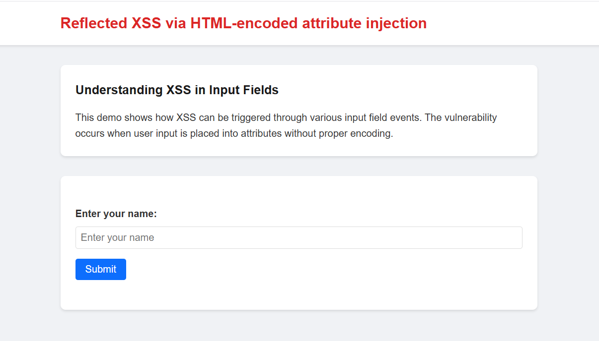
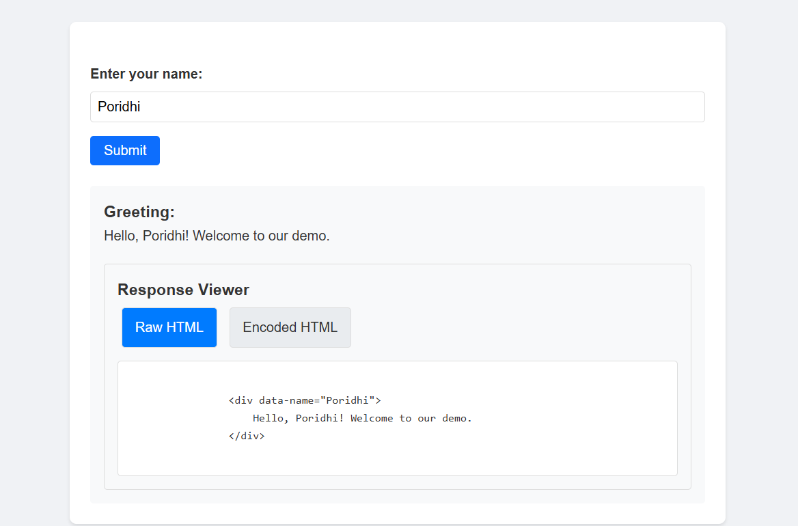
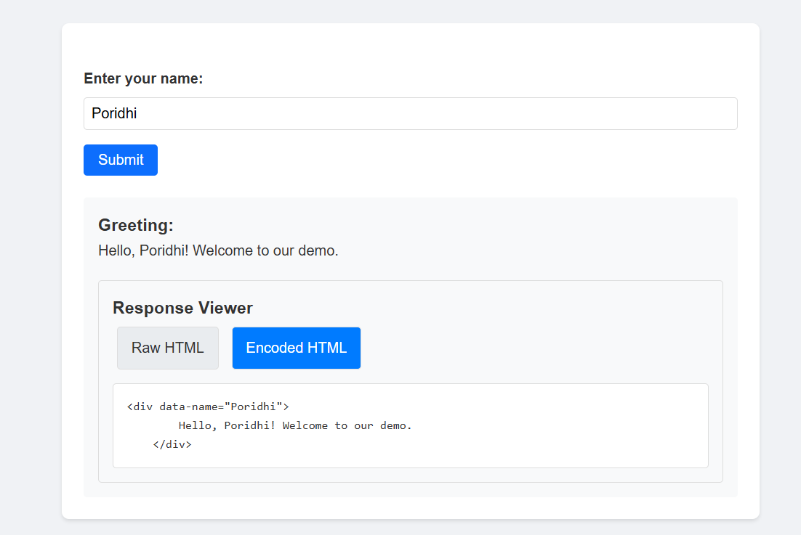
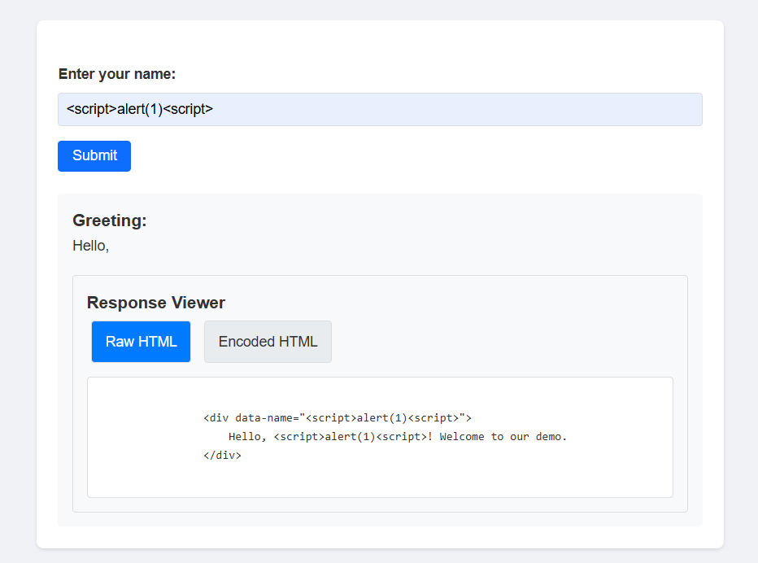
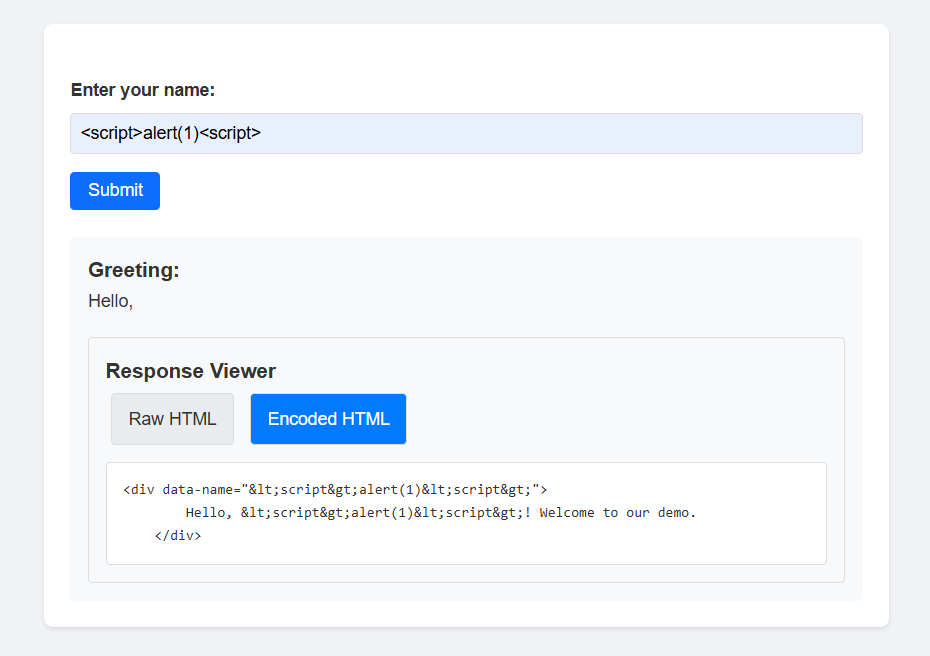
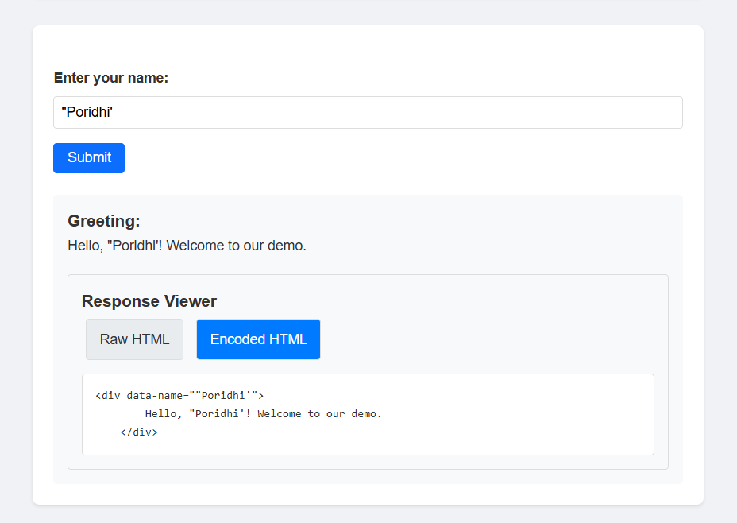
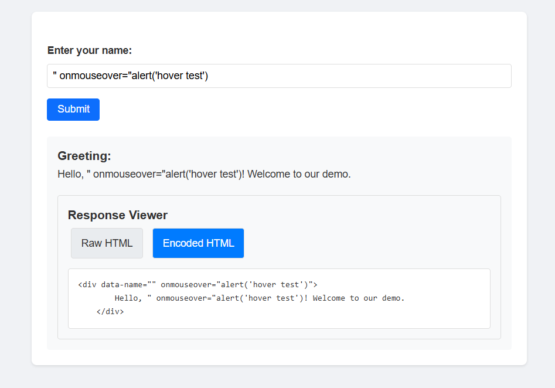
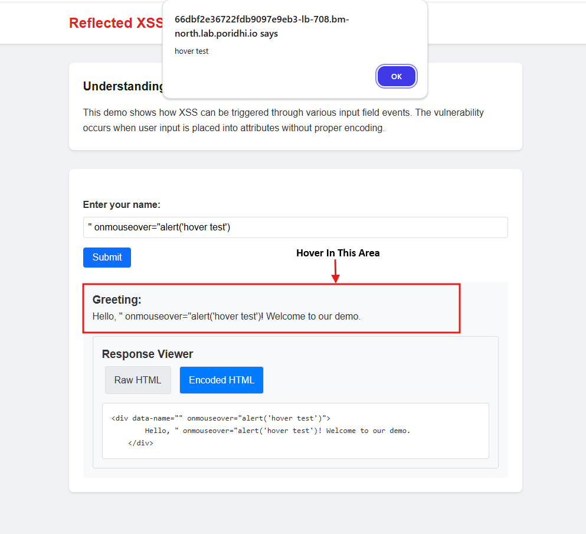

# Reflected XSS via HTML-encoded attribute injection

Cross-site Scripting (XSS) is a prevalent web security vulnerability that allows attackers to inject malicious scripts into web applications. One such variant is **Reflected XSS**, where an attacker injects a payload that gets immediately reflected in the response. Specifically, **Reflected XSS into attributes with angle brackets HTML-encoded** is a technique where user input is embedded into an HTML attribute but is improperly encoded, making it susceptible to exploitation.

## Objective

This documentation aims to:

- Explain **Reflected XSS** within HTML attributes.
- Discuss how **angle brackets (<> characters) are HTML-encoded but injection is still possible**.
- Demonstrate **bypassing mechanisms** to exploit this vulnerability.
- Explore **practical applications** of this attack.
- Provide insights on **how to mitigate this vulnerability**.

## What is Reflected XSS?

Reflected XSS is a type of XSS attack where the malicious script is reflected off the web application back to the victim's browser. This type of XSS is common in web applications that handle user input, such as name fields, search fields, comment sections, and login forms.


An attacker crafts a malicious URL containing a script and tricks a user into clicking it. The vulnerable website reflects the script in its response without proper sanitization, causing the user's browser to execute it, leading to data theft or session hijacking.

## HTML Attribute Injection

Reflected XSS in attributes occurs when **unsanitized user input is placed inside an HTML attribute**, such as:

```html
<input value="USER_INPUT">
```

### Why is This Dangerous?

When a web application takes user input and directly places it inside an HTML attribute **without proper encoding or validation**, an attacker can manipulate the input to inject malicious scripts.

Even if **angle brackets (`< >`) are encoded** (converted to `&lt;` and `&gt;` to prevent direct HTML injection), other special characters such as **quotes (`"` or `'`) and backticks (` ` ` )** might still be allowed. Attackers can use these characters to break out of the attribute and insert harmful JavaScript.

### How It Works

Consider this vulnerable input field:

```html
<input value="John Doe">
```

If an attacker enters:

```
onfocus=alert(1) autofocus=
```

The rendered HTML will be:

```html
<input value="onfocus=alert(1) autofocus=">
```

Now, whenever a user clicks inside the input field, the JavaScript `alert(1)` executes.

## How Attackers Exploit This Vulnerability


Attackers use several techniques to inject malicious scripts, including:

### 1. Breaking Out of Attributes

- Injecting quotes (`"` or `'`) can **break out of the attribute** and execute JavaScript.
- Example payload:
  ```html
  "><script>alert(1)</script>
  ```
- This breaks the `value` attribute and inserts a new `<script>` tag, leading to execution.

### 2. Using Event Handlers

- HTML elements support various **JavaScript event handlers** such as `onmouseover`, `onfocus`, `onerror`, etc.
- Example payload:
  ```html
  " onmouseover="alert(1)"
  ```
- When the user hovers over the input field, `alert(1)` is executed.

### 3. Exploiting Backticks in JavaScript Context

- Some JavaScript templating engines allow input inside **backticks (` ` ` )**.
- Example payload:
  ```html
  <input value=`onfocus=alert(1)` autofocus>
  ```
- This can lead to unintended script execution when the input field is focused.

## How the Bypass Mechanism Works

1. **HTML Attribute Context Misuse**: Attackers **inject closing characters** (`"`, `'`, `` ` ``) to break out of attributes and execute JavaScript.
2. **Event Listeners**: JavaScript executes when events like `onclick`, `onmouseover`, or `onfocus` trigger.
3. **Mismatched Encoding**: If `< >` are encoded but `"` or `'` are not, attackers can **break out of attributes**.
4. **Polyglot Payloads**: Attackers mix different techniques (e.g., encoding tricks) to evade filters and execute JavaScript.

## Practical Application

Now we will vulnerable application to exploit the Reflected XSS via HTML-encoded attribute injection. We will run the application in docker container and then we will exploit the vulnerability.

### **Step 1: Pull the Docker Image**

```bash
docker pull fazlulkarim105925/reflectedxssbracketencoded
```

### **Step 2: Run the Docker Container**

```bash
docker run -d -p 8000:8000 fazlulkarim105925/reflectedxssbracketencoded
```

### **Step 3: Create a Load Balancer in Poridhi's Cloud**

Find the `eth0` IP address with `ifconfig` command.


Create a Load Balancer with the `eth0 IP` address and the port `8000`


### **Step 4: Access the Web Application**

Access the web application with the the provided `URL` by `loadbalancer`



### **Step 5: Exploit the Vulnerability**

Now we will exploit the vulnerability by entering the malicious payload in the name field.

First try with your name (e.g. `Poridhi`). If you click on submit button, you will see a greeting message.

Below the Greeting message, you will see `Response Viwer` Section. Here you can see the `Raw HTML` that was inserted and in `Encoded HTML` you can see the HTML that was encoded.
For example, if you enter `Poridhi` in the name field, you will see the following response:

**For `Raw HTML`:**
```bash
<div data-name="Poridhi">
    <p>Hello, Poridhi! Welcome to our demo.</p>
</div>
```



**For `Encoded HTML`:**
```bash
<div data-name="Poridhi">
    <p>Hello, Poridhi! Welcome to our demo.</p>
</div>
```



As no `<` or `>` are characters are used in the payload, so the payload is not encoded.

Now try with the malicious payload. For example, 
```bash
<script>alert(1)</script>
```

**You will see the following response:**

**For `Raw HTML`:**



**For `Encoded HTML`:**



As `<` and `>` are used in the payload, so the payload is encoded.

**But `No alert` is shown!! Why?**

The reason is that the payload is encoded and the encoded payload is not executed. Browser will discard this as it is not a valid HTML tag.

**So how to exploit this vulnerability?**

If we use the payload with `'` or `"`:

```bash
"Poridhi'
```

You will see the following encoded response



We can see that `'` and `"` are not encoded. So we can use this to exploit the vulnerability.

Now try with this payload:

```bash
" onmouseover="alert('hover test')
```


In this payload, `"` are used to break out of the attribute and `onmouseover` is used to execute the `alert('hover test')` when,



you hovers over the `Greeting area` field.

We can also try out this payload in the `name` field to exploit the vulnerability.

```bash
" onclick="alert('clicked')
```

```bash
" onfocus="alert('focused')
```

## Prevention Techniques


To mitigate Reflected XSS via HTML-encoded attribute injection, we can use the following techniques:    

- Sanitize All User Input Properly (e.g. Encode `"` and `'` in user input.)
- Use Content Security Policy (CSP) to prevent inline JavaScript execution.
- Avoid Inline JavaScript.
- Validate and sanitize all attributes. 
- Implement Input Validation.
- Use a Web Application Firewall (WAF) to block malicious requests.


## Conclusion


Reflected XSS within HTML attributes is a dangerous vulnerability, especially when **only partial encoding is applied**. Attackers can bypass filters using **quotes, event handlers, and backticks**. To prevent such vulnerabilities:

- **Sanitize all user input properly** (encode `"` and `'`).
- **Use Content Security Policy (CSP)** to prevent script execution.
- **Avoid inline JavaScript** and prefer strict attribute handling.


