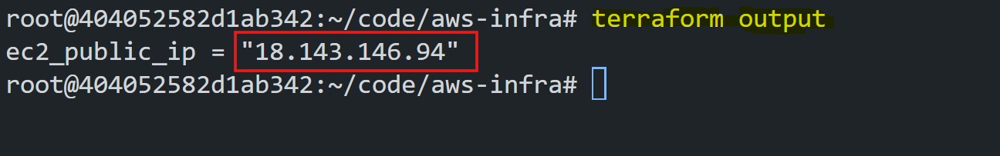
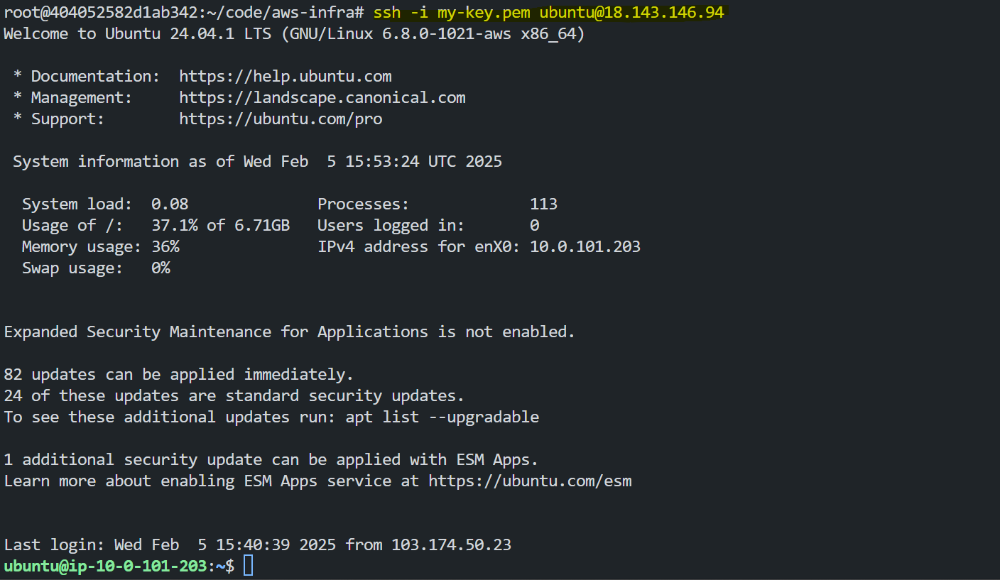
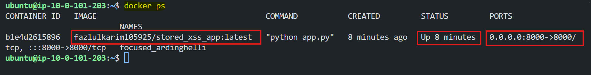
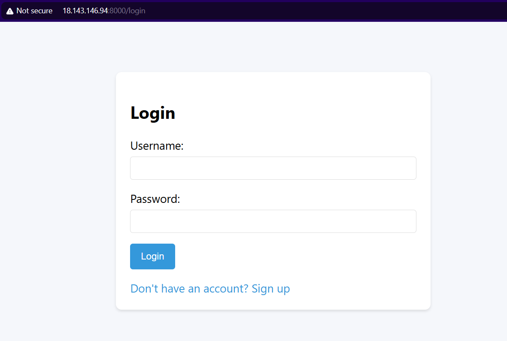
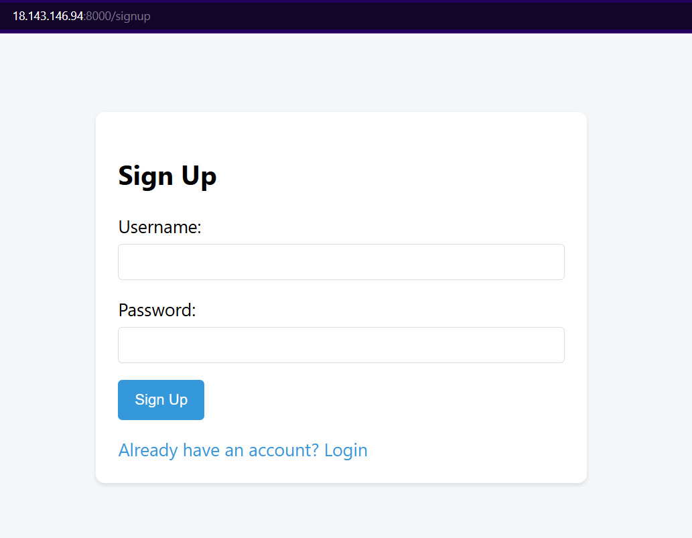
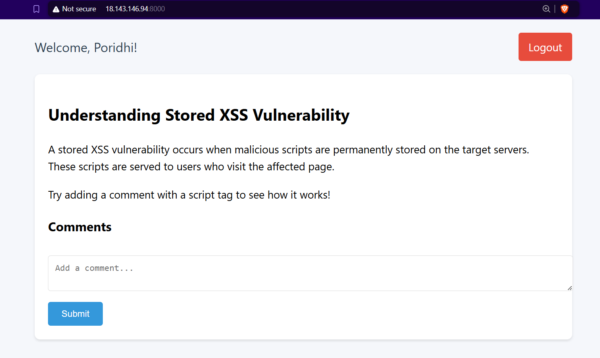
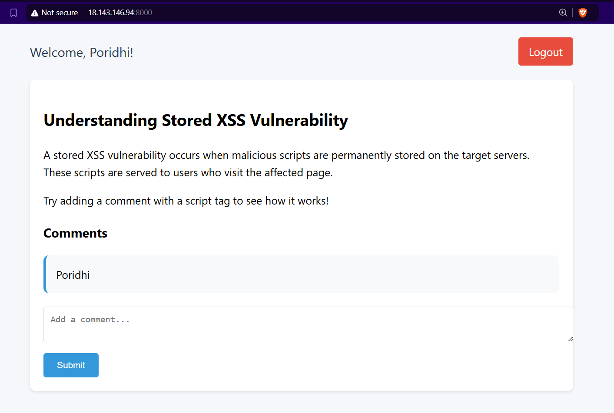
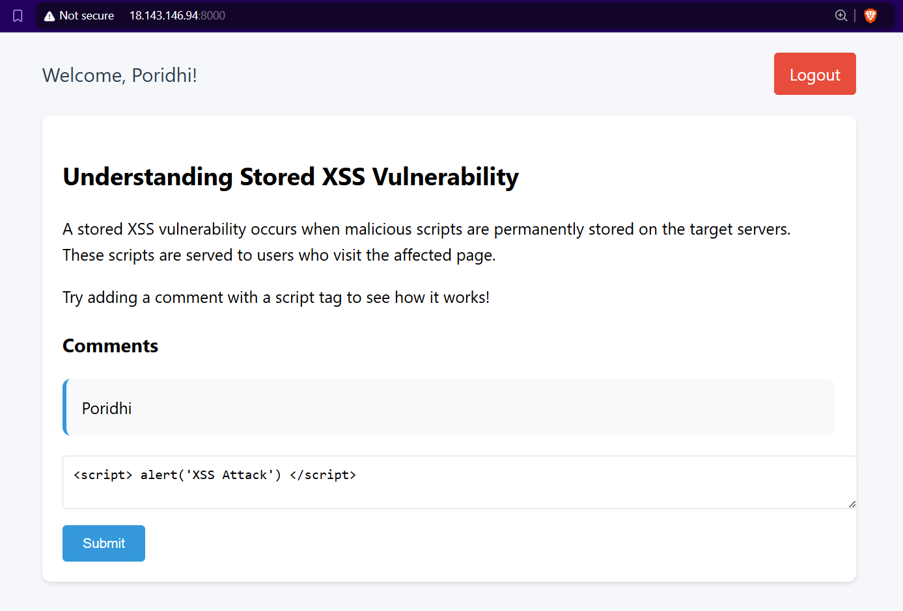
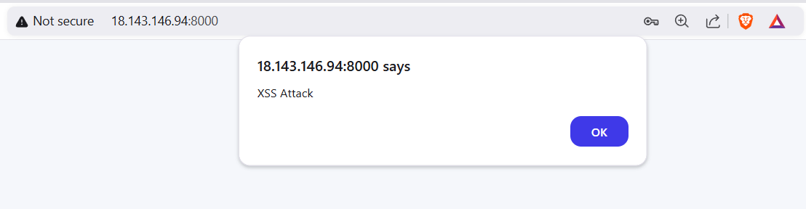

# **Stored XSS Attack**

Web security vulnerabilities can expose users and applications to severe risks, such as data theft, unauthorized access, or service disruption. Among these vulnerabilities, **Cross-Site Scripting (XSS)** is one of the most common and dangerous attacks. We will also perform a `Stored XSS` attack on an application hosted in `AWS` to understand how it works. We also will learn how to prevent `Stored XSS` attacks.
## **Objective**
The objective of this project is to:
1. Simulate a **Stored XSS attack** in a web application in `AWS`.
2. Creating the infrastructure in `AWS` using `Terraform`.
3. Running the vulnerable `Application` in `Docker`.
4. Performing a `Stored XSS` attack on the `Application`.
5. Understanding how malicious scripts can be injected and stored on a server.
6. Identifying ways to detect and mitigate stored XSS vulnerabilities.
7. Demonstrating security best practices to prevent XSS attacks in production systems.

## **What is XSS?**
**Cross-Site Scripting (XSS)** is a web security vulnerability that allows attackers to inject malicious scripts into web pages viewed by other users. When a vulnerable web page fails to properly handle untrusted user input, attackers can execute scripts in the browsers of other users, leading to various security risks.


## **Types of XSS**


### **1. Reflected XSS**  
The malicious script is included in the request URL or form data and is immediately returned by the server without being stored. This type of XSS is often used in phishing attacks.

### **2. Stored XSS (Persistent XSS)**  
The malicious script is permanently stored on the server (e.g., in a database) and is executed whenever another user views the infected page. This type is more dangerous because multiple users can be affected.

### **3. DOM-Based XSS**  
The malicious script manipulates the Document Object Model (DOM) on the client side, without direct server interaction. It occurs when the client-side JavaScript dynamically processes untrusted input.


## **Stored XSS**

### **How Stored XSS Works**


#### **1.Inject Malicious Script**  
An attacker inserts a harmful script (e.g., `<script>alert('XSS Attack');</script>`) through an input field like a comment box. The application doesn’t validate or clean the input, so it accepts and saves the script.

 Example:
   ```html
   <script>alert('XSS Attack!')</script>
   ```


#### **2. Script is Saved in the Database**  
The server stores the attacker’s script in the database along with other data. This script is now part of the application’s records and can be loaded whenever needed.

#### **3. Data with Malicious Script is Loaded**  
When users access the page, the server retrieves and sends the stored data to their browsers. The script is included with the HTML content.

#### **4. Script Executes in the User’s Browser**  
The browser processes and runs the script as part of the webpage. Since the script is treated as trusted, it can perform harmful actions like stealing cookies, modifying the page, or redirecting users.

#### **5. Information is Sent to the Attacker**  
The script may send sensitive information, such as session cookies, to the attacker’s server. This allows the attacker to take control of user accounts or perform further attacks.


## **Hands on with Stored XSS in AWS**

We will run a vunlnerable `Application` in `AWS` and perform a `Stored XSS` attack on it.

To Deploy the `Application` in `AWS` first we need to create the infrastructure. Including `AWS` `VPC`,`Subnet`,`Route Table`,`Internet Gateway`,`Key Pair`,`EC2 Instance`. Creating this infrastructure is lengthy process. So we will use `Terraform` to create the infrastructure.

**Terraform** is an open-source infrastructure as code tool that allows you to define and provision your cloud infrastructure in a declarative manner. It provides a high-level configuration language to describe your infrastructure in a way that is easy to understand and maintain.

## **Create the Infrastructure with `Terraform`**


### **Step 1: Configure aws credentials**

To get `AWS` Credententals open the lab landing page in right bottom corner in `Poridhi`, Click on Generate Credentails for `AWS`.
It will provide necessary credentials to access `AWS` services.

Copy the `Access Key ID` and `Secret Access Key`.

To Configure the `AWS` try the following command:

```bash
aws configure
```
Use the `Access Key ID` and `Secret Access Key` that was copied to configure the `AWS` credentials. For `region` type `ap-southeast-1` and format as `json`.

### **Step 2: Creating Key Pair**

```bash
mkdir aws-infra
cd aws-infra
```
Inside the project folder apply the following command to create the key file

```bash
aws ec2 create-key-pair --key-name my-key --query "KeyMaterial" --output text > my-key.pem
```

Make the key file read only

```bash
chmod 400 my-key.pem
```

### **Step 3: Creating the `main.tf` file**

Create the `main.tf` file in the project folder with the following content:

```bash
provider "aws" {
  region = "ap-southeast-1"
}

# Create VPC
resource "aws_vpc" "my_vpc" {
  cidr_block           = "10.0.0.0/16"
  enable_dns_support   = true
  enable_dns_hostnames = true

  tags = {
    Name = "my-vpc"
  }
}

# Create Public Subnet
resource "aws_subnet" "public_subnet" {
  vpc_id                  = aws_vpc.my_vpc.id
  cidr_block              = "10.0.101.0/24"
  availability_zone       = "ap-southeast-1a"
  map_public_ip_on_launch = true  # Assign public IP automatically

  tags = {
    Name = "public-subnet"
  }
}

# Create Internet Gateway
resource "aws_internet_gateway" "igw" {
  vpc_id = aws_vpc.my_vpc.id

  tags = {
    Name = "my-internet-gateway"
  }
}

# Create Route Table for Public Subnet
resource "aws_route_table" "public_rt" {
  vpc_id = aws_vpc.my_vpc.id

  # Allow all traffic to the internet
  route {
    cidr_block = "0.0.0.0/0"
    gateway_id = aws_internet_gateway.igw.id
  }

  tags = {
    Name = "public-route-table"
  }
}

# Associate Route Table with Public Subnet
resource "aws_route_table_association" "public_association" {
  subnet_id      = aws_subnet.public_subnet.id
  route_table_id = aws_route_table.public_rt.id
}

# Create Security Group for EC2 Instance
resource "aws_security_group" "ec2_sg" {
  vpc_id = aws_vpc.my_vpc.id

  # Allow SSH (Port 22) from anywhere
  ingress {
    from_port   = 22
    to_port     = 22
    protocol    = "tcp"
    cidr_blocks = ["0.0.0.0/0"]
  }

  # Allow HTTP (Port 80) from anywhere
  ingress {
    from_port   = 80
    to_port     = 80
    protocol    = "tcp"
    cidr_blocks = ["0.0.0.0/0"]
  }

  # Allow HTTPS (Port 443) from anywhere
  ingress {
    from_port   = 443
    to_port     = 443
    protocol    = "tcp"
    cidr_blocks = ["0.0.0.0/0"]
  }

  # Allow Application Traffic (Port 8000)
  ingress {
    from_port   = 8000
    to_port     = 8000
    protocol    = "tcp"
    cidr_blocks = ["0.0.0.0/0"]  # Open to all (Modify for specific IPs)
  }

  # Allow all outbound traffic
  egress {
    from_port   = 0
    to_port     = 0
    protocol    = "-1"
    cidr_blocks = ["0.0.0.0/0"]
  }

  tags = {
    Name = "ec2-security-group"
  }
}

# Create EC2 Instance in Public Subnet
resource "aws_instance" "my_instance" {
  ami                    = "ami-0672fd5b9210aa093"
  instance_type          = "t2.micro"
  subnet_id              = aws_subnet.public_subnet.id
  vpc_security_group_ids = [aws_security_group.ec2_sg.id]
  
  associate_public_ip_address = true  # Assign Public IP
  key_name                    = "my-key"  # Use the key pair

  tags = {
    Name = "my-public-ec2"
  }
}

# Output the Public IP of the EC2 instance
output "ec2_public_ip" {
  description = "The public IP of the EC2 instance"
  value       = aws_instance.my_instance.public_ip
}
```

This state file will create the infrastructure and output the public IP of the EC2 instance.

### **Step 4: Apply the Terraform State File**

```bash
terraform init
```

This command will initialize the terraform project.

```bash
terraform apply
```

This command will apply the state file and create the infrastructure. While applying the state file, it will ask for `yes` to apply the changes.

After the state file is applied, it will output the public IP of the EC2 instance.

### **Step 5: SSH into the EC2 Instance**

Get the public IP of the EC2 instance from the output of the `terraform output` command.

```bash
terraform output
```


copy the `Public IP` of the `ec2 instance`.

now using the public ip `ssh` into the `ec2-instance`

```bash
ssh -i my-key.pem ubuntu@<public-ip>
```
If you ssh for first time, it will ask for `yes` to continue.

Now you are successfully ssh into the `ec2-instance`.



### **Step 6: Install Docker on the EC2 Instance**

Inside the `ec2-instance` create a `install.sh` script for installing `docker`

```bash
nano install.sh
```
Now paste the following script

```bash
#!/bin/bash
sudo apt update -y && sudo apt upgrade -y
# Install dependencies
sudo apt install -y apt-transport-https ca-certificates curl software-properties-common
# Add Docker’s GPG key and repository
curl -fsSL https://download.docker.com/linux/ubuntu/gpg | sudo gpg --dearmor -o /usr/share/keyrings/docker-archive-keyring.gpg
echo "deb [arch=amd64 signed-by=/usr/share/keyrings/docker-archive-keyring.gpg] https://download.docker.com/linux/ubuntu $(lsb_release -cs) stable" | sudo tee /etc/apt/sources.list.d/docker.list > /dev/null
# Update package list and install Docker
sudo apt update -y && sudo apt install -y docker-ce
sudo systemctl start docker && sudo systemctl enable docker
sudo usermod -aG docker $USER
newgrp docker
```

To save the script and exit the nano editor, press `Ctrl + O` ,`Enter` and `Ctrl + X`.

Now make the script executable

```bash
chmod +x install.sh
```

Now run the script

```bash
./install.sh
```

Now you have successfully installed `docker` on the `ec2-instance`.

You can verify the docker installation by running the following command

```bash
docker --version
```
If docker is installed successfully, it will output the version of the docker.


## **Run the Application in Docker**

### **Step 1: Pull the Application from Docker Hub**

```bash
docker pull fazlulkarim105925/stored_xss_app:latest
```

### **Step 2: Run the Docker Container**

```bash
docker run -d -p 8000:8000 fazlulkarim105925/stored_xss_app:latest
```

### **Step 3: Check the Container Status**

By using the following command you can check the status of the container

```bash
docker ps
```


### **Step 4: Access the Application**

Now you can access the application by going to the `http://<public-ip>:8000` in the browser.




## **Exploring the Application**

If you first time open the application, you need to create a new user in `Sign up` page.




After creating a new user, you can login to the application. After login, you will see the `Home` page.



This is a simple application where you can add a comment to the blog. Try with `your comment` in `Comment` field. The comment will be stored in the database and will be displayed on the page.



Now, if you enter a comment with malicious script, like 

```bash
<script>alert('XSS Attack!')</script>
```



The script will be executed in the browser and will show an alert box.



The interesting part is that, now if open another tab on the browser and open the application with the `<PublicIP>:8000` you will see the alert box. Every time you open the application, the alert box will be shown. This is because the script is stored in the database and is executed whenever the page is loaded.

### **Why Stored XSS is Dangerous**
1. **Persistence**  
   Since the script is stored on the server, it can affect all users who visit the page until the input is removed.

2. **Multi-User Impact**  
   Stored XSS can compromise multiple users, leading to large-scale attacks on high-traffic websites.

3. **Data Theft and Account Takeover**  
   Attackers can steal sensitive data such as session cookies, allowing them to impersonate victims.

### **How to Prevent Stored XSS**

To prevent stored XSS attacks, implement the following security measures:


#### **1. User Input**
The process starts when a user submits data, such as a comment or form input, through the web application interface. This input could potentially contain harmful scripts.

#### **2. Check the Input**
The application should validate and sanitize all user input before processing it. This involves replacing special characters like `<`, `>`, and `&` with safe alternatives (`&lt;`, `&gt;`, `&amp;`).

   **Example:**  
   Input: `<script>alert('XSS');</script>`  
   After sanitization: `&lt;script&gt;alert('XSS');&lt;/script&gt;`

#### **3. Is it Safe?**
If the input does not meet security criteria, the application should block it entirely. This helps prevent potentially malicious scripts from entering the system.

#### **4. Save to Database**
Once the input is sanitized and confirmed to be safe, it is saved to the database. It is crucial to store the exact checked input, ensuring no untrusted or unsanitized content is retained.

#### **5. Before Displaying on Website**
When loading the stored input for display on a webpage, the application should escape special characters again to prevent script execution.

For example, characters like `<`, `>`, and `&` are converted to their HTML-safe representations to prevent browsers from interpreting them as executable code.

#### **6. Add Extra Safety Rules**
A **Content Security Policy (CSP)** can be applied to restrict which scripts the browser is allowed to execute. This instructs the browser to only run trusted code from approved sources, adding an additional layer of protection.


#### **7. Show on Website**
Finally, the sanitized and escaped data is displayed safely on the website. Even if a user tries to inject malicious content, it will appear as plain text rather than being executed as a script.

By following these steps, web applications can effectively prevent stored XSS attacks, protecting users and their data from exploitation.

### **Stored XSS Vulnerable Code**

### **Vulnerable Code (Node.js Example)**

```javascript
app.get('/comments', (req, res) => {
  let html = '<ul>';
  for (const comment of comments) {
    html += `<li>${comment}</li>`;
  }
  html += '</ul>';
  res.send(html);
});
```

#### **Why This is Vulnerable**
- The code reads and inserts user-generated comments directly into the HTML response without any sanitization.
- If a malicious comment like `<script>alert('XSS')</script>` is saved, the script will execute in the browser when another user views the page.


### **Fixed Code**

```javascript
const sanitizeHtml = require('sanitize-html');

app.get('/comments', (req, res) => {
  let html = '<ul>';
  for (const comment of comments) {
    const sanitizedComment = sanitizeHtml(comment);  // Sanitize each comment
    html += `<li>${sanitizedComment}</li>`;
  }
  html += '</ul>';
  res.send(html);
});
```

#### **Explanation**
- The `sanitizeHtml()` function removes any dangerous HTML elements and attributes.
- You can customize the sanitizer to allow safe formatting tags (e.g., `<b>`, `<i>`) while removing unsafe ones (e.g., `<script>`, `onload`).

### **Vulnerable Code (Python Flask Example)**

```python
@app.route('/comment', methods=['POST'])
def add_comment():
    comment_content = request.form['comment']  # User input is saved directly
    comment = Comment(content=comment_content)
    db.session.add(comment)
    db.session.commit()
    return 'Comment added!'

@app.route('/comments')
def show_comments():
    comments = Comment.query.all()
    return render_template_string(''.join(['<div>' + c.content + '</div>' for c in comments]))  # Raw HTML output
```

#### **Why This is Vulnerable**
- The user's comment is stored and rendered without sanitization or escaping.
- If a malicious script (e.g., `<script>alert('XSS')</script>`) is submitted, it will execute in the browser when displayed.

### **Fixed Code**

```python

@app.route('/comment', methods=['POST'])
def add_comment():
    comment_content = request.form['comment']
    comment = Comment(content=comment_content)
    db.session.add(comment)
    db.session.commit()
    return 'Comment added!'

@app.route('/comments')
def show_comments():
    comments = Comment.query.all()
    sanitized_comments = [escape(c.content) for c in comments]  # Escape special characters
    return render_template_string(''.join(['<div>' + comment + '</div>' for comment in sanitized_comments]))
```

#### **Explanation**
- The `escape()` function ensures that special characters like `<`, `>`, `&`, `'`, and `"` are converted to safe HTML entities (`&lt;`, `&gt;`, `&amp;`, etc.).
- Even if a user submits malicious input, it will not execute because the script tags are displayed as plain text.

## **Conclusion**

This lab demonstrated how stored XSS attacks exploit the lack of input sanitization and output escaping in web applications. By injecting malicious scripts, attackers can compromise users' data, hijack sessions, and perform unauthorized actions. We explored both vulnerable and secure code implementations, learning how sanitization, escaping, and applying Content Security Policies (CSP) can prevent these attacks. Properly handling user input is essential to safeguarding applications from XSS and ensuring user security.
