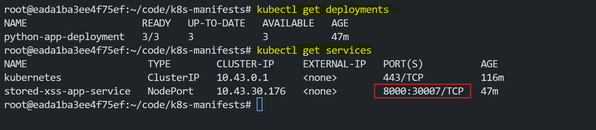
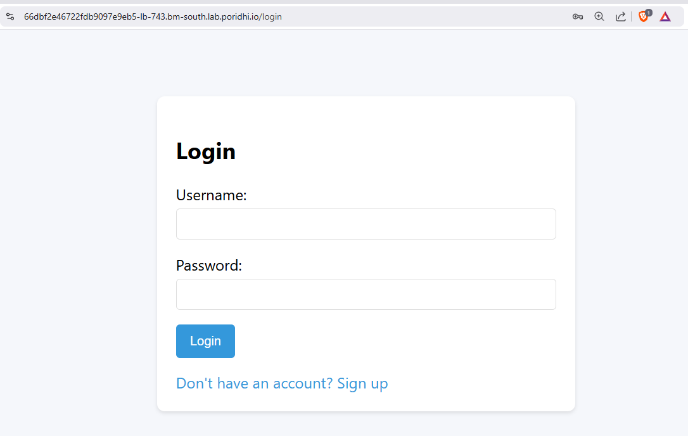
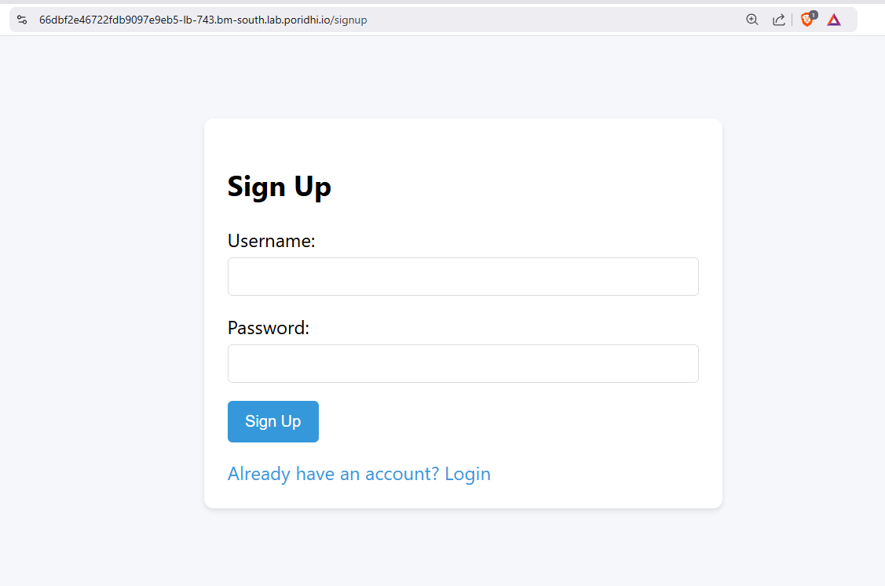
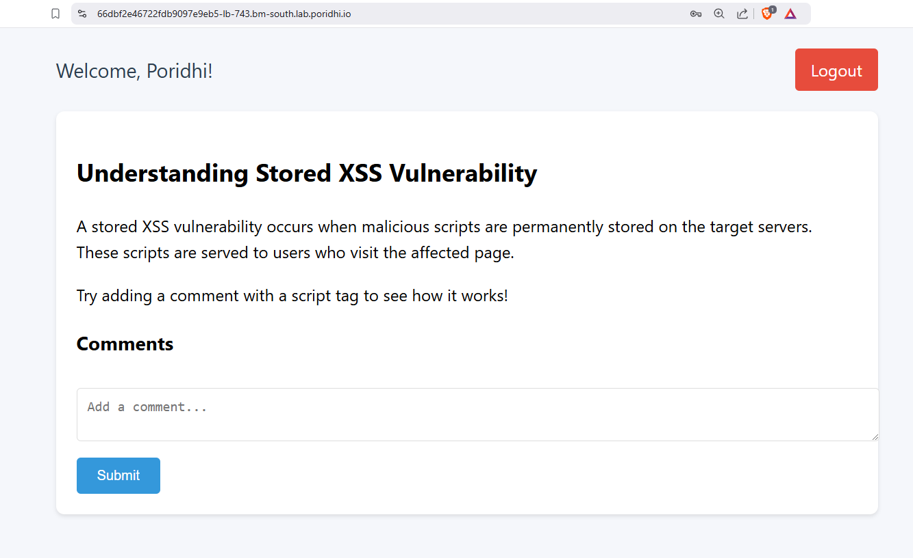
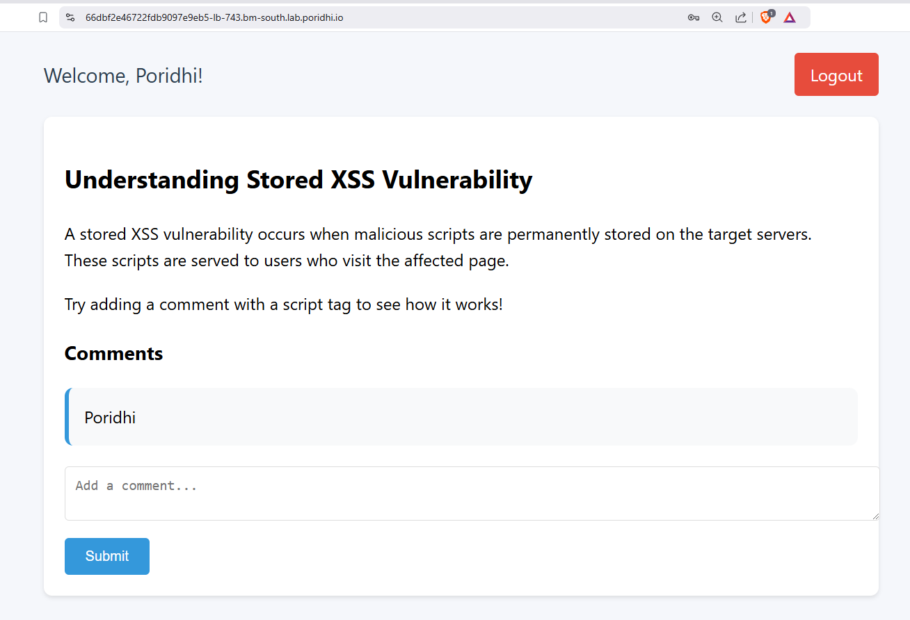
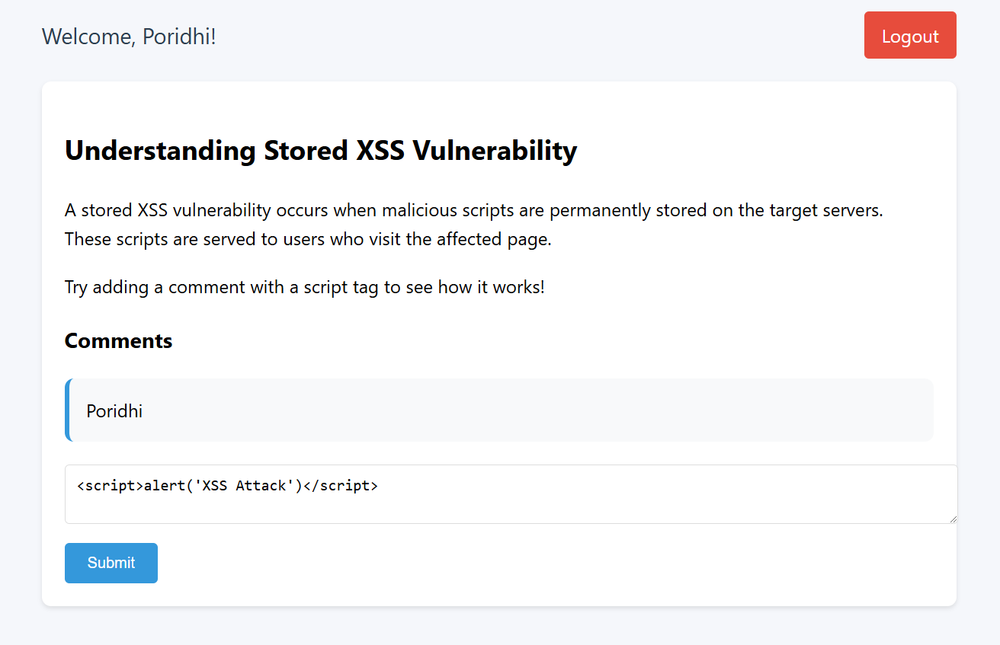
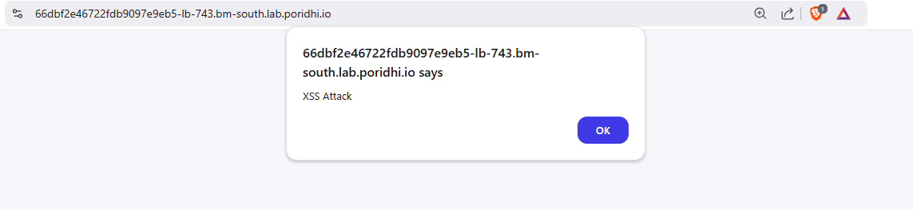

# **Stored XSS Attack**

Web security vulnerabilities can expose users and applications to severe risks, such as data theft, unauthorized access, or service disruption. Among these vulnerabilities, **Cross-Site Scripting (XSS)** is one of the most common and dangerous attacks. This documentation explores **Stored XSS**, including how it works and its impact and how to prevent it.
## **Objective**
The objective of this project is to:
1. Simulate a **Stored XSS attack** in a web application.
2. Understand how malicious scripts can be injected and stored on a server.
3. Identify ways to detect and mitigate stored XSS vulnerabilities.
4. Demonstrate security best practices to prevent XSS attacks in production systems.

## **What is XSS?**
**Cross-Site Scripting (XSS)** is a web security vulnerability that allows attackers to inject malicious scripts into web pages viewed by other users. When a vulnerable web page fails to properly handle untrusted user input, attackers can execute scripts in the browsers of other users, leading to various security risks.


## **Types of XSS**


### **1. Reflected XSS**  
The malicious script is included in the request URL or form data and is immediately returned by the server without being stored. This type of XSS is often used in phishing attacks.

### **2. Stored XSS (Persistent XSS)**  
The malicious script is permanently stored on the server (e.g., in a database) and is executed whenever another user views the infected page. This type is more dangerous because multiple users can be affected.

### **3. DOM-Based XSS**  
The malicious script manipulates the Document Object Model (DOM) on the client side, without direct server interaction. It occurs when the client-side JavaScript dynamically processes untrusted input.


## **Stored XSS**

### **How Stored XSS Works**


#### **1.Inject Malicious Script**  
An attacker inserts a harmful script (e.g., `<script>alert('XSS Attack');</script>`) through an input field like a comment box. The application doesn’t validate or clean the input, so it accepts and saves the script.

 Example:
   ```html
   <script>alert('XSS Attack!')</script>
   ```


#### **2. Script is Saved in the Database**  
The server stores the attacker’s script in the database along with other data. This script is now part of the application’s records and can be loaded whenever needed.

#### **3. Data with Malicious Script is Loaded**  
When users access the page, the server retrieves and sends the stored data to their browsers. The script is included with the HTML content.

#### **4. Script Executes in the User’s Browser**  
The browser processes and runs the script as part of the webpage. Since the script is treated as trusted, it can perform harmful actions like stealing cookies, modifying the page, or redirecting users.

#### **5. Information is Sent to the Attacker**  
The script may send sensitive information, such as session cookies, to the attacker’s server. This allows the attacker to take control of user accounts or perform further attacks.


## **Hands on with Stored XSS**


Now we will see a web application which is vulnerable to Stored XSS. We will host the application in `Poridhi's` Kubernetes Cluster. 


We will deploy the application in 3 kubernetes pods and expose it through a `NodePort` service. We will use a `persistent volume` to store the database file. A `PersistentVolumeClaim` will request the storage from the `persistent volume`.

### **Step 1: Create the k8s-manifests**
```
/k8s-manifests
│   ├── deploy.yml 
│   ├── svc.yml         
│   ├── pv.yml          
│   ├── pvc.yml           
```

Create this files with this command
```bash
mkdir k8s-manifests
touch deploy.yml svc.yml pv.yml pvc.yml
```

Now add the following content to the files.

**deploy.yml**

```yaml
apiVersion: apps/v1
kind: Deployment
metadata:
  name: python-app-deployment
spec:
  replicas: 3
  selector:
    matchLabels:
      app: python-app
  template:
    metadata:
      labels:
        app: python-app
    spec:
      containers:
      - name: python-app-container
        image: fazlulkarim105925/stored_xss_app:latest
        ports:
        - containerPort: 8000
        volumeMounts:
        - name: sqlite-storage
          mountPath: /app/xss_demo.db
          subPath: xss_demo.db
      volumes:
      - name: sqlite-storage
        persistentVolumeClaim:
          claimName: sqlite-pvc
``` 
This deployment will create 3 replicas of the application and will mount the `sqlite-pvc` to the container.

**svc.yml**

```yaml
apiVersion: v1
kind: Service
metadata:
  name: stored-xss-app-service
spec:
  type: NodePort
  selector:
    app: python-app 
  ports:
  - protocol: TCP
    port: 8000      
    targetPort: 8000 
    nodePort: 30007  
```

This service will expose the application on the `NodePort` `30007`.

**pv.yml**

```yaml
apiVersion: v1
kind: PersistentVolume
metadata:
  name: sqlite-pv
spec:
  capacity:
    storage: 1Gi 
  accessModes:
    - ReadWriteOnce  
  hostPath:
    path: /mnt/data  
```

This persistent volume will be mounted to the container and will store the database file.

**pvc.yml**

```yaml
apiVersion: v1
kind: PersistentVolumeClaim
metadata:
  name: sqlite-pvc
spec:
  accessModes:
    - ReadWriteOnce
  resources:
    requests:
      storage: 1Gi 
```

This persistent volume claim will request a `1Gi` storage.

### **Step 2: Apply the k8s-manifests**

```bash
cd k8s-manifests
kubectl apply -f pv.yml
kubectl apply -f pvc.yml
kubectl apply -f deploy.yml
kubectl apply -f svc.yml
```

Verify the deployment and service

```bash
kubectl get deployments
kubectl get services
```
Copy the `NodePort` (e.g `30007`) of the `stored-xss-app-service`




### **Step 3: Exposing the application with Poridhi's Loadbalancer**

Find the `eth0` ip address by running the following command.

```bash
ifconfig
```


Create a `Laodbalancer` in `Poridhi's Cloud` with `eth0` ip and `NodePort` (e.g `30007`).

With `Loadbalancer` `URL` you can open the application from any browser.



### **Step 4: Exploring the application**

If you first time open the application, you need to create a new user in `Sign up` page.



After creating a new user, you can login to the application. After login, you will see the `Home` page.



This is a simple application where you can add a comment to the blog. Try with `your comment` in `Comment` field. The comment will be stored in the database and will be displayed on the page.



Now, if you enter a comment with malicious script, like 

```bash
<script>alert('XSS Attack!')</script>
```



The script will be executed in the browser and will show an alert box.



The interesting part is that, now if open another tab on the browser and open the application with the `loadbalancer URL` you will see the alert box. Every time you open the application, the alert box will be shown. This is because the script is stored in the database and is executed whenever the page is loaded.

### **Why Stored XSS is Dangerous**
1. **Persistence**  
   Since the script is stored on the server, it can affect all users who visit the page until the input is removed.

2. **Multi-User Impact**  
   Stored XSS can compromise multiple users, leading to large-scale attacks on high-traffic websites.

3. **Data Theft and Account Takeover**  
   Attackers can steal sensitive data such as session cookies, allowing them to impersonate victims.

### **How to Prevent Stored XSS**

To prevent stored XSS attacks, implement the following security measures:


#### **1. User Input**
The process starts when a user submits data, such as a comment or form input, through the web application interface. This input could potentially contain harmful scripts.

#### **2. Check the Input**
The application should validate and sanitize all user input before processing it. This involves replacing special characters like `<`, `>`, and `&` with safe alternatives (`&lt;`, `&gt;`, `&amp;`).

   **Example:**  
   Input: `<script>alert('XSS');</script>`  
   After sanitization: `&lt;script&gt;alert('XSS');&lt;/script&gt;`

#### **3. Is it Safe?**
If the input does not meet security criteria, the application should block it entirely. This helps prevent potentially malicious scripts from entering the system.

#### **4. Save to Database**
Once the input is sanitized and confirmed to be safe, it is saved to the database. It is crucial to store the exact checked input, ensuring no untrusted or unsanitized content is retained.

#### **5. Before Displaying on Website**
When loading the stored input for display on a webpage, the application should escape special characters again to prevent script execution.

For example, characters like `<`, `>`, and `&` are converted to their HTML-safe representations to prevent browsers from interpreting them as executable code.

#### **6. Add Extra Safety Rules**
A **Content Security Policy (CSP)** can be applied to restrict which scripts the browser is allowed to execute. This instructs the browser to only run trusted code from approved sources, adding an additional layer of protection.


#### **7. Show on Website**
Finally, the sanitized and escaped data is displayed safely on the website. Even if a user tries to inject malicious content, it will appear as plain text rather than being executed as a script.

By following these steps, web applications can effectively prevent stored XSS attacks, protecting users and their data from exploitation.

### **Stored XSS Vulnerable Code**

### **Vulnerable Code (Node.js Example)**

```javascript
app.get('/comments', (req, res) => {
  let html = '<ul>';
  for (const comment of comments) {
    html += `<li>${comment}</li>`;
  }
  html += '</ul>';
  res.send(html);
});
```

#### **Why This is Vulnerable**
- The code reads and inserts user-generated comments directly into the HTML response without any sanitization.
- If a malicious comment like `<script>alert('XSS')</script>` is saved, the script will execute in the browser when another user views the page.


### **Fixed Code**

```javascript
const sanitizeHtml = require('sanitize-html');

app.get('/comments', (req, res) => {
  let html = '<ul>';
  for (const comment of comments) {
    const sanitizedComment = sanitizeHtml(comment);  // Sanitize each comment
    html += `<li>${sanitizedComment}</li>`;
  }
  html += '</ul>';
  res.send(html);
});
```

#### **Explanation**
- The `sanitizeHtml()` function removes any dangerous HTML elements and attributes.
- You can customize the sanitizer to allow safe formatting tags (e.g., `<b>`, `<i>`) while removing unsafe ones (e.g., `<script>`, `onload`).

### **Vulnerable Code (Python Flask Example)**

```python
@app.route('/comment', methods=['POST'])
def add_comment():
    comment_content = request.form['comment']  # User input is saved directly
    comment = Comment(content=comment_content)
    db.session.add(comment)
    db.session.commit()
    return 'Comment added!'

@app.route('/comments')
def show_comments():
    comments = Comment.query.all()
    return render_template_string(''.join(['<div>' + c.content + '</div>' for c in comments]))  # Raw HTML output
```

#### **Why This is Vulnerable**
- The user's comment is stored and rendered without sanitization or escaping.
- If a malicious script (e.g., `<script>alert('XSS')</script>`) is submitted, it will execute in the browser when displayed.

### **Fixed Code**

```python

@app.route('/comment', methods=['POST'])
def add_comment():
    comment_content = request.form['comment']
    comment = Comment(content=comment_content)
    db.session.add(comment)
    db.session.commit()
    return 'Comment added!'

@app.route('/comments')
def show_comments():
    comments = Comment.query.all()
    sanitized_comments = [escape(c.content) for c in comments]  # Escape special characters
    return render_template_string(''.join(['<div>' + comment + '</div>' for comment in sanitized_comments]))
```

#### **Explanation**
- The `escape()` function ensures that special characters like `<`, `>`, `&`, `'`, and `"` are converted to safe HTML entities (`&lt;`, `&gt;`, `&amp;`, etc.).
- Even if a user submits malicious input, it will not execute because the script tags are displayed as plain text.

## **Conclusion**

This lab demonstrated how stored XSS attacks exploit the lack of input sanitization and output escaping in web applications. By injecting malicious scripts, attackers can compromise users' data, hijack sessions, and perform unauthorized actions. We explored both vulnerable and secure code implementations, learning how sanitization, escaping, and applying Content Security Policies (CSP) can prevent these attacks. Properly handling user input is essential to safeguarding applications from XSS and ensuring user security.
