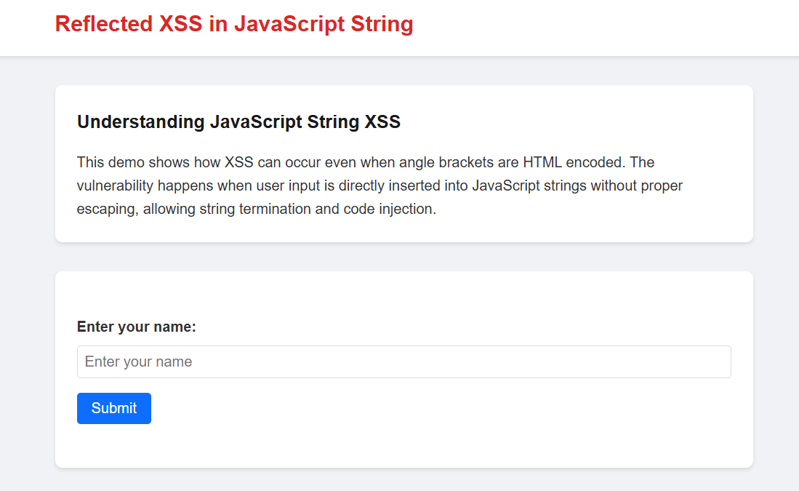
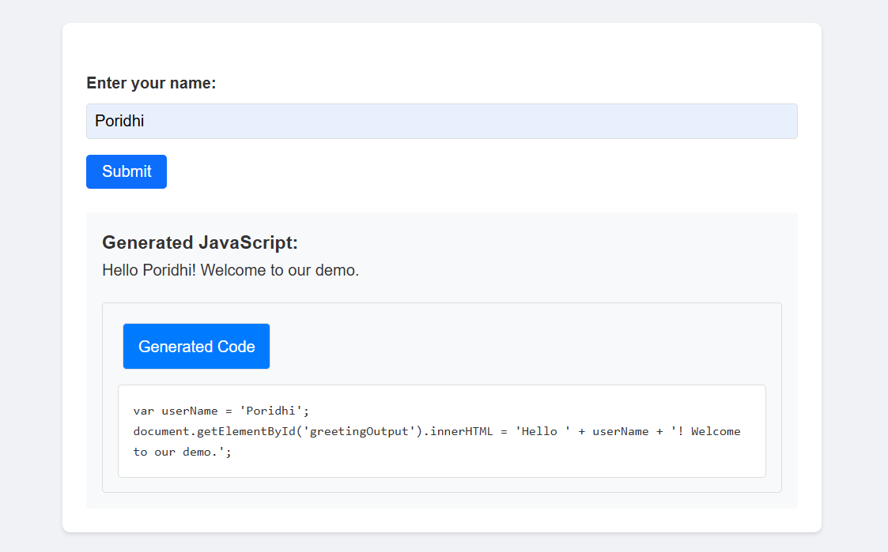
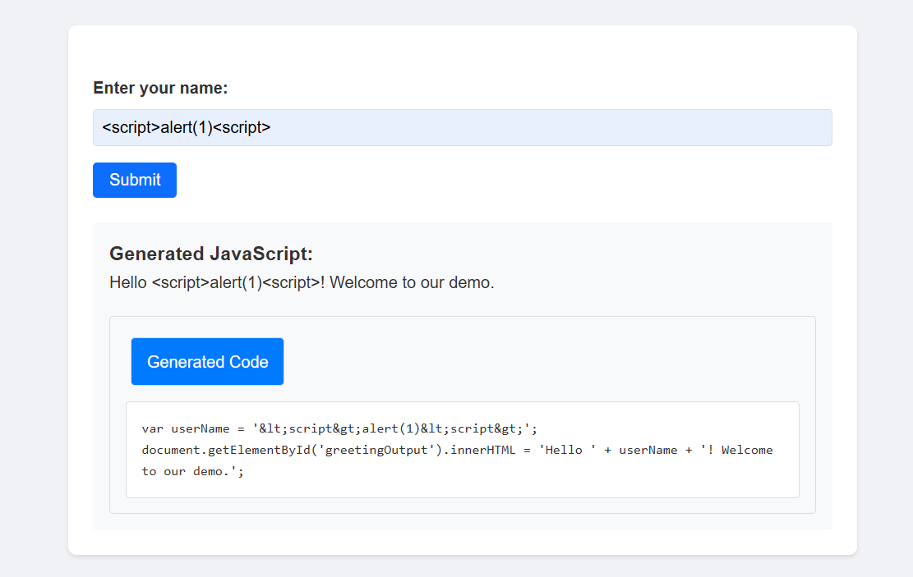
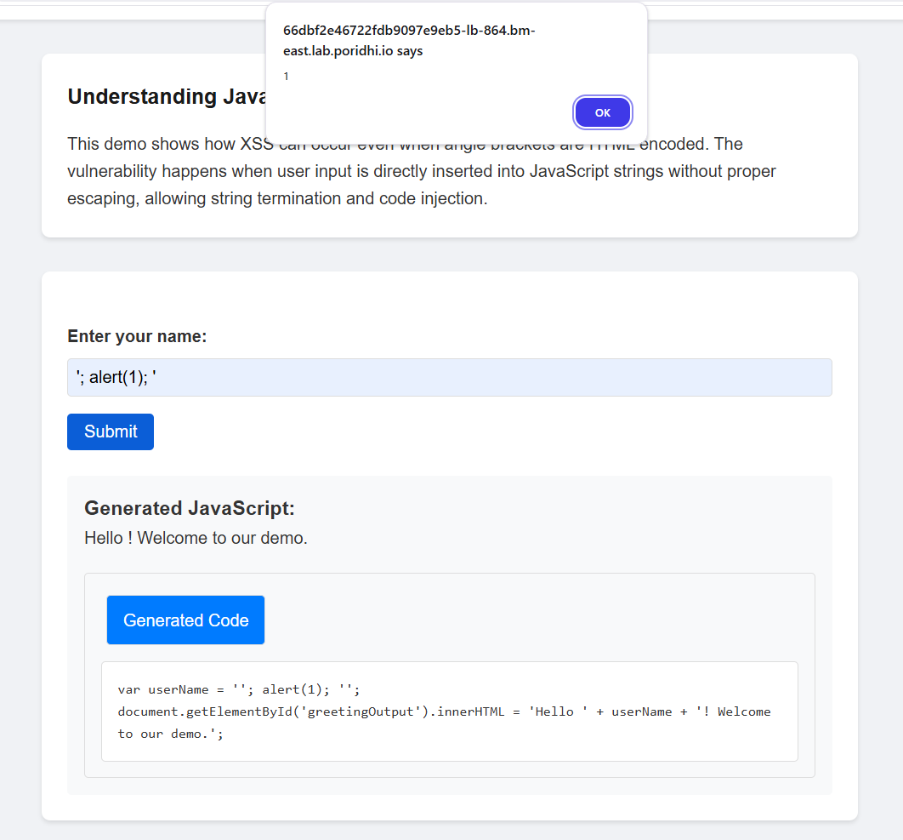
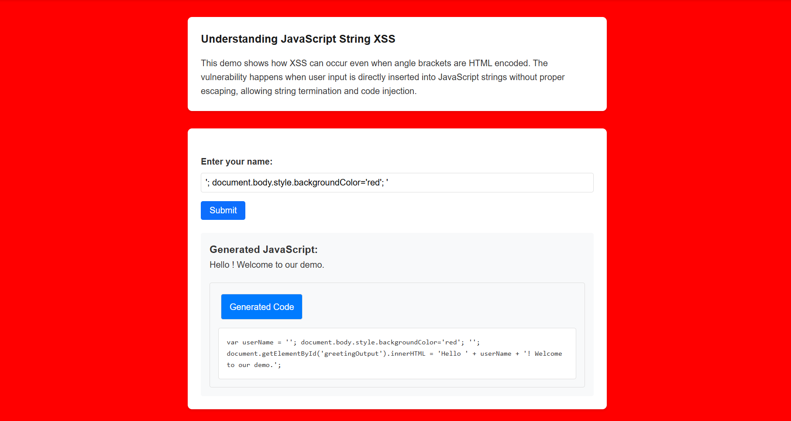

# Reflected XSS in JS string with HTML encoding

Cross-site Scripting (XSS) is a critical security vulnerability that allows attackers to inject and execute malicious scripts within a web application. **Reflected XSS** occurs when a user's input is included in the response of a web application without proper sanitization.

A specific type of this attack, **Reflected XSS in JS string with HTML encoding.**, arises when user input is inserted into a JavaScript string without proper encoding, allowing attackers to manipulate script execution.

## Objective
This lab aims to:
- Explain **Reflected XSS** within JavaScript strings.
- Discuss how **angle brackets (`< >`) are HTML-encoded but injection is still possible**.
- Demonstrate **bypassing techniques** to exploit this vulnerability.
- Provide **practical examples** of how this can be exploited.
- Outline **mitigation techniques** to prevent such attacks.

## What is Reflected XSS?

Reflected XSS is a type of XSS attack where the malicious script is reflected off the web application back to the victim's browser. This type of XSS is common in web applications that handle user input, such as name fields, comment sections, and login forms.


An attacker crafts a malicious URL containing a script and tricks a user into clicking it. The vulnerable website reflects the script in its response without proper sanitization, causing the user's browser to execute it, leading to data theft or session hijacking.
## JavaScript String Injection
Reflected XSS in JavaScript strings occurs when **unsanitized user input is placed within a JavaScript string** in a response, such as:
```html
<script>
    var username = "USER_INPUT";
    document.write("Hello, " + username);
</script>
```

### Why is This Dangerous?
If **angle brackets (`< >`) are encoded** (converted to `&lt;` and `&gt;` to prevent direct HTML injection), an attacker may still inject **special characters** (such as quotes, backslashes, or function calls) to break out of the JavaScript string and execute arbitrary JavaScript code.

### How It Works
Consider this vulnerable script:
```html
<script>
    var username = "John Doe";
    document.write("Hello, " + username);
</script>
```
If an attacker inputs:
```
"; alert(1); //
```
The rendered HTML will be:
```html
<script>
    var username = ""; alert(1); //";
    document.write("Hello, " + username);
</script>
```
By using `";` in the input, the attacker breaks out of the JavaScript string and executes `alert(1)` with `;` as a delimiter, demonstrating successful XSS execution.

## How Attackers Exploit This Vulnerability
Attackers utilize multiple techniques to inject and execute JavaScript within vulnerable scripts:


### 1. Breaking Out of String Quotes
If quotes are not properly sanitized, attackers can inject:

```html
<script>
    var username = ""; alert(1); //";
</script>
```
- By using `";` in the input, the attacker breaks out of the JavaScript.
- Inserting `alert(1)` in the input, the attacker executes `alert(1)` with `;` as a delimiter.
- As `;` is used as a delimiter, the attacker can execute multiple commands.
- (`//`)This comments out the closing quote from the original code

### 2. Injecting Function Calls
An attacker can use JavaScript functions to execute arbitrary code:
```html
<script>
    var username = ""; console.log(document.cookie); //";
</script>
```
- This allows the attacker to steal session cookies.

### 3. Using Escape Characters to Break the Syntax
An attacker can use escape characters (`\`) to manipulate the script:
```html
<script>
    var username = \"; alert(1); //
</script>
```
- This can escape existing string handling mechanisms and inject malicious JavaScript.

## How the Bypass Mechanism Works
1. **JavaScript String Context Misuse**: Attackers **inject closing characters** (`"`, `'`, `;`) to break out of JavaScript strings and execute their payloads.
2. **Function Calls and Object Access**: Attackers execute malicious functions (e.g., `alert()`, `console.log()`, `fetch()`, etc.) to manipulate the web page.
3. **Encoding Mismatch**: If `< >` are encoded but quotes and escape characters are not, an attacker can **bypass encoding restrictions**.
4. **JavaScript Execution Flow Hijacking**: Attackers manipulate JavaScript logic, injecting event handlers, script tags, or redirections.

## Practical Application

### **Step 1: Pull the Docker Image**

```bash
docker pull fazlulkarim105925/reflectedstringxss:latest
```

### **Step 2: Run the Docker Container**

```bash
docker run -d -p 8000:8000 fazlulkarim105925/reflectedstringxss
```

### **Step 3: Create a Load Balancer in Poridhi's Cloud**

Find the `eth0` IP address with `ifconfig` command.


Create a Load Balancer with the `eth0 IP` address and the port `8000`


### **Step 4: Access the Web Application**

Access the web application with the the provided `URL` by `loadbalancer`



### **Step 5: Exploit the Vulnerability**

Now we will exploit the vulnerability by entering the malicious payload in the name field.

First try with your name (e.g. `Poridhi`). If you click on submit button, you will see a greeting message.



Below the greeting message, you will see a `Section` called `Generated code`. Where we will see the portion of javascript code that is generated by the application from ther `user` input.

```bash
var userName = 'Poridhi';
document.getElementById('greetingOutput').innerHTML = 'Hello ' + userName + '! Welcome to our demo.';
```

**If we observe the generated code, we can see that**

- The `userName` variable is defined within single quotes.
- An attacker can escape these quotes to break out of the string context.
- For example, input like: '; alert(1); ' would break the string and allow code execution.

**Now try this payload with `html` tag.**

```bash
<script>alert(1)</script>
```




If we observe the `Generated code` section, we can see that the payload is encoded.

```bash
var userName = '&lt;script&gt;alert(1)&lt;script&gt;';
document.getElementById('greetingOutput').innerHTML = 'Hello ' + userName + '! Welcome to our demo.';
```

It means that we can't inject the payload with `html` tag directly in the input field.

Now let's try to exploit the vulnerability by entering the malicious payload in the name field which will bypass the encoding.
```bash
'; alert(1); '
```

**What the above payload does is,**

- It breaks the string context by using `;`
- It executes `alert(1)`

Now we will see a alert box with `1` as a message will pop up. Which means that the payload is executed. Welcome!!, you have successfully exploited the vulnerability.




As we have get idea about how to exploit the vulnerability, let's try to exploit the vulnerability with some other payloads.

```bash
'; document.body.style.backgroundColor='red'; '
```
**What the above payload does is,**

- It breaks the string context by using `;`
- It changes the background color of the body to red.

If we execute the above payload, we will see the background color of the body is changed to red.




**You can also try out this payloads:**
```bash
'; document.title='Hacked!'; '
```

```bash
'; document.body.innerHTML='Site Hacked!'; '
```

```bash
'; console.log('XSS'); '
```

## Prevention

- Use JSON.stringify() for JavaScript String Encoding.
- Custom JavaScript String Escaping Function.
- Use textContent Instead of innerHTML.
- HTML Template with Content Security Policy (CSP).
- Use DOMPurify for HTML Sanitization.

## Conclusion
Reflected XSS within JavaScript strings is a severe vulnerability, especially when **only partial encoding is applied**. Attackers can bypass input validation by injecting **quotes, escape characters, and function calls**. To prevent such vulnerabilities:
- **Sanitize all user input properly**, encoding both quotes (`"`, `'`) and escape characters (`\`).
- **Use Content Security Policy (CSP)** to restrict script execution.
- **Avoid inserting user input directly into JavaScript strings**; use safe APIs like `textContent` instead of `innerHTML`.

