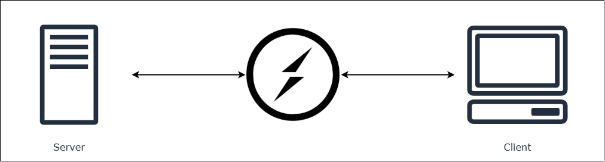
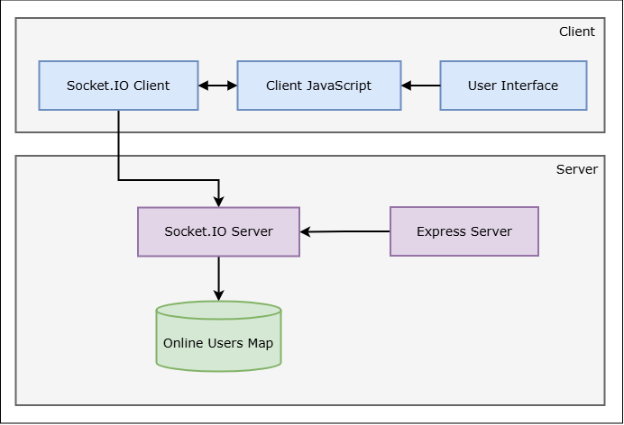
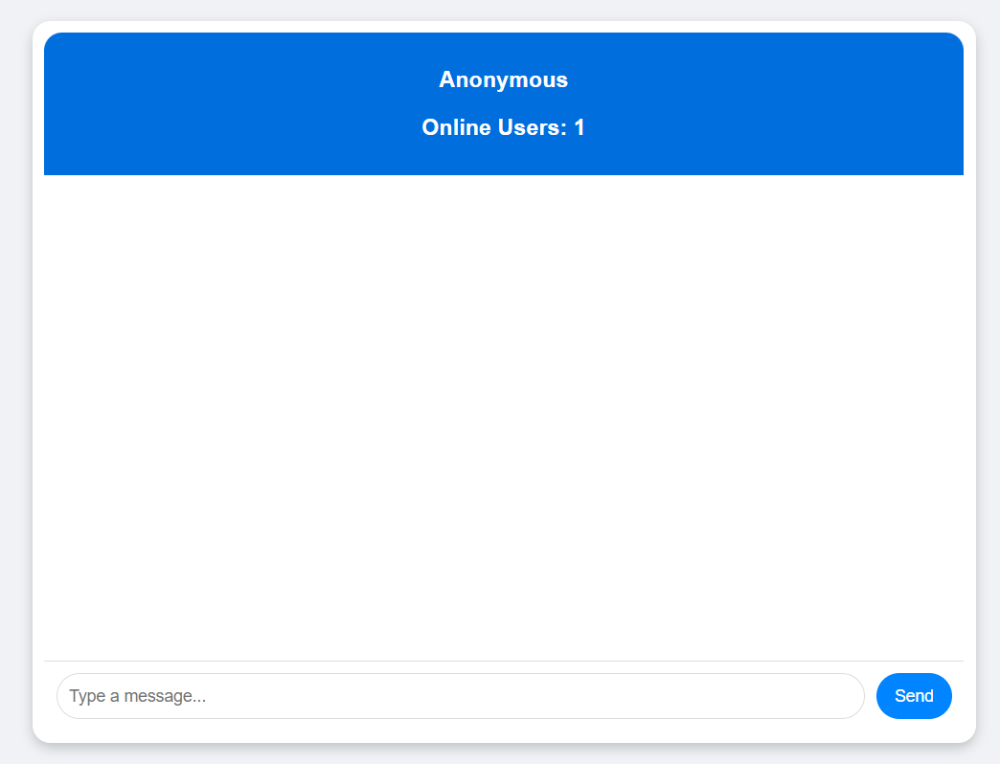
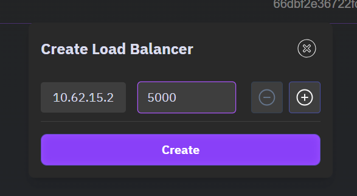
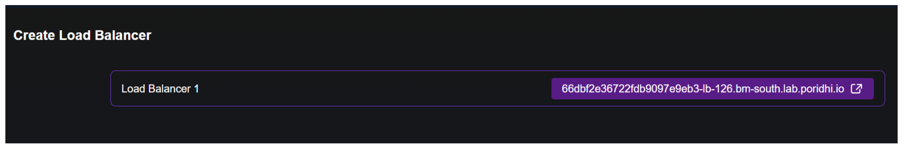
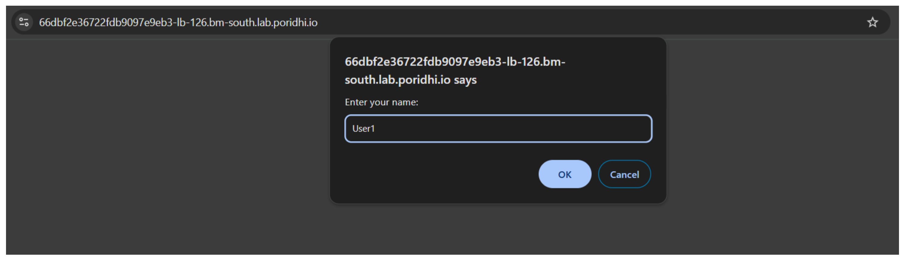
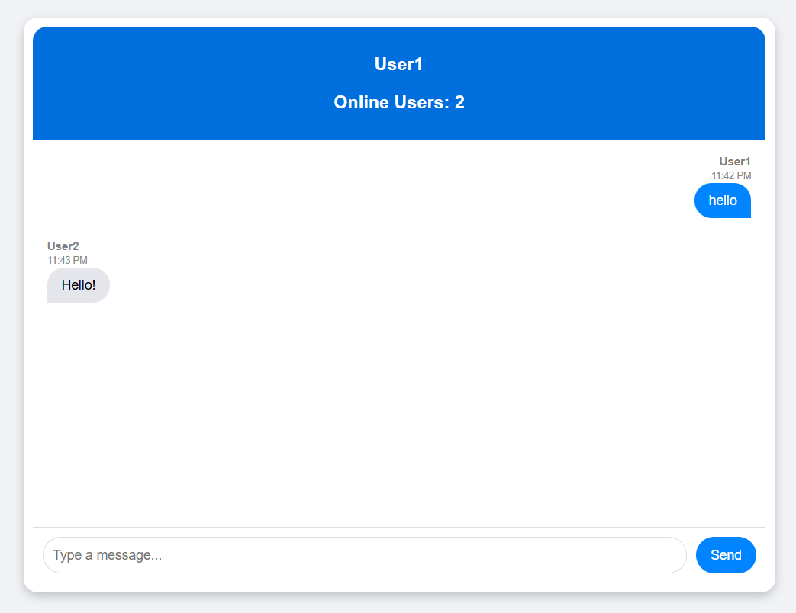

# Introduction to Socket.io

Socket.IO is a real-time, bidirectional event-based communication library built on WebSockets. It allows seamless communication between clients (browsers) and servers, making it ideal for real-time applications like chat apps, live notifications, multiplayer games, and collaborative tools. The library provides a simple API for sending and receiving messages, and it handles the complexities of WebSocket connections, including reconnection logic and automatic fallback to other transport methods if WebSockets are not available.




**Key Features:**

- Real-time communication using WebSockets.
- Automatic reconnection if a connection is lost.
- Event-based architecture (emit/listen for events).
- Supports fallback mechanisms (polling if WebSockets are unavailable).
- Cross-platform support (works on web browsers, Node.js, Python, etc.).

## Core Components of Socket.io

Socket.IO consists of two main parts:  

### **A. Socket.IO Server**  

The **server-side** runs in a Node.js environment. It listens for incoming connections from clients and handles events. It manages message broadcasting, rooms, and namespaces.

### **B. Socket.IO Client**

The **client-side** runs in the browser or another application (such as a mobile app). It connects to the server and listens for events. It can send and receive messages in real-time.

### **C. Transport Mechanisms**
Socket.IO primarily uses **WebSockets**, but it can **fall back** to other methods if WebSockets are not available:  

| **Transport Mechanism** | **Description** |
|-----------------|---------------------|
| **WebSockets** | Default transport, provides full-duplex, low-latency communication |
| **XHR Polling (Long Polling)** | Fallback method where the client repeatedly sends HTTP requests to check for new messages |
| **JSONP Polling** | Used when XHR is restricted due to CORS issues (rarely used today) |

## How Socket.io works

Socket.IO works through a **client-server connection model**.


### **Step 1: Client Requests Connection**
When a client (browser) wants to establish a real-time connection with the server, it sends a **handshake request**. The server then decides which transport mechanism to use (WebSockets, polling, etc.).

### **Step 2: Server Accepts Connection**
Once the connection is established, a **persistent communication channel** is created between the client and server. This means they can continuously send and receive messages without needing to establish a new connection for every request (unlike traditional HTTP).

### **Step 3: Sending and Receiving Messages**
- The **server** and **client** communicate through **events**.
- Both can emit and listen for custom events, making the communication bidirectional.

### **Step 4: Handling Disconnections & Reconnections**
- If a client gets disconnected due to **network issues**, Socket.IO **automatically tries to reconnect**.
- If WebSockets are blocked or unavailable, it **switches to polling**.


## Events in Socket.io

Events are the backbone of Socket.IO communication. They allow the server and client to send and receive messages in real-time. These events can be **default (built-in)** or **custom (user-defined)**.


## **A. Default Events in Socket.IO**  
Socket.IO provides several built-in events for connection management and error handling.

| **Event Name**  | **Triggered When...**  | **Example Usage** |
|---------------|---------------------|----------------|
| `connect`   | A client successfully connects to the server. | `socket.on('connect', () => { console.log('Connected!'); });` |
| `disconnect`  | A client disconnects due to network loss or closing the browser tab. | `socket.on('disconnect', () => { console.log('Disconnected'); });` |
| `error`  | An error occurs (e.g., transport failure). | `socket.on('error', (err) => { console.log('Error:', err); });` |
| `connect_error` | Connection fails due to network issues or server unavailability. | `socket.on('connect_error', (err) => { console.log('Connection Error:', err); });` |

### **Example of Default Events in Socket.IO**
#### **Server Side (Node.js)**
```javascript
io.on('connection', (socket) => {
    console.log('A user connected:', socket.id);

    socket.on('disconnect', () => {
        console.log('A user disconnected:', socket.id);
    });

    socket.on('error', (err) => {
        console.log('Socket error:', err);
    });
});
```

#### **Client Side (JavaScript)**
```javascript
const socket = io();

socket.on('connect', () => {
    console.log('Connected to the server!');
});

socket.on('disconnect', () => {
    console.log('Disconnected from the server');
});

socket.on('error', (err) => {
    console.error('Error:', err);
});
```

## **B. Custom Events in Socket.IO**  
Developers can define their own **custom events** to send and receive real-time messages. This is useful for implementing features like chat, notifications, and real-time updates.

### **How Custom Events Work**
1. The client emits an event to the server.
2. The server listens for that event and processes it.
3. The server can then emit a response event, which the client listens for.


### **Example: Chat Application Using Custom Events**
#### **1. Server Side (Node.js)**
```javascript
io.on('connection', (socket) => {
    console.log('User connected:', socket.id);

    // Listen for a custom event 'chatMessage'
    socket.on('chatMessage', (data) => {
        console.log(`User: ${data.username}, Message: ${data.text}`);

        // Broadcast message to all clients
        io.emit('chatMessage', data);
    });
});
```

#### **2. Client Side (JavaScript)**
```javascript
const socket = io();

// Send a chat message event to the server
socket.emit('chatMessage', { username: 'John', text: 'Hello, everyone!' });

// Listen for incoming chat messages
socket.on('chatMessage', (data) => {
    console.log(`${data.username}: ${data.text}`);
});
```

## Detailed Hands-on Implementation

Now, let's implement a simple chat application using Socket.IO. We will create a server and a client, and then connect them using Socket.IO. We will use Node.js and Express to create the server, and Socket.IO to handle the real-time communication. We also make a simple UI using HTML, CSS, and JavaScript for the chat application.



### Key Features

- Real-time communication between clients and server.
- Multiple clients can connect to the server.
- Messages are broadcasted to all connected clients.
- Users can send messages to each other.
- Users can see the list of online users.

### Project Structure

We will create a project named `Chat App` and add the necessary files to it.

```
Chat App
├── package.json
├── server
│   ├── server.js
├── public/
│   ├── index.html
│   ├── style.css
│   └── js
│       └── script.js
└── README.md
```

### **Setting Up the Server**

**1. Project initialization and Dependencies**

First we will initialize a new Node.js project and install the necessary dependencies. Run the following commands in your terminal:

```bash
npm init -y
npm install --save express socket.io
```

We will need to install `nodemon` to automatically restart the server when we make changes to the code. Run the following command in your terminal:

```bash
npm install --save-dev nodemon
```

> `--save-dev` is used to install the dependencies in the devDependencies section of the package.json file.

Update the `scripts` section of the `package.json` file to include the following:

```json
"scripts": {
    "start": "node server/server.js",
    "dev": "nodemon server/server.js"
}
```

**2. Chat app UI**

We will create a simple UI for the chat application. Create a file named `index.html` in the `public` folder and add the following code to it:

```html
<!DOCTYPE html>
<html lang="en">
<head>
    <meta charset="UTF-8">
    <meta name="viewport" content="width=device-width, initial-scale=1.0">
    <title>Chat App</title>
    <link rel="stylesheet" href="index.css">
    <script src="/socket.io/socket.io.js"></script> <!-- Socket.io client library -->
</head>
<body>
    <div class="chat-container">
        <!-- Header Section -->
        <div class="header">
            <h3 id="user-name">UserName</h3>
            <h3 id="online-users">Online Users:</h3>
        </div>

        <!-- Chat Messages Display -->
        <div id="chat-box" class="chat-box">
            <!-- Messages will be dynamically added here -->
        </div>

        <!-- Input Box -->
        <div class="input-container">
            <input id="message-input" type="text" placeholder="Type a message..." autocomplete="off">
            <button id="send-button">Send</button>
        </div>
    </div>

    <script src="js/index.js"></script>
</body>
</html>
```

- `<script src="/socket.io/socket.io.js"></script>` is used to include the Socket.io client library in the HTML file. This is required for the client to connect to the server.

- `<link rel="stylesheet" href="index.css">` is used to include the CSS file in the HTML file. This is required for the UI to be styled properly.

- `<script src="js/index.js"></script>` is used to include the JavaScript file in the HTML file. This is required for the client to connect to the server.

Now Create a file named `style.css` in the `public` folder and add the following code to it:

```css
body {
    font-family: Arial, sans-serif;
    background-color: #f0f2f5;
    display: flex;
    justify-content: center;
    align-items: center;
    height: 100vh;
    margin: 0;
}

.header {
    background-color: #006edc;
    color: white;
    padding: 10px;
    border-radius: 15px 15px 0 0;
    font-size: 16px;
    text-align: center;
}

.chat-container {
    width: 50%;
    height: 80vh;
    display: flex;
    flex-direction: column;
    background: white;
    border-radius: 15px;
    box-shadow: 0 4px 10px rgba(0, 0, 0, 0.2);
    overflow: hidden;
    padding: 10px;
}

#chat-box {
    flex-grow: 1;
    overflow-y: auto;
    padding: 10px;
    display: flex;
    flex-direction: column;
}

/* Message container */
.message-container {
    display: flex;
    flex-direction: column;
    margin-bottom: 12px;
    max-width: 75%;
    padding: 5px;
}

/* Sent message (blue bubble) */
.sent {
    align-self: flex-end;
    text-align: right;
}

.sent .message-bubble {
    background-color: #0084ff;
    color: white;
    border-radius: 18px 18px 0 18px;
    padding: 10px 15px;
    font-size: 14px;
    max-width: 100%;
    word-wrap: break-word;
}

/* Received message (gray bubble) */
.received {
    align-self: flex-start;
}

.received .message-bubble {
    background-color: #e4e6eb;
    color: black;
    border-radius: 18px 18px 18px 0;
    padding: 10px 15px;
    font-size: 14px;
    max-width: 100%;
    word-wrap: break-word;
}

/* Sender name & timestamp */
.message-info {
    font-size: 12px;
    color: gray;
    margin-bottom: 2px;
}

.sender-name {
    font-weight: bold;
}

.message-time {
    font-size: 10px;
    color: #888;
    margin-top: 3px;
    display: block;
}

/* Input area */
.input-container {
    display: flex;
    padding: 10px;
    background: white;
    border-top: 1px solid #ddd;
}

#message-input {
    flex-grow: 1;
    padding: 10px;
    border: 1px solid #ddd;
    border-radius: 20px;
    outline: none;
    font-size: 14px;
}

#send-button {
    background-color: #0084ff;
    color: white;
    border: none;
    padding: 8px 15px;
    border-radius: 20px;
    margin-left: 10px;
    cursor: pointer;
    font-size: 14px;
    transition: 0.2s;
}

#send-button:hover {
    background-color: #006edc;
}
```

This CSS file will style the UI of the chat application. Here is the screenshot of the UI:



**3. Server Setup**

Now we will create a server file and add the necessary code to it. Create a file named `server.js` in the root of your project and add the following code to it:

```js
const express = require('express');
const app = express();
const path = require('path');
const port = process.env.PORT || 3000;

app.use(express.static(path.join(__dirname, '../public'))); // serve static files from the public folder

const server = app.listen(port, () => {
    console.log(`Server is up on port ${port}`);
});

// create a socket.io server
const io = require('socket.io')(server);

// create a map to store online users
let onlineUsers = new Map();

// listen for new connections
io.on('connection', (socket) => {
    console.log('A new user connected: ', socket.id);

    // set the user name
    socket.on('set-name', (name) => {
        onlineUsers.set(socket.id, name);
        io.emit('onlineUsers', onlineUsers.size);
    });

    // listen for disconnections
    socket.on('disconnect', () => {
        onlineUsers.delete(socket.id);
        io.emit('onlineUsers', onlineUsers.size);
    });

    // listen for messages
    socket.on('message', (message) => {
        socket.broadcast.emit('chat-message', message);
    });
});
```

**4. Client Setup**

Now we will create a client file and add the necessary code to it. Create a file named `index.js` in the `public/js` folder and add the following code to it:

```js
// import socket.io client library
const socket = io();

// ask user for name
let userName = prompt("Enter your name:") || "Anonymous";

// send the user name to the server
socket.emit('set-name', userName);


// DOM elements
const chatBox = document.getElementById('chat-box');
const messageInput = document.getElementById('message-input');
const sendButton = document.getElementById('send-button');
const userNameDisplay = document.getElementById('user-name');

// Set the user name
userNameDisplay.textContent = userName;

// Listen for online users count
socket.on('onlineUsers', (count) => {
    document.getElementById('online-users').textContent = `Online Users: ${count}`;
});

// handle send button click
sendButton.addEventListener('click', (e) => {
    e.preventDefault();
    sendMessage();
});

// handle enter key press
messageInput.addEventListener('keypress', (e) => {
    if (e.key === 'Enter') {
        sendMessage();
    }
});

// send message to server
function sendMessage() {
    // check if the input is empty
    if (messageInput.value.trim() === '') {
        return;
    }

    // create message object
    const message = {
        text: messageInput.value,
        sender: userName, // Send username
        timestamp: new Date().toLocaleTimeString([], { hour: '2-digit', minute: '2-digit' })
    };

    // send message to server
    socket.emit('message', message);
    addMessageToChat(message, true);
    messageInput.value = '';
}

// add message to chat UI
function addMessageToChat(message, isSender) {
    const messageContainer = document.createElement('div');
    messageContainer.classList.add('message-container', isSender ? 'sent' : 'received');

    messageContainer.innerHTML = `
        <div class="message-info">
            <span class="sender-name">${message.sender}</span>
            <span class="message-time">${message.timestamp}</span>
        </div>
        <div class="message-bubble">${message.text}</div>
    `;

    chatBox.appendChild(messageContainer);
    chatBox.scrollTop = chatBox.scrollHeight;
}

// Receive message from server
socket.on('chat-message', (message) => {
    addMessageToChat(message, false);
});
```

**5. Running the Server**

To run the server, we will use the following command in our terminal:

```bash
npm run dev
```

## Access the chat app

This lab is intended to be run on Poridhi's VM. To access the chat app, we need to create a load balancer in the VM.



Follow the URL provided in the load balancer to access the chat app.





The user will be asked to enter a name.




After entering the name, the user will be on the home page and communicate with other users in real-time.



Here, we can see the Online Users count. and the chat messages are displayed in real-time.


## Conclusion

In this lab, we have learned how to implement a simple chat application using Socket.IO. We have created a server and a client, and then connected them using Socket.IO. We have also learned how to handle default and custom events in Socket.IO.


