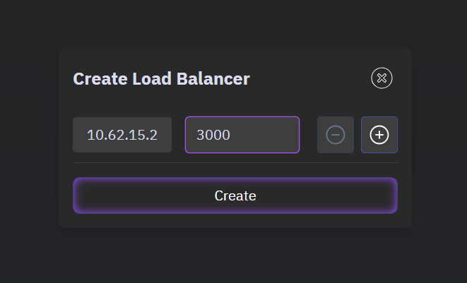

# Chat App with Socket.io

In this lab, we will build a chat app using Socket.io extending our previous lab by integrating rooms.


## key features

- A user can create a room
- A user can join a room, and leave a room
- A user can send messages and receive messages from a room
- A user can see the list of rooms
- A user can see the list of online users in a room

## What is Room?

Rooms in **Socket.IO** are a way to group sockets (clients) within a namespace.  
- Clients can **join** or **leave** rooms dynamically.  
- Messages can be **broadcasted to all clients** in a specific room without affecting others.  
- Rooms help in **efficient event handling** for features like chat groups, gaming lobbies, and private notifications.


> **Note:** Rooms are **not** a separate namespace. They exist **within** a namespace.

### How rooms work?

Rooms function by allowing a **socket (client) to join a named room** on the server, and the server can send messages to all sockets in that room.  

🔹 **Core Concepts:**  
- **Join a Room:** `socket.join(roomName)`  
- **Leave a Room:** `socket.leave(roomName)`  
- **Send a message to all users in a room:** `io.to(roomName).emit('eventName', data)`  
- **Send a message to a specific user in a room:** `socket.to(socketId).emit('eventName', data)`


### How Messages Are Sent in Rooms

| **Scenario** | **Code (Server-Side)** |
|-------------|----------------|
| **Send to all users in a room** | `io.to('room1').emit('message', 'Hello Room 1!');` |
| **Send to all except the sender** | `socket.to('room1').emit('message', 'Hello Room!');` |
| **Send to a specific socket (user)** | `socket.to(socketId).emit('message', 'Private message!');` |
| **Broadcast to everyone except sender** | `socket.broadcast.emit('message', 'Hello everyone except sender!');` |

### Hands-on implementation

To demonstrate how rooms work, we will create a project named `Chat App` and add the necessary files to it.

```
Chat App
├── package.json
├── server
│   ├── server.js
├── public/
│   ├── index.html
│   ├── style.css
│   └── js
│       └── script.js
└── README.md
```

### **Setting Up the Project**

**1. Project initialization and Dependencies**

First we will initialize a new Node.js project and install the necessary dependencies. Run the following commands in your terminal:

```bash
npm init -y
npm install --save express socket.io
```

We will need to install `nodemon` to automatically restart the server when we make changes to the code. Run the following command in your terminal:

```bash
npm install --save-dev nodemon
```

> `--save-dev` is used to install the dependencies in the devDependencies section of the package.json file.

Update the `scripts` section of the `package.json` file to include the following:

```json
"scripts": {
    "start": "node server/server.js",
    "dev": "nodemon server/server.js"
}
```


**2. Chat app UI**

We will create a simple UI for the chat application. Create a file named `index.html` in the `public` folder and add the following code to it:

```html
<!DOCTYPE html>
<html lang="en">
<head>
    <meta charset="UTF-8">
    <meta name="viewport" content="width=device-width, initial-scale=1.0">
    <title>Chat App</title>
    <link rel="stylesheet" href="index.css">
    <script src="/socket.io/socket.io.js"></script> <!-- Socket.io client library -->
</head>
<body>
    <div class="chat-container">
        <!-- Header Section -->
        <div class="header">
            <h3 id="user-name">Anonymous</h3>
            <h3 id="online-users">Online Users:</h3>
            <div class="room-controls">
                <input id="room-input" type="text" placeholder="Room name...">
                <button id="create-room">Create Room</button>
                <select id="room-select">
                    <option value="">Select a room...</option>
                </select>
            </div>
            <h4 id="current-room"></h4>
        </div>

        <!-- Chat Messages Display -->
        <div id="chat-box" class="chat-box">
            <!-- Messages will be dynamically added here -->
        </div>

        <!-- Input Box -->
        <div class="input-container">
            <input id="message-input" type="text" placeholder="Type a message..." autocomplete="off">
            <button id="send-button">Send</button>
        </div>
    </div>

    <script src="js/index.js"></script>
</body>
</html>
```

- `<script src="/socket.io/socket.io.js"></script>` is used to include the Socket.io client library in the HTML file. This is required for the client to connect to the server.

- `<link rel="stylesheet" href="index.css">` is used to include the CSS file in the HTML file. This is required for the UI to be styled properly.

- `<script src="js/index.js"></script>` is used to include the JavaScript file in the HTML file. This is required for the client to connect to the server.

Now Create a file named `style.css` in the `public` folder and add the following code to it:

```css
body {
    font-family: Arial, sans-serif;
    background-color: #f0f2f5;
    display: flex;
    justify-content: center;
    align-items: center;
    height: 100vh;
    margin: 0;
}

.header {
    background-color: #006edc;
    color: white;
    padding: 10px;
    border-radius: 15px 15px 0 0;
    font-size: 16px;
    text-align: center;
}

#user-name {    
    color: white;
}

.chat-container {
    width: 50%;
    height: 80vh;
    display: flex;
    flex-direction: column;
    background: white;
    border-radius: 15px;
    box-shadow: 0 4px 10px rgba(0, 0, 0, 0.2);
    overflow: hidden;
    padding: 10px;
}

#chat-box {
    flex-grow: 1;
    overflow-y: auto;
    padding: 10px;
    display: flex;
    flex-direction: column;
}

/* Message container */
.message-container {
    display: flex;
    flex-direction: column;
    margin-bottom: 12px;
    max-width: 75%;
    padding: 5px;
}

/* Sent message (blue bubble) */
.sent {
    align-self: flex-end;
    text-align: right;
}

.sent .message-bubble {
    background-color: #0084ff;
    color: white;
    border-radius: 18px 18px 0 18px;
    padding: 10px 15px;
    font-size: 14px;
    max-width: 100%;
    word-wrap: break-word;
}

/* Received message (gray bubble) */
.received {
    align-self: flex-start;
}

.received .message-bubble {
    background-color: #e4e6eb;
    color: black;
    border-radius: 18px 18px 18px 0;
    padding: 10px 15px;
    font-size: 14px;
    max-width: 100%;
    word-wrap: break-word;
}

/* Sender name & timestamp */
.message-info {
    font-size: 12px;
    color: gray;
    margin-bottom: 2px;
}

.sender-name {
    font-weight: bold;
}

.message-time {
    font-size: 10px;
    color: #888;
    margin-top: 3px;
    display: block;
}

/* Input area */
.input-container {
    display: flex;
    padding: 10px;
    background: white;
    border-top: 1px solid #ddd;
}

#message-input {
    flex-grow: 1;
    padding: 10px;
    border: 1px solid #ddd;
    border-radius: 20px;
    outline: none;
    font-size: 14px;
}

#send-button {
    background-color: #0084ff;
    color: white;
    border: none;
    padding: 8px 15px;
    border-radius: 20px;
    margin-left: 10px;
    cursor: pointer;
    font-size: 14px;
    transition: 0.2s;
}

#send-button:hover {
    background-color: #006edc;
}

.room-controls {
    display: flex;
    gap: 10px;
    margin: 10px 0;
}

#room-input {
    padding: 5px;
    border-radius: 5px;
    border: 1px solid #ddd;
}

#room-select {
    padding: 5px;
    border-radius: 5px;
    border: 1px solid #ddd;
    min-width: 150px;
}

#create-room {
    background-color: #0084ff;
    color: white;
    border: none;
    padding: 5px 10px;
    border-radius: 5px;
    cursor: pointer;
}

#create-room:hover {
    background-color: #006edc;
}

#current-room {
    margin: 5px 0;
    color: white;
}
```

These two files will create the UI for the chat application. Here is the screenshot of the UI:


**3. Server Setup**

Now we will create a server file and add the necessary code to it. Create a file named `server.js` in the root of your project and add the following code to it:

```js
const express = require('express');
const app = express();
const path = require('path');
const port = process.env.PORT || 3000;

app.use(express.static(path.join(__dirname, '../public')));

const server = app.listen(port, () => {
    console.log(`Server is up on port ${port}`);
});


const io = require('socket.io')(server);

// global variables
let onlineUsers = new Map(); // map of online users
let rooms = new Map(); // map of rooms

io.on('connection', (socket) => {
    console.log('A new user connected: ', socket.id);
    let currentRoom = null;

    // Send the list of rooms to the new connected client
    socket.emit('update-rooms', Array.from(rooms.keys()));

    // set the userName
    socket.on('set-name', (name) => {
        onlineUsers.set(socket.id, name);
        io.emit('onlineUsers', onlineUsers.size);
    });

    // create a new room
    socket.on('create-room', (roomName) => {
        rooms.set(roomName, new Set()); // create a new room roomName with an empty set of users
        io.emit('update-rooms', Array.from(rooms.keys())); // send the updated list of rooms to all clients
    });

    // join a room
    socket.on('join-room', (roomName) => {
        console.log('join-room', roomName);
        // leave the current room if the user is already in a room
        if (currentRoom) {
            socket.leave(currentRoom);
            rooms.get(currentRoom).delete(socket.id);
        }
        
        socket.join(roomName); // join the new room
        currentRoom = roomName; // set the current room to the new room
        if (!rooms.has(roomName)) { // if the new room does not exist, create it
            rooms.set(roomName, new Set()); // create a new room roomName with an empty set of users
        }
        rooms.get(roomName).add(socket.id); // add the user to the new room
        
        // Emit room members count
        io.to(roomName).emit('room-users', { // send the updated list of users in the new room to all clients in the new room
            room: roomName,
            count: rooms.get(roomName).size
        });
    });

    socket.on('message', (message) => {
        if (currentRoom) {
            socket.to(currentRoom).emit('chat-message', message); // send the message to all clients in the current room
        }
    });

    socket.on('disconnect', () => {
        if (currentRoom && rooms.get(currentRoom)) { // if the user is in a room
            rooms.get(currentRoom).delete(socket.id); // remove the user from the current room
            if (rooms.get(currentRoom).size === 0) { // if the current room has no users
                rooms.delete(currentRoom); // delete the current room
                io.emit('update-rooms', Array.from(rooms.keys())); // send the updated list of rooms to all clients
            } else {
                io.to(currentRoom).emit('room-users', { // send the updated list of users in the current room to all clients in the current room
                    room: currentRoom,
                    count: rooms.get(currentRoom).size
                });
            }
        }
        onlineUsers.delete(socket.id); // remove the user from the list of online users
        io.emit('onlineUsers', onlineUsers.size); // send the updated list of online users to all clients
    });
});
```

**4. Client Setup**

Now we will create a client file and add the necessary code to it. Create a file named `index.js` in the `public/js` folder and add the following code to it:

```js
const socket = io();

let userName = prompt("Enter your name:") || "Anonymous"; // Ask user for name
socket.emit('set-name', userName); // Send to server

// DOM elements
const chatBox = document.getElementById('chat-box');
const messageInput = document.getElementById('message-input');
const sendButton = document.getElementById('send-button');
const roomInput = document.getElementById('room-input');
const createRoomBtn = document.getElementById('create-room');
const roomSelect = document.getElementById('room-select');
const currentRoomDisplay = document.getElementById('current-room');
const userNameDisplay = document.getElementById('user-name');

// set the user name
userNameDisplay.textContent = userName;

let currentRoom = null;

// to display online users
socket.on('onlineUsers', (count) => {
    document.getElementById('online-users').textContent = `Online Users: ${count}`;
});

sendButton.addEventListener('click', (e) => {
    e.preventDefault();
    sendMessage();
});

// send message when the user presses enter
messageInput.addEventListener('keypress', (e) => {
    if (e.key === 'Enter') {
        sendMessage();
    }
});

// handle room creation
createRoomBtn.addEventListener('click', () => {
    const roomName = roomInput.value.trim(); // get the room name from the input
    if (roomName) {
        socket.emit('create-room', roomName); // send the room name to the server under the create-room event
        roomInput.value = ''; // clear the room input
    }
});

roomSelect.addEventListener('change', () => {
    const selectedRoom = roomSelect.value; // get the selected room from the dropdown
    if (selectedRoom) {
        joinRoom(selectedRoom); // join the selected room
    }
});

// Handle room joining
function joinRoom(roomName) {
    currentRoom = roomName;
    socket.emit('join-room', roomName); // send the room name to the server under the join-room event
    currentRoomDisplay.textContent = `Current Room: ${roomName}`; // update the current room display
    chatBox.innerHTML = ''; // Clear chat when joining new room
}

// Handle room updates
socket.on('update-rooms', (rooms) => {
    roomSelect.innerHTML = '<option value="">Select a room...</option>'; // clear the room select dropdown
    rooms.forEach(room => { // for each room, create an option and add it to the dropdown
        const option = document.createElement('option');
        option.value = room;
        option.textContent = room;
        roomSelect.appendChild(option); // add the option to the dropdown
    });
});

// Handle room users
socket.on('room-users', (data) => { // handle the room users event
    if (data.room === currentRoom) { // if the room is the current room
        document.getElementById('online-users').textContent = 
            `Online Users in ${data.room}: ${data.count}`; // update the online users display
    }
});

// send message to server
function sendMessage() {
    if (messageInput.value.trim() === '' || !currentRoom) { // if the message is empty or the user is not in a room
        return;
    }

    // create message object
    const message = {
        text: messageInput.value,
        sender: userName, // Send username
        timestamp: new Date().toLocaleTimeString([], { hour: '2-digit', minute: '2-digit' })
    };
    socket.emit('message', message); // send the message to the server under the message event
    addMessageToChat(message, true); // add the message to the chat
    messageInput.value = ''; // clear the message input
}

// add message to chat
function addMessageToChat(message, isSender) {
    const messageContainer = document.createElement('div');
    messageContainer.classList.add('message-container', isSender ? 'sent' : 'received');

    // create message container
    messageContainer.innerHTML = `
        <div class="message-info">
            <span class="sender-name">${message.sender}</span>
            <span class="message-time">${message.timestamp}</span>
        </div>
        <div class="message-bubble">${message.text}</div>
    `;

    // add message to chat box
    chatBox.appendChild(messageContainer);
    chatBox.scrollTop = chatBox.scrollHeight;
}

// Receive message from server
socket.on('chat-message', (message) => {
    addMessageToChat(message, false);
});
```

**5. Running the Server**

To run the server, we will use the following command in our terminal:

```bash
npm run dev
```

## Access the chat app

This lab is intended to be run on Poridhi's VM. To access the chat app, we need to create a load balancer in the VM.



Follow the URL provided in the load balancer to access the chat app.


The user will be asked to enter a name.


After entering the name, the user will be on the home page.


Users can create a room or join a room and start chatting.


Here, we can see, in the `TestRoom` room, there are 3 users online. They can also communicate with each other in real-time.

## Conclusion

In this lab, we learned how to use Socket.io to create a chat app with rooms. We also learned how to use the `join` and `leave` methods to join and leave a room. We also learned how to use the `to` method to send messages to a specific room.


