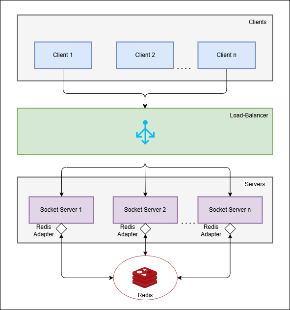
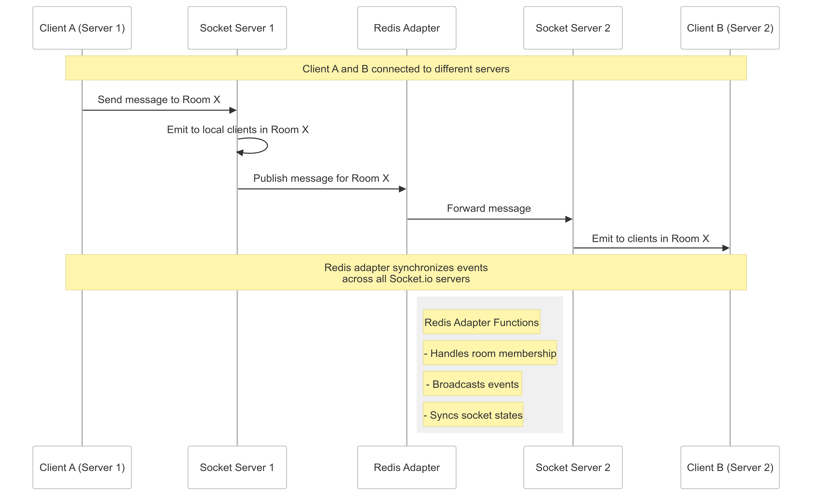

# Scalable Chat Application with Socket.IO and Redis Adapter

A chat application requires real-time, bidirectional communication between clients and the server. As the number of users grows, a single server may become a bottleneck, leading to performance issues. To address this, we can scale the chat application by deploying multiple server instances and using `Redis` as a message broker to synchronize events across servers. `Socket.IO` is a popular library for real-time communication, and the `redis-adapter` is a module that allows Socket.IO to use Redis as a message broker.

### What are the challenges in scaling a chat application?

Scaling a chat application presents several challenges, including infrastructure, performance, data consistency, and network considerations.

**1. Real-Time Message Synchronization**

Ensuring that messages are delivered in real-time across multiple distributed server instances is a challenge. Potential Issues might be Network latency, out-of-order message delivery, and duplicate messages. For example: A message sent from one user should be broadcasted instantly to all users in the same chat room, regardless of which server instance they are connected to.

**2. Load Balancing & High Availability**

Distributing user connections efficiently across multiple instances is crucial for scalability. But the main challenge is that WebSockets use persistent connections, meaning traditional load balancing `(e.g., round-robin)` might not work efficiently. Sessions need to be sticky to ensure a client stays connected to the same server instance.

**3. Efficient User Presence Management**

Tracking user presence (online/offline status) across multiple servers is complex. If a user connects to one instance but disconnects from another, inconsistencies can arise.

## What is the purpose of using Redis as a message broker?  

Redis acts as a **message broker** in a scalable chat application to enable real-time communication across multiple instances of a Socket.IO server.

### **1. Enabling Real-Time Event Propagation**
In a horizontally scaled architecture where multiple server instances handle different client connections, Redis facilitates communication between these instances using **Publish/Subscribe (Pub/Sub)** messaging.  
- When a user sends a message, the server instance handling that user **publishes** the message to Redis.
- Other instances **subscribe** to Redis and receive the message in real-time.
- Redis then **broadcasts** the message to all relevant clients, ensuring seamless communication.

### **2. Ensuring Consistency Across Multiple Servers**
Since WebSockets create a persistent connection between the client and a specific server, messages sent to a chat room must be synchronized across all servers.
- Redis ensures that even if clients are connected to different servers, they all receive the same messages.
- Without Redis, each server would only be aware of the clients directly connected to it, leading to **message loss or inconsistencies**.

### **3. Efficient Room and Namespace Management**
Redis helps manage chat **rooms** and **namespaces** effectively across distributed instances.
- When a client joins a room, Redis keeps track of it across all server instances.
- Messages sent to that room are relayed through Redis to **ensure that all participants receive the updates**, even if they are connected to different server instances.

### **4. Load Distribution Without Overloading Servers**
- Instead of each server processing and maintaining a list of connected users, Redis acts as a **centralized event hub**.
- This reduces the overhead on individual server instances, allowing them to **handle more concurrent users**.

### **5. High Availability and Fault Tolerance**
Redis can be deployed in a **clustered setup** with replication and automatic failover (using Redis Sentinel).
- If one Redis instance fails, another takes over, ensuring **continuous operation**.
- This prevents a **single point of failure**, improving the resilience of the chat application.

### **6. Message Queue for Offline Users**
- Redis can store messages temporarily when users are offline.
- When the user reconnects, pending messages can be **retrieved from Redis** and delivered, ensuring no messages are lost.

## How does the Redis adapter work with Socket.IO?

The **Redis adapter** is a powerful feature in **Socket.IO** that enables communication across multiple Socket.IO server instances. By default, Socket.IO manages connections in a single instance. However, when you have multiple instances, messages sent to a room might not reach users connected to different instances. This is where Redis comes in.

#### **1. Redis Pub/Sub Mechanism**

Redis uses a **publish/subscribe (pub/sub) model** to propagate messages between different Socket.IO instances. Each instance subscribes to Redis channels and listens for messages. When a client sends a message, the instance handling that client **publishes** the message to Redis. Other instances **subscribe** to the channel and receive the message, ensuring all clients receive the event, regardless of the server they are connected to.

#### **2. How It Works**

1. **Sending Messages:** A user sends a message to the chat room. The **Socket.IO server** emits the message to other clients in the same room. If multiple server instances exist, the message might not reach users connected to another instance.

2. **Redis Adapter Broadcasts the Message:** The **Redis adapter** intercepts the event and **publishes** the message to a Redis channel. Other Socket.IO instances **subscribe** to this Redis channel and receive the message. The message is then broadcasted to clients connected to different instances.

3. **Client Receives the Message:** Clients in the same chat room receive the message, regardless of the instance they are connected to.

