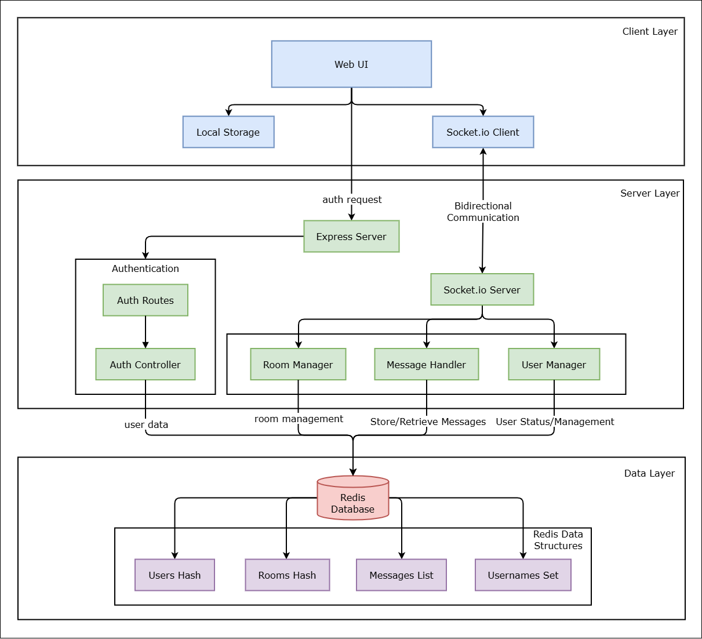
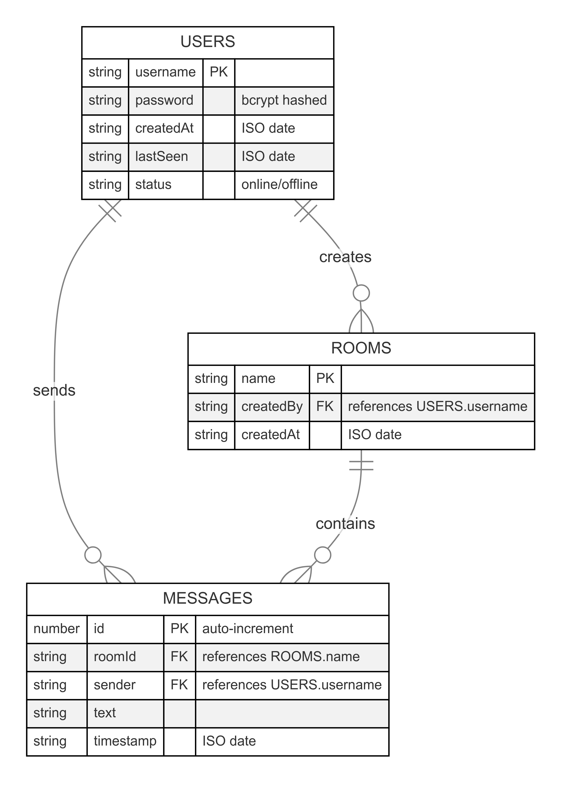
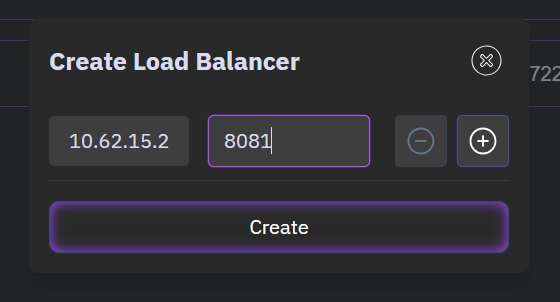
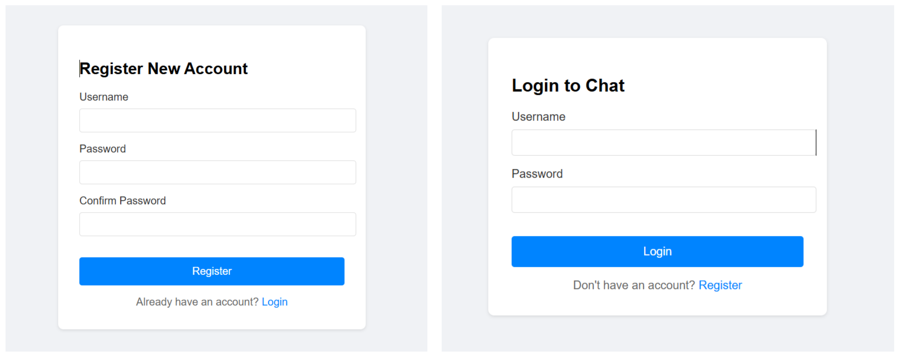
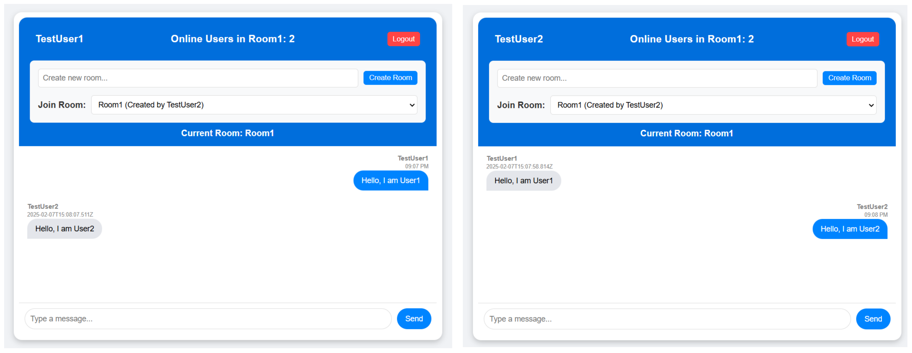
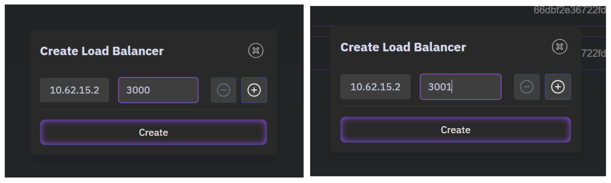
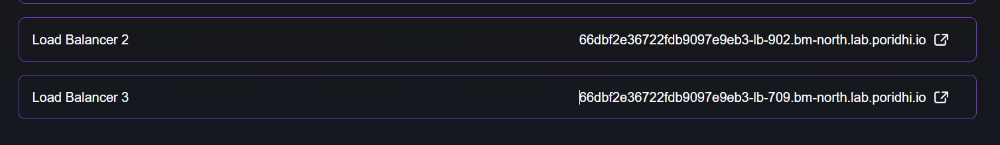
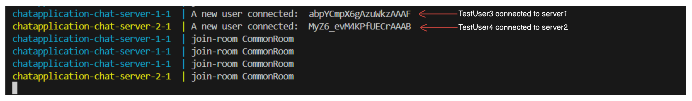
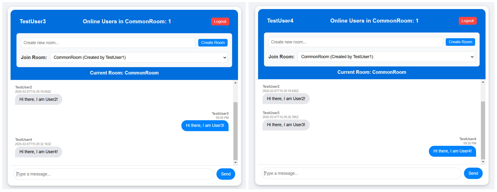

# Scalable Chat Application with Socket.IO and Redis Adapter

A chat application requires real-time, bidirectional communication between clients and the server. As the number of users grows, a single server may become a bottleneck, leading to performance issues. To address this, we can scale the chat application by deploying multiple server instances and using `Redis` as a message broker to synchronize events across servers. `Socket.IO` is a popular library for real-time communication, and the `redis-adapter` is a module that allows Socket.IO to use Redis as a message broker.


### What are the challenges in scaling a chat application?

Scaling a chat application presents several challenges, including infrastructure, performance, data consistency, and network considerations.

**1. Real-Time Message Synchronization**

Ensuring that messages are delivered in real-time across multiple distributed server instances is a challenge. Potential Issues might be Network latency, out-of-order message delivery, and duplicate messages. For example: A message sent from one user should be broadcasted instantly to all users in the same chat room, regardless of which server instance they are connected to.

**2. Load Balancing & High Availability**

Distributing user connections efficiently across multiple instances is crucial for scalability. But the main challenge is that WebSockets use persistent connections, meaning traditional load balancing `(e.g., round-robin)` might not work efficiently. Sessions need to be sticky to ensure a client stays connected to the same server instance.

**3. Efficient User Presence Management**

Tracking user presence (online/offline status) across multiple servers is complex. If a user connects to one instance but disconnects from another, inconsistencies can arise.

## What is the purpose of using Redis as a message broker?  

Redis acts as a **message broker** in a scalable chat application to enable real-time communication across multiple instances of a Socket.IO server.

### **1. Enabling Real-Time Event Propagation**
In a horizontally scaled architecture where multiple server instances handle different client connections, Redis facilitates communication between these instances using **Publish/Subscribe (Pub/Sub)** messaging.  
- When a user sends a message, the server instance handling that user **publishes** the message to Redis.
- Other instances **subscribe** to Redis and receive the message in real-time.
- Redis then **broadcasts** the message to all relevant clients, ensuring seamless communication.

### **2. Ensuring Consistency Across Multiple Servers**
Since WebSockets create a persistent connection between the client and a specific server, messages sent to a chat room must be synchronized across all servers.
- Redis ensures that even if clients are connected to different servers, they all receive the same messages.
- Without Redis, each server would only be aware of the clients directly connected to it, leading to **message loss or inconsistencies**.

### **3. Efficient Room and Namespace Management**
Redis helps manage chat **rooms** and **namespaces** effectively across distributed instances.
- When a client joins a room, Redis keeps track of it across all server instances.
- Messages sent to that room are relayed through Redis to **ensure that all participants receive the updates**, even if they are connected to different server instances.

<!-- ### **4. Load Distribution Without Overloading Servers**
- Instead of each server processing and maintaining a list of connected users, Redis acts as a **centralized event hub**.
- This reduces the overhead on individual server instances, allowing them to **handle more concurrent users**.

### **5. Message Queue for Offline Users**
- Redis can store messages temporarily when users are offline.
- When the user reconnects, pending messages can be **retrieved from Redis** and delivered, ensuring no messages are lost. -->

## How does the Redis adapter work with Socket.IO?

The **Redis adapter** is a powerful feature in **Socket.IO** that enables communication across multiple Socket.IO server instances. By default, Socket.IO manages connections in a single instance. However, when you have multiple instances, messages sent to a room might not reach users connected to different instances. This is where Redis comes in.


#### **1. Redis Pub/Sub Mechanism**

Redis uses a **publish/subscribe (pub/sub) model** to propagate messages between different Socket.IO instances. Each instance subscribes to Redis channels and listens for messages. When a client sends a message, the instance handling that client **publishes** the message to Redis. Other instances **subscribe** to the channel and receive the message, ensuring all clients receive the event, regardless of the server they are connected to.

#### **2. How It Works**

1. **Sending Messages:** A user sends a message to the chat room. The **Socket.IO server** emits the message to other clients in the same room. If multiple server instances exist, the message might not reach users connected to another instance.

2. **Redis Adapter Broadcasts the Message:** The **Redis adapter** intercepts the event and **publishes** the message to a Redis channel. Other Socket.IO instances **subscribe** to this Redis channel and receive the message. The message is then broadcasted to clients connected to different instances.

3. **Client Receives the Message:** Clients in the same chat room receive the message, regardless of the instance they are connected to.

## Hands-on Implementation

We will be using the same chat app as in the previous lab. We will be using Redis as a message broker to synchronize events across multiple server instances.

### Project Structure

```
ChatApp/
├── Dockerfile
├── docker-compose.yml
├── package.json
├── public/
│   ├── auth.html
│   ├── chat.html
│   ├── index.css
│   ├── js/
│   │   ├── index.js
|   |   |-- auth.js
├── src/
│   ├── config/
│   ├── models/
├── server/
│   ├── server.js
```

This is a simple project structure for the chat application. You can add more files and folders as needed also restructure the project as you see fit.

Here is the system architecture of the chat application:



## **Setting Up the Project**

### **1. Project initialization and Dependencies**

First we will initialize a new Node.js project and install the necessary dependencies. Run the following commands in your terminal:

```bash
npm init -y
npm install --save express socket.io bcrypt dotenv
```

We will need to install `nodemon` to automatically restart the server when we make changes to the code. Run the following command in your terminal:

```bash
npm install --save-dev nodemon
```

> `--save-dev` is used to install the dependencies in the devDependencies section of the package.json file.

Update the `scripts` section of the `package.json` file to include the following:

```json
"scripts": {
    "start": "node server/server.js",
    "dev": "nodemon server/server.js"
}
```

### **2. Application UI**

We will create a simple UI for our application. We will create two pages:

- `auth.html`: This page will contain a form for users to sign up or log in.
- `chat.html`: This page will contain the chat interface.

We use html css and js to create the UI for simplicity. The **main focus** of this lab is to understand the **inter-server communication** and how to **scale** the application.

### **auth.html**

This file contains the login and registration form.

```html
<!DOCTYPE html>
<html lang="en">
<head>
    <meta charset="UTF-8">
    <meta name="viewport" content="width=device-width, initial-scale=1.0">
    <title>Chat App - Login</title>
    <link rel="stylesheet" href="auth.css">
</head>
<body>
    <div class="auth-container">
        <div id="login-form">
            <h2>Login to Chat</h2>
            <form onsubmit="handleLogin(event)">
                <div class="form-group">
                    <label for="login-username">Username</label>
                    <input type="text" id="login-username" required>
                </div>
                <div class="form-group">
                    <label for="login-password">Password</label>
                    <input type="password" id="login-password" required>
                </div>
                <button type="submit">Login</button>
                <div class="error-message" id="login-error"></div>
            </form>
            <div class="toggle-form">
                Don't have an account? <a href="#" onclick="toggleForms()">Register</a>
            </div>
        </div>

        <div id="register-form" style="display: none;">
            <h2>Register New Account</h2>
            <form onsubmit="handleRegister(event)">
                <div class="form-group">
                    <label for="register-username">Username</label>
                    <input type="text" id="register-username" required>
                </div>
                <div class="form-group">
                    <label for="register-password">Password</label>
                    <input type="password" id="register-password" required>
                </div>
                <div class="form-group">
                    <label for="register-confirm-password">Confirm Password</label>
                    <input type="password" id="register-confirm-password" required>
                </div>
                <button type="submit">Register</button>
                <div class="error-message" id="register-error"></div>
            </form>
            <div class="toggle-form">
                Already have an account? <a href="#" onclick="toggleForms()">Login</a>
            </div>
        </div>
    </div>

    <script src="js/auth.js"></script>
</body>
</html>
```

**auth.css**

```css
body {
    font-family: Arial, sans-serif;
    background-color: #f0f2f5;
    margin: 0;
    display: flex;
    justify-content: center;
    align-items: center;
    height: 100vh;
}

.auth-container {
    background-color: white;
    padding: 2rem;
    border-radius: 8px;
    box-shadow: 0 2px 4px rgba(0, 0, 0, 0.1);
    width: 100%;
    max-width: 400px;
}

.form-group {
    margin-bottom: 1rem;
}

label {
    display: block;
    margin-bottom: 0.5rem;
    color: #333;
}

input {
    width: 100%;
    padding: 0.5rem;
    border: 1px solid #ddd;
    border-radius: 4px;
    font-size: 1rem;
}

button {
    width: 100%;
    padding: 0.75rem;
    background-color: #0084ff;
    color: white;
    border: none;
    border-radius: 4px;
    font-size: 1rem;
    cursor: pointer;
    margin-top: 1rem;
}

button:hover {
    background-color: #0066cc;
}

.toggle-form {
    text-align: center;
    margin-top: 1rem;
    color: #666;
}

.toggle-form a {
    color: #0084ff;
    text-decoration: none;
}

.error-message {
    color: #ff4444;
    margin-top: 1rem;
    text-align: center;
}
```
This will create a simple login and registration page.

**chat.html**

```html
<!DOCTYPE html>
<html lang="en">
<head>
    <meta charset="UTF-8">
    <meta name="viewport" content="width=device-width, initial-scale=1.0">
    <title>Chat App</title>
    <link rel="stylesheet" href="index.css">
    <script src="/socket.io/socket.io.js"></script> <!-- Socket.io client library -->
</head>
<body>
    <div class="chat-container">
        <!-- Header Section -->
        <div class="header">
            <div class="user-info">
                <h3 id="user-name">Anonymous</h3>
                <h3 id="online-users">Online Users:</h3>
            </div>
            <div class="room-controls">
                <div class="room-creation">
                    <input id="room-input" type="text" placeholder="Create new room...">
                    <button id="create-room">Create Room</button>
                </div>
                <div class="room-selection">
                    <label for="room-select">Join Room:</label>
                    <select id="room-select">
                        <option value="">Select a room...</option>
                    </select>
                </div>
            </div>
            <h4 id="current-room"></h4>
        </div>

        <!-- Chat Messages Display -->
        <div id="chat-box" class="chat-box">
            <!-- Messages will be dynamically added here -->
        </div>

        <!-- Input Box -->
        <div class="input-container">
            <input id="message-input" type="text" placeholder="Type a message..." autocomplete="off">
            <button id="send-button">Send</button>
        </div>
    </div>

    <script src="js/index.js"></script>
</body>
</html>
```

**index.css**

```css
body {
    font-family: Arial, sans-serif;
    background-color: #f0f2f5;
    display: flex;
    justify-content: center;
    align-items: center;
    height: 100vh;
    margin: 0;
}

.header {
    background-color: #006edc;
    color: white;
    padding: 10px;
    border-radius: 15px 15px 0 0;
    font-size: 16px;
    text-align: center;
}

#user-name {    
    color: white;
}

.chat-container {
    width: 50%;
    height: 80vh;
    display: flex;
    flex-direction: column;
    background: white;
    border-radius: 15px;
    box-shadow: 0 4px 10px rgba(0, 0, 0, 0.2);
    overflow: hidden;
    padding: 10px;
}

#chat-box {
    flex-grow: 1;
    overflow-y: auto;
    padding: 10px;
    display: flex;
    flex-direction: column;
}

/* Message container */
.message-container {
    display: flex;
    flex-direction: column;
    margin-bottom: 12px;
    max-width: 75%;
    padding: 5px;
}

/* Sent message (blue bubble) */
.sent {
    align-self: flex-end;
    text-align: right;
}

.sent .message-bubble {
    background-color: #0084ff;
    color: white;
    border-radius: 18px 18px 0 18px;
    padding: 10px 15px;
    font-size: 14px;
    max-width: 100%;
    word-wrap: break-word;
}

/* Received message (gray bubble) */
.received {
    align-self: flex-start;
}

.received .message-bubble {
    background-color: #e4e6eb;
    color: black;
    border-radius: 18px 18px 18px 0;
    padding: 10px 15px;
    font-size: 14px;
    max-width: 100%;
    word-wrap: break-word;
}

/* Sender name & timestamp */
.message-info {
    font-size: 12px;
    color: gray;
    margin-bottom: 2px;
}

.sender-name {
    font-weight: bold;
}

.message-time {
    font-size: 10px;
    color: #888;
    margin-top: 3px;
    display: block;
}

/* Input area */
.input-container {
    display: flex;
    padding: 10px;
    background: white;
    border-top: 1px solid #ddd;
}

#message-input {
    flex-grow: 1;
    padding: 10px;
    border: 1px solid #ddd;
    border-radius: 20px;
    outline: none;
    font-size: 14px;
}

#send-button {
    background-color: #0084ff;
    color: white;
    border: none;
    padding: 8px 15px;
    border-radius: 20px;
    margin-left: 10px;
    cursor: pointer;
    font-size: 14px;
    transition: 0.2s;
}

#send-button:hover {
    background-color: #006edc;
}

.user-info {
    display: flex;
    justify-content: space-between;
    align-items: center;
    padding: 0 20px;
}

.room-controls {
    display: flex;
    flex-direction: column;
    gap: 15px;
    padding: 15px;
    background-color: #f8f9fa;
    border-radius: 8px;
    margin: 10px;
}

.room-creation, .room-selection {
    display: flex;
    gap: 10px;
    align-items: center;
}

.room-selection label {
    color: #333;
    font-weight: bold;
}

#room-input {
    flex: 1;
    padding: 8px;
    border: 1px solid #ddd;
    border-radius: 5px;
    font-size: 14px;
}

#room-select {
    flex: 1;
    padding: 8px;
    border: 1px solid #ddd;
    border-radius: 5px;
    font-size: 14px;
}

#create-room {
    background-color: #0084ff;
    color: white;
    border: none;
    padding: 5px 10px;
    border-radius: 5px;
    cursor: pointer;
}

#create-room:hover {
    background-color: #006edc;
}

#current-room {
    margin: 5px 0;
    color: white;
}
```

### **auth.js**

This file contains the code for handling the authentication functionality. It contains the code for registering and logging in users.

```js
function toggleForms() {
    const loginForm = document.getElementById('login-form');
    const registerForm = document.getElementById('register-form');
    loginForm.style.display = loginForm.style.display === 'none' ? 'block' : 'none';
    registerForm.style.display = registerForm.style.display === 'none' ? 'block' : 'none';
}

async function handleLogin(event) {
    event.preventDefault();
    const username = document.getElementById('login-username').value;
    const password = document.getElementById('login-password').value;
    const errorElement = document.getElementById('login-error');

    try {
        const response = await fetch('/auth/login', {
            method: 'POST',
            headers: { 'Content-Type': 'application/json' },
            body: JSON.stringify({ username, password })
        });

        const data = await response.json();
        if (data.success) {
            localStorage.setItem('username', username);
            window.location.href = '/chat.html';
        } else {
            errorElement.textContent = data.error;
        }
    } catch (error) {
        errorElement.textContent = 'An error occurred. Please try again.';
    }
}

async function handleRegister(event) {
    event.preventDefault();
    const username = document.getElementById('register-username').value;
    const password = document.getElementById('register-password').value;
    const confirmPassword = document.getElementById('register-confirm-password').value;
    const errorElement = document.getElementById('register-error');

    if (password !== confirmPassword) {
        errorElement.textContent = 'Passwords do not match';
        return;
    }

    try {
        const response = await fetch('/auth/register', {
            method: 'POST',
            headers: { 'Content-Type': 'application/json' },
            body: JSON.stringify({ username, password })
        });

        const data = await response.json();
        if (data.success) {
            localStorage.setItem('username', username);
            window.location.href = '/chat.html';
        } else {
            errorElement.textContent = data.error;
        }
    } catch (error) {
        errorElement.textContent = 'An error occurred. Please try again.';
    }
}
```

### **index.js**

This file contains the code for handling the chat functionality. It contains the code for sending and receiving messages, creating and joining rooms, and updating the online users count.

```js
const userName = localStorage.getItem('username');
const socket = io({
    auth: {
        username: userName
    }
});

// DOM elements
const chatBox = document.getElementById('chat-box');
const messageInput = document.getElementById('message-input');
const sendButton = document.getElementById('send-button');
const roomInput = document.getElementById('room-input');
const createRoomBtn = document.getElementById('create-room');
const roomSelect = document.getElementById('room-select');
const currentRoomDisplay = document.getElementById('current-room');
const userNameDisplay = document.getElementById('user-name');

let currentRoom = null;

// Check if user is authenticated
function checkAuth() {
    if (!userName) {
        window.location.href = '/auth.html';
        return;
    }
    userNameDisplay.textContent = userName;
    enableChat();
}

// Function to enable chat functionality
function enableChat() {
    messageInput.disabled = false;
    sendButton.disabled = false;
    roomInput.disabled = false;
    createRoomBtn.disabled = false;
    roomSelect.disabled = false;
}

// Initially disable chat functionality
messageInput.disabled = true;
sendButton.disabled = true;
roomInput.disabled = true;
createRoomBtn.disabled = true;
roomSelect.disabled = true;

// Start the app by checking authentication
checkAuth();

// to display online users
socket.on('onlineUsers', (count) => {
    document.getElementById('online-users').textContent = `Online Users: ${count}`;
});

sendButton.addEventListener('click', (e) => {
    e.preventDefault();
    sendMessage();
});

// send message when the user presses enter
messageInput.addEventListener('keypress', (e) => {
    if (e.key === 'Enter') {
        sendMessage();
    }
});

// handle room creation
createRoomBtn.addEventListener('click', () => {
    const roomName = roomInput.value.trim();
    if (roomName) {
        socket.emit('create-room', roomName, (response) => {
            if (!response.success) {
                alert(response.error || 'Failed to create room');
            }
            roomInput.value = '';
        });
    }
});

roomSelect.addEventListener('change', () => {
    const selectedRoom = roomSelect.value;
    if (selectedRoom) {
        joinRoom(selectedRoom);
    }
});

// Handle room joining
function joinRoom(roomName) {
    console.log('Joining room:', roomName);
    currentRoom = roomName;
    socket.emit('join-room', roomName);
    currentRoomDisplay.textContent = `Current Room: ${roomName}`;
    chatBox.innerHTML = '';
}

// Add handler for previous messages
socket.on('previous-messages', (messages) => {
    messages.reverse().forEach(message => {
        addMessageToChat(message, message.sender === userName);
    });
});

// Handle room updates
socket.on('update-rooms', (rooms) => {
    roomSelect.innerHTML = '<option value="">Select a room...</option>';
    rooms.forEach(room => {
        const option = document.createElement('option');
        option.value = room.name;
        option.textContent = `${room.name} (Created by ${room.createdBy})`;
        roomSelect.appendChild(option);
    });
});

// Handle room users
socket.on('room-users', (data) => {
    if (data.room === currentRoom) {
        document.getElementById('online-users').textContent = 
            `Online Users in ${data.room}: ${data.count}`;
    }
});

// send message to server
function sendMessage() {
    if (messageInput.value.trim() === '' || !currentRoom || !userName) {
        return;
    }

    const message = {
        text: messageInput.value,
        sender: userName,
        timestamp: new Date().toLocaleTimeString([], { hour: '2-digit', minute: '2-digit' })
    };
    
    // Add message to chat immediately for sender
    addMessageToChat(message, true);
    
    // Send to server
    socket.emit('message', message);
    
    messageInput.value = '';
}

// add message to chat
function addMessageToChat(message, isSender) {
    const messageContainer = document.createElement('div');
    messageContainer.classList.add('message-container', isSender ? 'sent' : 'received');

    messageContainer.innerHTML = `
        <div class="message-info">
            <span class="sender-name">${message.sender}</span>
            <span class="message-time">${message.timestamp}</span>
        </div>
        <div class="message-bubble">${message.text}</div>
    `;

    chatBox.appendChild(messageContainer);
    chatBox.scrollTop = chatBox.scrollHeight;
}

// Update the chat-message event handler
socket.on('chat-message', (message) => {
    // Only add messages from others
    if (message.sender !== userName) {
        addMessageToChat(message, false);
    }
});

// Add logout functionality
const logoutButton = document.createElement('button');
logoutButton.textContent = 'Logout';
logoutButton.classList.add('logout-button');
logoutButton.onclick = () => {
    localStorage.removeItem('username');
    window.location.href = '/auth.html';
};
document.querySelector('.user-info').appendChild(logoutButton);

// Add some CSS for the logout button
const style = document.createElement('style');
style.textContent = `
    .logout-button {
        background-color: #ff4444;
        color: white;
        border: none;
        padding: 5px 10px;
        border-radius: 5px;
        cursor: pointer;
        margin-left: 10px;
    }
    .logout-button:hover {
        background-color: #cc0000;
    }
`;
document.head.appendChild(style);
```

## Database

To configure the database, we will use Redis. Redis is an in-memory data structure store, used as a database, cache and message broker. We will use Redis to store messages and user data. To connect to Redis, we will use the `redis` package. First we will install the package by running the following command:

```bash
npm install redis @redis/json
```

In the `src/config/redis.js` file, we will configure the Redis client.

```js
const { createClient } = require('redis');
const dotenv = require('dotenv');
dotenv.config();

const redisClient = createClient({
    url: process.env.REDIS_URL || 'redis://localhost:6379'
});

redisClient.on('error', (err) => {
    console.error('Redis Client Error:', err);
});

redisClient.on('connect', () => {
    console.log('Connected to Redis');
});

const connectRedis = async () => {
    await redisClient.connect();
};

module.exports = { redisClient, connectRedis };
```

### Database Schema

We will create a `ChatModel` class in the `src/models/chat.js` file. This class will contain the methods for storing and retrieving data from the database. Here is the ER diagram of the database:



The ER diagram shows three main entities:

**1. USERS**

- Stored as hash with username as key. Contains password (hashed), timestamps, and status.
- `Methods`: registerUser(), loginUser(), updateUserStatus()

**2. ROOMS**

- Stored as hash with room name as key. Tracks creator and creation time.
- `Methods`: saveRoom(), getAllRooms()

**3. MESSAGES**

- Stored as lists with key `messages:{roomId}`. - Auto-incrementing ID using Redis INCR. Limited to 100 messages per room via `LTRIM`
- `Methods`: saveMessage(), getRoomMessages()

**The relationships:**

- Users can create multiple rooms (1:many)
- Users can send multiple messages (1:many) 
- Rooms contain multiple messages (1:many)

All data is stored as JSON strings in Redis, with appropriate keys for lookup and relationships.

```js
const { redisClient } = require('../config/redis');
const bcrypt = require('bcrypt');

class ChatModel {
    static async saveMessage(roomId, message) {
        const messageId = await redisClient.incr('message_id');
        const messageData = {
            id: messageId,
            ...message,
            roomId,
            timestamp: new Date().toISOString()
        };
        
        // Store message in room's message list with room-specific key
        await redisClient.lPush(`messages:${roomId}`, JSON.stringify(messageData));
        // Trim to last 100 messages
        await redisClient.lTrim(`messages:${roomId}`, 0, 99);
        
        return messageData;
    }

    static async getRoomMessages(roomId, limit = 50) {
        const messages = await redisClient.lRange(`messages:${roomId}`, 0, limit - 1);
        return messages.map(msg => JSON.parse(msg));
    }

    static async saveRoom(roomName, createdBy) {
        // Check if room already exists
        const exists = await redisClient.hExists('rooms', roomName);
        if (exists) {
            throw new Error('Room already exists');
        }

        const roomData = {
            name: roomName,
            createdBy,
            createdAt: new Date().toISOString()
        };
        
        await redisClient.hSet('rooms', roomName, JSON.stringify(roomData));
        return roomData;
    }

    static async getAllRooms() {
        const rooms = await redisClient.hGetAll('rooms');
        return Object.values(rooms).map(room => JSON.parse(room));
    }

    static async registerUser(username, password) {
        // Check if username exists
        const exists = await this.isUsernameTaken(username);
        if (exists) {
            throw new Error('Username already taken');
        }

        // Hash password
        const hashedPassword = await bcrypt.hash(password, 10);
        
        const userData = {
            username,
            password: hashedPassword,
            createdAt: new Date().toISOString()
        };

        // Save user data
        await redisClient.hSet('users', username, JSON.stringify(userData));
        return { username: userData.username, createdAt: userData.createdAt };
    }

    static async loginUser(username, password) {
        const userData = await redisClient.hGet('users', username);
        if (!userData) {
            throw new Error('User not found');
        }

        const user = JSON.parse(userData);
        const isValid = await bcrypt.compare(password, user.password);
        
        if (!isValid) {
            throw new Error('Invalid password');
        }

        return { username: user.username, createdAt: user.createdAt };
    }

    static async isUsernameTaken(username) {
        return await redisClient.hExists('users', username);
    }

    static async saveUser(userId, userData) {
        // Check if username is taken
        const exists = await this.isUsernameTaken(userData.name);
        if (exists) {
            throw new Error('Username already taken');
        }

        // Save username to set of taken usernames
        await redisClient.sAdd('usernames', userData.name);
        // Save user data
        await redisClient.hSet('users', userId, JSON.stringify(userData));
        return userData;
    }

    static async getUser(userId) {
        const userData = await redisClient.hGet('users', userId);
        return userData ? JSON.parse(userData) : null;
    }

    static async removeUser(userId) {
        const userData = await this.getUser(userId);
        if (userData) {
            await redisClient.sRem('usernames', userData.name);
            await redisClient.hDel('users', userId);
        }
    }

    static async updateUserStatus(username, status) {
        const userData = await redisClient.hGet('users', username);
        if (userData) {
            const user = JSON.parse(userData);
            user.status = status;
            user.lastSeen = new Date().toISOString();
            await redisClient.hSet('users', username, JSON.stringify(user));
        }
    }
}

module.exports = ChatModel;
```

### Server

In the `server/server.js` file, we will configure the server. We will use the `express` package to create the server and the `socket.io` package to handle the socket connections. We will also use the `redis` package to connect to the Redis database.

```js
const express = require('express');
const app = express();
const path = require('path');
const port = process.env.PORT || 3000;
const { createClient } = require('redis');
const { createAdapter } = require('@socket.io/redis-adapter');
const { connectRedis } = require('../src/config/redis');
const ChatModel = require('../src/models/chat');
const dotenv = require('dotenv');
dotenv.config();
const { redisClient } = require('../src/config/redis');


// Add middleware to parse JSON bodies
app.use(express.json());
app.use(express.static(path.join(__dirname, '../public')));

const server = app.listen(port, async () => {
    await connectRedis();
    console.log(`Server is up on port ${port}`);
});

// Create Redis clients for Socket.IO adapter
const pubClient = createClient({ url: process.env.REDIS_URL });
const subClient = pubClient.duplicate();

// Initialize Socket.IO with Redis adapter
const io = require('socket.io')(server);

// Wait for Redis clients to connect before setting up the adapter
Promise.all([pubClient.connect(), subClient.connect()]).then(() => {
    io.adapter(createAdapter(pubClient, subClient));
    console.log('Socket.IO Redis adapter initialized');
});

// global variables
let onlineUsers = new Map(); // map of online users
let rooms = new Map(); // map of rooms

// Track online users globally using Redis
async function updateOnlineUsers(increment = true) {
    const count = increment ? 
        await redisClient.incr('online_users') : 
        await redisClient.decr('online_users');
    io.emit('onlineUsers', count);
    return count;
}

io.on('connection', async (socket) => {
    console.log('A new user connected: ', socket.id);
    let currentRoom = null;

    // Get username from the socket handshake query
    const userName = socket.handshake.auth.username;
    if (userName) {
        onlineUsers.set(socket.id, userName);
        await updateOnlineUsers(true);
    }

    // Send the list of rooms to the new connected client
    const existingRooms = await ChatModel.getAllRooms();
    socket.emit('update-rooms', existingRooms);

    socket.on('create-room', async (roomName, callback) => {
        try {
            const userName = onlineUsers.get(socket.id);
            if (!userName) {
                throw new Error('Must set username first');
            }
            await ChatModel.saveRoom(roomName, userName);
            rooms.set(roomName, new Set());
            const existingRooms = await ChatModel.getAllRooms();
            // Use Socket.IO broadcast instead of Redis Pub/Sub
            io.emit('update-rooms', existingRooms);
            callback({ success: true });
        } catch (error) {
            callback({ success: false, error: error.message });
        }
    });

    // join a room
    socket.on('join-room', async (roomName) => {
        console.log('join-room', roomName);
        // leave the current room if the user is already in a room
        if (currentRoom) {
            socket.leave(currentRoom);
            rooms.get(currentRoom).delete(socket.id);
        }
        
        socket.join(roomName); // join the new room
        currentRoom = roomName; // set the current room to the new room
        if (!rooms.has(roomName)) { // if the room does not exist, create it
            rooms.set(roomName, new Set()); // create a new room roomName with an empty set of users
        }
        rooms.get(roomName).add(socket.id); // add the user to the new room

        // send the previous messages in the room
        const previousMessages = await ChatModel.getRoomMessages(roomName);
        socket.emit('previous-messages',  previousMessages);
        
        
        // Emit room members count
        io.to(roomName).emit('room-users', { // send the updated list of users in the new room to all clients in the new room
            room: roomName,
            count: rooms.get(roomName).size
        });
    });

    socket.on('message', async (message) => {
        if (!currentRoom || !onlineUsers.has(socket.id)) {
            return;
        }
        const savedMessage = await ChatModel.saveMessage(currentRoom, message);
        
        // Broadcast to all clients in the room (including other servers via Redis adapter)
        io.to(currentRoom).emit('chat-message', savedMessage);
    });

    socket.on('disconnect', async () => {
        if (currentRoom && rooms.get(currentRoom)) {
            rooms.get(currentRoom).delete(socket.id);
            if (rooms.get(currentRoom).size === 0) {
                rooms.delete(currentRoom);
                io.emit('update-rooms', Array.from(rooms.keys()));
            } else {
                io.to(currentRoom).emit('room-users', {
                    room: currentRoom,
                    count: rooms.get(currentRoom).size
                });
            }
        }
        await ChatModel.removeUser(socket.id);
        if (onlineUsers.has(socket.id)) {
            onlineUsers.delete(socket.id);
            await updateOnlineUsers(false);
        }
    });
});

// Authentication routes
app.post('/auth/register', async (req, res) => {
    try {
        const { username, password } = req.body;
        const user = await ChatModel.registerUser(username, password);
        res.json({ success: true, user });
    } catch (error) {
        res.json({ success: false, error: error.message });
    }
});

app.post('/auth/login', async (req, res) => {
    try {
        const { username, password } = req.body;
        const user = await ChatModel.loginUser(username, password);
        res.json({ success: true, user });
    } catch (error) {
        res.json({ success: false, error: error.message });
    }
});

// Rename index.html to chat.html and update the root route
app.get('/', (req, res) => {
    res.sendFile(path.join(__dirname, '../public/auth.html'));
});

// Initialize online users count on server start
redisClient.set('online_users', '0').catch(console.error);
```

### Dockerize the application

We will create a `Dockerfile` for the server.

```Dockerfile
FROM node:18-alpine

WORKDIR /usr/src/app

# Install nodemon globally for development
RUN npm install -g nodemon

# Copy package files
COPY package*.json ./

# Install dependencies
RUN npm install

# Copy app source
COPY . .

# Make port configurable via environment variable
EXPOSE ${PORT}

# Use nodemon for development
CMD ["sh", "-c", "nodemon server/server.js"]
```

## Load Balancer SetUp

We have to create a Load Balancer to distribute the traffic across multiple server instances. We will be using Nginx with sticky sessions to distribute the traffic across multiple server instances.

We will create a `nginx.conf` file under the `nginx` folder.

```nginx
upstream socket_nodes {
    ip_hash; # Enable sticky sessions
    server chat-server-1:3000; # Docker service name
    server chat-server-2:3001; # Docker service name
    # Add more socket servers as needed
}

server {
    listen 80;
    server_name localhost;  # Changed to localhost

    location / {
        proxy_pass http://socket_nodes;
        proxy_http_version 1.1;
        proxy_set_header Upgrade $http_upgrade;
        proxy_set_header Connection "upgrade";
        proxy_set_header Host $host;
        proxy_set_header X-Real-IP $remote_addr;
        proxy_set_header X-Forwarded-For $proxy_add_x_forwarded_for;
        proxy_set_header X-Forwarded-Proto $scheme;
        proxy_buffering off;
    }
} 
```

In this configuration, Nginx will distribute the traffic across multiple server instances using sticky sessions. This ensures that the same user will be directed to the same server instance, maintaining the user's session and state.

## Docker Compose File

We will run the application using Docker Compose. We will create a `docker-compose.yml` file in the root of the project. The `docker-compose.yml` file will have the following services:

- `redis`: The Redis server.
- `chat-server-1`: The first server instance.
- `chat-server-2`: The second server instance.
- `nginx`: The Nginx load balancer.

```yml
version: '3.8'

services:

  redis:
    image: redis:latest
    ports:
      - "6379:6379"
    volumes:
      - redis_data:/data
    command: redis-server --appendonly yes
    networks:
      - chat_network
    healthcheck:
      test: ["CMD", "redis-cli", "ping"]
      interval: 5s
      timeout: 3s
      retries: 5

  chat-server-1:
    build: .
    ports:
      - "3000:3000"
    environment:
      - PORT=3000
      - REDIS_URL=redis://redis:6379
      - NODE_ENV=development
    volumes:
      - .:/usr/src/app
      - /usr/src/app/node_modules
    networks:
      - chat_network
    depends_on:
      - redis

  chat-server-2:
    build: .
    ports:
      - "3001:3001"
    environment:
      - PORT=3001
      - REDIS_URL=redis://redis:6379
      - NODE_ENV=development
    volumes:
      - .:/usr/src/app
      - /usr/src/app/node_modules
    networks:
      - chat_network
    depends_on:
      - redis

  nginx:
    image: nginx:latest
    ports:
      - "8080:80"
    volumes:
      - ./nginx/nginx.conf:/etc/nginx/conf.d/default.conf
    networks:
      - chat_network
    depends_on:
      - chat-server-1
      - chat-server-2

networks:
  chat_network:
    driver: bridge

volumes:
  redis_data:
```

### Running the Project

We will use the `docker compose up --build` command to run the project.

```bash
docker compose up --build
```


Make sure that the Redis server is running before running the server.

2. To access the application, create a Load Balancer using Poridhi's loadBalancer with port `8081` and follow the link provided by the Load Balancer.



The user will be redirected to the login page or if new user, register a new user and login with the new user.




## Testing the application

To test the application, we will go through the following steps:

1. Open the application in the browser.
2. Register a new user.
3. Login with the new user.
4. Create a new room.
5. Join the new room.
6. Send a message to the room.
7. See the message in the room.
8. Do the same steps for another user.



Here we can see that the message is sent to the room and all the other users in the room can see the message. We can also see the online users count in the top corner.

### Testing the Inter-Server Communication

To test the inter-server communication, we have to access each server instance individually.

First we have to create two load balancers in Poridhi's loadBalancer with port 3000 and 3001 respectively.



After that access the links provided by the load balancers:



Now, register a new user and login with the new user in both the load balancers and create a new room. Here we can see that the user is created in both the server instances.



After that, join the new room in both the server instances and send a message to the room. Here we can see that the message is sent to the room and all the other users in the room can see the message.



## Conclusion

In this lab, we have learned how to use Socket.IO and Redis Adapter to create a scalable real-time chat application. We have also learned how to use Redis to store the messages and user data. We have also learned how to use Nginx to create a load balancer to distribute the traffic across multiple server instances.


