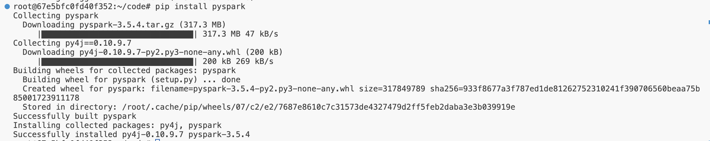

# Introduction to Apache Spark


## What is Apache Spark?

Spark is an open source powerful analytics engine for large-scale data processing. 

Spark has two fundamentals data abstractions: RDD(a set of element of same type) and DataFrame(a table of rows w named columns). 

### How does it work?

Spark applications run as independent sets of processes on a cluster, coordinated by the SparkContext object in your main program (*driver program*).


To run on a cluster, the SparkContext can connect to several types of cluster **managers (such as Spark’s own standalone cluster manager, Mesos and Kubernetes), which allocate resources across applications. Once connected, Spark acquires executors on nodes in the cluster, which are processes that run computations and store data for your application. Next, it sends your application code (Python files passed to SparkContext) to the executors. Finally, SparkContext sends tasks to the executors to run.


This figure helps us to understand how we can perform operations where the DataFrames are collected from sources and stored it into Cloud with the help of Programming Languages like Python, Java, Scala.

### Components of Spark:

**The Spark Driver** receives requests for computations and data from the user program, breaks down the task into stages, and submits them to the DAGScheduler.

**RDDs** are parallel data structures that enable users to persist intermediate data in memory and manipulate them using various operators. Spark distributes RDDs using clustering on server clusters and processes them at the same time or moves them to data storage.

Spark uses a **master/slave architecture** with one central coordinator, called the driver, and many distributed workers called executors.

Spark has **built-in modules** for SQL, streaming, machine learning, and graph processing.


A pictorial idea of how the SparkContext takes input and converts it to new_rdd with transformations.

**Spark Context** is the entry point to any Spark functionality. It allows an user application to interact with the cluster and submit jobs by connecting to a cluster(Standalone, Kubernetes).


How transformations are done in SparkContext with some tasks to make the data more reliable.

### How do we create a SparkSession?

```python
# Create an instance of SparkSession
spark=SparkSession.builder.getOrCreate()
# Create an RDD[String], which represents all input# records; each record becomes an RDD element
records=spark.sparkContext.textFile("sample.txt")
```

### **Trying out some hands-on programs to start a SparkSession**

**Prerequisites :**

- Update the terminal.
    
    ```python
    sudo apt update
    sudo apt upgrade -y
    ```
    
- Ensure you have Java installed.
    
    ```python
    sudo apt install default-jdk
    ```
    
- Install PySpark
    
    ```python
    pip install pyspark
    ```
    



- As everything installed, let’s try some basic code to see spark is working fine.

```python
from pyspark.sql import SparkSession
```

```python
#Create a Spark session
spark= SparkSession.builder \
        .appName("FirstSparkApp") \
        .getOrCreate()
        
#create a small dataset
data= [("John",30),("Alice",25),("Bob", 35)]
df= spark.createDataFrame(data, ["Name", "Age"])
df.show()

output: 
+-----+---+
| Name|Age|
+-----+---+
| John| 30|
|Alice| 25|
|  Bob| 35|
+-----+---+
```

We have perfectly made our first Spark code using PySpark and made a DataFrame.

## Transformations

Transformations are that kind of operations that creates a new RDD from an existing one. Important transformations (mapper and reducers)

### Lazy Evaluation:

Lazy evaluation is a concept where the whole transformations and actions are designed in such way that there will be transformation operations happening if the actions are given. This saves up the memory of all the transformations, as there are no usage of memory until an action is executed.

### Narrow vs Wide Transformation


**Narrow transformations:** are process within a single partition.

`map()` is the transformation that takes a function and applies it to each elements of the RDD.

Let’s assume we have a simple DataFrame 

```python
data= [("Alice", 30), ("Bob",56),("Cathe", 24)]
df1= spark.createDataFrame(data, ["Name", "Age"])
df1.show()

output:
+-----+---+
| Name|Age|
+-----+---+
|Alice| 30|
|  Bob| 56|
|Cathe| 24|
+-----+---+
```

as map() will apply a certain condition to each elements, we will add a greeting column to it where it will say Hello

```python
from pyspark.sql.functions import col, concat, lit
mapped_df= df1.withColumn("Greeting", concat(lit("Hello, "), col("Name")))
mapped_df.show()

output:
+-----+---+------------+
| Name|Age|    Greeting|
+-----+---+------------+
|Alice| 30|Hello, Alice|
|  Bob| 56|  Hello, Bob|
|Cathe| 24|Hello, Cathe|
+-----+---+------------+
```

`filter()` is the transformation that returns a new RDD with only the elements that passes the filter condition.

```python
filtered_df= df1.filter(col("age") > 30)
filtered_df.show()

output:
+----+---+
|Name|Age|
+----+---+
| Bob| 56|
+----+---+
```

`flatmap()` is the transformation that takes a function and applies it to each elements of the RDD as in map(). The difference is that it will return multiple values for each element of the source RDD.

Here we used a new DataFrame as sentence will turned into word stack.

```python
data= [("Alice love spark",), ("Bob loves python",)]
df2= spark.createDataFrame(data, ["sentence"])
df2.show()

output:
+----------------+
|        sentence|
+----------------+
|Alice love spark|
|Bob loves python|
+----------------+
```

```python
from pyspark.sql.functions import explode, split

flatmapped_df= df2.select(explode(split(col("sentence"), " ")).alias("word"))
flatmapped_df.show()

output:
+------+
|  word|
+------+
| Alice|
|  love|
| spark|
|   Bob|
| loves|
|python|
+------+
```


functions to change the RDD to more useable for analysis with transformations and here count() is used as an action.

**Wide transformations:** require a shuffle, meaning data needs to be redistributed across partitions, which involves network I/O and disk operations.

`reduceByKey()` merges the value of each key using associative reduce function.

```python
data = [("a", 1), ("b", 1), ("a", 2), ("b", 3)]
df = spark.createDataFrame(data, ["key", "value"])
```

we created a basic DataFrame to understand the transformations.

```python
result= df.groupBy("key").agg(sum("value").alias("sum_value"))
result.show()

output:
+---+---------+
|key|sum_value|
+---+---------+
|  b|        4|
|  a|        3|
+---+---------+
```

`groupByKey()` groups all the values associated with each key into single list.

```python
from pyspark.sql.functions import collect_list

result= df.groupBy("key").agg(collect_list("value").alias("values"))
result.show()

output:
+---+------+
|key|values|
+---+------+
|  b|[1, 3]|
|  a|[1, 2]|
+---+------+
```

`join()` combines two RDDs or DataFrames based on a common key.

To perform the join() transformation, we will need another DataFrame to concat them both into one.

```python
data2 = [("a", 3), ("b", 4), ("c", 5)]
df2 = spark.createDataFrame(data2, ["key", "other_value"])
```

```python
result=df.join(df2, on="key", how="inner")
result.show()

output:
+---+-----+-----------+
|key|value|other_value|
+---+-----+-----------+
|  a|    1|          3|
|  a|    2|          3|
|  b|    1|          4|
|  b|    3|          4|
+---+-----+-----------+
```

`repartition()` used to increase or decrease the number of partitions in an RDD or DataFrame.

```python
print("Initial partitions : ", df.rdd.getNumPartitions())

repartitioned_df= df.repartition(4)

print("Repartitioned to: ", repartitioned_df.rdd.getNumPartitions())

output:
Initial partitions :  2
Repartitioned to:  4
```

## Conclusion

In this introductory lab of Apache Spark, we got to know about the basic topics of Spark and the components of it.
