# Setting Up and Creating a Collection Type in Strapi

## Install Strapi

**Pre-requisites:** Make sure Node.js and npm are installed on your machine. Verify this by running the following commands in the terminal:

```bash
node -v
npm -v
```
If not installed, download and install Node.js from the official [Node.js website](https://nodejs.org/).

**Installation:** Open a terminal and run:

```bash
npx create-strapi-app strapi-project --quickstart
```
This command will create a new Strapi project and run it with SQLite as the default database. After the installation is complete, Strapi will launch and open the admin panel in your browser at `http://localhost:1337/admin`.

## Set up Admin User

Once the Strapi admin panel opens, you’ll be prompted to create an admin account. Fill in the required details (username, email, password) and click **Create Admin**. After this, you’ll be redirected to the dashboard.

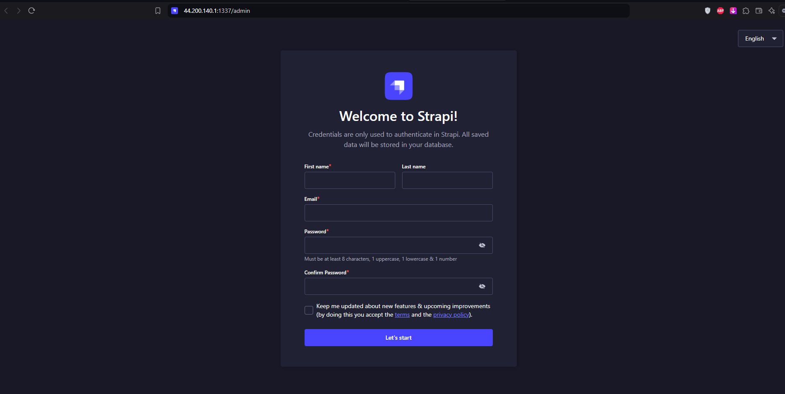

## Create a Collection Type

1. **Navigate to Content-Type Builder:** From the Strapi dashboard, click on **Content-Type Builder** in the left-hand menu.

   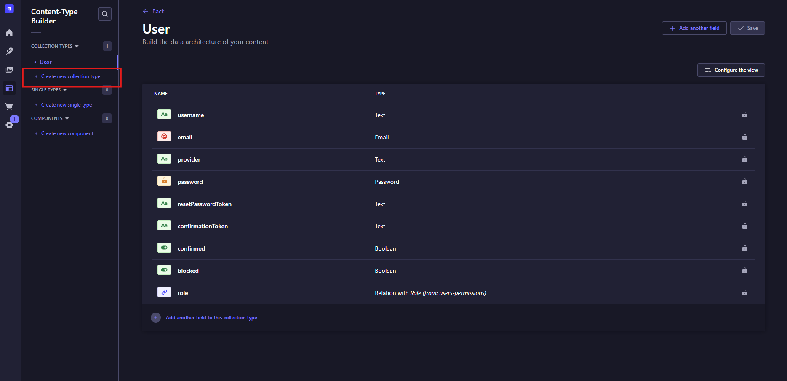

2. **Create a New Collection Type:**
   - Click the **+ Create new collection type** button.
   - In the "Display name" field, enter the name for your collection, e.g., `PoridhiLab`.
   - The `API ID` fields will be auto-filled as `poridhi-lab` (singular) and `poridhi-labs` (plural).
   - Click **Continue** to proceed.

   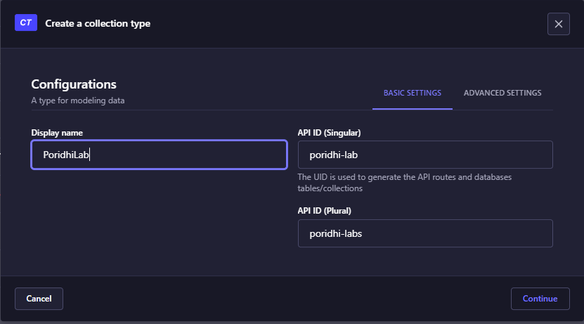

3. **Configure Collection Fields:**
   - Add fields based on your data requirements:
     - Click **Add another field** to select a field type. Options include Text, Number, Date, Media, etc.
     - For example, add a **Text** field named `name` and a **Rich Text** field named `readme`.
   
   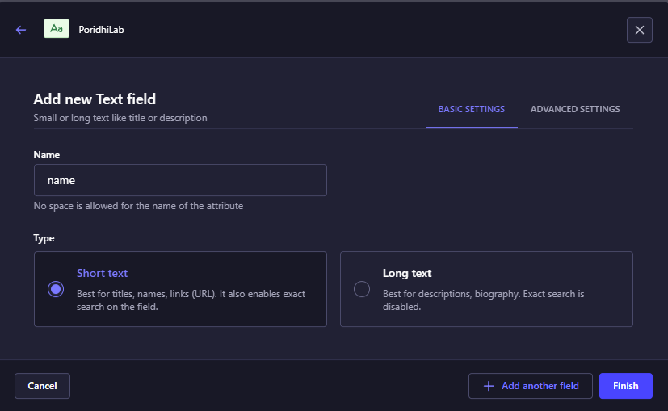
   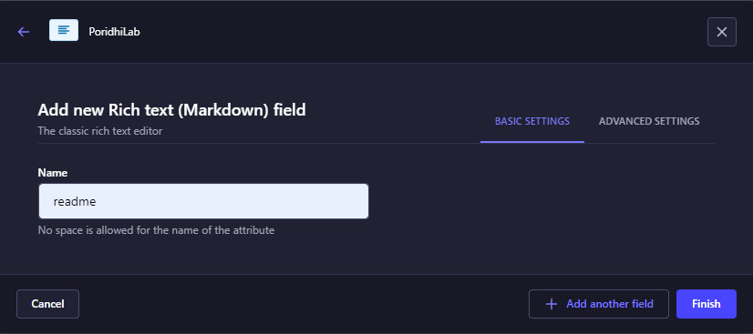

   - Configure field settings as required in `Advanced settings` (e.g., make the field required, set a unique constraint, etc.).

   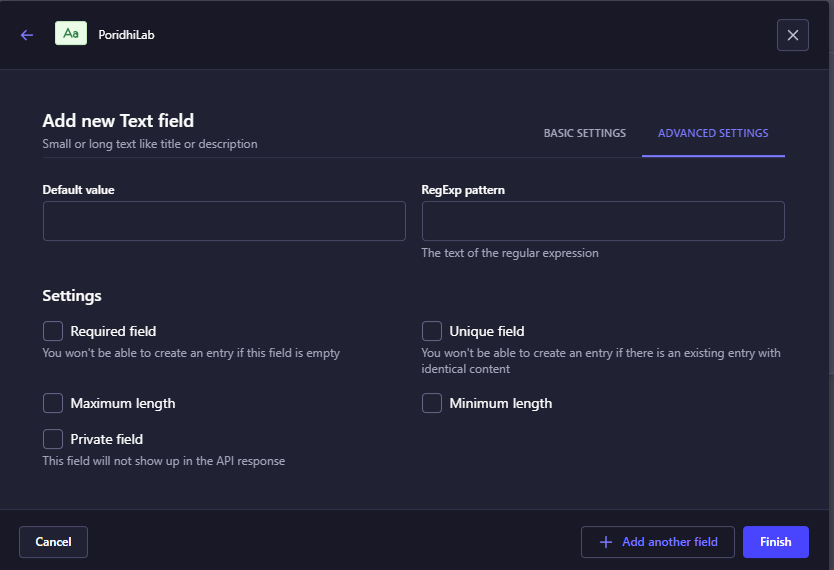

   - Click **Finish** after adding all necessary fields.

4. **Save Changes:** After creating the collection type, click the **Save** button in the top right corner. Wait for Strapi to rebuild the application.

## Upload Media Files

To upload images or other media assets to your collection type:

1. Click on the **Media Library** tab from the left-hand menu.

   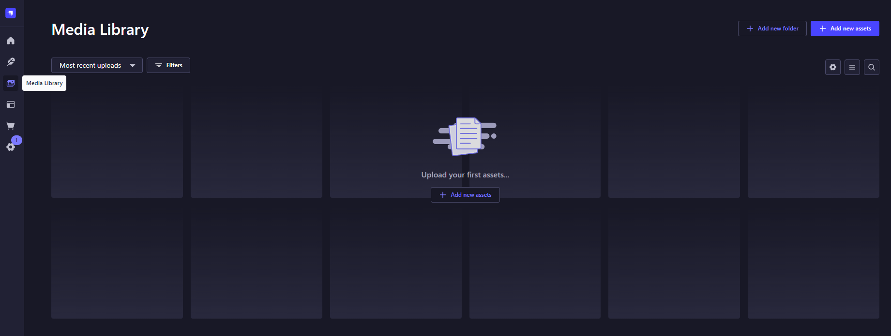

2. Click the **Add new assets** button.
3. Choose the files you want to upload (e.g., screenshots) and add them.
4. After adding the image, click on the image to open its details.
5. Copy the image URL by clicking on the **link icon** as shown below:

   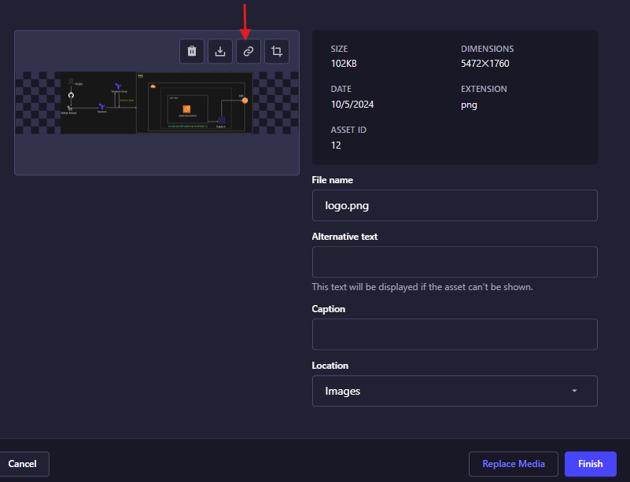

6. Use this image URL in your **readme** field or any other rich text field to display the image in your content.

## Create an Entry in the Collection Type

1. Go to the **Content Manager**.
2. Select your newly created collection type (e.g., `PoridhiLab`).
3. Click **Add New Entry**.

   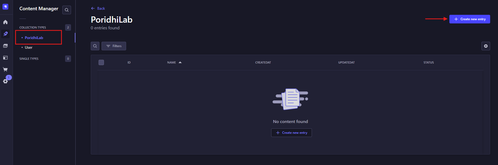

4. Fill in the fields with your data (e.g., `name: Lab - 01` and `readme` using Rich Text Markdown).

5. Save and Publish the entry.

   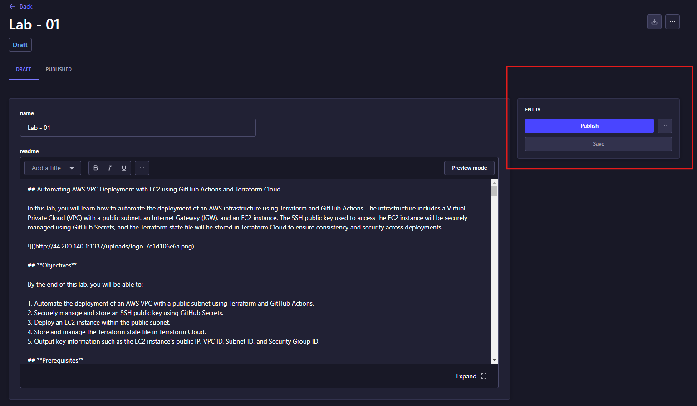

## Configure Roles and Permissions

1. Navigate to **Settings** -> **Roles** -> **Public**.

   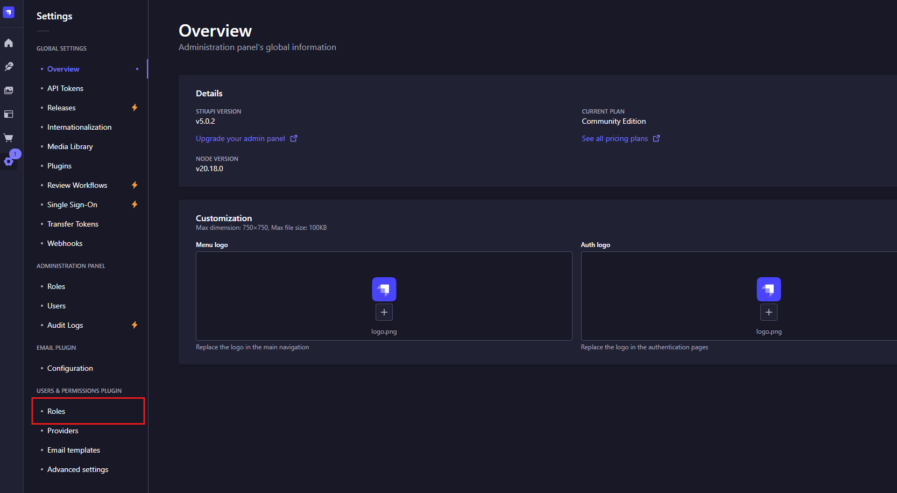
   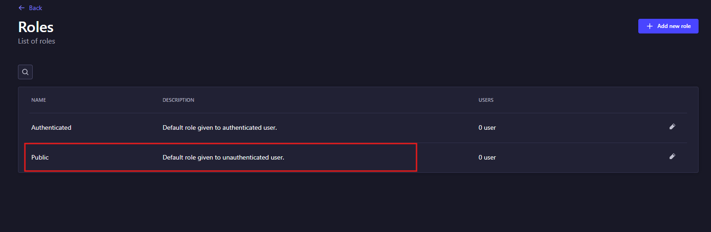

2. Under the **PoridhiLab** collection, enable `find` and `findOne` permissions.

   

3. In the right panel, find the `API` for your content.

4. Click **Save** to apply the changes.

## Access the API

Once the permissions are set, you can access your collection data via the API. Open your browser and enter:

```bash
http://localhost:1337/api/poridhi-labs
```

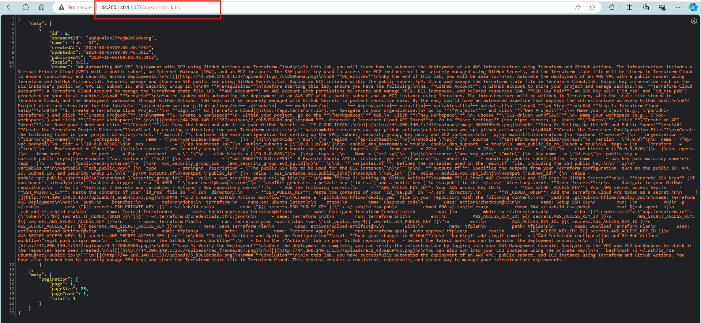

This will return all entries in your `PoridhiLab` collection type.

## Frontend React Application for Rendering `Readme.md`

1. Create a new React app using the following command:

   ```bash
   npx create-react-app poridhi-frontend
   ```

2. Change into the newly created directory:

    ```bash
    cd poridhi-frontend
    ```

3. Install necessary dependencies:

    ```bash
    npm install axios react-router-dom react-markdown highlight.js
    ```

4. Replace the default `src/App.js` with the following code:

    ```jsx
    import React from 'react';
    import { BrowserRouter as Router, Route, Routes } from 'react-router-dom';
    import ReadmeList from './components/ReadmeList';
    import ReadmeDetail from './components/ReadmeDetail';
    import './App.css';
    
    const App = () => {
      return (
        <Router>
          <div className="app-container">
            <div className="lab-list">
              <ReadmeList />
            </div>
            <div className="lab-content">
              <Routes>
                <Route path="/readme/:id" element={<ReadmeDetail />} />
                <Route path="/" element={<p>Select a lab to view its README</p>} />
              </Routes>
            </div>
          </div>
        </Router>
      );
    };
    
    export default App;
    ```

5. Create a new folder called `components` inside the `src` directory and add two new files: `ReadmeList.js` and `ReadmeDetail.js`.

6. Add the following code in `ReadmeList.js`:

    ```jsx
    import React, { useState, useEffect } from 'react';
    import axios from 'axios';
    import { Link } from 'react-router-dom';
    
    const ReadmeList = () => {
      const [readmes, setReadmes] = useState([]);
    
      useEffect(() => {
        const fetchReadmes = async () => {
          try {
            const response = await axios.get('http://localhost:1337/api/poridhi-labs');
            setReadmes(response.data.data);
          } catch (error) {
            console.error("Error fetching readme data", error);
          }
        };
    
        fetchReadmes();
      }, []);
    
      return (
        <div>
          <h1>Terraform Labs</h1>
          <ul>
            {readmes.map((readme) => (
              <li key={readme.id}>
                <Link to={`/readme/${readme.id}`}>{readme.attributes.name}</Link>
              </li>
            ))}
          </ul>
        </div>
      );
    };
    
    export default ReadmeList;
    ```

7. Add the following code in `ReadmeDetail.js`:

    ```jsx
    import React, { useState, useEffect } from 'react';
    import axios from 'axios';
    import ReactMarkdown from 'react-markdown';
    import { useParams } from 'react-router-dom';
    import highlightjs from 'highlight.js';
    import 'highlight.js/styles/github.css';
    import '../App.css';
    
    const ReadmeDetail = () => {
      const { id } = useParams();
      const [readmeContent, setReadmeContent] = useState(null);
    
      useEffect(() => {
        const fetchReadme = async () => {
          try {
            const response = await axios.get(`http://localhost:1337/api/poridhi-labs/${id}`);
            setReadmeContent(response.data.data.attributes.readme);
          } catch (error) {
            console.error("Error fetching readme content", error);
          }
        };
    
        fetchReadme();
      }, [id]);
    
      useEffect(() => {
        highlightjs.highlightAll();
      }, [readmeContent]);
    
      if (!readmeContent) return <p>Loading...</p>;
    
      return (
        <div className="markdown-body">
          <ReactMarkdown>{readmeContent}</ReactMarkdown>
        </div>
      );
    };
    
    export default ReadmeDetail;
    ```

8. Update the `src/App.css` file with the following styles:

    ```css
    /* Flexbox layout */
    .app-container {
      display: flex;
      height: 100vh;  /* Full height of the viewport */
    }
    
    .lab-list {
      width: 25%;  /* 25% width for the list of labs */
      background-color: #f0f0f0;
      padding: 20px;
      border-right: 1px solid #ccc;
      overflow-y: auto;
    }
    
    .lab-content {
      width: 75%;  /* 75% width for the lab content */
      padding: 20px;
      overflow-y: auto;
      background-color: #fff;
    }
    
    /* Markdown-specific styles to mimic GitHub */
    .markdown-body {
      box-sizing: border-box;
      min-width: 200px;
      max-width: 980px;
      margin: 0 auto;
      padding: 45px;
      font-family: -apple-system, BlinkMacSystemFont, "Segoe UI", Helvetica, Arial, sans-serif, "Apple Color Emoji", "
    
    Segoe UI Emoji", "Segoe UI Symbol";
    }
    
    .markdown-body h1,
    .markdown-body h2,
    .markdown-body h3,
    .markdown-body h4,
    .markdown-body h5,
    .markdown-body h6 {
      margin: 1.5em 0 1em;
      padding-bottom: 0.3em;
      border-bottom: 1px solid #eee;
      font-weight: bold;
    }
    
    .markdown-body p {
      line-height: 1.6;
      margin-bottom: 1.25em;
    }
    
    .markdown-body a {
      color: #0366d6;
      text-decoration: none;
    }
    
    .markdown-body a:hover {
      text-decoration: underline;
    }
    
    .markdown-body pre {
      background-color: #f6f8fa;
      padding: 16px;
      overflow: auto;
      border-radius: 6px;
    }
    
    .markdown-body code {
      background-color: #f6f8fa;
      padding: 2px 4px;
      border-radius: 6px;
      font-size: 85%;
    }
    
    .markdown-body blockquote {
      padding: 0 1em;
      color: #6a737d;
      border-left: 0.25em solid #dfe2e5;
      margin-bottom: 1.25em;
    }
    
    .markdown-body table {
      width: 100%;
      border-collapse: collapse;
    }
    
    .markdown-body th, 
    .markdown-body td {
      padding: 6px 13px;
      border: 1px solid #dfe2e5;
    }
    
    .markdown-body th {
      background-color: #f6f8fa;
      text-align: left;
    }
    
    .markdown-body img {
      max-width: 100%;
      box-sizing: border-box;
      background-color: #fff;
      border-radius: 6px;
      box-shadow: 0 1px 4px rgba(0,0,0,0.12);
    }
    ```
    
9. Run the React app:
    
    ```bash
    npm start
    ```
10. Accessing The application
     
     ```bahs
     http://localhost:3000
     ```

     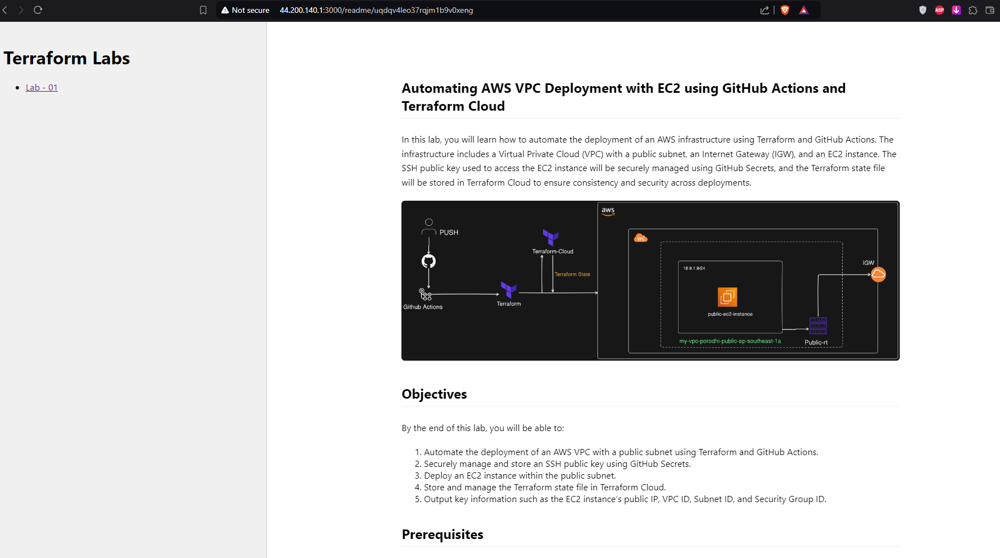
    
This will open the frontend in your default web browser at `http://localhost:3000`. Your React app should now be able to communicate with the Strapi backend to display the list of README entries and their content.