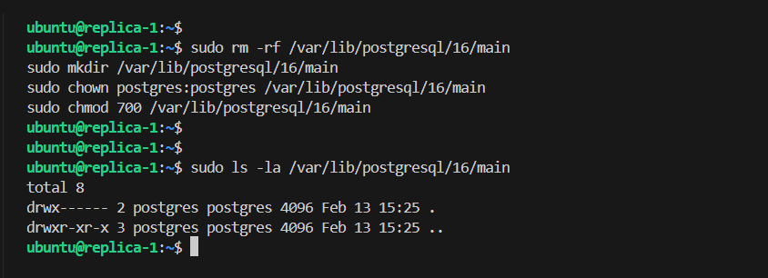
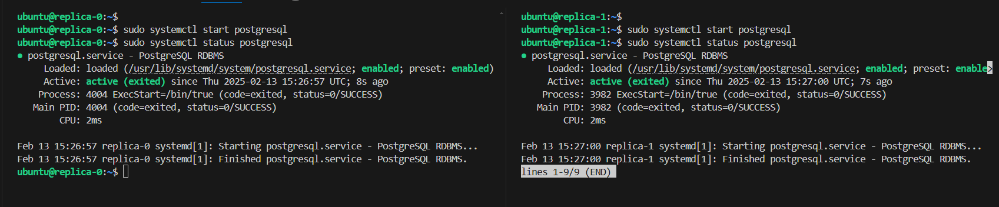
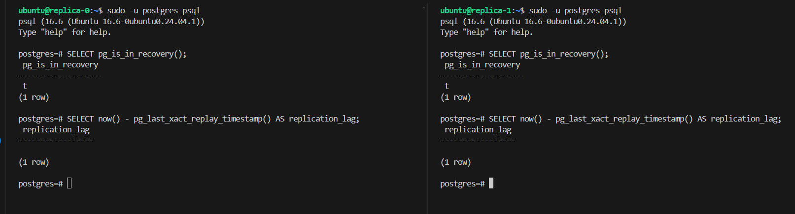
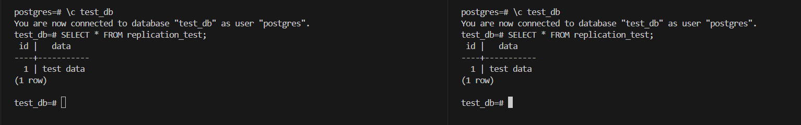

# Database Replication using PostgreSQL


Database replication is the process of copying and synchronizing data across multiple database servers. This ensures that all copies of the database remain consistent, available, and up to date. Replication is widely used to improve data availability, disaster recovery, load balancing, and performance in distributed database systems.

In this lab, we will configure a PostgreSQL database cluster with one master and two replicas. The master will be configured to send data to the replicas, and the replicas will be configured to receive data from the master. The lab will cover the following topics:

- Configure the master server
- Configure the replica servers
- Verify the replication setup
- Troubleshoot common issues

Here is the system architecture:

## AWS Infrastructure

In this setup, we will design and deploy AWS Infrastructure to support PostgreSQL Database Cluster. The cluster will

- Consist of three public instances, divided into two categories: Master and Replicas.
- To enable connectivity and internet access to the nodes, we will create a public route table and attach an internet gateway to it. This will allow the nodes to communicate with each other and access external resources and services.
- Finally, we will utilize Pulumi python to create and manage this AWS infrastructure.

### Configure AWS CLI

```bash
aws configure
```

### Provision AWS Infrastructure

1. Create a new directory for this lab and navigate into it:

```bash
mkdir lab-02 && cd lab-02
```

2. Install python venv

```bash
sudo apt update
sudo apt install python3.8-venv -y
```

3. Create a new pulumi project

```bash
pulumi new aws-python
```

4. Update the Pulumi program (__main__.py) to create the infrastructure   

```python
import pulumi
import pulumi_aws as aws
import os

# Create a VPC
vpc = aws.ec2.Vpc(
    'db-cluster-vpc',
    cidr_block='10.0.0.0/16',
    enable_dns_support=True,
    enable_dns_hostnames=True,
    tags={'Name': 'db-cluster-vpc'}
)

# Create a subnet
subnet = aws.ec2.Subnet(
    'db-cluster-subnet',
    vpc_id=vpc.id,
    cidr_block='10.0.1.0/24',
    map_public_ip_on_launch=True,
    tags={'Name': 'db-cluster-subnet'}
)

# Create an Internet Gateway
internet_gateway = aws.ec2.InternetGateway(
    'db-cluster-internet-gateway',
    vpc_id=vpc.id,
    tags={'Name': 'db-cluster-internet-gateway'}
)

# Create a Route Table
route_table = aws.ec2.RouteTable(
    'db-cluster-route-table',
    vpc_id=vpc.id,
    routes=[
        aws.ec2.RouteTableRouteArgs(
            cidr_block='0.0.0.0/0',
            gateway_id=internet_gateway.id,
        )
    ],
    tags={'Name': 'db-cluster-route-table'}
)

# Associate the route table with the subnet
route_table_association = aws.ec2.RouteTableAssociation(
    'db-cluster-route-table-association',
    subnet_id=subnet.id,
    route_table_id=route_table.id
)

# Create a security group with egress and ingress rules
security_group = aws.ec2.SecurityGroup(
    'db-cluster-security-group',
    vpc_id=vpc.id,
    description="db-cluster security group",
    ingress=[
        aws.ec2.SecurityGroupIngressArgs(
            protocol='-1',
            from_port=0,
            to_port=0,
            cidr_blocks=['0.0.0.0/0'],
        ),
    ],
    egress=[
        aws.ec2.SecurityGroupEgressArgs(
            protocol='-1',  # -1 allows all protocols
            from_port=0,
            to_port=0,
            cidr_blocks=['0.0.0.0/0'],  # Allow all outbound traffic
        )
    ],
    tags={'Name': 'db-cluster-security-group'}
)

# Create EC2 Instances for MasterDB
master_instances = []
for i in range(1):
    master = aws.ec2.Instance(
        f'master-{i}',
        instance_type='t2.small',
        ami='ami-01811d4912b4ccb26',  # Update with correct Ubuntu AMI ID
        subnet_id=subnet.id,
        key_name="db-cluster",
        vpc_security_group_ids=[security_group.id],
        associate_public_ip_address=True,
        private_ip=f'10.0.1.1{i}',
        tags={
            'Name': f'master-{i}'
        }
    )
    master_instances.append(master)

# Create EC2 Instances for Replicas
replica_instances = []
for i in range(2):
    replica = aws.ec2.Instance(
        f'replica-{i}',
        instance_type='t2.small',
        ami='ami-01811d4912b4ccb26',  # Update with correct Ubuntu AMI ID
        subnet_id=subnet.id,
        key_name="db-cluster",
        vpc_security_group_ids=[security_group.id],
        associate_public_ip_address=True,
        private_ip=f'10.0.1.2{i}',
        tags={'Name': f'replica-{i}'}
    )
    replica_instances.append(replica)

# Export Public and Private IPs of Controller and Worker Instances
master_public_ips = [master.public_ip for master in master_instances]
master_private_ips = [master.private_ip for master in master_instances]
replica_public_ips = [replica.public_ip for replica in replica_instances]
replica_private_ips = [replica.private_ip for replica in replica_instances]

pulumi.export('master_public_ips', master_public_ips)
pulumi.export('master_private_ips', master_private_ips)
pulumi.export('replica_public_ips', replica_public_ips)
pulumi.export('replica_private_ips', replica_private_ips)

# Export the VPC ID and Subnet ID for reference
pulumi.export('vpc_id', vpc.id)
pulumi.export('subnet_id', subnet.id)

# create config file
def create_config_file(ip_list):
    # Define the hostnames for each IP address
    hostnames = ['master-0', 'replica-0', 'replica-1']
    
    config_content = ""
    
    # Iterate over IP addresses and corresponding hostnames
    for hostname, ip in zip(hostnames, ip_list):
        config_content += f"Host {hostname}\n"
        config_content += f"    HostName {ip}\n"
        config_content += f"    User ubuntu\n"
        config_content += f"    IdentityFile ~/.ssh/db-cluster.id_rsa\n\n"
    
    # Write the content to the SSH config file
    config_path = os.path.expanduser("~/.ssh/config")
    with open(config_path, "w") as config_file:
        config_file.write(config_content)

# Collect the IPs for all nodes
all_ips = [master.public_ip for master in master_instances] + [replica.public_ip for replica in replica_instances]

# Create the config file with the IPs once the instances are ready
pulumi.Output.all(*all_ips).apply(create_config_file)
```

### Generate SSH Key      

```bash
aws ec2 create-key-pair --key-name db-cluster --output text --query 'KeyMaterial' > db-cluster.id_rsa
chmod 400 db-cluster.id_rsa 
```

### Provision the Infrastructure

```bash
pulumi up
```

```bash
sudo hostnamectl set-hostname master-0
```

```bash
sudo hostnamectl set-hostname replica-0
```

```bash
sudo hostnamectl set-hostname replica-1
```

```bash
sudo hostnamectl set-hostname app-server
```


## 1. Master Server Configuration (master-0)

### 1.1 Configure postgresql.conf
```bash
# Edit postgresql.conf
sudo vim /etc/postgresql/16/main/postgresql.conf

# Add/modify these settings
listen_addresses = '*'
wal_level = replica
max_wal_senders = 10
max_replication_slots = 10
wal_keep_size = 1GB
```

### 1.2 Configure pg_hba.conf
```bash
# Edit pg_hba.conf
sudo vim /etc/postgresql/16/main/pg_hba.conf

# Add these lines at the end (using private IPs)
host    replication     replicator      10.0.2.20/32        md5
host    replication     replicator      10.0.2.21/32        md5
host    all            replicator      10.0.2.20/32        md5
host    all            replicator      10.0.2.21/32        md5
```

### 1.3 Create Replication User
```sql
# Connect to PostgreSQL
sudo -u postgres psql

-- Drop user if exists (if needed)
DROP USER IF EXISTS replicator;

-- Create replication user with proper permissions
CREATE USER replicator WITH LOGIN REPLICATION PASSWORD 'db-cluster';

-- Verify the user was created
\du replicator

-- Exit psql
\q
```

### 1.4 Restart PostgreSQL on Master
```bash
sudo systemctl restart postgresql

# Verify PostgreSQL is running
sudo systemctl status postgresql

# Test network connectivity
nc -zv 10.0.1.10 5432
```

## 2. Replica Servers Configuration

### 2.1 Stop PostgreSQL on Replicas
```bash
# On both replica-0 and replica-1
sudo systemctl stop postgresql
sudo systemctl status postgresql  # Verify it's stopped
```

### 2.2 Prepare Data Directory on Replicas
```bash
# On both replicas
# Remove the entire directory and recreate it
sudo rm -rf /var/lib/postgresql/16/main
sudo mkdir /var/lib/postgresql/16/main
sudo chown postgres:postgres /var/lib/postgresql/16/main
sudo chmod 700 /var/lib/postgresql/16/main

# Verify directory is empty and has correct permissions
sudo ls -la /var/lib/postgresql/16/main
```




### 2.3 Create Base Backup on Replicas
```bash
# On replica-0
sudo -u postgres pg_basebackup -h 10.0.1.10 -D /var/lib/postgresql/16/main \
    -U replicator -P -v -R -X stream -C -S replica0

# On replica-1
sudo -u postgres pg_basebackup -h 10.0.1.10 -D /var/lib/postgresql/16/main \
    -U replicator -P -v -R -X stream -C -S replica1

# When prompted for password, enter: db-cluster
```

### 2.4 Start PostgreSQL on Replicas
```bash
# On both replicas
sudo systemctl start postgresql
sudo systemctl status postgresql
```



## 3. Verify Replication Setup

### 3.1 Check Replica Status
```sql
# On both replicas
sudo -u postgres psql

-- Verify replica mode
SELECT pg_is_in_recovery();  -- Should return 't'

-- Check replication lag
SELECT now() - pg_last_xact_replay_timestamp() AS replication_lag;

\q
```



### 3.2 Check Master Status
```sql
# On master
sudo -u postgres psql

-- Check replication connections
SELECT client_addr, state, sent_lsn, write_lsn, flush_lsn, replay_lsn 
FROM pg_stat_replication;

-- Check replication slots
SELECT slot_name, active FROM pg_replication_slots;

\q
```


### 3.3 Test Replication

```sql
# On master
sudo -u postgres psql

-- Create test database and table
CREATE DATABASE test_db;
\c test_db
CREATE TABLE replication_test (id serial primary key, data text);
INSERT INTO replication_test (data) VALUES ('test data');
```


### 3.4 On both replicas
```sql
\c test_db
SELECT * FROM replication_test;
```



## 4. Troubleshooting Tips

### 4.1 Connection Issues
```bash
# Test network connectivity
nc -zv 10.0.1.10 5432

# Check PostgreSQL logs
sudo tail -f /var/log/postgresql/postgresql-17-main.log
```

### 4.2 Authentication Issues
```sql
-- On master, verify replication user
\du replicator

-- Check pg_hba.conf entries
sudo grep replicator /etc/postgresql/17/main/pg_hba.conf
```

### 4.3 Replication Slot Issues
```sql
-- On master, check slot status
SELECT slot_name, active FROM pg_replication_slots;

-- If needed, drop and recreate slots
SELECT pg_drop_replication_slot('replica0');
SELECT pg_drop_replication_slot('replica1');
```

## 5. Maintenance Considerations

### 5.1 Monitor Replication Lag
```sql
-- On master
SELECT client_addr, 
       pg_size_pretty(pg_wal_lsn_diff(pg_current_wal_lsn(), replay_lsn)) as lag_size
FROM pg_stat_replication;
```

### 5.2 Regular Health Checks
```sql
-- On replicas
SELECT pg_is_in_recovery(), pg_last_wal_receive_lsn(), pg_last_wal_replay_lsn();
```

```bash
rsync -avz -e "ssh -i ~/.ssh/db-cluster.id_rsa" db-cluster-app ubuntu@app-server:/home/ubuntu/
```


