# Master Slave DB Replication

Database replication is the process of copying and synchronizing data across multiple database servers. This ensures that all copies of the database remain consistent, available, and up to date. Replication is widely used to improve data availability, disaster recovery, load balancing, and performance in distributed database systems.

In this lab, we will create a master-slave database replication setup using PostgreSQL on AWS. Here's an overview of the architecture:


## AWS Infrastructure

In this setup, we will design and deploy AWS Infrastructure to support Database Cluster. The cluster will

Consist of four public instances: 

1. **Database Cluster**: `master-0`, `replica-0`, `replica-1`.
2. **Application Server**: `app-server`.

To enable connectivity and access we will create necessary route tables, internet gateway, subnets, security groups and configure the rules, Network Load Balancer and target groups.

We will use **Pulumi python** to create and manage this AWS infrastructure.

## Setting up the AWS CLI and Pulumi

The AWS CLI is a command-line tool that allows you to interact with AWS services programmatically. It simplifies provisioning resources, such as EC2 instances and load balancers, which are required to host our database cluster and application server.

### Configure AWS CLI

```bash
aws configure
```

- `AWS Access Key ID:` Your access key to authenticate AWS API requests.
- `AWS Secret Access Key:` A secret key associated with your access key.
- `Default region:` The AWS region in which you want to provision your resources (ap-southeast-1).
- `Default output format:` You can choose the output format (JSON, text, table).

> Get your access key and secret access key from Poridhi's lab account by generating AWS credentials.

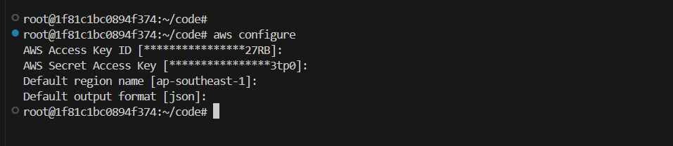

## Provisioning Compute Resources

In this step, we will provision the necessary AWS resources that will host our database cluster and application server.

**1. Create a Directory for Your Infrastructure**

Before starting, it’s best to create a dedicated directory for the infrastructure files:

```bash
mkdir db-cluster-aws
cd db-cluster-aws
```

**2. Install Python venv**

Set up a Python virtual environment (venv) to manage dependencies for Pulumi or other Python-based tools:

```bash
sudo apt update
sudo apt install python3.8-venv -y
```

This will set up a Python virtual environment which will be useful later when working with Pulumi.

**3. Initialize a New Pulumi Project**

Pulumi is an Infrastructure-as-Code (IaC) tool used to manage cloud infrastructure. In this tutorial, you'll use Pulumi python to provision the AWS resources required for Database Cluster.

Run the following command to initialize a new Pulumi project:

```bash
pulumi new aws-python
```

**4. Update the `__main.py__` file:**

Open the `__main__.py` file and define the AWS infrastructure required for the Database Cluster. This Pulumi code provisions the foundational infrastructure required to set up a Database Cluster on AWS. It handles the creation of a Virtual Private Cloud (VPC), subnets, security groups, EC2 instances, and a Network Load Balancer (NLB).

```python
import pulumi
import pulumi_aws as aws
import os

# Create a VPC
vpc = aws.ec2.Vpc(
    'db-cluster-vpc',
    cidr_block='10.0.0.0/16',
    enable_dns_support=True,
    enable_dns_hostnames=True,
    tags={'Name': 'db-cluster-vpc'}
)

# Create two subnets in different AZs
subnet1 = aws.ec2.Subnet(
    'db-cluster-subnet-1',
    vpc_id=vpc.id,
    cidr_block='10.0.1.0/24',
    availability_zone='ap-southeast-1a',
    map_public_ip_on_launch=True,
    tags={
        'Name': 'db-cluster-subnet-1',
        'Environment': 'production'
    }
)

subnet2 = aws.ec2.Subnet(
    'db-cluster-subnet-2',
    vpc_id=vpc.id,
    cidr_block='10.0.2.0/24',
    availability_zone='ap-southeast-1b',
    map_public_ip_on_launch=True,
    tags={
        'Name': 'db-cluster-subnet-2',
        'Environment': 'production'
    }
)

# Create an Internet Gateway
internet_gateway = aws.ec2.InternetGateway(
    'db-cluster-internet-gateway',
    vpc_id=vpc.id,
    tags={'Name': 'db-cluster-internet-gateway'}
)

# Create a Route Table
route_table = aws.ec2.RouteTable(
    'db-cluster-route-table',
    vpc_id=vpc.id,
    routes=[
        aws.ec2.RouteTableRouteArgs(
            cidr_block='0.0.0.0/0',
            gateway_id=internet_gateway.id,
        )
    ],
    tags={'Name': 'db-cluster-route-table'}
)

# Associate the route table with both subnets
route_table_association1 = aws.ec2.RouteTableAssociation(
    'db-cluster-route-table-association-1',
    subnet_id=subnet1.id,
    route_table_id=route_table.id
)

route_table_association2 = aws.ec2.RouteTableAssociation(
    'db-cluster-route-table-association-2',
    subnet_id=subnet2.id,
    route_table_id=route_table.id
)


# Create security group for NLB
nlb_security_group = aws.ec2.SecurityGroup(
    'nlb-security-group',
    vpc_id=vpc.id,
    description="NLB security group",
    ingress=[
        aws.ec2.SecurityGroupIngressArgs(
            protocol='tcp',
            from_port=5432,
            to_port=5432,
            cidr_blocks=['10.0.0.0/16'],
        ),
    ],
    egress=[
        aws.ec2.SecurityGroupEgressArgs(
            protocol='-1',
            from_port=0,
            to_port=0,
            cidr_blocks=['0.0.0.0/0'],
        )
    ],
    tags={
        'Name': 'nlb-security-group',
        'Environment': 'production'
    }
)

# Create a security group for the database cluster
db_security_group = aws.ec2.SecurityGroup(
    'db-cluster-security-group',
    vpc_id=vpc.id,
    description="Database cluster security group",
    ingress=[
        # PostgreSQL from vpc
        aws.ec2.SecurityGroupIngressArgs(
            protocol='tcp',
            from_port=5432,
            to_port=5432,
            cidr_blocks=['10.0.0.0/16'],
        ),
        # PostgreSQL from NLB security group
        aws.ec2.SecurityGroupIngressArgs(
            protocol='tcp',
            from_port=5432,
            to_port=5432,
            security_groups=[nlb_security_group.id],
        ),
        # SSH access
        aws.ec2.SecurityGroupIngressArgs(
            protocol='tcp',
            from_port=22,
            to_port=22,
            cidr_blocks=['0.0.0.0/0'],
        ),
    ],
    egress=[
        aws.ec2.SecurityGroupEgressArgs(
            protocol='-1',
            from_port=0,
            to_port=0,
            cidr_blocks=['0.0.0.0/0'],
        )
    ],
    tags={
        'Name': 'db-cluster-security-group',
        'Environment': 'production'
    }
)

# Create a security group for the application server
app_security_group = aws.ec2.SecurityGroup(
    'app-security-group',
    vpc_id=vpc.id,
    description="Application server security group",
    ingress=[
        # HTTP
        aws.ec2.SecurityGroupIngressArgs(
            protocol='tcp',
            from_port=80,
            to_port=80,
            cidr_blocks=['0.0.0.0/0'],
        ),
        # HTTPS
        aws.ec2.SecurityGroupIngressArgs(
            protocol='tcp',
            from_port=443,
            to_port=443,
            cidr_blocks=['0.0.0.0/0'],
        ),
        # Node.js application port
        aws.ec2.SecurityGroupIngressArgs(
            protocol='tcp',
            from_port=3000,
            to_port=3000,
            cidr_blocks=['0.0.0.0/0'],
        ),
        # SSH
        aws.ec2.SecurityGroupIngressArgs(
            protocol='tcp',
            from_port=22,
            to_port=22,
            cidr_blocks=['0.0.0.0/0'],
        ),
    ],
    egress=[
        aws.ec2.SecurityGroupEgressArgs(
            protocol='-1',
            from_port=0,
            to_port=0,
            cidr_blocks=['0.0.0.0/0'],
        )
    ],
    tags={
        'Name': 'app-security-group',
        'Environment': 'production'
    }
)

# User data script for application server
app_user_data = """#!/bin/bash
# Update system packages
sudo apt-get update
sudo apt-get upgrade -y

# Install Node.js and npm
curl -fsSL https://deb.nodesource.com/setup_18.x | sudo -E bash -
sudo apt-get install -y nodejs

# Install PostgreSQL client
sudo apt-get install -y postgresql-client

# Create application directory
sudo mkdir -p /opt/db-cluster-app
sudo chown ubuntu:ubuntu /opt/db-cluster-app

# Install PM2 for process management
sudo npm install -g pm2
"""


db_user_data = """#!/bin/bash
# Update system packages
sudo apt update

# Install PostgreSQL
sudo apt install -y postgresql postgresql-contrib
sudo systemctl start postgresql
sudo systemctl enable postgresql
"""


# Create EC2 Instance for Application Server
app_server = aws.ec2.Instance(
    'app-server',
    instance_type='t2.small',
    ami='ami-01811d4912b4ccb26',
    subnet_id=subnet1.id,
    key_name="db-cluster",
    vpc_security_group_ids=[app_security_group.id],
    associate_public_ip_address=True,
    private_ip='10.0.1.30',
    user_data=app_user_data,
    tags={
        'Name': 'app-server',
        'Environment': 'production'
    }
)

# Create EC2 Instance for Master DB
master_instances = []
master = aws.ec2.Instance(
    'master-0',
    instance_type='t2.small',
    ami='ami-01811d4912b4ccb26',
    subnet_id=subnet1.id,
    key_name="db-cluster",
    vpc_security_group_ids=[db_security_group.id],
    associate_public_ip_address=True,
    private_ip='10.0.1.10',
    user_data=db_user_data,
    tags={
        'Name': 'master-0',
        'Environment': 'production',
        'AZ': 'ap-southeast-1a'
    }
)
master_instances.append(master)

# Create EC2 Instances for Replicas in the first AZ
replica_instances_1 = []
for i in range(1):
    replica = aws.ec2.Instance(
        f'replica-az-a-{i}',
        instance_type='t2.small',
        ami='ami-01811d4912b4ccb26',
        subnet_id=subnet1.id, # same subnet as master
        key_name="db-cluster",
        vpc_security_group_ids=[db_security_group.id],
        associate_public_ip_address=True,
        private_ip=f'10.0.1.2{i}',
        user_data=db_user_data,
        tags={
            'Name': f'replica-az-a-{i}',
            'Environment': 'production',
            'AZ': 'ap-southeast-1a'

        }
    )
    replica_instances_1.append(replica)

# Create EC2 Instances for Replicas in the second AZ
replica_instances_2 = []
for i in range(1):
    replica = aws.ec2.Instance(
        f'replica-az-b-{i}',
        instance_type='t2.small',
        ami='ami-01811d4912b4ccb26',
        subnet_id=subnet2.id, # different subnet as master
        key_name="db-cluster",
        vpc_security_group_ids=[db_security_group.id],
        associate_public_ip_address=True,
        private_ip=f'10.0.2.2{i}',
        user_data=db_user_data,
        tags={
            'Name': f'replica-az-b-{i}',
            'Environment': 'production',
            'AZ': 'ap-southeast-1b'
        }
    )
    replica_instances_2.append(replica)

# Create Network Load Balancer
nlb = aws.lb.LoadBalancer(
    'postgres-nlb',
    internal=True,
    load_balancer_type='network',
    subnets=[subnet1.id, subnet2.id],
    enable_cross_zone_load_balancing=True,
    name='postgres-nlb'  # Added explicit name
)

# Create target group for read replicas
read_target_group = aws.lb.TargetGroup(
    'postgres-target-group',
    port=5432,
    protocol='TCP',
    vpc_id=vpc.id,
    target_type='ip',
    health_check=aws.lb.TargetGroupHealthCheckArgs(
        protocol='TCP',
        port=5432,
        healthy_threshold=2,
        unhealthy_threshold=2,
        interval=30,
        timeout=10
    ),
    tags={
        'Name': 'postgres-read-replicas',
        'Environment': 'production'
    }
)

# Function to create attachments
def create_attachment(name, target_id):
    return aws.lb.TargetGroupAttachment(
        name,
        target_group_arn=read_target_group.arn,
        target_id=target_id,
        port=5432
    )


# Attach master to target group using private IP
target_id = master.private_ip
attachment_name = master.tags["Name"].apply(
    lambda tag_name: f'master-tg-attachment'
)

# Create attachment using resolved values
attachment = pulumi.Output.all(target_id, attachment_name).apply(
    lambda vals: create_attachment(vals[1], vals[0])
)
# Debug output
attachment_name.apply(lambda name: pulumi.log.info(f'Creating TargetGroupAttachment with name: {name}'))


# Attach replicas to target group using private IPs
for i, replica in enumerate(replica_instances_1):
    # Use private IP instead of instance ID
    target_id = replica.private_ip
    attachment_name = replica.tags["Name"].apply(
        lambda tag_name: f'replica-{tag_name}-tg-attachment-{i}'
    )
    
    # Create attachment using resolved values
    attachment = pulumi.Output.all(target_id, attachment_name).apply(
        lambda vals: create_attachment(vals[1], vals[0])
    )
    # Debug output
    attachment_name.apply(lambda name: pulumi.log.info(f'Creating TargetGroupAttachment with name: {name}'))

# Attach replicas to target group using private IPs
for i, replica in enumerate(replica_instances_2):
    # Use private IP instead of instance ID
    target_id = replica.private_ip
    attachment_name = replica.tags["Name"].apply(
        lambda tag_name: f'replica-{tag_name}-tg-attachment-{i}'
    )
    
    # Create attachment using resolved values
    attachment = pulumi.Output.all(target_id, attachment_name).apply(
        lambda vals: create_attachment(vals[1], vals[0])
    )
    # Debug output
    attachment_name.apply(lambda name: pulumi.log.info(f'Creating TargetGroupAttachment with name: {name}'))

# Create listener for read requests
listener = aws.lb.Listener(
    'postgres-listener',
    load_balancer_arn=nlb.arn,
    port=5432,
    protocol='TCP',
    default_actions=[aws.lb.ListenerDefaultActionArgs(  # Using proper args structure
        type='forward',
        target_group_arn=read_target_group.arn,
    )]
)

# Export Public and Private IPs
master_public_ips = [master.public_ip for master in master_instances]
master_private_ips = [master.private_ip for master in master_instances]
replica_public_ips = [replica.public_ip for replica in replica_instances_1] + [replica.public_ip for replica in replica_instances_2]
replica_private_ips = [replica.private_ip for replica in replica_instances_1] + [replica.private_ip for replica in replica_instances_2]
app_server_public_ip = app_server.public_ip
app_server_private_ip = app_server.private_ip
load_balancer_dns = nlb.dns_name

# Export all the necessary information
pulumi.export('vpc_id', vpc.id)
pulumi.export('subnet1_id', subnet1.id)
pulumi.export('subnet2_id', subnet2.id)
pulumi.export('master_public_ips', master_public_ips)
pulumi.export('master_private_ips', master_private_ips)
pulumi.export('replica_public_ips', replica_public_ips)
pulumi.export('replica_private_ips', replica_private_ips)
pulumi.export('app_server_public_ip', app_server_public_ip)
pulumi.export('app_server_private_ip', app_server_private_ip)
pulumi.export('load_balancer_dns', load_balancer_dns)
pulumi.export('nlb_security_group_id', nlb_security_group.id)
pulumi.export('db_security_group_id', db_security_group.id)

# Updated create_config_file function
def create_config_file(args):
    # Split the flattened list into IPs and hostnames
    ip_list = args[:len(args)//2]
    hostname_list = args[len(args)//2:]
    
    config_content = "# PostgreSQL Cluster SSH Configuration\n\n"
    
    for hostname, ip in zip(hostname_list, ip_list):
        config_content += f"Host {hostname}\n"
        config_content += f"    HostName {ip}\n"
        config_content += f"    User ubuntu\n"
        config_content += f"    IdentityFile ~/.ssh/db-cluster.id_rsa\n"
        config_content += f"    StrictHostKeyChecking no\n\n"
    
    config_path = os.path.expanduser("~/.ssh/config")
    with open(config_path, "w") as config_file:
        config_file.write(config_content)

# Collect all IPs and hostnames including app server
all_ips = [master.public_ip for master in master_instances] + \
          [replica.public_ip for replica in replica_instances_1] + \
          [replica.public_ip for replica in replica_instances_2] + \
          [app_server.public_ip]

all_hostnames = [master.tags["Name"] for master in master_instances] + \
                [replica.tags["Name"] for replica in replica_instances_1] + \
                [replica.tags["Name"] for replica in replica_instances_2] + \
                [app_server.tags["Name"]]

# Combine all_ips and all_hostnames into a single list of Outputs
combined_outputs = all_ips + all_hostnames

# Create the config file with the IPs
pulumi.Output.all(*combined_outputs).apply(create_config_file)
```

**5. Create an AWS Key Pair**

Database Cluster nodes need to communicate securely. This key pair will be used to authenticate when accessing EC2 instances.

**Generate the Key Pair**

Use the following AWS CLI command to create a new SSH key pair named kubernetes:

```bash
cd ~/.ssh/
aws ec2 create-key-pair --key-name db-cluster --output text --query 'KeyMaterial' > db-cluster.id_rsa
chmod 400 db-cluster.id_rsa
```

This will save the private key as db-cluster.id_rsa in the `~/.ssh/` directory and restrict its permissions.

**6. Provision the Infrastructure**

Run the following command to provision the infrastructure:

```bash
pulumi up --yes
```

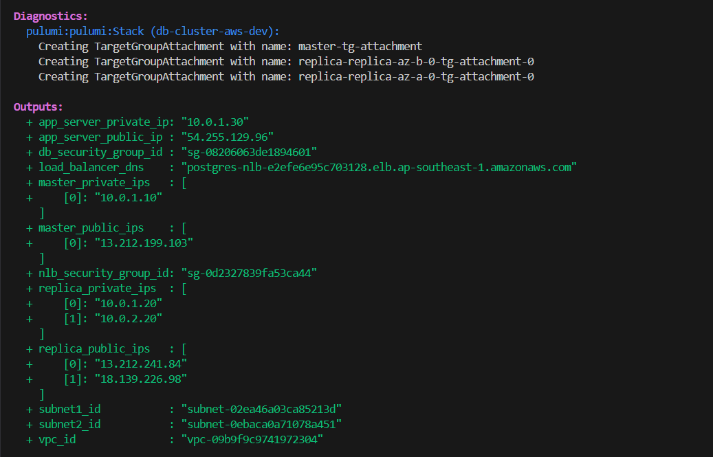

This will create the necessary resources and output the public and private IPs of the instances. This will also create a config file in `~/.ssh/config` file with the IPs of the instances.

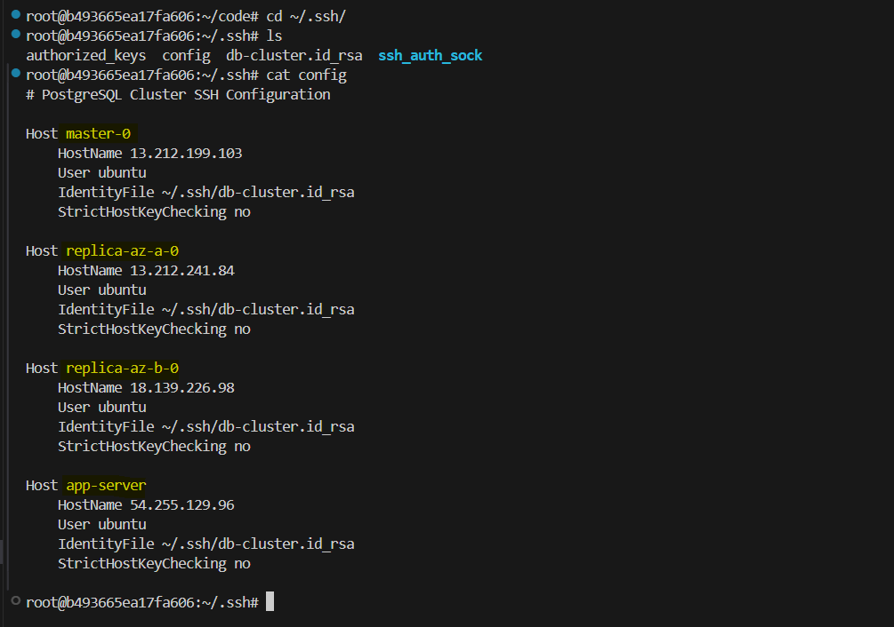


## SSH into the Database Cluster

First, connect to the master DB and replicas. As we have created the config file in `~/.ssh/config` file, we can connect to the instances by running the following command:

```bash
ssh master-0
```

You will be connected to the master DB. You may change the hostname to `master-0` by running the following command:

```bash
sudo hostnamectl set-hostname master-0
```

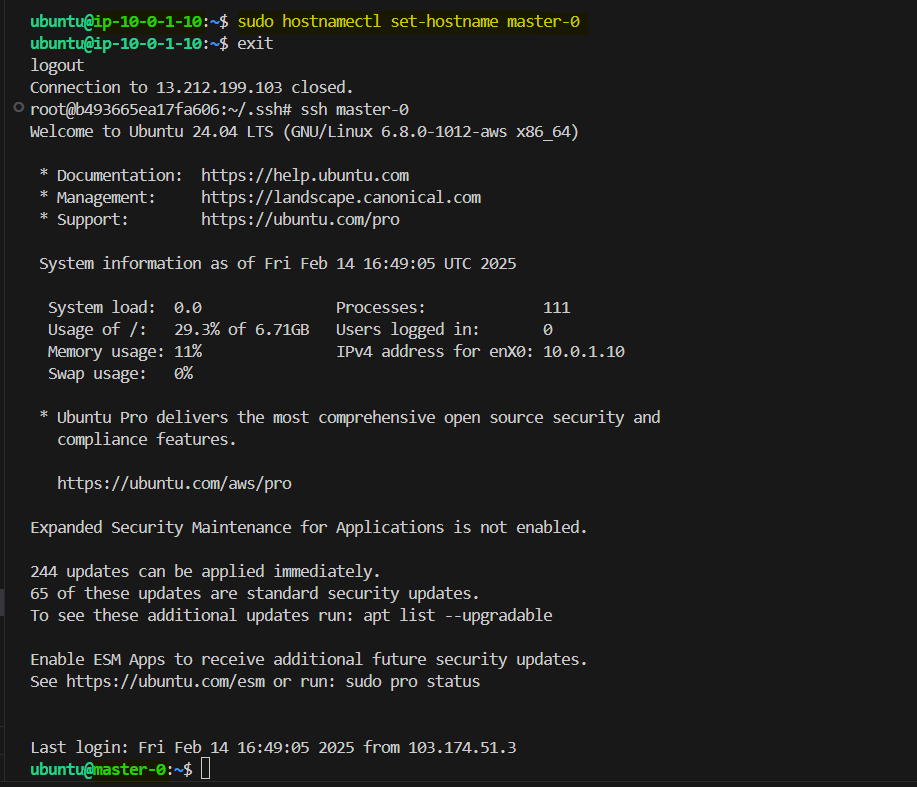

In the same way, you can connect to the replicas by running the following command:

Connect to the first replica:

```bash
ssh replica-az-a-0
```

Connect to the second replica:

```bash
ssh replica-az-b-0
```

You may change the hostname to `replica-az-a-0` and `replica-az-b-0` by running the following command in each of the instances:

```bash
sudo hostnamectl set-hostname replica-az-a-0
sudo hostnamectl set-hostname replica-az-b-0
```

## Configure the Database Cluster

We will configure the database cluster on the master DB and replicas. This will include configuring the `postgresql.conf` file and `pg_hba.conf` file. 

### 1. Master Server Configuration (master-0)

First we need to check the psql version on the master DB.

```bash
psql --version
```

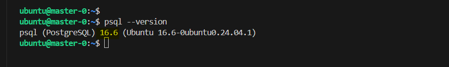

**1.1 Configure postgresql.conf**

Edit the `postgresql.conf` file:

```bash
sudo vim /etc/postgresql/16/main/postgresql.conf
```

> Note: If you are using a different version of PostgreSQL, you need to change the version in the path. As we are using PostgreSQL 16, the path is `/etc/postgresql/16/main/postgresql.conf`.

Add/modify these settings:

```bash
listen_addresses = '*'
wal_level = replica
max_wal_senders = 10
max_replication_slots = 10
wal_keep_size = 1GB
```

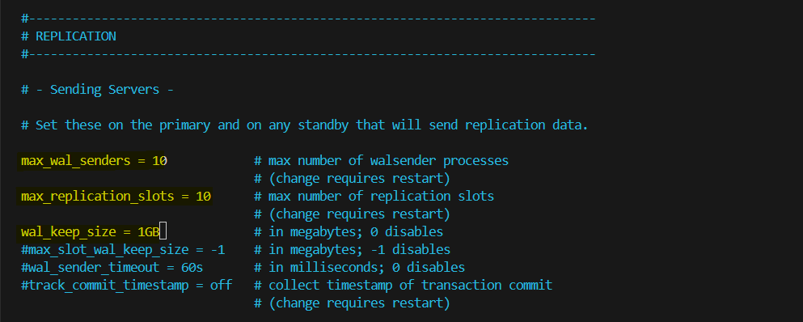

**1.2 Configure pg_hba.conf**

Edit the `pg_hba.conf` file:

```bash
sudo vim /etc/postgresql/16/main/pg_hba.conf
```

Add these lines at the end (using private IPs):

```bash
host    replication     replicator      10.0.1.20/32         md5
host    replication     replicator      10.0.2.20/32         md5
host    all             replicator      10.0.1.20/32         md5
host    all             replicator      10.0.2.20/32         md5
host    all             app_user        10.0.1.30/32         md5
host    all             app_user         10.0.1.0/24         md5     # Subnet 1 for NLB
host    all             app_user         10.0.2.0/24         md5     # Subnet 2 for NLB
```

These lines allow the master DB to connect to the replicas and the application server to connect to the master DB.

**1.3 Create Replication User**

Connect to the master DB and create a replication user.

```bash
sudo -u postgres psql

-- Drop user if exists (if needed)
DROP USER IF EXISTS replicator;

-- Create replication user with proper permissions
CREATE USER replicator WITH LOGIN REPLICATION PASSWORD 'db-cluster';

-- Verify the user was created
\du replicator

-- Exit psql
\q
```

> Note: We are using the password `db-cluster` for the replication user. You can change it to any other password.

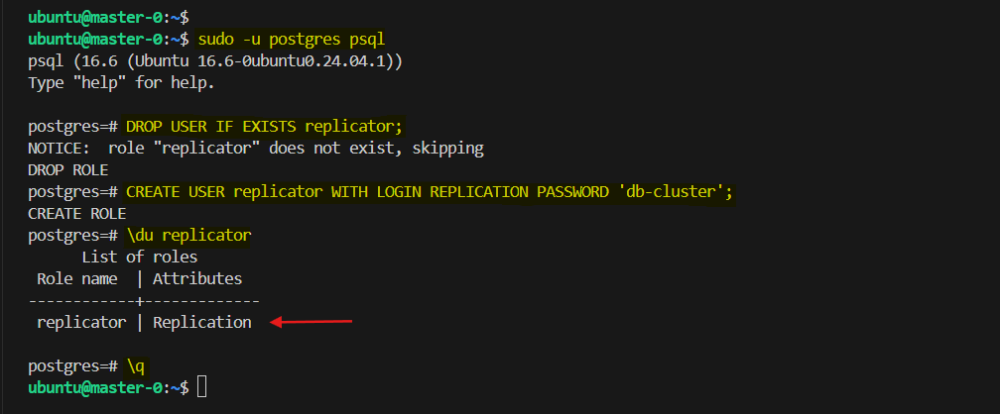

**1.4 Restart PostgreSQL on Master**

As we have modified the `postgresql.conf` file and `pg_hba.conf` file, we need to restart the PostgreSQL service.

```bash
sudo systemctl restart postgresql

# Verify PostgreSQL is running
sudo systemctl status postgresql
```

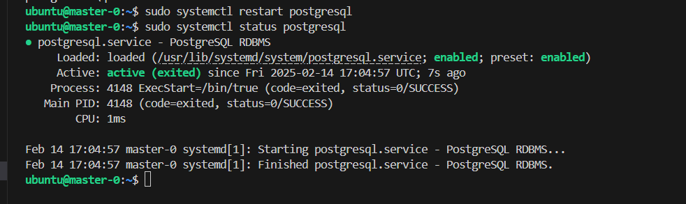

## 2. Replica Servers Configuration

Now, we will configure the replicas. Run the following commands on both replicas. First check the network connectivity to the master DB.

```bash
nc -zv 10.0.1.10 5432
```

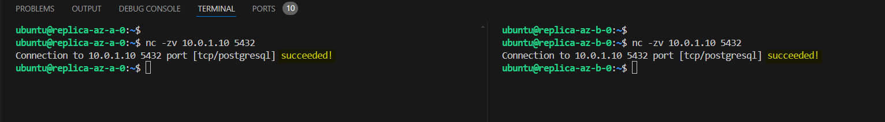

If the connection is successful, you can proceed with the following steps.

**2.1 Stop PostgreSQL on Replicas**

Stop the PostgreSQL service on both replicas.

```bash
sudo systemctl stop postgresql
sudo systemctl status postgresql  # Verify it's stopped
```

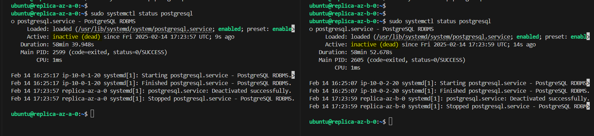

**2.2 Prepare Data Directory on Replicas**

Remove the entire directory and recreate it.

```bash
sudo rm -rf /var/lib/postgresql/16/main
sudo mkdir /var/lib/postgresql/16/main
sudo chown postgres:postgres /var/lib/postgresql/16/main
sudo chmod 700 /var/lib/postgresql/16/main
```

Verify directory is empty and has correct permissions.

```bash
sudo ls -la /var/lib/postgresql/16/main
```

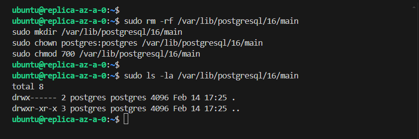

> Make sure to run the above commands on both replicas.

**2.3 Configure postgresql.conf**

Edit the `postgresql.conf` file:

```bash
sudo vim /etc/postgresql/16/main/postgresql.conf
```

Add/modify these settings:

```bash
listen_addresses = '*'
port = 5432
```

**2.4 Configure pg_hba.conf**

Edit the `pg_hba.conf` file:

```bash
sudo vim /etc/postgresql/16/main/pg_hba.conf
```

Add these lines:

```bash
# On both replicas, add to pg_hba.conf:

# Allow app server
host    all             app_user         10.0.1.30/32         md5    # App server

# Allow entire VPC subnets for NLB
host    all             app_user         10.0.1.0/24         md5     # Subnet 1
host    all             app_user         10.0.2.0/24         md5     # Subnet 2

# Allow master for replication verification
host    all             replicator       10.0.1.10/32         md5    # Master DB
```

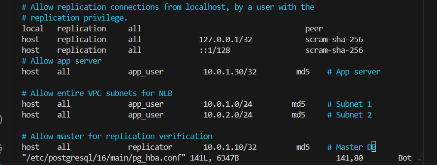

This configuration:

- Allows the app server (10.0.1.30) to connect directly
- Allows NLB to forward connections from both subnets
- Allows the master to verify replication status

The reason we include both subnet CIDRs (10.0.1.0/24 and 10.0.2.0/24) is because the NLB endpoints exist in both AZs, and connections could come from either subnet.

**2.5 Create Base Backup on Replicas**

Create a base backup on both replicas.

On replica-0:

```bash
sudo -u postgres pg_basebackup -h 10.0.1.10 -D /var/lib/postgresql/16/main \
    -U replicator -P -v -R -X stream -C -S replica_az_a_0
```

On replica-1:

```bash
sudo -u postgres pg_basebackup -h 10.0.1.10 -D /var/lib/postgresql/16/main \
    -U replicator -P -v -R -X stream -C -S replica_az_b_0
```

> When prompted for password, enter: your password or the password `db-cluster` if you have not changed it.

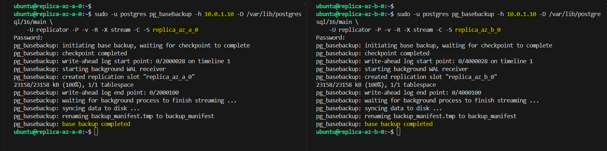

**2.6 Start PostgreSQL on Replicas**

Start the PostgreSQL service on both replicas.

```bash
sudo systemctl start postgresql
sudo systemctl status postgresql
```

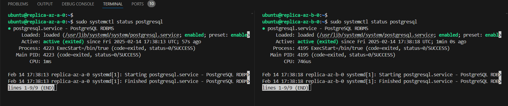

## 3. Verify Replication Setup

### 3.1 Check Replica Status

Connect to the replicas and check the status of the replicas.

```bash
sudo -u postgres psql

-- Verify replica mode
SELECT pg_is_in_recovery();  -- Should return 't'

-- Check replication lag
SELECT now() - pg_last_xact_replay_timestamp() AS replication_lag;

\q
```

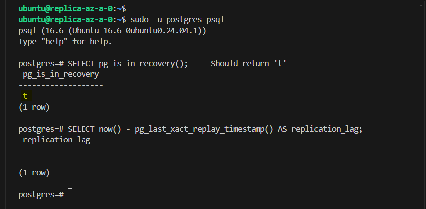

### 3.2 Check Master Status

Connect to the master and check the status of the master.

```bash
sudo -u postgres psql

-- Check replication connections
SELECT client_addr, state, sent_lsn, write_lsn, flush_lsn, replay_lsn 
FROM pg_stat_replication;

-- Check replication slots
SELECT slot_name, active FROM pg_replication_slots;

\q
```

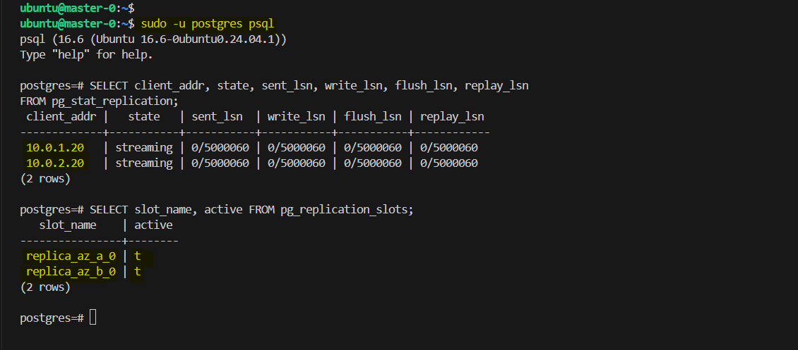

### Test Replication

**1. Connect to the master and create a test database and table.**

```bash
sudo -u postgres psql

-- Create test database and table
CREATE DATABASE test_db;
\c test_db
CREATE TABLE replication_test (id serial primary key, data text);
INSERT INTO replication_test (data) VALUES ('test data');
```

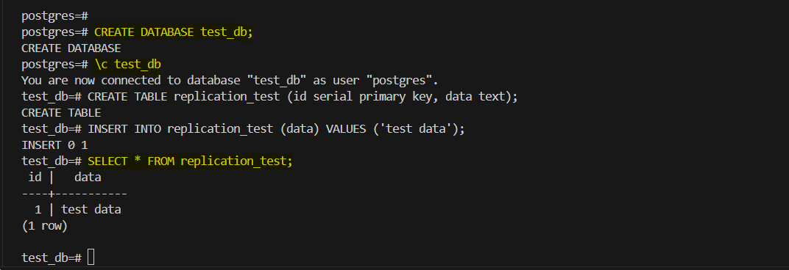

This will create a test database and table on the master.


**2. Connect to the replicas and check the status of the replicas.**

```bash
sudo -u postgres psql

\c test_db
SELECT * FROM replication_test;
```

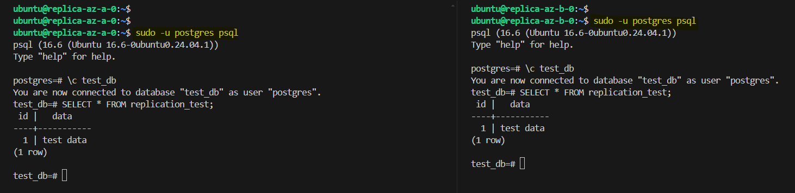

Here we can see that the data is replicated to the replicas.


## Configure the Application Server

We will use a simple `Node.js` application to test the replication. This application will connect to the `master DB` and `replicas` and insert data into the test database. It will perform the following steps:

1. Connect to the master DB and insert data into the test database.
2. Connect to the replicas and check the status of the replicas.
3. Connect to the master DB and check the status of the master.
4. Perform WRITE operation to the master DB.
5. Perform READ operation from the replicas.

First clone the repository into the `application server` and install the dependencies.

```bash
git clone https://github.com/Konami33/db-cluster-app.git
cd db-cluster-app
npm install
```

This repository contains the following files:

```
db-cluster-app/
│── node_modules/
│── src/
│   ├── config/
│   │   ├── database.js
│   │   ├── logger.js
│   ├── routes/
│   │   ├── health.js
│   │   ├── data.js
│   ├── app.js
│── .env
│── package.json
│── .gitignore
│── README.md
```

### Create Database and Table

Connect to the master DB and create a database and user.

```bash
-- Connect to PostgreSQL
sudo -u postgres psql

-- Create application database and user if not exists
CREATE DATABASE app_db;
CREATE USER app_user WITH PASSWORD 'app_password';
GRANT ALL PRIVILEGES ON DATABASE app_db TO app_user;

-- Connect to app_db
\c app_db

-- Create test table if not exists
CREATE TABLE IF NOT EXISTS test_table (
    id SERIAL PRIMARY KEY,
    data TEXT,
    created_at TIMESTAMP DEFAULT CURRENT_TIMESTAMP,
    updated_at TIMESTAMP DEFAULT CURRENT_TIMESTAMP
);

-- Grant permissions
GRANT ALL PRIVILEGES ON ALL TABLES IN SCHEMA public TO app_user;
GRANT USAGE, SELECT ON ALL SEQUENCES IN SCHEMA public TO app_user;

\q
```


### Configure the Environment Variables

Create a `.env` file in the root directory and configure the environment variables.

```env
NODE_ENV=production
PORT=3000 
MASTER_DB_HOST=10.0.1.10
READ_REPLICA_HOST=<your-nlb-dns-name>
DB_USER=app_user 
DB_PASSWORD=app_password 
DB_NAME=app_db
DB_PORT=5432
MAX_POOL_SIZE=20
IDLE_TIMEOUT=30000
```

> NOTE: You can change the environment variables to your own values.

### Run the Application

1. **Start the application in development mode**  
   ```sh
   npm run dev
   ```
2. **Start in production mode**  
   ```sh
   npm start
   ```

   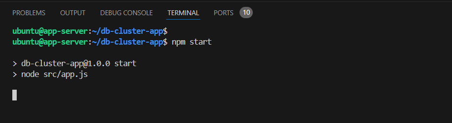

## Test the Application

We can test the application using **Postman** or **thunder client**. Here are the endpoints to test:

### **1. Check `Health` Status (GET /health)**
- **URL:**  
  ```
  http://<application-server-public-ip>:3000/health
  ```
- **Method:** `GET`
- **Expected Response:**

    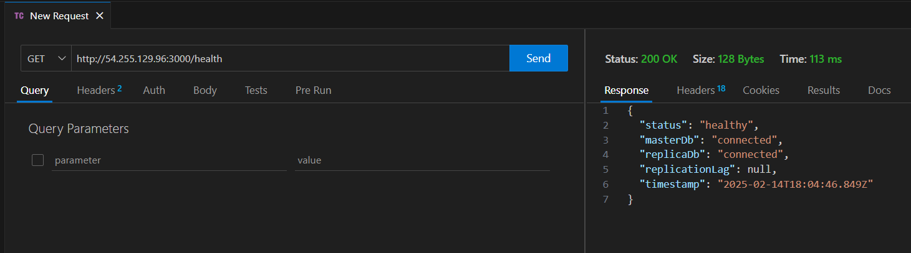


### **2. Get Replication Metrics (GET /health/metrics)**
- **URL:**  
  ```
  http://<application-server-public-ip>:3000/health/metrics
  ```
- **Method:** `GET`


### **3. Create Data (POST /)**
- **URL:**  
  ```
  http://<application-server-public-ip>:3000/data/
  ```
- **Method:** `POST`

- **Body (raw, JSON format in Postman):**
  ```json
  {
    "data": "Sample data"
  }
  ```
- **Expected Response:**

    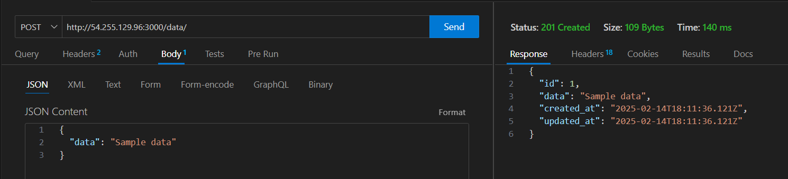

### **4. Read All Data (GET /)**
- **URL:**  
  ```
  http://<application-server-public-ip>:3000/data/
  ```
- **Method:** `GET`

- **Expected Response:**

    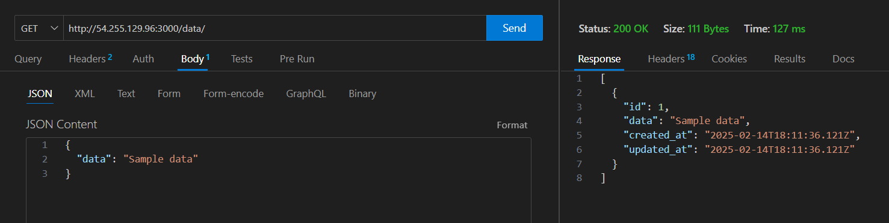

### **5. Get Specific Record (GET /:id)**
- **URL:**  
  ```
  http://<application-server-public-ip>:3000/data/1
  ```
- **Method:** `GET`

---

### **6. Update Data (PUT /:id)**
- **URL:**  
  ```
  http://<application-server-public-ip>:3000/data/1
  ```
- **Method:** `PUT`
- **Headers:**
  ```json
  {
    "Content-Type": "application/json"
  }
  ```
- **Body (raw, JSON format in Postman):**
  ```json
  {
    "data": "Updated data"
  }
  ```
- **Expected Response:**

    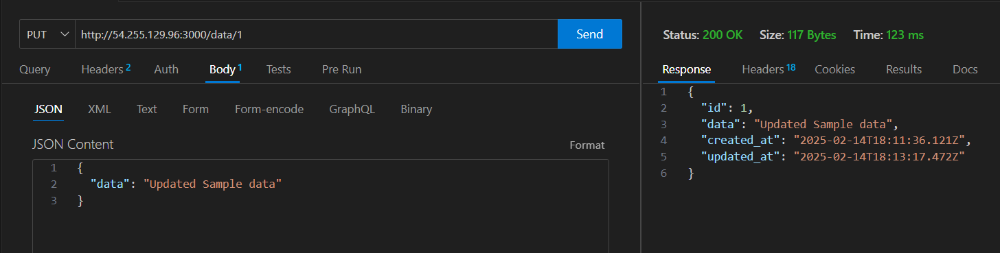

---

### **7. Delete Data (DELETE /:id)**
- **URL:**  
  ```
  http://<application-server-public-ip>:3000/data/1
  ```
- **Method:** `DELETE`
- **Expected Response:**
    
    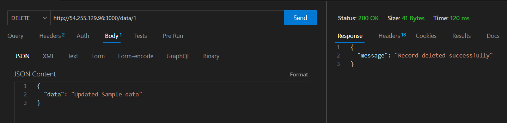

## Verify the Replication

We can verify the replication by checking the data in the replicas.

**First Create Data (POST /)**

- **URL:**  
  ```
  http://<application-server-public-ip>:3000/data/
  ```
- **Method:** `POST`

- **Body (raw, JSON format in Postman):**
  ```json
  {
    "data": "Sample data 2"
  }
  ```

### Test in the ReplicaDB

Connect to the replicas and check the data in the replicas.

```sql
sudo -u postgres psql

\c app_db
SELECT * FROM test_table;
```

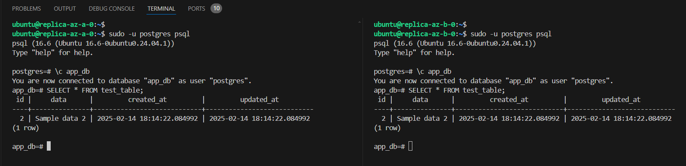

Here we can see that the data is replicated to the replicas.


## Conclusion

In this lab, we have created a master-slave database replication setup using PostgreSQL on AWS. We have configured the master DB and replicas, created a simple Node.js application to test the replication, and verified the replication by checking the data in the replicas. We have also tested the application by performing write and read operations to the master DB and replicas. This is a basic setup and can be improved by adding more features and security measures. 


