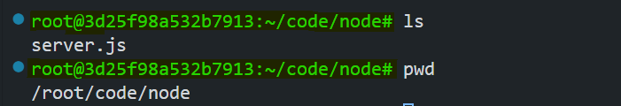
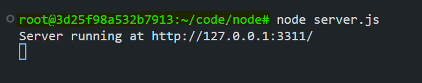
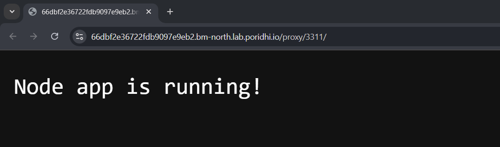
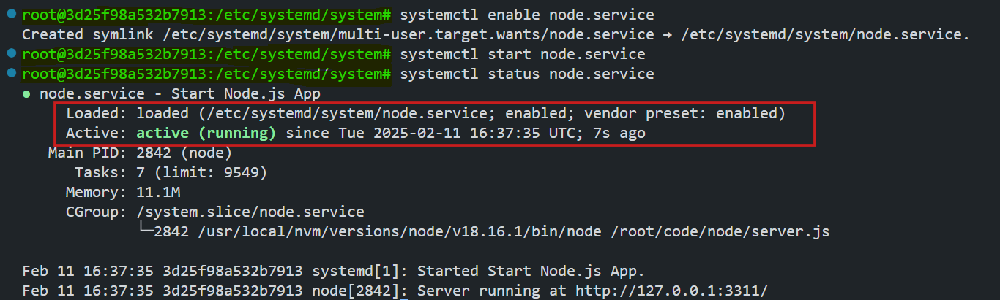
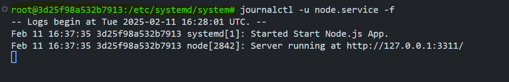
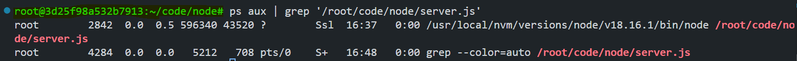
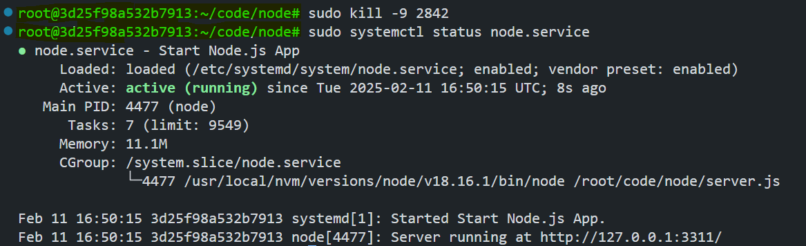

# Running a Node.js Application with systemd

Using `systemd` to manage a Node.js application simplifies the process by ensuring the application starts automatically on boot, restarts on failure, and runs efficiently in the background. This lab provides a step-by-step guide to configuring `systemd` to manage a Node.js application.


## Lab Overview

In this lab, we are going to: 
- Configure and manage a Node.js application using `systemd`.
- Create a simple Node.js server.
- Set up a `systemd` service file.
- Enable and start the service.
- Monitor logs using `journalctl`.
- Ensure the Node.js application restarts on failure.

## What is `systemd`?

`systemd` is an init system used in Linux distributions to manage system processes, services, and dependencies. It ensures that services start on boot, restart on failure, and run efficiently in the background. In this lab, we will configure `systemd` to manage a Node.js application, ensuring its resilience and automatic recovery in case of failure.

## Why Use `systemd` for Node.js Applications?

- **Automatic Startup:** Ensures the application starts automatically when the server boots.
- **Failure Recovery:** Automatically restarts the application if it crashes.
- **Logging & Monitoring:** Provides built-in logging and monitoring through journalctl.
- **Process Isolation:** Ensures that all processes related to the application are properly managed.

## Step 1: Create the Node.js Server
First, create a simple Node.js server that listens on port `3311`. Create a directory named `node` and create a file named `server.js` inside it.

### Code for `server.js`
```javascript
const http = require('http');
const hostname = '127.0.0.1'; // Listen on all ports
const port = 3311;

http.createServer((req, res) => {
  res.writeHead(200, { 'Content-Type': 'text/plain' });
  res.end('Node app is running!');
}).listen(port, hostname, () => {
  console.log(`Server running at http://${hostname}:${port}/`);
});
```

> **Note:** Check the path to the server file using `pwd` as we will be using it in the systemd service file.



**Run the server using:**
```
node server.js
```



You can also check the server running on the browser using `http://127.0.0.1:3311/`



## Step 2: Create the systemd Service File

Now, we will create a `systemd` service file to manage the Node.js application. 

### Steps to create the service file:

1. Navigate to the systemd directory:

   ```
   cd /etc/systemd/system/
   ```
2. Create and edit the `node.service` file:

   ```
   vim node.service
   ```

### Contents of `node.service`

```
[Unit]
Description=Start Node.js App
After=network.target

[Service]
ExecStart=/usr/local/nvm/versions/node/v18.16.1/bin/node /root/code/node/server.js
KillMode=control-group
WorkingDirectory=/root/code/node
Restart=on-failure

[Install]
WantedBy=multi-user.target
```

### Explanation of the Service File

- **[Unit]**
  - `Description=Start Node.js App`: A brief description of the service.
  - `After=network.target`: Ensures the service starts only after the network is up.

- **[Service]**
  - `ExecStart`: Specifies the command to run the Node.js application.
  - `KillMode=control-group`: Ensures all processes in the control group are terminated when stopping the service.
  - `WorkingDirectory=/root/code/node`: The directory where the service runs.
  - `Restart=on-failure`: Restarts the service automatically if it fails.

- **[Install]**
  - `WantedBy=multi-user.target`: Ensures the service starts automatically on boot in a non-graphical, multi-user environment.

## Step 3: Enable and Start the Service

**Enable the service to start on boot:**
```
systemctl enable node.service
```

**Start the service manually:**
```
systemctl start node.service
```

**Verify the service status:**
```
systemctl status node.service
```



This output indicates that the `node.service` is successfully loaded and running under `systemd`.  

- **Loaded:** The service file is located at `/etc/systemd/system/node.service`, and it is enabled, meaning it will start on boot.  
- **Active:** The service is currently running (`active (running)`).  

## Step 4: Checking Logs with `journalctl`

Use `journalctl` to view logs related to the Node.js service.

**View logs in real-time:**
```
journalctl -u node.service -f
```



## Step 5: Handling Failures and Testing Automatic Restarts

systemd’s `Restart=on-failure` directive ensures the service recovers from crashes.

### How systemd Handles Failures:
1. The service exits unexpectedly (non-zero exit code or signal).
2. systemd checks the `Restart` condition (`on-failure` in this case).
3. If the condition is met, systemd waits `RestartSec` (default: 100ms) before restarting.
4. The service is restarted until it stabilizes or reaches the `StartLimit` threshold.

### Simulating a Failure

1. **Identify the Process ID (PID)**  

   Find the PID of the running Node.js process:
   ```bash
   ps aux | grep '/root/code/node/server.js'
   ```

   

   Here, the process ID of the Node.js server is `2842`.

2. **Forcefully Terminate the Process** 

   Use `kill -9` to simulate a crash:
   ```bash
   sudo kill -9 <PID>
   ```

3. **Check Service Status**

   Verify that systemd restarts the service:
   ```bash
   sudo systemctl status node.service
   ```
   
   

   Here, we can see that the service is restarted automatically.

4. **Inspect Logs**  

   Confirm the restart in the logs:
   ```bash
   sudo journalctl -u node.service
   ```
   

   Here, we can see that the service is restarted by `systemd` after the process is killed.

## Conclusion

Using systemd to manage a Node.js application ensures reliability, automatic recovery from failures, and simplified process management. By following this guide, you have learned how to:

- Set up a Node.js application as a systemd service.
- Enable automatic startup and restart policies.
- Monitor logs with journalctl.
- Simulate failures and verify systemd’s automatic recovery.

This approach is ideal for production deployments, ensuring applications remain running with minimal manual intervention.

